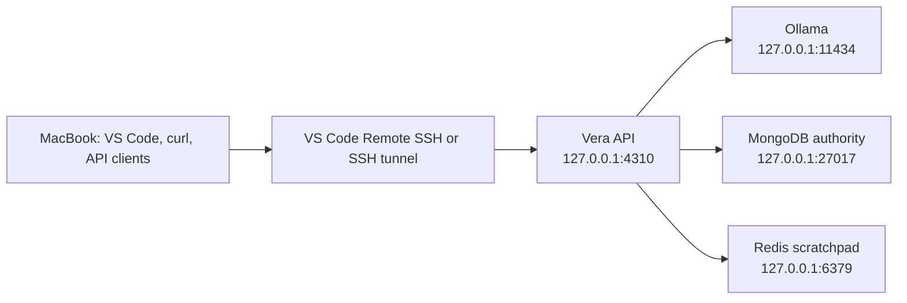

# Vera

Vera is a personal AI orchestration system: one consistent interface
through which its owner can express intent while Vera selects and coordinates
the appropriate models, tools, workflows, machines, and services.

## Current status

Vera is now in production implementation. The executable control plane is a
TypeScript/Node.js npm-workspaces modular monolith in `apps/api`, using Fastify
for HTTP and Zod for runtime and JSON Schema contracts. It implements a durable
request-to-decision-to-approval-to-capability lifecycle, fixed and
evidence-adaptive bounded goal execution, an asynchronous worker, a
browser-neutral TypeScript client, an owner CLI, a universal Expo React Native
frontend, explicit owner-governed long-term memory, and a grounded personal
knowledge library built from deliberately promoted documents and analyzed
images.

The orchestration brain is selected at startup through a provider registry.
Ollama remains the default owner-controlled provider; OpenAI and Gemini are
implemented third-party providers, and the deterministic provider remains the
repeatable test boundary. Provider-native payloads, credentials, and schema
dialects stay behind adapters and do not enter Vera's domain contracts.
The Ollama adapter removes JSON Schema keywords that Ollama's grammar compiler
cannot represent and, only when Ollama rejects that grammar, retries the same
provider in JSON mode. Vera's complete Zod contract remains authoritative, so
this compatibility path does not weaken output validation or cross a provider
boundary.

`POST /v1/model-decisions` accepts a natural-language message. A model may
propose a direct response or one of the capabilities enabled in the runtime
catalog. The implemented declarations are `development_planning@1`,
`software_change@1`, project-independent `web_research@1`, and owner-scoped
`personal_task_management@1`, `personal_reminder_management@1`, and
`attachment_analysis@1`, plus grounded `knowledge_management@1`; Vera's code
validates the closed, versioned proposal and routing arguments, then returns a
direct response, one approval requirement, a validated fixed goal, an adaptive
goal's first step, or a rejection. A disabled capability is absent from the
model contract. Model output is never authorization.

For evidence-dependent outcomes, an owner-controlled brain may propose an
adaptive goal with a durable contract for every requested outcome and only its first step. After each separately approved
capability produces a durable artifact, Vera validates that observation and
asks for exactly one next step or an evidence-linked final answer. The loop is
limited to three capability steps and four model calls; no model may add a
capability, grant authority, reuse approval, or extend the budget. Completion
requires capability-matched evidence for every satisfied outcome and produces a
code-authored execution ledger, so model prose cannot manufacture an effect. Artifact
contents are not sent to OpenAI, Gemini, or another third-party orchestration
brain until a separate exact disclosure policy is designed. See
[ADR-0024](docs/decisions/0024-adapt-bounded-goals-from-validated-capability-evidence.md).

Vera can now create, list, complete, and reopen durable personal tasks through
ordinary conversation. The first adapter stores them locally in Vera's
authoritative owner resource store, requires no external account, and exposes
read-only task retrieval through the API, client, and CLI. Every conversational
action is explicitly approved; list approvals carry no write effect while
mutations disclose `personal_data_write`. The provider-neutral integration port
is the extension point for future calendars, reminders, and external task
services. See
[ADR-0022](docs/decisions/0022-introduce-provider-neutral-integration-actions-with-vera-owned-personal-tasks.md).

Vera can also schedule one-shot reminders from ordinary language, recover them
after restart, and deliver each due reminder into its durable owner inbox. The
MongoDB reminder document atomically contains both delivery state and its
notification, while expiring claims prevent concurrent workers from delivering
the same reminder. Clients can page the inbox with an opaque cursor or watch a
resumable server-sent-event projection; a disconnected stream never loses the
durable notification. Creating, rescheduling, cancelling, and acknowledging a
reminder all remain exact, approval-gated capability actions. See
[ADR-0023](docs/decisions/0023-deliver-durable-reminders-through-a-vera-owned-notification-inbox.md).

For compound requests such as “research, plan, and implement,” Vera now keeps
one owner-facing goal while approving and executing each capability boundary
separately. Every completed step produces a typed artifact; later steps may
receive only artifact types their declarations accept, with exact hashes and
lineage frozen into approval and checked again at execution. Historical
approvals and invocations remain inspectable and restart-safe. See
[ADR-0021](docs/decisions/0021-execute-bounded-goals-with-step-scoped-approvals-and-artifact-lineage.md).

Conditional requests no longer need to guess every step up front. For example,
Vera can research a question, inspect the validated report, and only then ask
for approval to create a reminder when the evidence warrants it. The
continuation records which artifacts informed the decision but passes their
contents to the next capability only when its declared input contract requires
them.

The owner-facing journey registers a generic project, creates a conversation,
and posts project-linked messages. Vera freezes bounded prior complete turns
from the same project scope, persists that model context in the versioned task
aggregate, and sends it with the current message. It then selects bounded
Git-tracked context using exact request anchors, token-boundary path matches,
and local full-text evidence. Source, tests, and configuration outrank
documentation; non-documentation requests reserve most of both the file and
byte budgets for implementation evidence. Vera shows the exact manifest and
configured specialist destination for approval, then executes
the provider-neutral `development_planning@1` contract through a registered
adapter. The default `codex_cli` planning adapter uses an ephemeral read-only
snapshot. The `software_change@1` path instead permits bounded writes inside an
isolated snapshot, then Vera computes and stores a review-only Git patch and
file hashes. It never mutates, commits, pushes, or opens a pull request against
the registered project. A separate, exactly approved change-application
resource can then stage that artifact on a deterministic branch in a durable
managed Git worktree while leaving the owner's active checkout unchanged. It
does not itself commit, push, or open a pull request. A third, separately
approved publication resource can freeze the staged tree, Git author, commit
message, GitHub repository and branch identities, and exact pull-request
metadata; its worker then creates or verifies one commit, a non-force Vera
branch push, and one pull request. Both capability results are
stored as versioned artifacts keyed by invocation identity. Task,
conversation, project, and artifact idempotency are principal-scoped. The same
generic runtime can execute an explicitly approved public-web research request
without a synthetic project. The initial live adapter uses OpenAI Responses web
search and stores a source-backed `research_report` artifact; research selection
is independent of the orchestration model and disabled by default unless
configured.
Every terminal task also records a recoverable pending Vera reply before that
reply is appended to the conversation, so a crash cannot silently remove one
side of the dialogue.

The universal frontend now carries that same delivery contract end to end. A
software-change result can prepare and approve isolated staging, configure a
draft or ready pull request, separately approve the exact publication, follow
durable progress, cancel while cancellation is still valid, and open the
verified GitHub pull request. Refresh and device restart recover the chain from
MongoDB-backed attempt discovery rather than browser-local IDs.

The same conversation surface accepts documents and common image formats
through one file control. Vera extracts bounded text from plain text, Markdown,
JSON, and PDF files; normalizes JPEG, PNG, WebP, GIF, HEIC/HEIF, AVIF, and TIFF
images into a safe vision representation; freezes exact attachment identities
into approval; and stores a cited `attachment_analysis` artifact. The
orchestration brain sees only attachment metadata before approval, while a
separately configurable vision provider receives approved image content.
Original bytes remain immutable and owner-scoped in MongoDB/GridFS. See
[ADR-0031](docs/decisions/0031-store-owner-attachments-and-analyze-them-through-exact-approval.md).

Attachments can now drive useful work rather than ending at analysis. A request
such as “analyze this note and create a task from its most important finding”
becomes one bounded **Understand → Decide → Act** goal: approve the exact
analysis, inspect its cited result, then approve the exact derived action. The
second approval distinguishes evidence Vera used internally from complete
artifacts a specialist will receive. Task, reminder, and memory actions receive
only derived typed arguments; planning and software change can consume the
analysis artifact only when that disclosure is named and approved. See
[ADR-0032](docs/decisions/0032-compose-attachment-evidence-into-separately-approved-actions.md).

Files can also become reusable personal knowledge through an explicit second
decision: the owner asks Vera to save them, approves permanent promotion, and
receives a durable source with exact attachment provenance and integrity-checked
search chunks. The Knowledge workspace lists those sources, searches them
locally, shows source/locator/excerpt citations, and confirms removal before
clearing searchable text. Local answer models receive only a bounded retrieved
evidence set; cloud answer models require a disclosure approval. Knowledge is
separate from concise governed memory and never enters ordinary conversation
context automatically. See
[ADR-0036](docs/decisions/0036-build-grounded-personal-knowledge-from-owner-approved-sources.md).

MongoDB is selected as V1's authoritative operational store and Redis as the
rebuildable, expiring scratchpad through
[ADR-0010](docs/decisions/0010-use-mongodb-for-operational-truth-and-redis-for-scratchpads.md).
The implemented increment has deterministic recovery coverage and compiled
MongoDB/Redis evidence across project registration, conversation submission,
approval, artifact persistence, process restart, and Redis projection loss.
The compiled gate also applies one deterministic software-change artifact to a
temporary clean Git fixture, verifies its staged managed worktree, idempotent
application identity, ordered application events, and project-mutation lease
exclusion, then removes the fixture.
Task-producing HTTP requests now return after durable acceptance; an in-process
worker rediscovers work from MongoDB and uses expiring per-run MongoDB leases to
prevent concurrent execution. Redis remains a rebuildable scratchpad, not a
queue. See
[ADR-0013](docs/decisions/0013-dispatch-durable-work-with-mongodb-leases.md).
Approved change applications use their own MongoDB aggregate, per-project
mutation lease, ordered events, and recovery rules; see
[ADR-0018](docs/decisions/0018-apply-approved-software-changes-in-managed-git-worktrees.md).
Approved publications use a separate MongoDB aggregate and the same
per-project mutation lease. They reconcile exact existing commits, remote
branches, and pull requests after retry; see
[ADR-0029](docs/decisions/0029-publish-approved-software-changes-through-a-separate-durable-lifecycle.md).
One approved development campaign can now compose those boundaries across a
single objective: bounded implementation, managed staging, operator-configured
local gates, exact pull-request publication, GitHub checks/review observation,
policy-gated merge, and local-base synchronization. The campaign cannot alter
its own policy or control-plane code, and remote CI/review failure stops for
owner review. See
[ADR-0034](docs/decisions/0034-delegate-bounded-development-campaigns-through-one-owner-approval.md).
Vera can also draft one bounded software mission from conversation, ask for one
exact owner approval, and run one `pull_request_only` campaign while the owner
is away. The mission can select one outcome inside configured policy and return
one verified PR, but it cannot merge, recur, create another campaign, or change
its own controls. See
[ADR-0035](docs/decisions/0035-run-bounded-software-missions-that-stop-at-a-pull-request.md).
The accepted V1 journey, including an exact owner-reviewed third-party Codex
disclosure and real artifact, was demonstrated on 25 August 2026. Additional
cloud-brain profiles remain optional conformance targets, not V1 blockers or
modules specific to one project. V1's owner perimeter is the trusted Mac Mini
account and SSH session around a code-enforced loopback listener, optionally
extended to the owner's private devices through Tailscale Serve. Application
authentication remains required before shared or multi-user exposure.

As of 24 August 2026, the Product Charter, the Domain Model's core
vocabulary, the System Architecture's logical shape, the Capability Model's
contract, Security and Trust, and the Engineering Method are Accepted. V1
scope was trimmed to a solo-buildable slice and its first journey was selected — see
[ADR-0008](docs/decisions/0008-trim-v1-scope-and-ratify-foundation.md).
The implementation boundary and first source layout are accepted in
[ADR-0009](docs/decisions/0009-implement-the-model-decision-boundary.md).
The growing API's nested role-first module map and enforced dependency direction
are accepted in
[ADR-0019](docs/decisions/0019-organize-the-api-as-an-inward-dependent-modular-monolith.md).
The declarative capability runtime, owner-visible catalog, authority envelope,
and project-independent web-research contract are accepted in
[ADR-0020](docs/decisions/0020-use-a-declarative-capability-runtime-and-approval-gated-web-research.md).
Bounded goal execution, step-scoped approvals, and typed artifact handoffs are
accepted in
[ADR-0021](docs/decisions/0021-execute-bounded-goals-with-step-scoped-approvals-and-artifact-lineage.md).
Provider-neutral integration actions and Vera-owned personal tasks are accepted
in
[ADR-0022](docs/decisions/0022-introduce-provider-neutral-integration-actions-with-vera-owned-personal-tasks.md).
Durable reminders, scheduler claims, and the Vera-owned notification inbox are
accepted in
[ADR-0023](docs/decisions/0023-deliver-durable-reminders-through-a-vera-owned-notification-inbox.md).
Bounded evidence-adaptive orchestration is accepted in
[ADR-0024](docs/decisions/0024-adapt-bounded-goals-from-validated-capability-evidence.md).
Explicit, versioned owner-governed memory is accepted in
[ADR-0025](docs/decisions/0025-use-explicit-versioned-owner-governed-memory.md),
and the universal frontend's thin-client boundary is accepted in
[ADR-0026](docs/decisions/0026-use-one-expo-react-native-frontend-for-web-and-mobile.md).
Private physical-device ingress through Tailscale Serve is accepted in
[ADR-0027](docs/decisions/0027-use-tailscale-serve-for-private-physical-device-access.md).
Owner-controlled recording, provider-neutral transcription, and reviewed reply
playback are accepted in
[ADR-0030](docs/decisions/0030-transcribe-owner-controlled-recordings-through-a-provider-neutral-boundary.md),
which supersedes ADR-0028's platform speech recognizer.
Registered local and SSH machine operations, exact service-action approvals,
and verified postconditions are accepted in
[ADR-0033](docs/decisions/0033-govern-machine-operations-through-registered-actions.md).
Grounded personal knowledge from explicitly promoted sources is accepted in
[ADR-0036](docs/decisions/0036-build-grounded-personal-knowledge-from-owner-approved-sources.md).
Explicit owner-governed long-term memory is now implemented through ADR-0025.
Physical erasure, retention beyond tombstones, and third-party-provider memory
disclosure remain deliberately open.

The repository is currently the durable source of truth for the project. Chat
history and external source material may inform the project, but decisions only
become authoritative when they are recorded and accepted here.

## Documentation

Start with the [documentation guide](docs/README.md). It provides the reading
order, document authority, status of each design area, and decision index.

The foundation currently covers:

- Vera's product identity and North Star;
- the system architecture and request lifecycle;
- conversations, tasks, runs, events, approvals, and artifacts;
- context, scratchpads, operational state, and long-term memory;
- model providers, specialist capabilities, and external orchestrators;
- security and trust boundaries;
- the accepted V1 scope;
- the implemented model decision boundary;
- the durable task/run/approval lifecycle and selected V1 storage topology;
- the architect-builder engineering method;
- accepted and proposed architecture decisions with explicit status.

Documents and decisions carry their own statuses. A **Proposed** document is a
basis for review, not an approved implementation instruction. Accepted
architecture decisions are indexed under `docs/decisions/`.

## Working method

1. Discover before claiming certainty.
2. Record decisions and unresolved questions explicitly.
3. Define acceptance criteria before implementation.
4. Give builders bounded, repository-backed work rather than relying on chat
   history.
5. Prefer evidence from tests, traces, and inspection over AI agreement.

## Run it

Requirements:

- Node.js 22 or newer;
- npm 10 or newer;
- one configured model provider: Ollama locally, or an OpenAI or Gemini API key;
- Codex CLI authenticated on the Vera host for the default `codex_cli` planning
  and software-change adapters. Override `CODEX_COMMAND`, or configure the two
  adapter selections independently for conformance work.
- MongoDB on `127.0.0.1:27017` and Redis on `127.0.0.1:6379` for persistent
  operation. Docker Compose configuration is included.
- Optional physical-phone development requires Tailscale on the Mac Mini and
  phone. The phone uses the universal frontend through its browser; no Expo
  tunnel or public development endpoint is required.

Install dependencies and run the full deterministic quality gate:

```bash
npm install
npm run check
npm run build
```

Start the API and universal frontend for web in two terminals:

```bash
VERA_PROFILE=ollama npm run dev
npm run dev:web
```

For the default Ollama attachment-vision path, install the independently
configured vision model once:

```bash
ollama pull qwen3-vl:8b
```

For owner-controlled local voice transcription, install `whisper-cpp` and
`ffmpeg`, place `ggml-large-v3-turbo-q5_0.bin` at
`~/.vera/models/whisper/`, set
`VERA_TRANSCRIPTION_PROVIDER=whisper_cpp` in the selected API profile, and run a
third process before the API:

```bash
npm run dev:transcription
```

The helper binds whisper.cpp to loopback only, enables compressed-audio
conversion and Metal acceleration, and never exposes the service directly to
the tailnet. Override its command, model file, or loopback origin with
`WHISPER_CPP_COMMAND`, `WHISPER_CPP_MODEL_PATH`, or
`WHISPER_CPP_BASE_URL`. Alternatively, an OpenAI profile can set
`VERA_TRANSCRIPTION_PROVIDER=openai`; it reuses `OPENAI_API_KEY` unless a
transcription-only key is provided.

Open the URL printed by Expo (normally `http://localhost:8081`). The frontend
uses the public client/API contract
for conversations, exact approvals, cancellation, memory inspection and
correction, tasks, reminders, and durable notifications. It contains no model
keys, credentials, orchestration policy, or execution authority. The web and
iOS simulator defaults use `http://127.0.0.1:4310`; Android emulator builds use
`http://10.0.2.2:4310`. Override either with
`EXPO_PUBLIC_VERA_API_URL=http://127.0.0.1:4311 npm run dev:web` when testing an
intentional alternate local listener.

The assistant-first interface keeps conversation primary, presents owner data
in a secondary drawer or inspector, and renders structured capability results
as human-readable cards with exact technical data available on demand. Its
visual and interaction contract is documented in
[Interface Design](docs/interface-design.md).

Use the refresh control in the conversation header—or pull down from the top
of the conversation—to synchronize Vera without reloading the page or losing
an in-progress message draft.

Press the microphone control to begin one continuous recording. Silence and
thinking pauses do not stop it. The square control stops, transcribes exactly
once, and leaves an editable draft; the send control stops, transcribes once,
and submits that exact text through the ordinary conversation path. The UI
shows elapsed recording time and a separate transcription phase. There is no
interim recognizer stream, automatic restart, or silence timeout.

The API handles completed audio only in memory for the synchronous
transcription request and never writes it to MongoDB, Redis, artifacts, events,
or logs. Select transcription independently of Vera's orchestration brain with
`VERA_TRANSCRIPTION_PROVIDER=openai` or `whisper_cpp`; see
[ADR-0030](docs/decisions/0030-transcribe-owner-controlled-recordings-through-a-provider-neutral-boundary.md).
A reply to a voice-originated message is read aloud after the durable Vera
message appears, and every reply has explicit Read aloud and Stop audio
controls. Override the default `en-US` playback locale with, for example,
`EXPO_PUBLIC_VERA_SPEECH_LOCALE=en-ZA npm run dev:web`.

Run `npm run dev:frontend` to open Expo's interactive launcher for web, iOS, or
Android simulators. `expo-audio` is included in Expo Go, so recording works
without a custom development build when the API has a transcription adapter.

To use a physical phone already enrolled in the same private tailnet as the Mac
Mini, keep the API running above and start the private phone frontend:

```bash
npm run dev:phone
```

The command discovers the Mac Mini's MagicDNS HTTPS URL, configures Tailscale
Serve with the frontend at `/` and the loopback API at `/api`, verifies the API,
and starts Expo web on loopback. Open the printed private HTTPS URL in the
phone's browser. Both the page and API then share one tailnet-only origin, so no
remote browser origin needs to be added to CORS. Check the routes with
`npm run tailscale:status`; configure them without starting Expo with
`npm run tailscale:serve`, and remove them with
`npm run tailscale:serve:off`. Never use Tailscale Funnel for Vera.

With local MongoDB and Redis running, execute the repeatable compiled
persistence journey:

```bash
npm run verify:persistent
```

It uses a uniquely named temporary MongoDB database, the deterministic
owner-controlled adapters, a real HTTP listener, the shared client, and the
compiled CLI. It verifies asynchronous acceptance, duplicate approval and
request idempotency, rejection, cancellation, concurrent task isolation,
MongoDB lease exclusion, Redis scratchpad reconstruction, artifact and event
persistence, controlled managed-worktree application, project-mutation lease
exclusion, durable owner/Vera dialogue, survival of a forced process
termination at the approval boundary, and retrieval after a later graceful
restart. The same compiled journey discovers `web_research@1`, approves its
project-independent authority, retrieves its sourced artifact, and verifies it
again after restart. It also executes a plan-to-change goal, restarts between
its two approval boundaries, replays the first decision idempotently, and
verifies the final artifact lineage. It also creates a durable personal task,
restarts the API, completes the task through another approved action, and reads
it through the compiled client and CLI. It also creates a future reminder,
restarts the API, reschedules it to a due instant, verifies exactly one durable
inbox notification, acknowledges it, and retrieves it through the compiled
client and CLI. The gate additionally runs an adaptive research-to-reminder
goal, kills the API between the two approval boundaries, and verifies its
continuation evidence, final response, artifact lineage, budgets, and reminder
after restart. The gate also remembers an owner preference, verifies that a new
conversation freezes it into owner-controlled model context, restarts, corrects
the same stable memory with revision history, forgets it, and checks both the
compiled client and CLI. It then removes its own database, Redis scratchpads,
managed worktrees, and temporary Git fixture.

Required CI runs the same compiled journey against ephemeral MongoDB 8.2 and
Redis 8 service containers in the existing Linux job. CI builds once and calls
`npm run verify:persistent:compiled`; it does not install Ollama, download model
weights, or contact Codex or another third-party specialist. The job has a
nine-minute hard limit and superseded runs are cancelled. Real Ollama
conformance and real specialist acceptance remain separate, deliberate checks.
The persistent gate runs once on the pull request, not again for the resulting
`main` push; it can also be started manually. The normal deterministic quality
and build checks still run on both events.

Choose one loopback-only infrastructure option. To run MongoDB and Redis with
Docker Compose:

```bash
npm run infra:up
```

MongoDB uses a named volume because it is authoritative. Redis intentionally
has persistence disabled because every scratchpad value is reconstructible from
MongoDB. `npm run infra:down` stops both services without deleting MongoDB data.

On the Mac Mini, use the existing Homebrew services instead:

```bash
brew services start mongodb-community@8.2
brew services start redis
```

Both are configured on loopback on the current development host. Redis was
installed and enabled during this increment; MongoDB was already enabled.
Do not start the Compose services at the same time because they use the same
loopback ports.

### Remote development from the MacBook

The current development topology keeps one authoritative runtime environment
on the Mac Mini. The MacBook is a client and editor; it does not need local
Ollama, MongoDB, or Redis servers.



Forward API port `4310` through VS Code or SSH for normal MacBook testing. Vera
connects to MongoDB and Redis over Mac Mini loopback and, when the Ollama
profile is selected, reaches Ollama there as well. Database or model-provider
ports do not need forwarding for the application to work.

In a VS Code Remote SSH window, install database extensions on the remote
extension host and connect to `mongodb://127.0.0.1:27017`. A MacBook shell can
inspect Redis without a local installation by running the Mini's client:

```bash
ssh <mac-mini-ssh-host> redis-cli PING
ssh <mac-mini-ssh-host> redis-cli HGET \
  'vera:v1:run:<run-id>:scratchpad' payload
```

Forward MongoDB or Redis to alternate MacBook ports only when a local GUI or
CLI must connect directly. Do not expose either service on the LAN.

Create the shared local environment file at the repository root:

```bash
cp .env.example .env
```

Vera loads `.env` for both development and production startup. It can also load
one provider-specific profile before the shared file. Actual environment files
are ignored by Git; committed `*.example` files contain no usable credentials.

For Ollama:

```bash
cp .env.ollama.example .env.ollama
VERA_PROFILE=ollama npm run dev
```

For OpenAI or Gemini, copy the corresponding template, replace its placeholder
key, and select it at startup:

```bash
cp .env.openai.example .env.openai
# Edit OPENAI_API_KEY in .env.openai
VERA_PROFILE=openai npm run dev

cp .env.gemini.example .env.gemini
# Edit GEMINI_API_KEY in .env.gemini
VERA_PROFILE=gemini npm run dev
```

Precedence is `launching shell > .env.<profile> > .env`. Profile names are
case-insensitive at selection, normalized to lowercase, and restricted to safe
filename characters. A selected profile that is absent or invalid fails
startup. This makes temporary overrides straightforward:

```bash
OPENAI_MODEL=gpt-5-mini VERA_PROFILE=openai npm run dev
```

`VERA_MODEL_PROVIDER` accepts `ollama`, `openai`, `gemini`, or the
non-production `deterministic` adapter. OpenAI defaults to `gpt-5-mini`; Gemini
defaults to `gemini-2.5-flash`; both model names remain configurable because
account access and provider aliases change. `MODEL_MAX_OUTPUT_TOKENS` is sent as
the provider output ceiling. `OLLAMA_THINK` accepts `false`, `true`, `low`,
`medium`, or `high` and defaults to `false` for compatibility. Reasoning
models such as GPT-OSS require a supported reasoning level; Vera consumes only
their final structured content and does not log, persist, or expose Ollama's
separate reasoning trace. Use Vera's model conformance command to select the
level for the exact model and Ollama build; `medium` is the qualified starting
point for GPT-OSS rather than a model-name rule in application code. `GET
/ready` verifies the configured credentials and model without running
inference.

Capability adapters are selected independently. `VERA_RESEARCH_ADAPTER`
accepts `disabled` (the default), `openai_web_search`, or the non-production
`deterministic_research` adapter. The live adapter reads
`RESEARCH_OPENAI_API_KEY`, falling back to `OPENAI_API_KEY`, plus optional
`RESEARCH_OPENAI_BASE_URL`, `RESEARCH_OPENAI_MODEL`, and
`RESEARCH_SEARCH_CONTEXT_SIZE`. Research defaults to the web-search-capable
`gpt-5.4-mini`, independently of the orchestration-model default. This permits
an Ollama orchestration profile to delegate research to OpenAI without changing
Vera's brain. The OpenAI profile template enables this adapter explicitly. No
adapter fallback occurs.

Vera never falls back automatically between providers. An Ollama failure will
not silently send the request to a cloud service, and a failed cloud request
will not be retried through a different disclosure or cost boundary. Selecting
an OpenAI or Gemini profile authorizes the owner message, minimal selected-
project identity, and bounded prior complete turns from the exact same project
scope to cross that provider boundary for orchestration. It does not authorize
repository files, credentials, unrelated conversations, long-term memory, or
capability execution. See
[ADR-0016](docs/decisions/0016-freeze-bounded-conversation-context-and-durably-project-replies.md).

Only declared non-secret configuration is logged. API keys are sent only in
provider transport headers and are not logged, persisted, placed in model
content, or returned through the API. Cloud-provider base URLs must use HTTPS
and cannot contain embedded credentials, query parameters, or fragments.

`WORKER_CONCURRENCY` controls simultaneous run progression and
`WORKER_POLL_INTERVAL_MS` controls idle discovery latency.
`VERA_OWNER_TIME_ZONE` selects the IANA zone used to interpret reminder
requests. `REMINDER_WORKER_CONCURRENCY`, `REMINDER_POLL_INTERVAL_MS`, and
`REMINDER_LEASE_MS` control due-reminder pickup independently from task runs;
the defaults are 2, 500 milliseconds, and 30 seconds.
`CONVERSATION_CONTEXT_MAX_MESSAGES` and
`CONVERSATION_CONTEXT_MAX_CHARACTERS` bound prior dialogue supplied to one
orchestration call. Vera selects only whole, completed owner/Vera turn pairs;
the defaults are 20 messages and 40,000 characters.
`WORKER_LEASE_MS` defaults to 15 minutes and must remain longer than the
10-minute V1 run budget. Graceful shutdown releases a lease immediately; after
a forced process loss, another worker may reclaim the run when the lease
expires. MongoDB sockets, Redis commands, model calls, Git inspection, and
specialist execution are all configured with finite deadlines so claimed work
cannot wait forever.

Run real conformance for whichever model profile is selected:

```bash
VERA_PROFILE=openai npm run test:model
VERA_PROFILE=gemini npm run test:model
VERA_PROFILE=ollama npm run test:model
```

One successful sample is useful but not enough to qualify a probabilistic
model. Repeat the same provider-neutral cases without stopping at the first
failure and emit an aggregate pass rate, latency, and token-usage summary:

```bash
VERA_MODEL_CONFORMANCE_RUNS=3 \
VERA_RESEARCH_ADAPTER=deterministic_research \
VERA_PROFILE=ollama \
npm run test:model
```

For an owner-controlled profile with web research enabled, this also verifies
the adaptive boundary end to end: the brain must plan a conditional
research-to-reminder goal and select the reminder after positive research
evidence. Profiles that cannot run adaptive orchestration report that case as
skipped rather than implying it was tested.

After conformance passes, qualify the same profile through compiled production
code, the HTTP API, durable worker, MongoDB, Redis, approvals, artifacts,
conversation reply projection, and an adaptive research-to-reminder goal:

```bash
VERA_PROFILE=ollama npm run verify:live-model
```

This command requires an explicit profile, uses a unique temporary MongoDB
database, removes its Redis scratchpads and database afterward, and never
downloads model weights. Specialist execution remains deterministic during
this check, so no public research or coding service is contacted; only the
selected orchestration model is live. Use `VERA_LIVE_MODEL_TIMEOUT_MS` to raise
the default four-minute per-operation deadline for slower hardware. This is a
deliberate local qualification check, not required pull-request CI.

The compatibility command for the default local provider remains:

```bash
npm run test:ollama
```

During development, run the TypeScript source directly with automatic reloads:

```bash
npm run dev
```

The watcher follows the imported TypeScript source and root `.env*` files while
excluding `dist` and `node_modules`. Source imports use `.ts` extensions;
TypeScript rewrites them to `.js` only in compiled production output.

To run the compiled production output instead:

```bash
npm run build
npm start
```

In another terminal, use the owner CLI to test the complete path. First check
the service and register this repository:

```bash
curl http://127.0.0.1:4310/health
curl http://127.0.0.1:4310/ready

npm run cli -- project add \
  --name Vera \
  --path "$(pwd)" \
  --key register-vera-local
npm run cli -- project list
```

To exercise the personal-assistant path, submit a reminder through `chat` or
`task submit`, approve the exact action, then inspect or watch the durable
inbox:

```bash
npm run cli -- chat --message "Remind me to stretch in five minutes"
npm run cli -- reminder list --status scheduled
npm run cli -- notification list
npm run cli -- notification watch
```

`notification watch` remains open until interrupted. Each printed event includes
its opaque `cursor`; resume with `--after <cursor>`. Reminder mutations are
conversational and approval-gated; the read-only `reminder` and `notification`
commands never bypass that policy.

Copy the returned project ID, then run the complete planning journey:

```bash
npm run cli -- plan \
  --project project_... \
  --message "Prepare an implementation plan for VERA-101: add health monitoring to the API."
```

The CLI submits the task, polls while the worker decides, prints the exact
context manifest and destination, and asks for confirmation before disclosure.
After approval it polls to a terminal state and prints the stored artifact. Do
not add `--approve` for a real third-party adapter unless you have already
reviewed and intend to approve that exact invocation.

Run the isolated implementation journey with the same approval discipline:

```bash
npm run cli -- change \
  --project project_... \
  --message "Implement VERA-101: add health monitoring to the API."
```

On approval, the selected specialist writes only to a disposable snapshot.
Vera prints the persisted `software_change` artifact containing its own
computed patch, file operations, hashes, verification report, and risks. The
registered repository is unchanged; applying, committing, pushing, or opening
a pull request remains a separate authority. To apply and stage the exact
artifact in Vera's managed worktree, use its returned artifact ID:

```bash
npm run cli -- change apply --artifact artifact_...
```

The CLI discloses the immutable base commit, patch hash, exact file manifest,
deterministic branch, managed workspace path, and staged effect before asking
for a second approval. On success, inspect the returned workspace or run:

```bash
npm run cli -- application show application_...
npm run cli -- application events application_...
```

The active registered checkout remains unchanged. To publish the successful
staged application through a third, exact approval:

```bash
npm run cli -- change publish \
  --application application_... \
  --commit-message "Implement VERA-101 health monitoring" \
  --pr-title "Implement VERA-101 health monitoring" \
  --pr-body "Implements the approved and staged VERA-101 change." \
  --base main \
  --draft
```

The CLI discloses the repository, current base-branch revision, Vera head
branch, staged tree and files, Git author, commit message, pull-request content,
and the explicit prohibition on direct and force pushes before asking for a
third approval. The durable worker uses `git` plus the authenticated GitHub CLI
to create or verify the exact effects. It never updates an incompatible remote
state; ambiguity becomes `review_required`.

Inspect a publication with:

```bash
npm run cli -- publication show publication_...
npm run cli -- publication events publication_...
```

The `plan` and `change` commands refuse to auto-approve a capability other than
the one named by the command.

Inspect the complete capability catalog, including disabled declarations and
their authority, then run project-independent research:

```bash
npm run cli -- capability list
npm run cli -- capability show web_research

npm run cli -- research \
  --message "Compare current approaches to durable AI task execution and cite primary sources."
```

The research command submits no project identity. Before confirmation it prints
the exact objective, adapter destination, third-party disclosure, public-web
read authority, and search-call ceiling. On success it prints the durable
`research_report` artifact and sources. Use `--approve` only when you intend to
approve that exact disclosure.

To enable governed machine operations, copy
`config/machines.example.json` to an ignored local file, correct every absolute
executable path and service name for the host, and set:

```bash
VERA_MACHINE_CATALOG_FILE=config/machines.json npm run dev
```

Confirm the public, command-free registry with:

```bash
curl --silent http://127.0.0.1:4310/v1/machines | jq
```

Then ask Vera naturally: “Inspect Redis on macmini,” “Restart Redis on
macmini,” or “Check Redis on macmini and if it is unhealthy then restart it.”
The conditional form pauses once for read-only inspection and again for the
exact mutation. Never copy the example unchanged: the catalog is executable
operator policy, not sample data.

To enable bounded development campaigns, copy and tailor the separate ignored
operator policy:

```bash
cp config/development-campaigns.example.json config/development-campaigns.json
command -v npm
# Replace every /absolute/path/to/npm in the copied file.
VERA_DEVELOPMENT_CAMPAIGN_CATALOG_FILE=config/development-campaigns.json npm run dev
```

The selected project must be registered, clean, on the configured base branch,
and synchronized with `origin`. From the frontend Campaigns tab, prepare one
objective, inspect the frozen base, gates, limits, delivery metadata, and merge
policy, then approve the complete envelope. Vera may merge only this campaign's
exact non-draft pull request after the configured local and GitHub evidence is
green. The example includes `npm ci` because each managed worktree starts
without shared `node_modules`.

To enable bounded missions on top of that campaign policy:

```bash
cp config/missions.example.json config/missions.json
# Make campaignPolicyId match the configured campaign policy.
VERA_DEVELOPMENT_CAMPAIGN_CATALOG_FILE=config/development-campaigns.json \
VERA_MISSION_CATALOG_FILE=config/missions.json \
npm run dev
```

Select the project in the frontend and ask Vera for one mission with an exact
outcome and completion criteria. Vera creates the draft locally, then the
Missions tab presents the single consequential approval. After approval it may
produce one verified non-draft pull request and notify you; it never merges.

For a multi-turn conversation, use `chat`. The first command creates a
conversation and returns its ID with Vera's durable reply:

```bash
npm run cli -- chat \
  --project project_... \
  --message "What should we improve first in this project?"

npm run cli -- chat \
  --conversation conversation_... \
  --project project_... \
  --message "Turn that into a concrete implementation plan."
```

Keep the same `--project` value on follow-ups that should share context.
Unscoped chat and each distinct project ID form separate context scopes even
inside one conversation. The CLI waits until Vera's reply is durably projected,
prints exact approval disclosure when needed, and never auto-approves unless
`--approve` is supplied.

Chat also drives compound goals. For example:

```bash
npm run cli -- chat \
  --project project_... \
  --message "Plan and implement VERA-101: add health monitoring to the API."
```

The CLI pauses once for the planning step and again for the implementation
step. The second disclosure identifies the exact plan artifact Vera will pass
to the change specialist. `--approve` confirms every disclosed step, so omit it
when destinations or data boundaries require individual review.

Individual resources remain inspectable:

```bash
npm run cli -- task show task_...
npm run cli -- run show run_...
npm run cli -- run events run_...
npm run cli -- artifact show artifact_...
```

`/health` reports only that the Vera process is alive. `/ready` checks the
configured provider and model, MongoDB, Redis, lifecycle recovery, and every
enabled capability runtime. For Codex this verifies the CLI, non-interactive
execution grammar, and login status. For OpenAI web research it checks exact
model access but does not perform a search. The readiness checks do not run
orchestration inference or web-search calls.

The optional publication path checks `git`, Git author configuration, GitHub
repository access, and authenticated `gh` availability when a publication is
prepared. Those owner-initiated delivery dependencies do not make the core API
globally unready when no publication is requested.

The initial submission normally returns in `deciding`; the worker later moves
it to `awaiting_approval`. Inspect
`approval.contextManifest` and `approval.destination` before approving: those
are the only project files disclosed to the named adapter and provider. The
manifest's selection reasons distinguish exact request anchors, path-token
matches, content matches, nearby implementation evidence, and repository-root
evidence. Once an exact route or path anchor resolves, it becomes the primary
evidence set instead of allowing broad prose tokens to pull unrelated areas
into the bundle. Selection searches locally and does not disclose unselected
files. If no request evidence matches, selection falls back to repository-root
evidence instead of arbitrary source files. For implementation work,
documentation remains limited to one fifth of either context limit even when
documenting the implementation is part of the request. Small repository-root
formatting contracts accompany the selected implementation evidence so
specialist verification uses the project's actual style rules. The Codex
planning adapter copies the selected files into an ephemeral read-only snapshot
and closes subprocess stdin explicitly so non-interactive Codex cannot wait for
terminal input. After approval, the CLI prints the run it is waiting for while
the specialist executes.
Each invocation records model metadata and persists one typed artifact. A
single-capability run then succeeds; a compound goal may return to
`awaiting_approval` for its next step and succeeds only after all steps do. The
Codex software-change adapter uses a separate isolated
workspace-write snapshot and produces a review-only patch artifact; it still
cannot touch the registered project or publish anything. A later
change-application approval is independently durable and authorizes only the
exact staged managed-worktree effect. Repeating either request is idempotent,
and recovery verifies the actual Git state before recording success. Repeating the
same approval neither invokes the capability again nor creates another
artifact; sending the opposite decision returns a conflict.

Provider failures are intentionally distinguishable:

| Code | HTTP status | Meaning |
|---|---:|---|
| `model_not_found` | 503 | The configured model is not installed. |
| `provider_unavailable` | 503 | The provider cannot be reached or returned a server failure. |
| `provider_timeout` | 504 | The provider exceeded the configured timeout. |
| `provider_request_rejected` | 502 | The provider rejected Vera's request. |
| `provider_response_invalid` | 502 | The provider response violated its adapter contract. |
| `operational_store_unavailable` | 503 | MongoDB or lifecycle recovery is unavailable. |
| `scratchpad_unavailable` | 503 | Redis is unavailable. |
| `planning_capability_unavailable` | 503 | The configured planning specialist is unavailable or not authenticated. |
| `software_change_capability_unavailable` | 503 | The configured software-change specialist is unavailable or not authenticated. |
| `capability_unavailable` | 503 | An enabled generic capability runtime is unavailable; inspect the response dependency. |

Client errors are sanitized. The server log records the internal classified
cause and upstream status without returning provider details to the client.

For a fast one-process smoke test without Ollama or databases, explicitly use
the deterministic and in-memory adapters:

```bash
VERA_MODEL_PROVIDER=deterministic VERA_PLANNING_ADAPTER=structured_model \
  VERA_CHANGE_ADAPTER=deterministic_change \
  VERA_RESEARCH_ADAPTER=deterministic_research \
  VERA_STORAGE_MODE=memory npm start
```

Memory mode is not a persistence fallback and loses all work when the process
stops. Persistent mode is the default.

V1 authenticates the owner at the deployment perimeter: Vera runs in the
owner's Mac Mini session, while remote owner devices use authenticated SSH or
private Tailscale Serve ingress to the loopback listener. The configuration
rejects non-loopback `HOST` values and maps admitted requests to `owner_v1`.
This is not application-layer caller authentication; it remains mandatory
before public, shared-host, shared-tailnet, or multi-user exposure.
