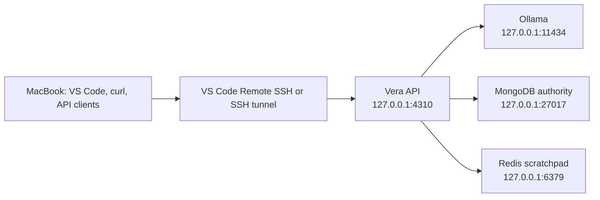

# Vera

Vera is a personal AI orchestration system: one consistent interface
through which its owner can express intent while Vera selects and coordinates
the appropriate models, tools, workflows, machines, and services.

## Current status

Vera is now in production implementation. The executable control plane is a
TypeScript/Node.js npm-workspaces modular monolith in `apps/api`, using Fastify
for HTTP and Zod for runtime and JSON Schema contracts. It now implements a
durable request-to-decision-to-approval-to-capability lifecycle.

`POST /v1/model-decisions` accepts a natural-language message. A model may
propose a direct response or `development_planning@1`; Vera's code validates the
closed, versioned proposal and routing arguments, then returns a direct response,
an approval requirement, or a rejection. It never treats model output as
authorization.

The owner-facing journey registers a generic project, creates a conversation,
and posts a project-linked message. Vera persists a versioned task aggregate in
MongoDB before model work, selects bounded Git-tracked context, shows its exact
manifest and the configured specialist destination for approval, then executes
the provider-neutral `development_planning@1` contract through a registered
adapter. The default `codex_cli` adapter uses an ephemeral read-only snapshot.
The resulting plan
is stored as one versioned artifact keyed by invocation identity. Task,
conversation, project, and artifact idempotency are principal-scoped.

MongoDB is selected as V1's authoritative operational store and Redis as the
rebuildable, expiring scratchpad through
[ADR-0010](docs/decisions/0010-use-mongodb-for-operational-truth-and-redis-for-scratchpads.md).
The implemented increment has deterministic recovery coverage and compiled
MongoDB/Redis evidence across project registration, conversation submission,
approval, artifact persistence, process restart, and Redis projection loss.
The remaining V1 work is owner acceptance of an exact third-party specialist
disclosure—initially through the default Codex adapter—and broader product
evidence, not a Gatherle-specific module.

As of 24 August 2026, the Product Charter, the Domain Model's core
vocabulary, the System Architecture's logical shape, the Capability Model's
contract, Security and Trust, and the Engineering Method are Accepted. V1
scope was trimmed to a solo-buildable slice and its first journey was selected — see
[ADR-0008](docs/decisions/0008-trim-v1-scope-and-ratify-foundation.md).
The implementation boundary and first source layout are accepted in
[ADR-0009](docs/decisions/0009-implement-the-model-decision-boundary.md).
Broader long-term-memory and retention policy remain open on purpose; the V1
operational storage products do not.

The repository is currently the durable source of truth for the project. Chat
history and external source material may inform the project, but decisions only
become authoritative when they are recorded and accepted here.

## Documentation

Start with the [documentation guide](docs/README.md). It provides the reading
order, document authority, status of each design area, and decision index.

The foundation currently covers:

- Vera's product identity and North Star;
- the system architecture and request lifecycle;
- conversations, tasks, runs, events, approvals, and artifacts;
- context, scratchpads, operational state, and long-term memory;
- model providers, specialist capabilities, and external orchestrators;
- security and trust boundaries;
- the accepted V1 scope;
- the implemented model decision boundary;
- the durable task/run/approval lifecycle and selected V1 storage topology;
- the architect-builder engineering method;
- accepted and proposed architecture decisions with explicit status.

Documents and decisions carry their own statuses. A **Proposed** document is a
basis for review, not an approved implementation instruction. Accepted
architecture decisions are indexed under `docs/decisions/`.

## Working method

1. Discover before claiming certainty.
2. Record decisions and unresolved questions explicitly.
3. Define acceptance criteria before implementation.
4. Give builders bounded, repository-backed work rather than relying on chat
   history.
5. Prefer evidence from tests, traces, and inspection over AI agreement.

## Run it

Requirements:

- Node.js 22 or newer;
- npm 10 or newer;
- Ollama listening on `http://127.0.0.1:11434` with the configured model. The
  default is `gemma4-12b-64k:latest`; override it with `OLLAMA_MODEL`.
- Codex CLI authenticated on the Vera host for the default `codex_cli` planning adapter.
  Override `CODEX_COMMAND` or select the explicit `model` adapter for local
  conformance work.
- MongoDB on `127.0.0.1:27017` and Redis on `127.0.0.1:6379` for persistent
  operation. Docker Compose configuration is included.

Install dependencies and run the full deterministic quality gate:

```bash
npm install
npm run check
npm run build
```

Choose one loopback-only infrastructure option. To run MongoDB and Redis with
Docker Compose:

```bash
npm run infra:up
```

MongoDB uses a named volume because it is authoritative. Redis intentionally
has persistence disabled because every scratchpad value is reconstructible from
MongoDB. `npm run infra:down` stops both services without deleting MongoDB data.

On the Mac Mini, use the existing Homebrew services instead:

```bash
brew services start mongodb-community@8.2
brew services start redis
```

Both are configured on loopback on the current development host. Redis was
installed and enabled during this increment; MongoDB was already enabled.
Do not start the Compose services at the same time because they use the same
loopback ports.

### Remote development from the MacBook

The current development topology keeps one authoritative runtime environment
on the Mac Mini. The MacBook is a client and editor; it does not need local
Ollama, MongoDB, or Redis servers.



Forward API port `4310` through VS Code or SSH for normal MacBook testing. Vera
still connects to Ollama, MongoDB, and Redis over Mac Mini loopback; database
ports do not need forwarding for the application to work.

In a VS Code Remote SSH window, install database extensions on the remote
extension host and connect to `mongodb://127.0.0.1:27017`. A MacBook shell can
inspect Redis without a local installation by running the Mini's client:

```bash
ssh <mac-mini-ssh-host> redis-cli PING
ssh <mac-mini-ssh-host> redis-cli HGET \
  'vera:v1:run:<run-id>:scratchpad' payload
```

Forward MongoDB or Redis to alternate MacBook ports only when a local GUI or
CLI must connect directly. Do not expose either service on the LAN.

Create the local environment file at the repository root:

```bash
cp .env.example .env
```

Vera loads `<repository-root>/.env` for both development and production
startup. Existing shell environment variables take precedence. Only declared
configuration is logged; Vera does not dump the complete environment because
it may contain secrets.

Run the real Ollama conformance cases:

```bash
npm run test:ollama
```

During development, run the TypeScript source directly with automatic reloads:

```bash
npm run dev
```

The watcher follows the imported TypeScript source and the root `.env` file,
while excluding `dist` and `node_modules`. Source imports use `.ts` extensions;
TypeScript rewrites them to `.js` only in compiled production output.

To run the compiled production output instead:

```bash
npm run build
npm start
```

In another terminal, test the full HTTP path:

```bash
curl http://127.0.0.1:4310/health
curl http://127.0.0.1:4310/ready

PROJECT=$(jq --null-input --arg root "$(pwd)" \
  '{displayName:"Vera",source:{kind:"local_git",rootPath:$root}}' | \
  curl --silent --request POST http://127.0.0.1:4310/v1/projects \
  --header 'content-type: application/json' \
  --header 'idempotency-key: register-vera-local' \
  --data @-)

PROJECT_ID=$(echo "$PROJECT" | jq --raw-output '.id')

CONVERSATION=$(curl --silent --request POST \
  http://127.0.0.1:4310/v1/conversations \
  --header 'content-type: application/json' \
  --header "idempotency-key: conversation-$(date +%s)" \
  --data '{"title":"Vera planning test"}')

CONVERSATION_ID=$(echo "$CONVERSATION" | jq --raw-output '.id')

TASK=$(jq --null-input --arg projectId "$PROJECT_ID" \
  '{content:"Prepare an implementation plan for VERA-101: add health monitoring to the API.",projectId:$projectId}' | \
  curl --silent --request POST \
  "http://127.0.0.1:4310/v1/conversations/$CONVERSATION_ID/messages" \
  --header 'content-type: application/json' \
  --header "idempotency-key: message-$(date +%s)" \
  --data @-)

echo "$TASK" | jq

RUN_ID=$(echo "$TASK" | jq --raw-output '.runId')
APPROVAL_ID=$(echo "$TASK" | jq --raw-output '.approval.id')

curl --silent "http://127.0.0.1:4310/v1/runs/$RUN_ID/events" | jq

COMPLETED=$(curl --silent --request POST \
  "http://127.0.0.1:4310/v1/approvals/$APPROVAL_ID/decision" \
  --header 'content-type: application/json' \
  --data '{"decision":"approved"}')

echo "$COMPLETED" | jq

ARTIFACT_ID=$(echo "$COMPLETED" | jq --raw-output '.output.artifact.id')
curl --silent "http://127.0.0.1:4310/v1/artifacts/$ARTIFACT_ID" | jq

curl --silent "http://127.0.0.1:4310/v1/runs/$RUN_ID" | jq
```

`/health` reports only that the Vera process is alive. `/ready` checks the
configured provider and model, MongoDB, Redis, lifecycle recovery, and the
configured planning specialist. For Codex this verifies both the CLI and login
status. The model readiness check does not run inference or spend inference
tokens.

The message submission should stop in `awaiting_approval`. Inspect
`approval.contextManifest` and `approval.destination` before approving: those
are the only project files disclosed to the named adapter and provider. The
default Codex adapter copies them into an ephemeral read-only snapshot. Approval records model
metadata, persists one plan artifact, and ends in `succeeded`. Repeating the
same approval neither invokes the capability again nor creates another
artifact; sending the opposite decision returns a conflict.

Provider failures are intentionally distinguishable:

| Code | HTTP status | Meaning |
|---|---:|---|
| `model_not_found` | 503 | The configured model is not installed. |
| `provider_unavailable` | 503 | The provider cannot be reached or returned a server failure. |
| `provider_timeout` | 504 | The provider exceeded the configured timeout. |
| `provider_request_rejected` | 502 | The provider rejected Vera's request. |
| `provider_response_invalid` | 502 | The provider response violated its adapter contract. |
| `operational_store_unavailable` | 503 | MongoDB or lifecycle recovery is unavailable. |
| `scratchpad_unavailable` | 503 | Redis is unavailable. |
| `planning_capability_unavailable` | 503 | The configured planning specialist is unavailable or not authenticated. |

Client errors are sanitized. The server log records the internal classified
cause and upstream status without returning provider details to the client.

For a fast one-process smoke test without Ollama or databases, explicitly use
the deterministic and in-memory adapters:

```bash
VERA_MODEL_PROVIDER=deterministic VERA_PLANNING_ADAPTER=structured_model \
  VERA_STORAGE_MODE=memory npm start
```

Memory mode is not a persistence fallback and loses all work when the process
stops. Persistent mode is the default.

The service binds to loopback by default and has no authentication yet. Do not
expose it to an untrusted network.
