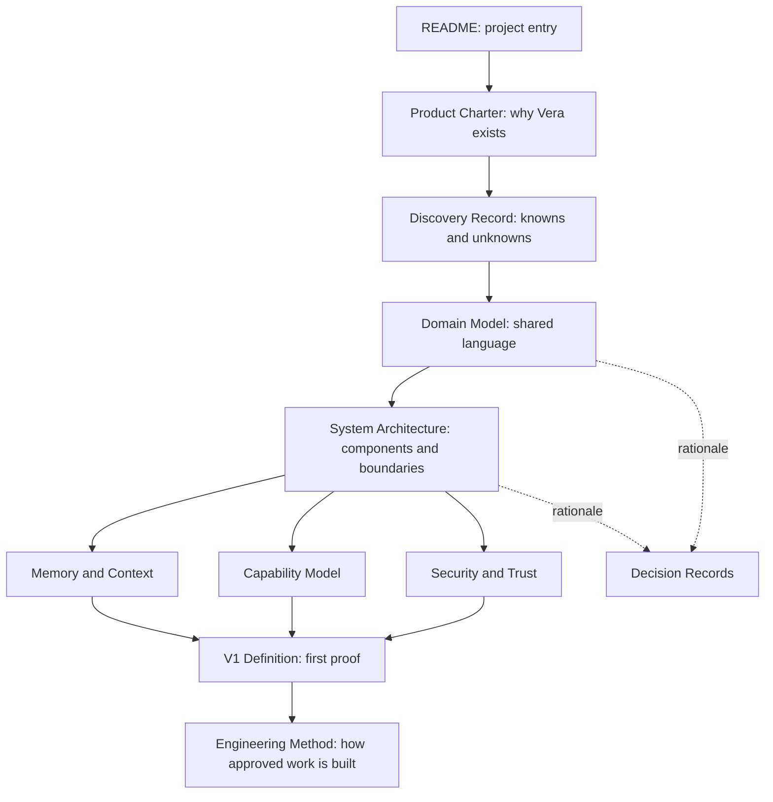

# Vera Documentation Guide

**Status:** Active index
**Last updated:** 24 August 2026

## Purpose

This directory is Vera's durable design record. It converts product discovery
into a body of knowledge that a human engineer or AI builder can enter without
depending on old chat history.

The documentation is intentionally split by concern. A short index and
targeted documents provide cleaner context than one enormous instruction file.

## Foundation review, 24 August 2026

The owner reviewed the foundation and its unresolved decisions on this date.
The Product Charter, the Domain Model's core vocabulary, the System
Architecture's logical shape, the Capability Model's contract, Security and
Trust, and the Engineering Method are now Accepted. V1 scope was trimmed —
see [ADR-0008](decisions/0008-trim-v1-scope-and-ratify-foundation.md).
The durable-state/execution-scratchpad/model-context separation and the V1
experimental journey are also accepted. Broader memory design and the exact
persistence backend remain open on purpose. The current experiment hypothesis
uses MongoDB for durable authority and Redis for a rebuildable execution
scratchpad; it is not yet a production selection.

## Recommended reading order

## Document map

| Document | Status | Question it answers |
|---|---|---|
| [Product Charter](product-charter.md) | Accepted | Why should Vera exist, and what promise must it keep? |
| [Discovery Record](discovery-record.md) | Living | What do we know, recommend, assume, and still need to learn? |
| [Domain Model](domain-model.md) | Accepted (core) | What do conversation, task, run, capability, event, approval, and memory mean? |
| [System Architecture](system-architecture.md) | Accepted (shape) | What are Vera's major components and how does a request move through them? |
| [Memory and Context](memory-and-context.md) | Proposed (except accepted separation principle) | What is durable truth, working state, model context, and long-term memory? |
| [Capability Model](capability-model.md) | Accepted (contract) | How does Vera discover and invoke models, tools, agents, and specialist workflows? |
| [Security and Trust](security-and-trust.md) | Accepted | What may Vera access or change, and who authorizes it? |
| [V1 Definition](v1-definition.md) | Accepted (experimental scope) | What exact architectural claim must the first version prove? |
| [Engineering Method](engineering-method.md) | Accepted | How do we turn discovery into bounded, verifiable implementation work? |
| [Architecture decisions](decisions/README.md) | Mixed — see index | Which consequential choices are recommended, why, and with what consequences? |

## Authority model

Not every document has the same authority.

1. **The accepted Product Charter** is authoritative for product identity,
   purpose, and non-negotiable principles.
2. **Accepted specifications** define required behaviour and contracts within
   the charter's boundaries.
3. **Accepted decision records** are authoritative for the technical or process
   decision they cover and may not contradict higher-level accepted product
   authority.
4. **Proposed documents and decisions** are recommendations awaiting owner
   review.
5. **Discovery records** preserve uncertainty and alternatives.
6. **Chat transcripts, meeting notes, and external material** are inputs, not
   authority.

If two authoritative documents conflict, the conflict must be made explicit and
resolved through a new decision record. A later edit must not silently rewrite
why an earlier decision was made.

## Canonical ownership

Important ideas may be referenced from several documents, but exact definitions
and normative wording have one owner.

| Concern | Canonical owner |
|---|---|
| Vera's identity, North Star, and product principles | [Product Charter](product-charter.md) |
| Domain terms and distinctions | [Domain Model](domain-model.md) |
| Component responsibilities and request lifecycle | [System Architecture](system-architecture.md) |
| Model-provider and capability semantics, including Ollama's role | [Capability Model](capability-model.md) |
| Memory, context, and operational-state semantics | [Memory and Context](memory-and-context.md) |
| Authorization, approval, credential, and budget rules | [Security and Trust](security-and-trust.md) |
| V1 scope and acceptance | [V1 Definition](v1-definition.md) |
| Decision rationale and consequences | [Architecture Decisions](decisions/README.md) |

Other documents should link to the canonical owner instead of creating a
slightly different normative version of the same statement.

## How the original discussion is represented

The initial Vera discussion established several important ideas:

- Product identity and the North Star are owned by the
  [Product Charter](product-charter.md).
- Delegation and the relationship between models, providers, and specialist
  workflows are owned by the [Capability Model](capability-model.md).
- The execution and client boundaries are owned by the
  [System Architecture](system-architecture.md).
- Isolated work and its refined vocabulary are owned by the
  [Domain Model](domain-model.md).
- Temporary context, operational state, and durable memory are separated in
  [Memory and Context](memory-and-context.md).

Those ideas now appear in the relevant design documents and decision records
rather than surviving only as a transcript.

## Documentation rules

- Every document states its status and last-updated date.
- Requirements use testable language where practical.
- Examples are labelled as examples and do not silently become contracts.
- Provider and framework names are kept out of stable semantics unless a
  decision explicitly selects them.
- Diagrams describe the same concepts as the prose and must change with it.
- Open questions remain visible until answered.
- Accepted decisions are superseded, not rewritten to conceal history.
- Raw credentials, personal secrets, and private transcripts do not belong in
  documentation.

## What is intentionally absent

There is no application, package, service, or deployment folder structure yet.
The architecture must first establish process, trust, and ownership boundaries.
Source layout will follow those decisions instead of pretending to make them.

## Documentation stop condition

This foundation is now broad enough to support experiments. No additional
design document should be created until the structured-model-proposal,
durable-transition/recovery, and capability-boundary experiments have
produced evidence — see [Discovery Record](discovery-record.md#required-experiments-before-architecture-approval)
for why these three gate further design and the other two do not. Existing
documents may be corrected or updated when review or experimental results
justify the change.
