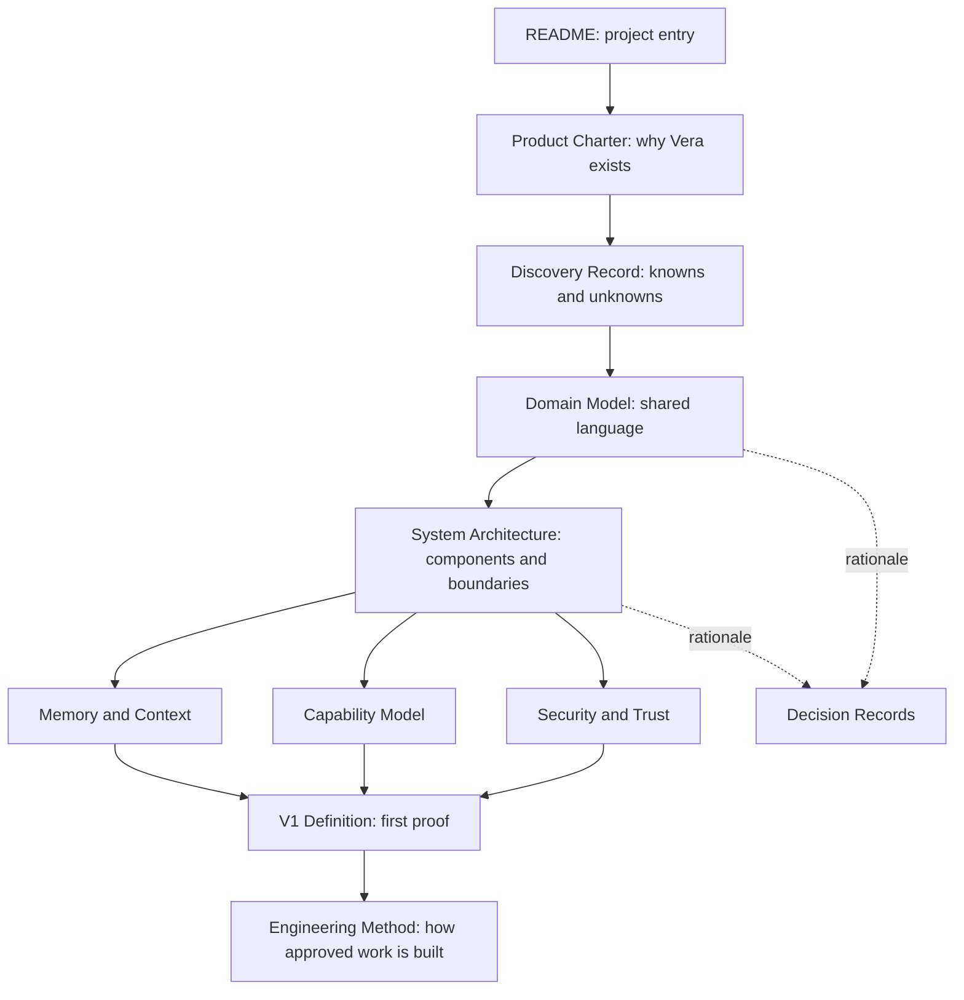

# Vera Documentation Guide

**Status:** Active index
**Last updated:** 26 August 2026

## Purpose

This directory is Vera's durable design record. It converts product discovery
into a body of knowledge that a human engineer or AI builder can enter without
depending on old chat history.

The documentation is intentionally split by concern. A short index and
targeted documents provide cleaner context than one enormous instruction file.

## Foundation review, 24 August 2026

The owner reviewed the foundation and its unresolved decisions on this date.
The Product Charter, the Domain Model's core vocabulary, the System
Architecture's logical shape, the Capability Model's contract, Security and
Trust, and the Engineering Method are now Accepted. V1 scope was trimmed —
see [ADR-0008](decisions/0008-trim-v1-scope-and-ratify-foundation.md).
The durable-state/execution-scratchpad/model-context separation and the V1
journey are also accepted. Broader personal-memory and retention design remains
open on purpose. ADR-0010 selects MongoDB for durable operational authority and
Redis for a rebuildable execution scratchpad.
ADR-0011 makes projects generic and constrains specialist disclosure to a
bounded, approved, hash-verified context snapshot.
ADR-0012 keeps specialist platforms late-bound behind provider-neutral
capabilities while preserving their exact identity in approvals.
ADR-0013 derives asynchronous work from durable MongoDB state and coordinates
workers with expiring per-run leases; Redis remains a disposable scratchpad.
ADR-0014 defines the authenticated host/SSH session and enforced loopback
listener as V1's single-owner perimeter. ADR-0015 registers Ollama, OpenAI, and
Gemini behind explicit startup profiles without silent provider fallback.
ADR-0016 freezes bounded prior complete conversation turns by exact project
scope and durably projects every terminal Vera reply.
ADR-0017 adds provider-neutral software implementation as a review-only patch
artifact produced in an isolated workspace, without repository mutation or
publication authority.
ADR-0018 adds exact, separately approved patch application in durable managed
Git worktrees while leaving commit and publication authority absent. ADR-0019
organizes the growing API by architectural role and cohesive responsibility,
with executable dependency-boundary checks.
ADR-0021 adds bounded two- or three-step goals, exact approval at every
capability boundary, and integrity-checked artifact handoffs.

Implementation began on the same date. ADR-0009 accepts the first production
source layout and model decision boundary. ADR-0010 accepts the durable
task/run/approval lifecycle and operational storage topology.
ADR-0011 accepts the generic project-source, context-manifest, snapshot, and
idempotent plan-artifact boundaries. ADR-0012 records Codex as the default
adapter rather than a permanent domain dependency.
ADR-0013 accepts durable dispatch and the initial in-process worker topology.
ADR-0014 resolves the earlier authentication wording without claiming
application-layer caller identity. ADR-0015 accepts the provider registry,
profile precedence, cloud disclosure boundary, and credential handling.

## Recommended reading order

## Document map

| Document | Status | Question it answers |
|---|---|---|
| [Product Charter](product-charter.md) | Accepted | Why should Vera exist, and what promise must it keep? |
| [Discovery Record](discovery-record.md) | Living | What do we know, recommend, assume, and still need to learn? |
| [Domain Model](domain-model.md) | Accepted (core) | What do conversation, task, run, capability, event, approval, and memory mean? |
| [System Architecture](system-architecture.md) | Accepted (shape) | What are Vera's major components and how does a request move through them? |
| [HTTP API](api.md) | Accepted (implemented paths) | How does a client submit, inspect, approve, and audit work? |
| [Memory and Context](memory-and-context.md) | Proposed (except accepted separation principle) | What is durable truth, working state, model context, and long-term memory? |
| [Capability Model](capability-model.md) | Accepted (contract) | How does Vera discover and invoke models, tools, agents, and specialist workflows? |
| [Security and Trust](security-and-trust.md) | Accepted | What may Vera access or change, and who authorizes it? |
| [V1 Definition](v1-definition.md) | Accepted | What exact architectural claim must the first version prove? |
| [Engineering Method](engineering-method.md) | Accepted | How do we turn discovery into bounded, verifiable implementation work? |
| [Architecture decisions](decisions/README.md) | Mixed — see index | Which consequential choices are recommended, why, and with what consequences? |

The API's concrete source placement and dependency rules are documented in
[`apps/api/README.md`](../apps/api/README.md).

## Authority model

Not every document has the same authority.

1. **The accepted Product Charter** is authoritative for product identity,
   purpose, and non-negotiable principles.
2. **Accepted specifications** define required behaviour and contracts within
   the charter's boundaries.
3. **Accepted decision records** are authoritative for the technical or process
   decision they cover and may not contradict higher-level accepted product
   authority.
4. **Proposed documents and decisions** are recommendations awaiting owner
   review.
5. **Discovery records** preserve uncertainty and alternatives.
6. **Chat transcripts, meeting notes, and external material** are inputs, not
   authority.

If two authoritative documents conflict, the conflict must be made explicit and
resolved through a new decision record. A later edit must not silently rewrite
why an earlier decision was made.

## Canonical ownership

Important ideas may be referenced from several documents, but exact definitions
and normative wording have one owner.

| Concern | Canonical owner |
|---|---|
| Vera's identity, North Star, and product principles | [Product Charter](product-charter.md) |
| Domain terms and distinctions | [Domain Model](domain-model.md) |
| Component responsibilities and request lifecycle | [System Architecture](system-architecture.md) |
| Model-provider and capability semantics, including local/cloud boundaries | [Capability Model](capability-model.md) |
| Memory, context, and operational-state semantics | [Memory and Context](memory-and-context.md) |
| Authorization, approval, credential, and budget rules | [Security and Trust](security-and-trust.md) |
| V1 scope and acceptance | [V1 Definition](v1-definition.md) |
| Decision rationale and consequences | [Architecture Decisions](decisions/README.md) |

Other documents should link to the canonical owner instead of creating a
slightly different normative version of the same statement.

## How the original discussion is represented

The initial Vera discussion established several important ideas:

- Product identity and the North Star are owned by the
  [Product Charter](product-charter.md).
- Delegation and the relationship between models, providers, and specialist
  workflows are owned by the [Capability Model](capability-model.md).
- The execution and client boundaries are owned by the
  [System Architecture](system-architecture.md).
- Isolated work and its refined vocabulary are owned by the
  [Domain Model](domain-model.md).
- Temporary context, operational state, and durable memory are separated in
  [Memory and Context](memory-and-context.md).

Those ideas now appear in the relevant design documents and decision records
rather than surviving only as a transcript.

## Documentation rules

- Every document states its status and last-updated date.
- Requirements use testable language where practical.
- Examples are labelled as examples and do not silently become contracts.
- Provider and framework names are kept out of stable semantics unless a
  decision explicitly selects them.
- Diagrams describe the same concepts as the prose and must change with it.
- Open questions remain visible until answered.
- Accepted decisions are superseded, not rewritten to conceal history.
- Raw credentials, personal secrets, and private transcripts do not belong in
  documentation.

## Current implementation boundary

The repository now has two applications: the deployable service under
`apps/api` and an owner CLI under `apps/cli`. The API is a modular monolith;
internal modules preserve domain, application, adapter, and HTTP boundaries.
`packages/client` is the first genuine shared boundary: a browser-neutral
TypeScript client used by the CLI and available to future user interfaces. See
[ADR-0009](decisions/0009-implement-the-model-decision-boundary.md),
[ADR-0010](decisions/0010-use-mongodb-for-operational-truth-and-redis-for-scratchpads.md),
and [ADR-0013](decisions/0013-dispatch-durable-work-with-mongodb-leases.md).
The model gateway now supplies Ollama, OpenAI, Gemini, and deterministic
adapters through startup-selected profiles; see
[ADR-0015](decisions/0015-select-model-providers-through-explicit-profiles.md).
Conversation-aware orchestration and reply recovery are accepted in
[ADR-0016](decisions/0016-freeze-bounded-conversation-context-and-durably-project-replies.md).
Isolated software-change artifacts are accepted in
[ADR-0017](decisions/0017-produce-software-changes-as-isolated-patch-artifacts.md).
The declarative capability runtime and approval-gated, project-independent
web-research contract are accepted in
[ADR-0020](decisions/0020-use-a-declarative-capability-runtime-and-approval-gated-web-research.md).
Bounded goal execution is accepted in
[ADR-0021](decisions/0021-execute-bounded-goals-with-step-scoped-approvals-and-artifact-lineage.md).
Provider-neutral integration actions and Vera-owned personal tasks are accepted
in
[ADR-0022](decisions/0022-introduce-provider-neutral-integration-actions-with-vera-owned-personal-tasks.md).

## Documentation and implementation cadence

The documentation foundation is complete enough to support implementation.
Consequential decisions are recorded when they are made, while each production
increment must finish with executable evidence. The structured model proposal,
local-model boundary, state machine, approval claim, and schema-bound planning
execution now have deterministic evidence. Real MongoDB/Redis forced-restart,
projection-loss, and idempotency evidence also passes. The generic-project
increment adds bounded hash-verified context, adapter-specific disclosure,
specialist execution, versioned artifacts, ceilings, cancellation, and
deterministic recovery evidence. Durable asynchronous pickup, cross-worker
leases, polling-client behavior, and the owner CLI also have executable
evidence. Provider conformance tests now cover Ollama, OpenAI, and Gemini
request, response, readiness, usage, timeout, and secret-handling boundaries.
Conversation tests cover exact-scope isolation, complete-turn selection,
hash-auditable limits, idempotent replies, and recovery after reply projection
failure. The owner CLI exposes the same path through `vera chat`.
The `vera change` path now has deterministic compiled persistence evidence and
Codex-adapter isolation, path-safety, and Vera-derived patch tests.
The separate change-application path has managed-worktree, exact staged-effect,
idempotency, ordered-event, MongoDB validation, cancellation reconciliation,
and project-mutation lease evidence.
The `vera research` path has deterministic compiled catalog, approval-authority,
project-independent artifact, source-persistence, and restart-retrieval
evidence. The live OpenAI adapter separately has request-shape, readiness,
source-validation, refusal, failure-classification, and secret-redaction tests.
The natural-language goal path has deterministic model-boundary, HTTP, CLI,
artifact-lineage, historical-approval, and forced-restart evidence across a
plan-to-change sequence.
The personal-task path has action-specific approval authority, owner isolation,
idempotent create and mutation recovery, HTTP/client/CLI discovery, durable
artifacts, and forced-restart MongoDB evidence.
Required CI now runs the compiled CLI-to-artifact journey with real
ephemeral MongoDB and Redis plus deterministic owner-controlled adapters; it
does not download models or call a third party. The owner separately approved
and accepted the exact real-cloud-Codex V1 journey on 25 August 2026.
Real OpenAI or Gemini calls require owner-supplied keys and remain explicit
operator conformance rather than required CI; see the
[Discovery Record](discovery-record.md#implementation-evidence-and-next-increments).
