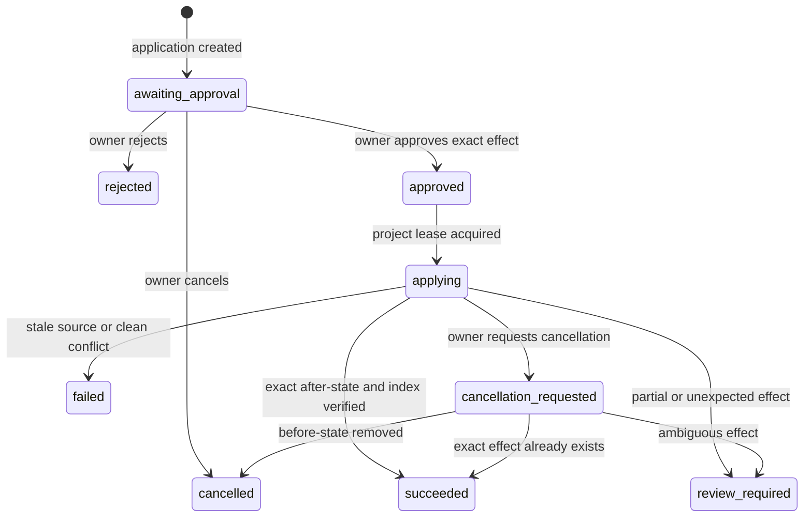

# Vera HTTP API

**Status:** Accepted for implemented V1 paths
**Version:** 1.0
**Last updated:** 26 August 2026

## Purpose

This document owns the external behavior of Vera's implemented HTTP paths. The
domain meanings remain in the [Domain Model](domain-model.md); this document
defines how an HTTP client observes them.

All paths are versioned except process health. JSON request objects are closed:
unknown properties are rejected rather than silently removed. The service
rejects non-loopback bind configuration and uses the implicit `owner_v1`
principal inside the trusted Mac Mini account/SSH perimeter. This topology does
not provide application-layer caller authentication and must not be exposed to
an untrusted network.

## Implemented paths

| Method and path | Purpose | Success |
|---|---|---:|
| `GET /health` | Process liveness only | `200` |
| `GET /ready` | Model, stores, recovery, and every enabled capability runtime | `200` or `503` |
| `GET /v1/capabilities` | List declared capability contracts, authority, enabled state, and destination | `200` |
| `GET /v1/personal-tasks` | List owner-scoped personal tasks; filters: `status`, `limit` | `200` |
| `GET /v1/personal-tasks/{personalTaskId}` | Retrieve one owner-scoped personal task | `200` |
| `POST /v1/projects` | Register an owner-controlled project source | `201` |
| `GET /v1/projects` | List registered projects | `200` |
| `GET /v1/projects/{projectId}` | Retrieve a registered project | `200` |
| `POST /v1/conversations` | Create a conversation | `201` |
| `GET /v1/conversations` | List conversations | `200` |
| `GET /v1/conversations/{conversationId}` | Retrieve messages and task links | `200` |
| `POST /v1/conversations/{conversationId}/messages` | Add owner intent and create its task | `202` |
| `POST /v1/tasks` | Submit owner intent as a durable task and first run | `202` |
| `GET /v1/tasks/{taskId}` | Retrieve the current task/run projection | `200` |
| `GET /v1/runs/{runId}` | Retrieve the current task/run projection by run | `200` |
| `GET /v1/runs/{runId}/events` | Retrieve immutable ordered run events | `200` |
| `POST /v1/approvals/{approvalId}/decision` | Approve or reject the exact proposed invocation | `202` |
| `POST /v1/runs/{runId}/cancellation` | Request a best-effort stop | `202` |
| `GET /v1/artifacts/{artifactId}` | Retrieve a versioned capability artifact | `200` |
| `POST /v1/artifacts/{artifactId}/applications` | Create an exactly scoped software-change application | `202` |
| `GET /v1/change-applications/{applicationId}` | Retrieve application, approval, effect, and result state | `200` |
| `GET /v1/change-applications/{applicationId}/events` | Retrieve immutable ordered application events | `200` |
| `POST /v1/change-applications/{applicationId}/decision` | Approve or reject the disclosed managed-worktree effect | `202` |
| `POST /v1/change-applications/{applicationId}/cancellation` | Request cancellation and reconciliation | `202` |
| `POST /v1/model-decisions` | Exercise the lower-level model decision boundary | `200` |

The model-decision path is useful for provider and proposal diagnostics. New
owner-facing clients should submit tasks so accepted work has durable identity,
events, approval, and recovery semantics.

## Task lifecycle

```mermaid
stateDiagram-v2
    [*] --> deciding: durable task created
    deciding --> succeeded: direct response
    deciding --> rejected: proposal rejected
    deciding --> failed: model or internal failure
    deciding --> awaiting_approval: capability proposed
    awaiting_approval --> rejected: owner rejects
    awaiting_approval --> cancelled: owner cancels
    awaiting_approval --> executing: owner approves and execution claim succeeds
    executing --> cancellation_requested: owner requests cancellation
    cancellation_requested --> cancelled: capability stops
    cancellation_requested --> succeeded: capability finishes first
    executing --> succeeded: validated result recorded
    executing --> awaiting_approval: goal step succeeds; next step disclosed
    executing --> failed: capability fails
```



Task status is a coarser projection:

| Run status | Task status |
|---|---|
| `deciding`, `awaiting_approval`, `executing`, `cancellation_requested` | `active` |
| `succeeded` | `completed` |
| `rejected` | `rejected` |
| `failed` | `failed` |
| `cancelled` | `cancelled` |

Terminal runs are not reopened. Retry as a new run is not implemented yet.

For a compound request, the optional `goal` projection contains the objective,
authoritative project identity when applicable, current step, and two or three
ordered step states. `approval` and `invocation` always name the current
boundary. When a step completes and another begins, its full records move to
the bounded `approvalHistory` and `invocationHistory`; the next approval gets a
new identity. Clients must therefore continue polling after approval and must
handle another `awaiting_approval` before terminal completion.

The final `goal_result` contains every step's artifact reference. An artifact's
optional `inputs` field records the exact upstream references that were approved
for that invocation.

## Submit a task

```http
POST /v1/tasks
Content-Type: application/json
Idempotency-Key: 4a43628a-e1df-42f7-98bb-b2e59b62745d

{
  "message": "Create an implementation plan for VERA-202.",
  "projectId": "project_..."
}
```

`Idempotency-Key` is required, case-insensitive as an HTTP header, and must be
8–200 characters. The key is scoped to the implicit V1 principal. Repeating the
same key with the same complete task input returns the original task. Reusing
it for different input returns `409 idempotency_key_reused`. Different
principals may independently use the same key.

Vera persists the task before asking a model. A worker then discovers the
`deciding` run from durable state. A provider failure therefore
produces an inspectable terminal task instead of losing the accepted request.
The response is `202 Accepted` because clients must treat task resources and
polling—not the duration of this connection—as the execution contract.

The initial response will normally have `runStatus: "deciding"`. Clients must
poll `GET /v1/runs/{runId}` until the run becomes terminal or reaches
`awaiting_approval`; they must not assume the submission response already
contains an approval.

Example waiting response, abbreviated:

```json
{
  "schemaVersion": 1,
  "taskId": "task_...",
  "runId": "run_...",
  "taskStatus": "active",
  "runStatus": "awaiting_approval",
  "message": "Create an implementation plan for VERA-202.",
  "projectId": "project_...",
  "approval": {
    "id": "approval_...",
    "status": "pending",
    "reason": "specialist_capability_invocation",
    "capability": {
      "name": "development_planning",
      "version": 1
    },
    "proposedArguments": {
      "objective": "Create an implementation plan for VERA-202.",
      "ticket": {
        "reference": "VERA-202",
        "details": "Create an implementation plan."
      },
      "project": {
        "name": "Vera"
      }
    },
    "project": {
      "id": "project_...",
      "displayName": "Vera"
    },
    "contextManifest": {
      "schemaVersion": 1,
      "projectId": "project_...",
      "sourceKind": "local_git",
      "revision": "<git-commit>+working-tree",
      "entries": [
        {
          "relativePath": "apps/api/src/server.ts",
          "sha256": "...",
          "bytes": 1234,
          "selectionReason": "Repository evidence for the requested work.",
          "classification": "source_code"
        }
      ],
      "totalFiles": 1,
      "totalBytes": 1234
    },
    "destination": {
      "schemaVersion": 1,
      "adapterId": "codex_cli",
      "provider": "openai",
      "transport": "local_process",
      "dataBoundary": "third_party"
    },
    "requestedAt": "2026-08-24T18:00:00.000Z"
  },
  "links": {
    "task": "/v1/tasks/task_...",
    "run": "/v1/runs/run_...",
    "events": "/v1/runs/run_.../events",
    "approval": "/v1/approvals/approval_.../decision"
  }
}
```

`proposedArguments` is the model-proposed routing input. `project`,
`contextManifest`, destination, invocation identity, and limits are
authoritative fields added by Vera code. Approval covers this complete
disclosure. The corresponding hash-verified contents are frozen durably but are
not echoed in ordinary API responses.

Every new approval also records the selected declaration's `authority`:
approval mode, project-context requirement, network access, data classes,
side-effect classes, credential mode, and any capability-specific hard ceiling.
For `web_research@1`, `projectContext` is `none`, network access is
`public_web_via_provider`, and the maximum is four search calls. No project or
context manifest is present. This authority is added by Vera code; it is never
accepted from the model or caller.

For `personal_task_management@1`, `projectContext`, network access, and
credentials are all `none`; the destination is the owner-controlled
`vera_personal_tasks` local-store adapter. A `list` action discloses
`personal_task_data` with no side effect. `create`, `complete`, and `reopen`
also disclose `personal_data_write`. These are calculated from the validated
action by Vera code and frozen before execution.

## Personal tasks

Personal task mutations are submitted as natural-language tasks or conversation
messages and follow the normal decision and approval lifecycle. The supported
closed action contract is:

```text
create   { title, notes?, dueAt? }
list     { status?: all|open|completed, limit?: 1..100 }
complete { taskId }
reopen   { taskId }
```

Successful execution returns a `personal_task_result` artifact and a matching
task output. The personal task itself is a durable owner resource with a stable
`personal_task_...` identity and `open` or `completed` status.

The retrieval endpoint is read-only:

```http
GET /v1/personal-tasks?status=open&limit=50
```

It returns `{ "schemaVersion": 1, "tasks": [...] }`. `GET
/v1/personal-tasks/{id}` returns one task or `404 personal_task_not_found`.
There is deliberately no direct HTTP mutation path in this increment; mutations
must pass through proposal validation, approval, durable invocation, and
artifact evidence.

The destination is provider-neutral but not anonymous. A future
`claude_code_cli` adapter would appear as that `adapterId` with provider
`anthropic`; it would not require a different task or artifact contract.
The claimed invocation and resulting artifact copy this descriptor. Execution
resolves the persisted approved descriptor, not whichever adapter happens to be
selected when an approval or restart is processed. If the adapter is absent or
its provider/boundary configuration changed, the run fails closed.

In a completed development plan or software change, `project`, `ticket`, and `objective` are copied
into the result by Vera code from these approved arguments. They are deliberately
excluded from model-generated plan content, so a model cannot rewrite task
identity while producing the plan.

## Decide an approval

```http
POST /v1/approvals/approval_.../decision
Content-Type: application/json

{
  "decision": "approved"
}
```

The only decisions are `approved` and `rejected`. Vera records the decision and
principal before doing anything else. On approval it then atomically claims an
invocation identity before calling the capability.

Repeating the same decision is idempotent. Sending the opposite decision after
one has been recorded returns `409 approval_already_decided`. A model, caller
request property, or capability cannot create or broaden an approval.

## Register projects and use conversations

Project registration is explicit and idempotent:

```http
POST /v1/projects
Content-Type: application/json
Idempotency-Key: register-vera-local

{
  "displayName": "Vera",
  "source": {
    "kind": "local_git",
    "rootPath": "/absolute/path/to/vera"
  }
}
```

The path must be the canonical root of a Git repository. Models never provide
or alter it. A conversation is created with `POST /v1/conversations`, then an
owner message creates a linked task:

```http
POST /v1/conversations/conversation_.../messages
Content-Type: application/json
Idempotency-Key: plan-vera-202

{
  "content": "Prepare the implementation plan for VERA-202.",
  "projectId": "project_..."
}
```

Repeating the message key returns the same message and task. A single
conversation response exposes immutable owner and Vera messages and their
`taskId` links. Before the model call, the task freezes bounded prior complete
turns from the exact same `projectId` scope; unscoped messages form their own
scope. The task response exposes `conversationContextManifest` with hashes,
limits, totals, and exclusion counts, without duplicating message content.

Every terminal conversation task has a `conversationReply` projection with a
stable message ID and `pending` or `projected` status. The worker recovers a
pending projection idempotently. A polling client should treat a conversation
task as settled only after this status is `projected`, even if the run has
already reached a terminal status.

The list endpoint returns bounded summaries instead: identity, title, status,
timestamps, `messageCount`, and the most recent message without its internal
idempotency key.

## Capability catalog

`GET /v1/capabilities` returns stable declarations whether enabled or disabled.
An enabled entry includes the selected provider-neutral destination; a disabled
entry omits it. Credentials and provider-native configuration are never
returned. Only enabled capability references are included in the orchestration
model's prompt and structured proposal schema. A disabled entry reports the
capability's maximum authority envelope. An enabled entry reports the selected
runtime's narrower effective authority, which is the value frozen by approval.

```json
{
  "schemaVersion": 1,
  "capabilities": [
    {
      "name": "web_research",
      "version": 1,
      "description": "Research a project-independent question on the public web and return a source-backed report.",
      "effect": "external",
      "artifact": {
        "type": "research_report",
        "mediaType": "application/vnd.vera.research-report+json"
      },
      "authority": {
        "approval": "always",
        "projectContext": "none",
        "networkAccess": "public_web_via_provider",
        "dataClasses": ["owner_request", "public_web"],
        "sideEffects": ["third_party_disclosure", "public_network_read"],
        "credentials": "server_managed",
        "maxWebSearchCalls": 4
      },
      "enabled": false
    }
  ]
}
```

## Artifacts, application, and cancellation

A successful planning invocation stores one `implementation_plan` artifact. A
successful `software_change@1` invocation stores one `software_change` artifact
with a reviewable Git patch, file operations, sizes, hashes, verification
report, and risks. The change is produced in an isolated snapshot and does not
modify, commit, push, or publish the registered project.

A successful `web_research@1` invocation stores one project-independent
`research_report` artifact. It preserves the approved objective, Markdown
report, deduplicated HTTP(S) sources, search timestamp, invocation identity, and
producer destination. It has no `projectId`. The live adapter fails closed when
it cannot establish that web search occurred or when the result has no source.

The stable artifact identity is derived from the invocation ID; retry or
recovery cannot create a second artifact for that invocation. The task output
includes a typed artifact reference, and
`GET /v1/artifacts/{artifactId}` returns the versioned content and provenance.

A `software_change` artifact is still only a reviewable result. Creating an
application requires a new principal-scoped `Idempotency-Key`:

```http
POST /v1/artifacts/artifact_.../applications
Idempotency-Key: apply-vera-101-v1
```

The returned application is initially `awaiting_approval`. Its approval freezes
the artifact and patch hashes, project, immutable base commit, deterministic
branch, managed workspace path, exact file operations and hashes, and the fact
that the change will be staged. Approval is addressed by application ID because
the complete application is the effect-owning resource:

```http
POST /v1/change-applications/application_.../decision
Content-Type: application/json

{ "decision": "approved" }
```

The worker later applies and stages the patch in the disclosed managed Git
worktree. It does not change the registered checkout, commit, push, or open a
pull request. A successful response exposes the verified result and stable
links to the application and its events.



The application is idempotent by principal and request key. Reuse with a
different artifact returns a conflict. Persistent workers serialize effects per
project, and restart reconciliation classifies the actual managed worktree as
before, after, or mixed before recording an outcome.

`POST /v1/runs/{runId}/cancellation` records a stop request. Before capability
execution it terminally cancels the run and rejects a pending approval. During
execution it asks the adapter to abort. Cancellation is best effort: a
capability that finishes before the abort is observed may still succeed.

The cancellation and approval handlers also return after their durable
transition. The worker performs subsequent execution asynchronously, so clients
poll the run resource for the resulting terminal state. No long-running work
depends on one HTTP connection.

`POST /v1/change-applications/{applicationId}/cancellation` is stricter about
filesystem truth. Cancellation removes a still-unmodified managed worktree. If
the exact approved patch is already staged, the application succeeds because
the effect cannot truthfully be reported as reversed. Mixed state becomes
`review_required` and is never overwritten automatically.

## Events

`GET /v1/runs/{runId}/events` returns:

```json
{
  "schemaVersion": 1,
  "taskId": "task_...",
  "runId": "run_...",
  "events": []
}
```

Every event has an opaque ID, a strictly increasing sequence within the task
aggregate, a stable type, an ISO-8601 occurrence time, and a versioned payload
owned by that event type. Current event types are:

- `task_created`, `run_started`;
- `budget_assigned`, `budget_consumed`, `budget_exhausted`;
- `model_decision_recorded`;
- `context_assembled`;
- `approval_requested`, `approval_approved`, `approval_rejected`;
- `capability_invocation_started`, `capability_invocation_succeeded`,
  `capability_invocation_failed`;
- `artifact_created`;
- `cancellation_requested`, `run_cancelled`;
- `run_succeeded`, `run_rejected`, `run_failed`;
- `conversation_context_assembled`, `conversation_reply_pending`,
  `conversation_reply_projected`.

Change-application events use their own sequence and include creation, approval
request/decision, start, success, failure, review-required, cancellation
request, and cancellation. Their event stream is not mixed into the source
task's run events because artifact production and repository mutation are
separate effects.

Events are evidence, not debug logs. Provider internals, credentials, and raw
exceptions are excluded.

## Validation and errors

Error envelopes use:

```json
{
  "error": {
    "code": "invalid_request",
    "message": "Request validation failed."
  }
}
```

| Status | Codes | Meaning |
|---:|---|---|
| `400` | `invalid_request` | Missing, malformed, too large, or unknown request input. |
| `404` | `task_not_found`, `run_not_found`, `approval_not_found`, `project_not_found`, `conversation_not_found`, `conversation_message_not_found`, `artifact_not_found`, `change_application_not_found` | The addressed resource does not exist. |
| `409` | `idempotency_key_reused`, `approval_already_decided`, `concurrent_transition_failed`, `conversation_message_mismatch`, `change_application_idempotency_key_reused`, `change_application_approval_already_decided`, `change_application_concurrent_transition_failed`, `change_application_not_cancellable`, `stale_source`, `application_conflict`, `review_required` | The request conflicts with durable or filesystem state. |
| `422` | `invalid_project_source`, `software_change_artifact_required` | A project source is invalid, or the selected artifact cannot be used for a software-change application. |
| `502` | `provider_request_rejected`, `provider_response_invalid` | Provider boundary failed while using the diagnostic endpoint. |
| `503` | `model_not_found`, `provider_unavailable`, `operational_store_unavailable`, `scratchpad_unavailable`, `planning_capability_unavailable`, `software_change_capability_unavailable`, `capability_unavailable` | A required runtime dependency is unavailable. The response `dependency` identifies a generic capability runtime. |
| `504` | `provider_timeout` | The model provider exceeded its deadline. |
| `500` | `internal_error`, `application_failed` | An unexpected server or managed-effect failure; details remain in structured logs. |

## Current security boundary

The API has no application-layer caller authentication. ADR-0014 explicitly
sets the V1 owner perimeter at the trusted Mac Mini account and authenticated
SSH session, and configuration rejects non-loopback listeners. SSH forwarding
may expose the loopback service to the owner's MacBook. Vera must not bind to a
LAN or public interface until application identity, authentication, and
transport policy are implemented.
