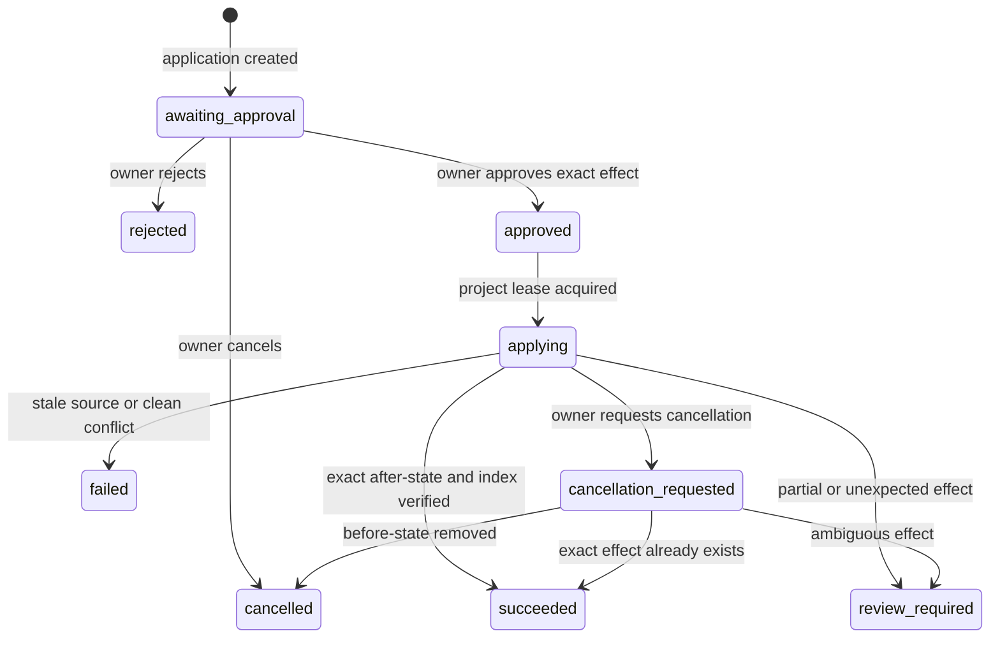
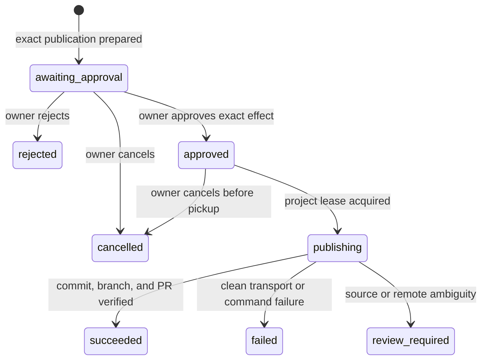
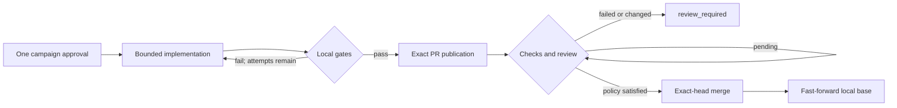

# Vera HTTP API

**Status:** Accepted for implemented V1 paths
**Version:** 1.7
**Last updated:** 4 September 2026

## Purpose

This document owns the external behavior of Vera's implemented HTTP paths. The
domain meanings remain in the [Domain Model](domain-model.md); this document
defines how an HTTP client observes them.

All paths are versioned except process health. JSON request objects are closed:
unknown properties are rejected rather than silently removed. The service
rejects non-loopback bind configuration and uses the implicit `owner_v1`
principal inside the trusted Mac Mini account/SSH/private-tailnet perimeter.
This topology does not provide application-layer caller authentication and
must not be exposed to an untrusted or shared network.

## Implemented paths

| Method and path | Purpose | Success |
|---|---|---:|
| `GET /health` | Process liveness only | `200` |
| `GET /ready` | Model, stores, recovery, workers, and every enabled task-capability runtime | `200` or `503` |
| `GET /v1/capabilities` | List declared capability contracts, authority, enabled state, and destination | `200` |
| `GET /v1/attention` | Compute the current owner briefing from authoritative resources and persisted dispositions | `200` |
| `POST /v1/attention-items/{attentionItemId}/decision` | Idempotently snooze, dismiss, or restore one exact attention generation | `200` |
| `GET /v1/routines` | List durable standing instructions | `200` |
| `POST /v1/routines` | Idempotently draft an inactive routine for exact approval | `202` |
| `GET /v1/routines/{routineId}` | Retrieve one routine and its frozen authority | `200` |
| `POST /v1/routines/{routineId}/decision` | Approve or reject one pending standing instruction | `202` |
| `POST /v1/routines/{routineId}/pause` | Revoke execution for an active routine | `202` |
| `POST /v1/routines/{routineId}/resume` | Resume the unchanged approved routine | `202` |
| `GET /v1/routines/{routineId}/runs` | List recent durable routine runs | `200` |
| `POST /v1/routines/{routineId}/runs` | Idempotently queue one manual run of an active routine | `202` |
| `GET /v1/routine-runs/{runId}` | Retrieve one durable routine occurrence for completion polling | `200` |
| `POST /v1/audio/transcriptions` | Transcribe one completed bounded audio recording without persisting it | `200` |
| `POST /v1/attachments` | Validate, extract, and durably store one owner-scoped document | `200` or `201` |
| `GET /v1/attachments/{attachmentId}` | Retrieve attachment metadata and extraction status, never original content | `200` |
| `GET /v1/personal-tasks` | List owner-scoped personal tasks; filters: `status`, `limit` | `200` |
| `GET /v1/personal-tasks/{personalTaskId}` | Retrieve one owner-scoped personal task | `200` |
| `GET /v1/reminders` | List owner-scoped reminders; filters: `status`, `limit` | `200` |
| `GET /v1/reminders/{reminderId}` | Retrieve one owner-scoped reminder | `200` |
| `GET /v1/memories` | List owner-scoped memories; filters: `status`, `kind`, `scopeKind`, `projectId`, `limit` | `200` |
| `GET /v1/memories/{memoryId}` | Retrieve one owner-scoped memory including revision history | `200` |
| `POST /v1/knowledge-sources` | Promote exact owner attachments into one durable knowledge source | `200` or `201` |
| `GET /v1/knowledge-sources` | List active or removed knowledge-source projections | `200` |
| `GET /v1/knowledge-sources/{sourceId}` | Retrieve one source projection and provenance | `200` |
| `DELETE /v1/knowledge-sources/{sourceId}` | Tombstone a source and erase its searchable chunks | `200` |
| `POST /v1/knowledge-search` | Retrieve bounded, integrity-checked citations from active sources | `200` |
| `GET /v1/notifications` | Page durable inbox notifications after an opaque cursor | `200` |
| `GET /v1/notifications/stream` | Watch the durable inbox as resumable server-sent events | `200` |
| `POST /v1/projects` | Register an owner-controlled project source | `201` |
| `GET /v1/projects` | List registered projects | `200` |
| `GET /v1/projects/{projectId}` | Retrieve a registered project | `200` |
| `POST /v1/conversations` | Create a conversation | `201` |
| `GET /v1/conversations` | List conversations | `200` |
| `GET /v1/conversations/{conversationId}` | Retrieve messages and task links | `200` |
| `POST /v1/conversations/{conversationId}/messages` | Add owner intent and create its task | `202` |
| `POST /v1/tasks` | Submit owner intent as a durable task and first run | `202` |
| `GET /v1/tasks/{taskId}` | Retrieve the current task/run projection | `200` |
| `GET /v1/runs/{runId}` | Retrieve the current task/run projection by run | `200` |
| `GET /v1/runs/{runId}/events` | Retrieve immutable ordered run events | `200` |
| `POST /v1/approvals/{approvalId}/decision` | Approve or reject the exact proposed invocation | `202` |
| `POST /v1/runs/{runId}/cancellation` | Request a best-effort stop | `202` |
| `GET /v1/artifacts/{artifactId}` | Retrieve a versioned capability artifact | `200` |
| `POST /v1/artifacts/{artifactId}/applications` | Create an exactly scoped software-change application | `202` |
| `GET /v1/artifacts/{artifactId}/applications` | List the latest owner-scoped application attempts for recovery | `200` |
| `GET /v1/change-applications/{applicationId}` | Retrieve application, approval, effect, and result state | `200` |
| `GET /v1/change-applications/{applicationId}/events` | Retrieve immutable ordered application events | `200` |
| `POST /v1/change-applications/{applicationId}/decision` | Approve or reject the disclosed managed-worktree effect | `202` |
| `POST /v1/change-applications/{applicationId}/cancellation` | Request cancellation and reconciliation | `202` |
| `POST /v1/change-applications/{applicationId}/publications` | Create an exact commit/branch/pull-request publication request | `202` |
| `GET /v1/change-applications/{applicationId}/publications` | List the latest owner-scoped publication attempts for recovery | `200` |
| `GET /v1/software-change-publications/{publicationId}` | Retrieve publication approval, effect, and result state | `200` |
| `GET /v1/software-change-publications/{publicationId}/events` | Retrieve immutable ordered publication events | `200` |
| `POST /v1/software-change-publications/{publicationId}/decision` | Approve or reject the disclosed publication effect | `202` |
| `POST /v1/software-change-publications/{publicationId}/cancellation` | Cancel publication before execution begins | `202` |
| `POST /v1/development-campaigns` | Prepare one policy-bounded development campaign for approval | `202` |
| `GET /v1/development-campaign-policies` | List safe campaign-policy summaries for registered projects | `200` |
| `GET /v1/development-campaigns` | List the latest owner-scoped campaigns | `200` |
| `GET /v1/development-campaigns/{campaignId}` | Retrieve frozen authority, attempts, PR observation, and result | `200` |
| `POST /v1/development-campaigns/{campaignId}/decision` | Approve or reject the complete campaign envelope | `202` |
| `POST /v1/development-campaigns/{campaignId}/cancellation` | Cancel a campaign before publication begins | `202` |
| `GET /v1/mission-policies` | List safe bounded-mission policy summaries | `200` |
| `GET /v1/missions` | List owner-scoped missions | `200` |
| `POST /v1/missions` | Prepare one exact bounded mission for approval | `202` |
| `GET /v1/missions/{missionId}` | Retrieve mission authority, campaign identity, progress, and result | `200` |
| `POST /v1/missions/{missionId}/decision` | Approve or reject the complete mission envelope | `202` |
| `POST /v1/missions/{missionId}/cancellation` | Cancel a mission while its campaign can still be stopped | `202` |
| `POST /v1/model-decisions` | Exercise the lower-level model decision boundary | `200` |

The model-decision path is useful for provider and proposal diagnostics. New
owner-facing clients should submit tasks so accepted work has durable identity,
events, approval, and recovery semantics.

## Speech transcription

`POST /v1/audio/transcriptions` is deliberately not a task-creation endpoint.
It is a synchronous, ephemeral experience adapter used to turn one completed
recording into editable text before the owner submits anything.

Send the binary recording as the request body with one of these content types:
`audio/webm`, `audio/mp4`, `audio/mpeg`, `audio/wav`, or `audio/x-wav`. The
default and maximum body limit is 25,000,000 bytes. Empty audio returns
`422 audio_empty`, unsupported media returns `415 audio_type_unsupported`, and
oversized input returns `413 audio_too_large`.

```http
POST /v1/audio/transcriptions
Content-Type: audio/webm

<binary recording>
```

```json
{
  "schemaVersion": 1,
  "text": "Please show my open tasks.",
  "provider": "openai",
  "model": "gpt-transcribe",
  "durationMs": 842
}
```

The response metadata describes transcription only. Raw audio and this response
are not stored by the endpoint. If the owner sends the returned text, the
ordinary conversation/task contract governs that separate request. Provider
credentials never enter the public client.

## Attachments and document/image analysis

`POST /v1/attachments` accepts the original bytes using
`Content-Type: application/octet-stream`. `X-Vera-Filename` contains the
percent-encoded display filename and `X-Vera-Media-Type` declares a supported
document or image type. Separating transport type from declared media type
preserves the API's ordinary JSON parser.

```http
POST /v1/attachments
Content-Type: application/octet-stream
X-Vera-Filename: quarterly-brief.pdf
X-Vera-Media-Type: application/pdf

<original PDF bytes>
```

Documents may be text, Markdown, JSON, or PDF and are limited to 8 MiB. Images
may be JPEG, PNG, WebP, GIF, HEIC, HEIF, AVIF, or TIFF and are limited to 20
MiB. Successful creation returns `201`; uploading the same bytes again for the
same
owner returns the existing resource with `200`. The response contains stable
identity, filename, media type, byte length, content hash, creation time, and
document extraction status or image normalization metadata. It never returns
original bytes or extracted segments. Empty or unreadable content returns
`422`, an unsupported declared or transport type returns `415`, and an
over-limit body returns `413`.

`GET /v1/attachments/{attachmentId}/preview` returns only the bounded,
metadata-stripped JPEG or PNG vision representation for an owner-scoped image.
It never returns original image bytes. Document attachments do not have a
preview response in this version.

Messages and direct tasks accept at most five unique `attachmentIds`:

```json
{
  "content": "Compare the risks and cite the evidence.",
  "attachmentIds": ["attachment_..."]
}
```

The API resolves every ID inside the current owner boundary and freezes exact
filename, media type, size, and SHA-256 references into the resulting task.
Unknown or cross-owner IDs are reported as not found. The orchestration model
sees only filename, media type, and byte length. If it proposes
`attachment_analysis@1`, the approval identifies every exact attachment and
whether extracted document text or normalized images will remain
owner-controlled or cross a third-party provider boundary. Content is loaded
only after approval and all stored hashes are verified again immediately before
provider invocation.

The successful task output and `attachment_analysis` artifact contain a summary,
findings, and citations. During execution the model selects opaque source IDs;
Vera resolves them to approved segments and constructs the public citations.
Document citations contain an attachment ID, filename, exact locator such as
`page 3` or `lines 12-20`, and a source excerpt verified against the approved
segment. Image citations contain the exact approved image identity; this
version does not falsely claim pixel-level citation precision. A follow-up must
explicitly reference the attachment again; conversation history alone does not
silently redisclose attachment content.

## Task lifecycle

```mermaid
stateDiagram-v2
    [*] --> deciding: durable task created
    deciding --> succeeded: direct response
    deciding --> rejected: proposal rejected
    deciding --> failed: model or internal failure
    deciding --> awaiting_approval: capability proposed
    awaiting_approval --> rejected: owner rejects
    awaiting_approval --> cancelled: owner cancels
    awaiting_approval --> executing: owner approves and execution claim succeeds
    executing --> cancellation_requested: owner requests cancellation
    cancellation_requested --> cancelled: capability stops
    cancellation_requested --> succeeded: capability finishes first
    executing --> succeeded: validated result recorded
    executing --> awaiting_approval: goal step succeeds; next step disclosed
    executing --> deciding: adaptive step produces validated observation
    deciding --> awaiting_approval: adaptive continuation proposes next step
    deciding --> succeeded: adaptive continuation completes from evidence
    executing --> failed: capability fails
```



Task status is a coarser projection:

| Run status | Task status |
|---|---|
| `deciding`, `awaiting_approval`, `executing`, `cancellation_requested` | `active` |
| `succeeded` | `completed` |
| `rejected` | `rejected` |
| `failed` | `failed` |
| `cancelled` | `cancelled` |

Terminal runs are not reopened. Retry as a new run is not implemented yet.

For a compound request, the optional `goal` projection contains the objective,
authoritative project identity when applicable, current step, and at most three
ordered step states. Schema version 1 is a fixed two- or three-step plan. Schema
version 2 has `mode: "adaptive"`, completion criteria, a durable list of
capability-backed outcome requirements, one initially known step, and a bounded
continuation history added after validated observations.
`approval` and `invocation` always name the current boundary. When a step
completes and another begins, its full records move to the bounded
`approvalHistory` and `invocationHistory`; the next approval gets a new
identity. Clients must therefore continue polling after approval and must
handle `deciding` and another `awaiting_approval` before terminal completion.

The fixed final `goal_result` contains every step's artifact reference. The
adaptive `adaptive_goal_result` contains a natural-language message with a
code-authored verified-outcome and execution ledger, all artifacts, and the
exact evidence references supporting that message. Completion resolves every
outcome requirement as capability-proven or evidence-backed not applicable. An
artifact's optional `inputs` field records upstream references actually
approved for and consumed by that invocation.

Adaptive approvals may also contain `decisionEvidence`. These references show
which prior artifacts informed the continuation but are not capability inputs
and do not disclose artifact content to that capability. The continuation
history retains proposal, code-validated decision, model metadata, evidence
step IDs, and decision time. Internal artifact content is not embedded in the
task projection.

An attachment-plus-action request is projected as an adaptive goal whose first
step is `attachment_analysis@1`. A later approval exposes
`decisionEvidence` for the exact analysis used to derive its arguments. When a
planning or software-change specialist must also consume that analysis, the
same reference appears under `inputArtifacts`; its complete content then falls
inside the approval's `artifact_content` disclosure. Owner-state actions keep
`inputArtifacts` absent and receive only their exact derived arguments.

## Submit a task

```http
POST /v1/tasks
Content-Type: application/json
Idempotency-Key: 4a43628a-e1df-42f7-98bb-b2e59b62745d

{
  "message": "Create an implementation plan for VERA-202.",
  "projectId": "project_..."
}
```

`Idempotency-Key` is required, case-insensitive as an HTTP header, and must be
8–200 characters. The key is scoped to the implicit V1 principal. Repeating the
same key with the same complete task input returns the original task. Reusing
it for different input returns `409 idempotency_key_reused`. Different
principals may independently use the same key.

Vera persists the task before asking a model. A worker then discovers the
`deciding` run from durable state. A provider failure therefore
produces an inspectable terminal task instead of losing the accepted request.
The response is `202 Accepted` because clients must treat task resources and
polling—not the duration of this connection—as the execution contract.

The initial response will normally have `runStatus: "deciding"`. Clients must
poll `GET /v1/runs/{runId}` until the run becomes terminal or reaches
`awaiting_approval`; they must not assume the submission response already
contains an approval.

Example waiting response, abbreviated:

```json
{
  "schemaVersion": 1,
  "taskId": "task_...",
  "runId": "run_...",
  "taskStatus": "active",
  "runStatus": "awaiting_approval",
  "message": "Create an implementation plan for VERA-202.",
  "projectId": "project_...",
  "approval": {
    "id": "approval_...",
    "status": "pending",
    "reason": "specialist_capability_invocation",
    "capability": {
      "name": "development_planning",
      "version": 1
    },
    "proposedArguments": {
      "objective": "Create an implementation plan for VERA-202.",
      "ticket": {
        "reference": "VERA-202",
        "details": "Create an implementation plan."
      },
      "project": {
        "name": "Vera"
      }
    },
    "project": {
      "id": "project_...",
      "displayName": "Vera"
    },
    "contextManifest": {
      "schemaVersion": 1,
      "projectId": "project_...",
      "sourceKind": "local_git",
      "revision": "<git-commit>+working-tree",
      "entries": [
        {
          "relativePath": "apps/api/src/server.ts",
          "sha256": "...",
          "bytes": 1234,
          "selectionReason": "Repository evidence for the requested work.",
          "classification": "source_code"
        }
      ],
      "totalFiles": 1,
      "totalBytes": 1234
    },
    "destination": {
      "schemaVersion": 1,
      "adapterId": "codex_cli",
      "provider": "openai",
      "transport": "local_process",
      "dataBoundary": "third_party"
    },
    "requestedAt": "2026-08-24T18:00:00.000Z"
  },
  "links": {
    "task": "/v1/tasks/task_...",
    "run": "/v1/runs/run_...",
    "events": "/v1/runs/run_.../events",
    "approval": "/v1/approvals/approval_.../decision"
  }
}
```

`proposedArguments` is the model-proposed routing input. `project`,
`contextManifest`, destination, invocation identity, and limits are
authoritative fields added by Vera code. Approval covers this complete
disclosure. The corresponding hash-verified contents are frozen durably but are
not echoed in ordinary API responses.

Every new approval also records the selected declaration's `authority`:
approval mode, project-context requirement, network access, data classes,
side-effect classes, credential mode, and any capability-specific hard ceiling.
For `web_research@1`, `projectContext` is `none`, network access is
`public_web_via_provider`, and the maximum is four search calls. No project or
context manifest is present. This authority is added by Vera code; it is never
accepted from the model or caller.

For `personal_task_management@1`, `projectContext`, network access, and
credentials are all `none`; the destination is the owner-controlled
`vera_personal_tasks` local-store adapter. A `list` action discloses
`personal_task_data` with no side effect. `create`, `complete`, and `reopen`
also disclose `personal_data_write`. These are calculated from the validated
action by Vera code and frozen before execution.

## Personal tasks

Personal task mutations are submitted as natural-language tasks or conversation
messages and follow the normal decision and approval lifecycle. The supported
closed action contract is:

```text
create   { title, notes?, dueAt? }
list     { status?: all|open|completed, limit?: 1..100 }
complete { taskId }
reopen   { taskId }
```

Successful execution returns a `personal_task_result` artifact and a matching
task output. The personal task itself is a durable owner resource with a stable
`personal_task_...` identity and `open` or `completed` status.

The retrieval endpoint is read-only:

```http
GET /v1/personal-tasks?status=open&limit=50
```

It returns `{ "schemaVersion": 1, "tasks": [...] }`. `GET
/v1/personal-tasks/{id}` returns one task or `404 personal_task_not_found`.
There is deliberately no direct HTTP mutation path in this increment; mutations
must pass through proposal validation, approval, durable invocation, and
artifact evidence.

## Registered machines

`GET /v1/machines` returns only public registered identities, adapter kinds,
diagnostic labels, service identities, and allowed actions. It never returns
executables, command arguments, SSH options, or credentials.

Machine work enters through the normal task or conversation API. An inspection
approval targets `machine_inspection@1` and freezes a machine-specific
destination such as `machine.macmini`. Its result is a
`machine_diagnostic` artifact containing bounded system facts, diagnostic
observations, and service health.

Start, stop, and restart use `machine_service_management@1`. The approval names
exactly `{ machineId, serviceId, action }`, declares
`machine_service_control`, and may bind matching diagnostic evidence. A
successful `machine_service_action_result` contains the before observation,
bounded command outcome, after observation, and `verified: true`. A command
whose registered postcondition is not met fails the run instead of reporting
success.

## Reminders and notifications

Reminder mutations are natural-language tasks or conversation messages using a
closed capability contract:

```text
create      { message, scheduledFor, timeZone }
list        { status?: all|scheduled|delivered|acknowledged|cancelled, limit? }
reschedule  { reminderId, scheduledFor, timeZone }
cancel      { reminderId }
acknowledge { reminderId }
```

`scheduledFor` is an ISO-8601 UTC instant. Temporal context uses the durable
task-creation instant, so retrying decision-making cannot shift a relative
request. `timeZone` is the configured owner IANA zone supplied to the model and
retained as interpretation evidence. The model cannot choose principal, claim,
worker, notification, or channel identity. Every action is separately approved and returns a
`personal_reminder_result` artifact.

`GET /v1/reminders?status=scheduled&limit=50` and `GET
/v1/reminders/{id}` are read-only resource paths. Due reminders are claimed by
the scheduler and atomically become `delivered` with one embedded durable
notification.

`GET /v1/notifications?after={cursor}&limit=100` returns notifications ordered
by delivery instant and identity plus `nextCursor`. The cursor is opaque and an
invalid cursor returns `400 invalid_notification_cursor`.

`GET /v1/notifications/stream?after={cursor}` returns `text/event-stream`.
Each `notification` event uses the resumable cursor as its SSE `id` and the
notification resource as JSON `data`. A standard `Last-Event-ID` header is also
accepted when `after` is absent. Heartbeats keep idle connections visible. The
shared client exposes both cursor and notification, so clients can reconnect
with the last cursor or page the inbox after a disconnect; the stream is a
projection and does not own delivery state.

The destination is provider-neutral but not anonymous. A future
`claude_code_cli` adapter would appear as that `adapterId` with provider
`anthropic`; it would not require a different task or artifact contract.
The claimed invocation and resulting artifact copy this descriptor. Execution
resolves the persisted approved descriptor, not whichever adapter happens to be
selected when an approval or restart is processed. If the adapter is absent or
its provider/boundary configuration changed, the run fails closed.

In a completed development plan or software change, `project`, `ticket`, and `objective` are copied
into the result by Vera code from these approved arguments. They are deliberately
excluded from model-generated plan content, so a model cannot rewrite task
identity while producing the plan.

## Decide an approval

```http
POST /v1/approvals/approval_.../decision
Content-Type: application/json

{
  "decision": "approved"
}
```

The only decisions are `approved` and `rejected`. Vera records the decision and
principal before doing anything else. On approval it then atomically claims an
invocation identity before calling the capability.

Repeating the same decision is idempotent. Sending the opposite decision after
one has been recorded returns `409 approval_already_decided`. A model, caller
request property, or capability cannot create or broaden an approval.

## Register projects and use conversations

Project registration is explicit and idempotent:

```http
POST /v1/projects
Content-Type: application/json
Idempotency-Key: register-vera-local

{
  "displayName": "Vera",
  "source": {
    "kind": "local_git",
    "rootPath": "/absolute/path/to/vera"
  }
}
```

The path must be the canonical root of a Git repository. Models never provide
or alter it. A conversation is created with `POST /v1/conversations`, then an
owner message creates a linked task:

```http
POST /v1/conversations/conversation_.../messages
Content-Type: application/json
Idempotency-Key: plan-vera-202

{
  "content": "Prepare the implementation plan for VERA-202.",
  "projectId": "project_..."
}
```

Repeating the message key returns the same message and task. A single
conversation response exposes immutable owner and Vera messages and their
`taskId` links. Before the model call, the task freezes bounded prior complete
turns from the exact same `projectId` scope; unscoped messages form their own
scope. The task response exposes `conversationContextManifest` with hashes,
limits, totals, and exclusion counts, without duplicating message content.

Every terminal conversation task has a `conversationReply` projection with a
stable message ID and `pending` or `projected` status. The worker recovers a
pending projection idempotently. A polling client should treat a conversation
task as settled only after this status is `projected`, even if the run has
already reached a terminal status.

For owner-controlled orchestration providers, a task may also expose a
`memoryContextManifest`. It identifies the exact bounded, revisioned memory
selection frozen for that run, including hashes, scopes, limits, totals, and
exclusions, without duplicating memory content. Vera verifies it against the
authoritative memory records immediately before provider disclosure. For a
third-party provider the manifest is absent because long-term memory is not
disclosed.

The conversation-list endpoint returns bounded summaries: identity, title,
status, timestamps, `messageCount`, and the most recent message without its
internal idempotency key.

## Governed memory

Memory mutations are requested through an ordinary task or conversation
message and proposed as `memory_management@1`. `remember`, `correct`, and
`forget` approvals disclose `personal_data_write`; `list` has no side effect.
The approved invocation produces a typed `memory_result` artifact. Direct HTTP
memory paths are intentionally read-only so clients cannot bypass approval.

`GET /v1/memories` defaults to active records. `status=all` includes forgotten
tombstones. `scopeKind=project` requires `projectId`; exact project scope is
validated against the project registry. `GET /v1/memories/{memoryId}` returns
the current revision and immutable correction history. Creation-invocation
idempotency metadata remains internal.

## Grounded personal knowledge

`POST /v1/knowledge-sources` requires `idempotency-key`, a title, global or
exact-project scope, one to five unique attachment IDs, optional sensitivity,
and an attachment-analysis artifact ID when visual evidence is present. A
replayed key returns the original source with `200`; first creation returns
`201`. Original bytes, extracted text, chunks, request keys, and principal IDs
are never returned by source endpoints.

`GET /v1/knowledge-sources` defaults to active sources and accepts `status`,
`scopeKind`, `projectId`, and `limit`. `DELETE` is idempotent after removal and
returns a tombstone with `chunkCount: 0`.

`POST /v1/knowledge-search` accepts a query, optional scope, and a maximum of 12
matches. Omitting scope searches the owner's complete active library. Global
scope searches only global sources; project scope searches global sources plus
the exact registered project and never another project's sources. Each citation contains the durable source and chunk identities,
human-readable source title and locator, a bounded excerpt, relevance score,
and exact attachment provenance. Search validates the stored whole-source and
per-chunk hashes before returning any evidence and fails closed on mismatch.

Conversation requests use `knowledge_management@1`. Add and remove actions
require approval. Attachment-driven adds first approve analysis, then present a
separate save approval with the analysis artifact frozen as input. Local
owner-controlled answering may execute read-only search without approval;
third-party answering requires approval for the disclosed excerpts. Successful
answer artifacts contain only citations selected from the retrieved closed set.

## Capability catalog

`GET /v1/capabilities` returns stable declarations whether enabled or disabled.
An enabled entry includes the selected provider-neutral destination; a disabled
entry omits it. Credentials and provider-native configuration are never
returned. Only enabled capability references are included in the orchestration
model's prompt and structured proposal schema. A disabled entry reports the
capability's maximum authority envelope. An enabled entry reports the selected
runtime's narrower effective authority, which is the value frozen by approval.

```json
{
  "schemaVersion": 1,
  "capabilities": [
    {
      "name": "web_research",
      "version": 1,
      "description": "Research a project-independent question on the public web and return a source-backed report.",
      "effect": "external",
      "artifact": {
        "type": "research_report",
        "mediaType": "application/vnd.vera.research-report+json"
      },
      "authority": {
        "approval": "always",
        "projectContext": "none",
        "networkAccess": "public_web_via_provider",
        "dataClasses": ["owner_request", "public_web"],
        "sideEffects": ["third_party_disclosure", "public_network_read"],
        "credentials": "server_managed",
        "maxWebSearchCalls": 4
      },
      "enabled": false
    }
  ]
}
```

## Artifacts, application, and cancellation

A successful planning invocation stores one `implementation_plan` artifact. A
successful `software_change@1` invocation stores one `software_change` artifact
with a reviewable Git patch, file operations, sizes, hashes, verification
report, and risks. The change is produced in an isolated snapshot and does not
modify, commit, push, or publish the registered project.

A successful `web_research@1` invocation stores one project-independent
`research_report` artifact. It preserves the approved objective, Markdown
report, deduplicated HTTP(S) sources, search timestamp, invocation identity, and
producer destination. It has no `projectId`. The live adapter fails closed when
it cannot establish that web search occurred or when the result has no source.

A successful `attachment_analysis@1` invocation stores one owner-scoped
`attachment_analysis` artifact with structured findings and source-verified
citations. Its provenance freezes the exact attachment references and selected
model destination; neither the artifact nor the conversation reply grants a
later task implicit access to the source content.

The stable artifact identity is derived from the invocation ID; retry or
recovery cannot create a second artifact for that invocation. The task output
includes a typed artifact reference, and
`GET /v1/artifacts/{artifactId}` returns the versioned content and provenance.

A `software_change` artifact is still only a reviewable result. Creating an
application requires a new principal-scoped `Idempotency-Key`:

```http
POST /v1/artifacts/artifact_.../applications
Idempotency-Key: apply-vera-101-v1
```

The returned application is initially `awaiting_approval`. Its approval freezes
the artifact and patch hashes, project, immutable base commit, deterministic
branch, managed workspace path, exact file operations and hashes, and the fact
that the change will be staged. Approval is addressed by application ID because
the complete application is the effect-owning resource:

```http
POST /v1/change-applications/application_.../decision
Content-Type: application/json

{ "decision": "approved" }
```

The worker later applies and stages the patch in the disclosed managed Git
worktree. It does not change the registered checkout, commit, push, or open a
pull request. A successful response exposes the verified result and stable
links to the application and its events.



The application is idempotent by principal and request key. Reuse with a
different artifact returns a conflict. Persistent workers serialize effects per
project, and restart reconciliation classifies the actual managed worktree as
before, after, or mixed before recording an outcome.

`GET /v1/artifacts/{artifactId}/applications` returns at most the latest 20
owner-scoped attempts, newest first. This is a recovery query, not a new source
of authority: after a client restart, the caller selects an active attempt
first, then a successful attempt, and only then terminal history.

### Software-change publication

Only a successful staged application can be published. The caller supplies
human-authored delivery metadata; it cannot supply or widen authority:

```http
POST /v1/change-applications/application_.../publications
Idempotency-Key: publish-vera-101-v1
Content-Type: application/json

{
  "baseBranch": "main",
  "commitMessage": "Implement VERA-101 health monitoring",
  "pullRequest": {
    "title": "Implement VERA-101 health monitoring",
    "body": "Publishes the separately approved VERA-101 change.",
    "draft": true
  }
}
```

The `awaiting_approval` response freezes the source application version,
credential-free GitHub repository identity, current remote base-branch
revision, Vera head branch, staged tree and complete file manifest, Git author,
commit message, and exact pull-request metadata. Its server-defined authority
is `create_one` commit, `create_or_verify_head` push, and
`create_or_verify` pull request, with `directBasePush` and `forcePush` both
false. Before returning that approval, Vera independently verifies the current
file byte counts and SHA-256 digests against the durable application result.

```http
POST /v1/software-change-publications/publication_.../decision
Content-Type: application/json

{ "decision": "approved" }
```

The worker takes the project-mutation lease and executes create-or-verify
steps. On restart it accepts only an exact existing commit, remote branch, and
pull request. A different remote commit, duplicate or modified pull request,
changed staged tree, or moved base branch becomes `review_required`; Vera does
not rewrite the remote state. The base revision is checked before the remote
effects and after the pull request is verified. Cancellation is accepted only
before the worker enters `publishing`, because later cancellation could falsely
imply that an external effect was rolled back.

Git and GitHub CLI availability is checked synchronously while preparing a
publication, before any approval resource is created. It is not part of the
global readiness result because publication is an optional owner-initiated
delivery effect rather than an enabled task capability; an unavailable tool or
login returns `503 publication_unavailable` from the create request.

`GET /v1/change-applications/{applicationId}/publications` provides the same
bounded, newest-first recovery query for publication attempts. Together, the
two discovery routes let a client reconstruct `artifact -> staged application
-> publication` without keeping generated IDs in local device storage.



`POST /v1/runs/{runId}/cancellation` records a stop request. Before capability
execution it terminally cancels the run and rejects a pending approval. During
execution it asks the adapter to abort. Cancellation is best effort: a
capability that finishes before the abort is observed may still succeed.

The cancellation and approval handlers also return after their durable
transition. The worker performs subsequent execution asynchronously, so clients
poll the run resource for the resulting terminal state. No long-running work
depends on one HTTP connection.

`POST /v1/change-applications/{applicationId}/cancellation` is stricter about
filesystem truth. Cancellation removes a still-unmodified managed worktree. If
the exact approved patch is already staged, the application succeeds because
the effect cannot truthfully be reported as reversed. Mixed state becomes
`review_required` and is never overwritten automatically.

### Development campaigns

A development campaign composes the existing task, staged-application, and
publication resources without bypassing them. The operator first configures
`VERA_DEVELOPMENT_CAMPAIGN_CATALOG_FILE`. The selected policy, not the request
body or a model, supplies the project root, base branch, exact quality-gate
commands, protected paths, attempt and change ceilings, duration, minimum check
count, and merge policy.

```http
POST /v1/development-campaigns
Idempotency-Key: campaign-vera-401
Content-Type: application/json

{
  "projectId": "project_...",
  "policyId": "vera-supervised-autonomy",
  "objective": "Add a visible status endpoint.",
  "ticket": {
    "reference": "VERA-401",
    "details": "Add a visible status endpoint."
  },
  "delivery": {
    "commitMessage": "feat: add a visible status endpoint",
    "pullRequest": {
      "title": "feat: add a visible status endpoint",
      "body": "Implements VERA-401 under the configured campaign policy.",
      "draft": false
    }
  }
}
```

Creation is read-only but strict: the registered checkout must be clean, on the
configured base branch, and exactly synchronized with the remote. The response
freezes that base revision, repository, exact enabled specialist destination
and authority, complete gate definitions, protected paths, limits, delivery
metadata, and explicit prohibitions on direct base pushes, force pushes, and
policy mutation. The owner approves that one complete effect through the
campaign decision route.

After approval, the campaign worker owns the project-mutation lease for each
transition and may approve only matching internal specialist, application, and
publication effects. A failed local gate records bounded output, retires that
attempt from the campaign, and starts a complete replacement from the same base
while attempts remain. Its managed worktree remains immutable evidence and is
never reused by the replacement. Successful local verification creates one
non-draft pull request. Vera
then polls GitHub and merges only when the exact approved head/base, minimum
check count, zero pending/failed checks, configured review decision, and clean
merge state all hold.

Remote CI failure, reviewer change request, moved refs, or ambiguous remote
state becomes `review_required`. V1 does not update an already published branch
or re-run implementation after remote review. Campaign cancellation is truthful
only through `verifying`; after publication begins the owner handles the pull
request and any external state directly.



The example catalog at `config/development-campaigns.example.json`
intentionally uses `/absolute/path/to/npm`; the operator replaces it with the
result of `command -v npm` on the host. Its first gate installs the
lockfile-defined dependencies in each fresh managed worktree before repository
checks and build run.

### Bounded missions

A mission is one layer above a campaign: it lets Vera select and carry one
software outcome to a verified pull request after one exact owner approval. It
does not grant merge authority. Enable it by copying `config/missions.example.json`
to ignored `config/missions.json`, ensuring its `campaignPolicyId` exists in the
development-campaign catalog, and setting `VERA_MISSION_CATALOG_FILE`.

Ordinary conversation is the primary creation path. With a project selected,
the owner can ask: “Run one bounded mission while I am away: choose one useful
improvement and return one verified pull request. Do not merge.” Vera first
creates a durable draft and replies with its mission ID. The Missions tab then
shows the one approval containing objective, completion criteria, campaign
effect, delivery metadata, time ceiling, and explicit no-merge/no-recurrence
authority.

Approval starts the embedded `pull_request_only` campaign. A terminal mission
is the only approval route for that subordinate campaign; direct campaign
approval returns a conflict because its frozen approval controller is the
mission. A terminal mission
is `succeeded` only when that campaign reports `pull_request_ready`; a merged
campaign is an integrity conflict. Expiry, failed checks, changed refs, or any
campaign review boundary becomes `review_required` or `failed` and delivers an
inbox notification. The owner opens and merges the resulting PR manually.

## Events

`GET /v1/runs/{runId}/events` returns:

```json
{
  "schemaVersion": 1,
  "taskId": "task_...",
  "runId": "run_...",
  "events": []
}
```

Every event has an opaque ID, a strictly increasing sequence within the task
aggregate, a stable type, an ISO-8601 occurrence time, and a versioned payload
owned by that event type. Current event types are:

- `task_created`, `run_started`;
- `budget_assigned`, `budget_consumed`, `budget_exhausted`;
- `model_decision_recorded`;
- `goal_planned`, `goal_step_succeeded`;
- `adaptive_goal_planned`, `adaptive_goal_observation_recorded`,
  `adaptive_goal_continuation_recorded`, `adaptive_goal_succeeded`;
- `context_assembled`;
- `approval_requested`, `approval_approved`, `approval_rejected`;
- `capability_invocation_started`, `capability_invocation_succeeded`,
  `capability_invocation_failed`;
- `artifact_created`;
- `cancellation_requested`, `run_cancelled`;
- `run_succeeded`, `run_rejected`, `run_failed`;
- `conversation_context_assembled`, `conversation_reply_pending`,
  `conversation_reply_projected`.

Change-application events use their own sequence and include creation, approval
request/decision, start, success, failure, review-required, cancellation
request, and cancellation. Their event stream is not mixed into the source
task's run events because artifact production and repository mutation are
separate effects.

Events are evidence, not debug logs. Provider internals, credentials, and raw
exceptions are excluded.

## Validation and errors

Error envelopes use:

```json
{
  "error": {
    "code": "invalid_request",
    "message": "Request validation failed."
  }
}
```

| Status | Codes | Meaning |
|---:|---|---|
| `400` | `invalid_request` | Missing, malformed, too large, or unknown request input. |
| `404` | `task_not_found`, `run_not_found`, `approval_not_found`, `project_not_found`, `conversation_not_found`, `conversation_message_not_found`, `artifact_not_found`, `attention_item_not_found`, `routine_not_found`, `routine_run_not_found`, `routine_machine_not_found`, `routine_service_not_found`, `change_application_not_found`, `software_change_publication_not_found`, `development_campaign_not_found`, `development_campaign_project_not_found` | The addressed resource, routine target, or current attention generation does not exist. |
| `409` | `idempotency_key_reused`, `approval_already_decided`, `concurrent_transition_failed`, `conversation_message_mismatch`, `routine_idempotency_key_reused`, `routine_approval_already_decided`, `routine_invalid_transition`, `routine_concurrent_transition_failed`, `change_application_idempotency_key_reused`, `change_application_approval_already_decided`, `change_application_concurrent_transition_failed`, `change_application_not_cancellable`, `software_change_publication_idempotency_key_reused`, `software_change_publication_approval_already_decided`, `software_change_publication_concurrent_transition_failed`, `software_change_publication_not_cancellable`, `development_campaign_idempotency_key_reused`, `development_campaign_approval_already_decided`, `development_campaign_concurrent_transition_failed`, `development_campaign_not_cancellable`, `stale_source`, `application_conflict`, `publication_conflict`, `campaign_conflict`, `review_required` | The request conflicts with durable, filesystem, or remote state. |
| `422` | `invalid_attention_decision`, `invalid_project_source`, `software_change_artifact_required`, `software_change_publication_source_required` | An attention snooze is invalid, a project source is invalid, or the selected artifact/application cannot be used for the requested effect. |
| `502` | `provider_request_rejected`, `provider_response_invalid` | Provider boundary failed while using the diagnostic endpoint. |
| `503` | `model_not_found`, `provider_unavailable`, `publication_unavailable`, `operational_store_unavailable`, `scratchpad_unavailable`, `planning_capability_unavailable`, `software_change_capability_unavailable`, `development_campaign_capability_unavailable`, `capability_unavailable` | A required runtime dependency is unavailable. The response `dependency` identifies a generic capability runtime when applicable. |
| `504` | `provider_timeout` | The model provider exceeded its deadline. |
| `500` | `internal_error`, `application_failed`, `publication_failed`, `merge_failed`, `synchronization_failed` | An unexpected server or managed-effect failure; details remain in structured logs. |

## Current security boundary

The API has no application-layer caller authentication. ADR-0014 and ADR-0027
set the V1 owner perimeter at the trusted Mac Mini account, authenticated SSH,
and an optional private owner-controlled tailnet. Configuration rejects
non-loopback listeners. SSH forwarding or Tailscale Serve may proxy the
loopback service to the owner's devices; direct LAN/Tailscale binding and
Tailscale Funnel remain forbidden. Every device admitted by tailnet policy has
`owner_v1` authority, so application identity is required before shared or
multi-user exposure.
