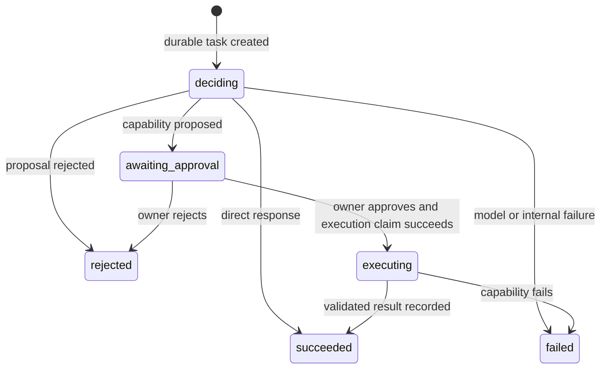

# Vera HTTP API

**Status:** Accepted for implemented V1 paths
**Version:** 0.1
**Last updated:** 24 August 2026

## Purpose

This document owns the external behavior of Vera's implemented HTTP paths. The
domain meanings remain in the [Domain Model](domain-model.md); this document
defines how an HTTP client observes them.

All paths are versioned except process health. JSON request objects are closed:
unknown properties are rejected rather than silently removed. The service
binds to loopback by default and uses the implicit `owner_v1` principal until
authentication is implemented.

## Implemented paths

| Method and path | Purpose | Success |
|---|---|---:|
| `GET /health` | Process liveness only | `200` |
| `GET /ready` | Model, operational store, scratchpad, and recovery readiness | `200` or `503` |
| `POST /v1/tasks` | Submit owner intent as a durable task and first run | `202` |
| `GET /v1/tasks/{taskId}` | Retrieve the current task/run projection | `200` |
| `GET /v1/runs/{runId}` | Retrieve the current task/run projection by run | `200` |
| `GET /v1/runs/{runId}/events` | Retrieve immutable ordered run events | `200` |
| `POST /v1/approvals/{approvalId}/decision` | Approve or reject the exact proposed invocation | `202` |
| `POST /v1/model-decisions` | Exercise the lower-level model decision boundary | `200` |

The model-decision path is useful for provider and proposal diagnostics. New
owner-facing clients should submit tasks so accepted work has durable identity,
events, approval, and recovery semantics.

## Task lifecycle



Task status is a coarser projection:

| Run status | Task status |
|---|---|
| `deciding`, `awaiting_approval`, `executing` | `active` |
| `succeeded` | `completed` |
| `rejected` | `rejected` |
| `failed` | `failed` |

Terminal runs are not reopened. Retry as a new run is not implemented yet.

## Submit a task

```http
POST /v1/tasks
Content-Type: application/json
Idempotency-Key: 4a43628a-e1df-42f7-98bb-b2e59b62745d

{
  "message": "For project Vera, create an implementation plan for VERA-202."
}
```

`Idempotency-Key` is required, case-insensitive as an HTTP header, and must be
8–200 characters. The key is scoped to the implicit V1 principal. Repeating the
same key with the same message returns the original task. Reusing it for a
different message returns `409 idempotency_key_reused`.

Vera persists the task before asking a model. A provider failure therefore
produces an inspectable terminal task instead of losing the accepted request.
The response is `202 Accepted` because clients must treat task resources and
polling—not the duration of this connection—as the execution contract.

Example waiting response, abbreviated:

```json
{
  "schemaVersion": 1,
  "taskId": "task_...",
  "runId": "run_...",
  "taskStatus": "active",
  "runStatus": "awaiting_approval",
  "message": "For project Vera, create an implementation plan for VERA-202.",
  "approval": {
    "id": "approval_...",
    "status": "pending",
    "reason": "external_capability_invocation",
    "capability": {
      "name": "development_planning",
      "version": 1
    },
    "proposedArguments": {
      "objective": "Create an implementation plan for VERA-202.",
      "ticket": {
        "reference": "VERA-202",
        "details": "Create an implementation plan."
      },
      "project": {
        "name": "Vera"
      }
    },
    "requestedAt": "2026-08-24T18:00:00.000Z"
  },
  "links": {
    "task": "/v1/tasks/task_...",
    "run": "/v1/runs/run_...",
    "events": "/v1/runs/run_.../events",
    "approval": "/v1/approvals/approval_.../decision"
  }
}
```

`proposedArguments` is the exact schema-validated input that execution will
receive if approved.

In a completed development plan, `project`, `ticket`, and `objective` are copied
into the result by Vera code from these approved arguments. They are deliberately
excluded from model-generated plan content, so a model cannot rewrite task
identity while producing the plan.

## Decide an approval

```http
POST /v1/approvals/approval_.../decision
Content-Type: application/json

{
  "decision": "approved"
}
```

The only decisions are `approved` and `rejected`. Vera records the decision and
principal before doing anything else. On approval it then atomically claims an
invocation identity before calling the capability.

Repeating the same decision is idempotent. Sending the opposite decision after
one has been recorded returns `409 approval_already_decided`. A model, caller
request property, or capability cannot create or broaden an approval.

The current handler may complete model-backed planning before returning its
`202` response, but clients must still poll the run resource: recovery and later
long-running capabilities cannot depend on one HTTP connection.

## Events

`GET /v1/runs/{runId}/events` returns:

```json
{
  "schemaVersion": 1,
  "taskId": "task_...",
  "runId": "run_...",
  "events": []
}
```

Every event has an opaque ID, a strictly increasing sequence within the task
aggregate, a stable type, an ISO-8601 occurrence time, and a versioned payload
owned by that event type. Current event types are:

- `task_created`, `run_started`;
- `model_decision_recorded`;
- `approval_requested`, `approval_approved`, `approval_rejected`;
- `capability_invocation_started`, `capability_invocation_succeeded`,
  `capability_invocation_failed`;
- `run_succeeded`, `run_rejected`, `run_failed`.

Events are evidence, not debug logs. Provider internals, credentials, and raw
exceptions are excluded.

## Validation and errors

Error envelopes use:

```json
{
  "error": {
    "code": "invalid_request",
    "message": "Request validation failed."
  }
}
```

| Status | Codes | Meaning |
|---:|---|---|
| `400` | `invalid_request` | Missing, malformed, too large, or unknown request input. |
| `404` | `task_not_found`, `run_not_found`, `approval_not_found` | The addressed resource does not exist. |
| `409` | `idempotency_key_reused`, `approval_already_decided`, `concurrent_transition_failed` | The request conflicts with durable state. |
| `502` | `provider_request_rejected`, `provider_response_invalid` | Provider boundary failed while using the diagnostic endpoint. |
| `503` | `model_not_found`, `provider_unavailable`, `operational_store_unavailable`, `scratchpad_unavailable` | A required runtime dependency is unavailable. |
| `504` | `provider_timeout` | The model provider exceeded its deadline. |
| `500` | `internal_error` | An unexpected server failure; details remain in structured logs. |

## Current security boundary

The API has no authentication yet. Loopback binding is mandatory for this
increment. SSH forwarding may expose loopback ports to the owner's MacBook, but
Vera must not bind to a LAN or public interface until identity, authentication,
and transport policy are implemented.
