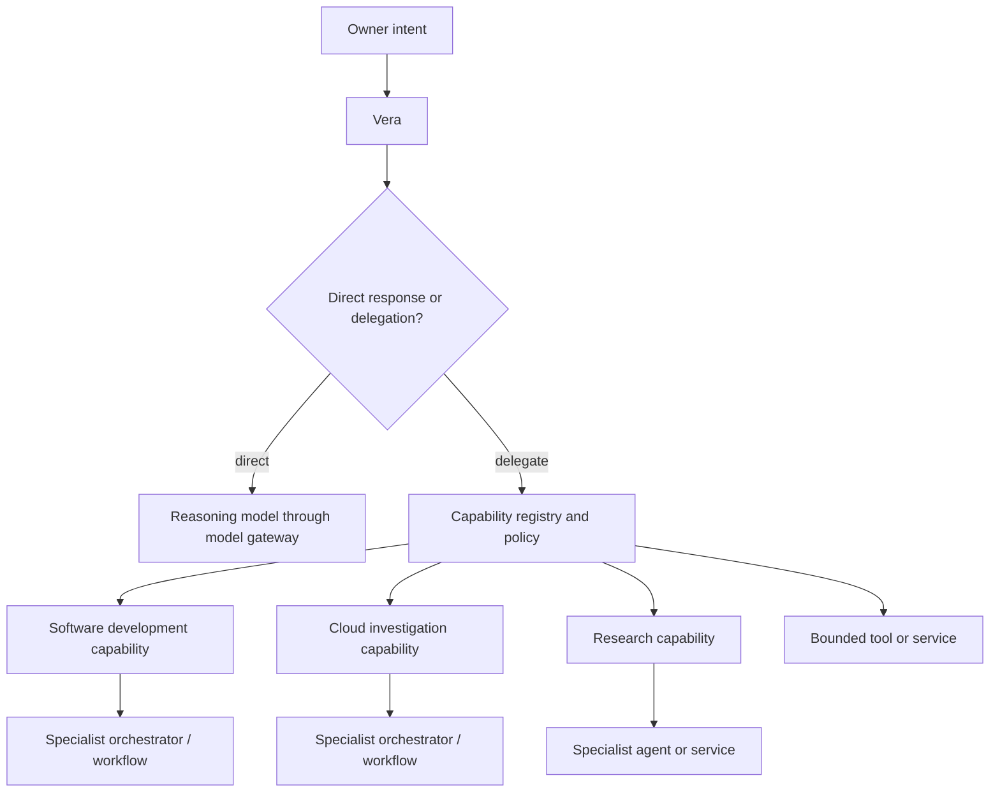
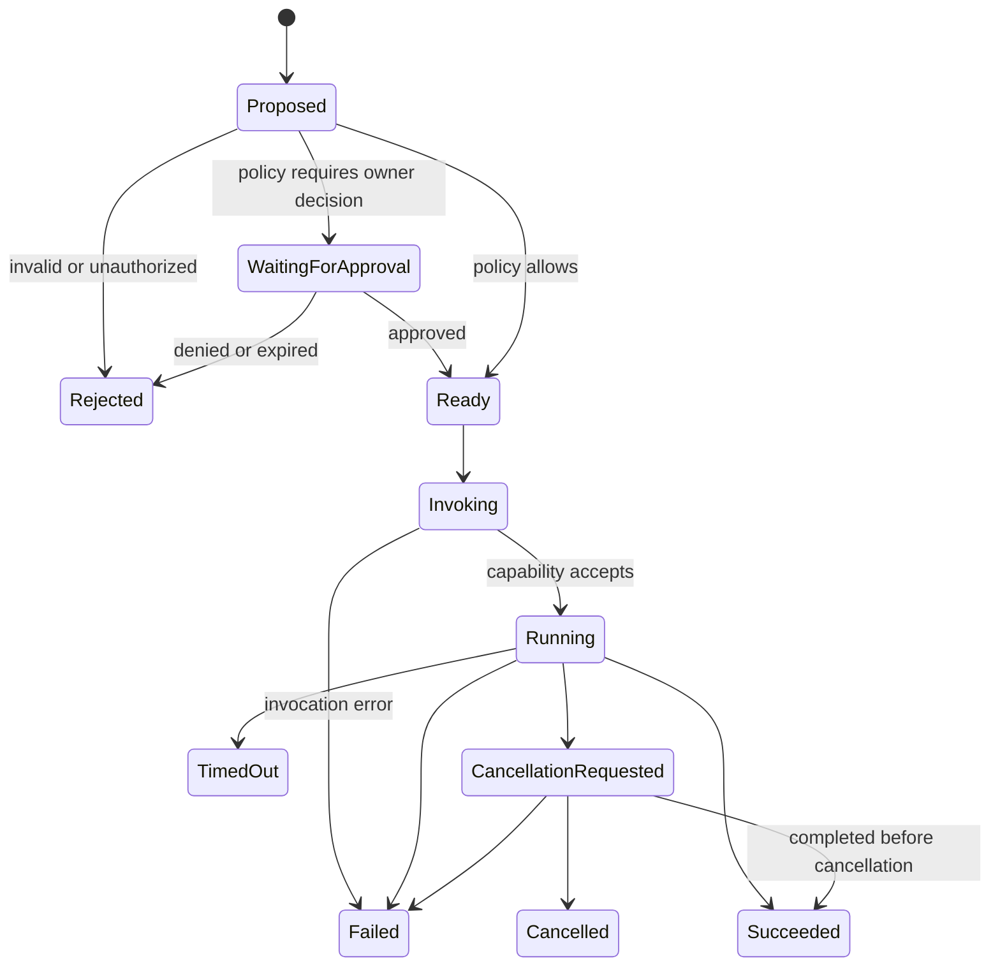
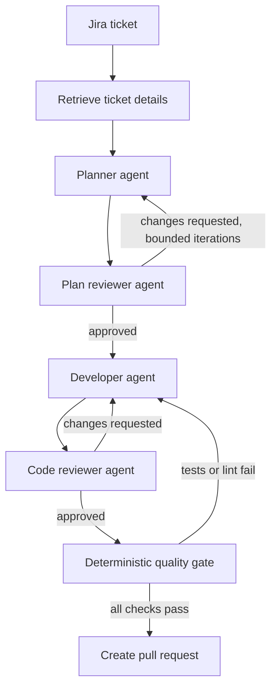
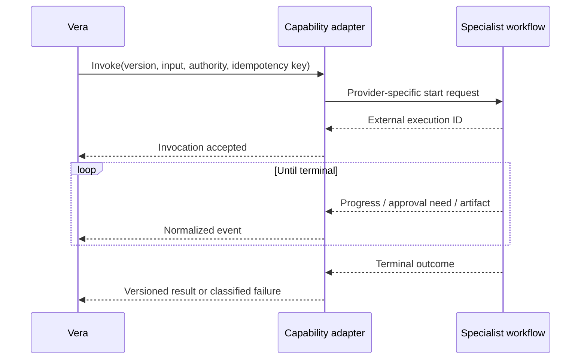

# Vera Capability Model

**Status:** Accepted (capability declaration shape, invocation lifecycle,
selection checks, and resource/delegation budget model)
**Version:** 0.3
**Last updated:** 25 August 2026
**Accepted:** 24 August 2026 (owner) — V1 capability selected during
ratification; future registry design remains open

## Purpose

Vera's central product promise depends on delegation. This document defines how
models, tools, services, agents, and entire specialist workflows fit beneath
Vera without becoming hard-coded parts of its identity.

## Delegation hierarchy



Vera may invoke another orchestrator. The child workflow does not need Vera's
entire personal context; it receives only the task, data, and authority required
for its specialty.

## Capability definition

A capability is a versioned promise that bounded work can be requested through
a declared contract.

Its implementation may be:

- deterministic application code;
- a local executable;
- an HTTP service;
- an MCP server or client integration;
- a model-assisted agent;
- a durable specialist workflow;
- a remote platform such as Codex;
- a human-in-the-loop operational process.

Vera chooses capabilities, not internal implementation nodes.

## Capability declaration

An eventual declaration should cover at least:

```text
identity
  name
  version
  owner
  description

contract
  input_schema
  output_schema
  event_schema
  error_schema

execution
  synchronous | asynchronous
  expected_duration
  timeout_policy
  cancellation_support
  idempotency_scope
  retry_classification

authority
  required_permissions
  credential_scopes
  data_classifications
  side_effect_classes
  approval_policy

operations
  health
  availability
  cost_metadata
  artifact_types
  observability_links
```

The exact schema is not yet accepted. The semantic categories are required for
safe selection and execution.

## Capability invocation lifecycle



Cancellation is a protocol, not a magical rollback. A capability must declare
what cancellation can stop and which completed external effects remain.

## Capability selection

A model may propose a capability based on descriptions and structured inputs.
Vera's code must then verify:

- the capability and version exist;
- the capability is healthy and available;
- the input matches its schema;
- the principal is authorized;
- the data is allowed to cross the capability's trust boundary;
- cost and policy limits are satisfied;
- the invocation and any proposed child work fit within the run's remaining
  resource and delegation budget;
- required approval has been granted;
- a safe idempotency identity exists for side effects.

The model does not invent a capability, permission, credential, or contract.

### Proposal arguments are not invocation input

The model-visible `invoke_capability` proposal contains only versioned routing
arguments that the model may infer from owner intent. For
`development_planning@1`, those arguments are:

```text
objective: string
ticket:
  reference: string
  details: string
project:
  name: string
```

They are untrusted proposed data. They do not include, and cannot create:

- an invocation identity or idempotency key;
- approved context manifests or source contents;
- effective authority, permissions, or credentials;
- enforced budgets, timeouts, or retry limits; or
- an approval decision.

After proposal validation and policy evaluation, Vera's code constructs the
full capability invocation envelope from the proposed arguments plus those
authoritative fields. The invocation schema is therefore distinct from the
model proposal schema even when both refer to the same capability version.
This distinction prevents a model from authoring its own authority and lets the
invocation contract grow without silently broadening the proposal contract.

## Resource and delegation budgets

Every run must have a finite budget envelope enforced by Vera's deterministic
policy layer. The envelope may constrain:

- monetary spend or provider-specific usage units;
- model calls and tokens;
- capability invocations;
- steps and wall-clock duration;
- retries per operation and across the run;
- child-task count;
- delegation depth.

A child task receives an explicitly allocated portion of its parent's remaining
budget. Creating a child must not reset or expand the total envelope. A
specialist workflow may enforce stricter internal limits, but it cannot weaken
Vera's outer limit.

When a limit is reached, Vera stops scheduling new work and records the reason.
It may fail safely, return a partial result, or request a narrowly scoped budget
extension from the owner. A model cannot approve or silently increase its own
budget.

V1 must use finite configured values and demonstrate enforcement. The exact
numbers remain an owner decision.

## Model providers

Models supply reasoning or generation. They are accessed through a model gateway
with a related but specialized contract:

- supported input modalities;
- context limits;
- structured-output support;
- tool support;
- latency and cost characteristics;
- local or remote execution;
- data-handling constraints;
- provider-specific failure modes.

Ollama is the default local provider. OpenAI and Gemini are implemented cloud
providers. All three sit behind the same Vera-owned structured-generation port;
the deterministic provider supplies repeatable evidence. A model may classify
intent, draft a plan, summarize results, or converse, but its provider is not
Vera's orchestrator and does not decide what infrastructure Vera may control.

Provider selection is explicit at process startup. Provider adapters normalize
native schemas, readiness, usage, and failures while declaring whether data is
owner-controlled or crosses a third party. Automatic fallback across those
boundaries is forbidden. A new provider requires an adapter and conformance
evidence rather than being assumed compatible because it accepts an API key.

## Example: development workflow

The original discussion described an existing development workflow as a model
for specialist orchestration:



Some nodes reason with models; others execute deterministic checks. The workflow
as a whole is an orchestrator.

Vera's responsibility is not to reproduce those internal nodes. Vera should:

1. recognize that the request concerns software development;
2. identify the target project and relevant task;
3. select the approved development capability;
4. pass a versioned work request and bounded authority;
5. observe progress, approvals, artifacts, and outcome;
6. return a coherent result to the owner.

## External workflow boundary



Provider-specific identifiers and payloads may be recorded as adapter metadata,
but they must not replace Vera's task, run, event, and artifact concepts.

## Child tasks versus capability calls

A capability invocation should create a child task when the delegated work:

- has an independently useful owner-visible outcome;
- may outlive or be controlled separately from its parent;
- requires its own approvals or authority boundary;
- may itself coordinate multiple capabilities;
- should appear independently in the client's task list.

A short bounded operation may remain a step and invocation inside the existing
run.

## Versioning and compatibility

- Runs record the exact capability contract version used.
- Breaking input, output, event, permission, or semantic changes create a new
  version.
- Adapters may translate old contracts during a declared migration period.
- Capabilities must not read Vera's private database tables as their API.
- Removal requires handling tasks that still reference an older version.

## V1 capability requirement

V1 needs one real capability, not a catalog of hypothetical integrations. The
selected capability is the provider-neutral `development_planning@1`, with
`codex_cli` as its initial default adapter. It
accepts a ticket and an explicitly selected, read-only project context and
returns one versioned implementation-plan artifact.

For V1:

- Vera invokes it through a versioned adapter contract after validating input;
- the capability receives only context displayed in the approval request;
- raw credentials are never capability input;
- invocation state, progress, errors, and artifacts are exposed through Vera's
  polled resources;
- cancellation is best-effort and its observed outcome is recorded;
- sending scoped context across any third-party data boundary requires explicit
  approval naming the adapter and provider; and
- success means one schema-valid plan artifact is durably associated with the
  invocation, using that invocation ID as the idempotency identity.

The default production adapter reconstructs the exact approved, hash-verified
context in an ephemeral directory and invokes Codex with an output schema and
read-only sandbox. A model-backed implementation remains available as an
explicit local and conformance adapter behind the same capability port. Vera
resolves the persisted approved destination at execution and recovery time,
validates the result, creates one artifact keyed by invocation ID, and removes
the snapshot. A configuration change may select a different adapter for new
work but cannot redirect an already approved invocation.
See [ADR-0011](decisions/0011-use-generic-project-sources-and-bounded-context-snapshots.md)
and [ADR-0012](decisions/0012-late-bind-specialist-platforms-behind-capability-adapters.md)
and the [V1 Definition](v1-definition.md#required-first-journey).
