# Vera Capability Model

**Status:** Accepted (capability declaration shape, invocation lifecycle,
selection checks, and resource/delegation budget model)
**Version:** 1.0
**Last updated:** 27 August 2026
**Accepted:** 24 August 2026 (owner); declarative runtime, catalog, and
`web_research@1` accepted by ADR-0020 on 25 August 2026; bounded composition
accepted by ADR-0021 on 26 August 2026; provider-neutral integration actions
and `personal_task_management@1` accepted by ADR-0022 on 26 August 2026;
evidence-adaptive bounded orchestration accepted by ADR-0024 on 26 August 2026;
and `memory_management@1` accepted by ADR-0025 on 26 August 2026;
`attachment_analysis@1` is accepted by ADR-0031 on 27 August 2026; actionable
attachment composition is accepted by ADR-0032 on 27 August 2026
and registered machine operations are accepted by ADR-0033 on 27 August 2026

## Purpose

Vera's central product promise depends on delegation. This document defines how
models, tools, services, agents, and entire specialist workflows fit beneath
Vera without becoming hard-coded parts of its identity.

## Delegation hierarchy

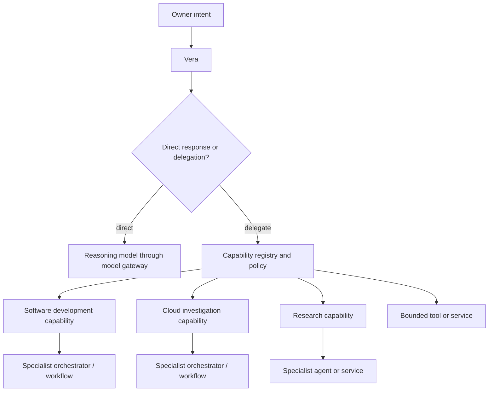

Vera may invoke another orchestrator. The child workflow does not need Vera's
entire personal context; it receives only the task, data, and authority required
for its specialty.

## Capability definition

A capability is a versioned promise that bounded work can be requested through
a declared contract.

Its implementation may be:

- deterministic application code;
- a local executable;
- an HTTP service;
- an MCP server or client integration;
- a model-assisted agent;
- a durable specialist workflow;
- a remote platform such as Codex;
- a human-in-the-loop operational process.

Vera chooses capabilities, not internal implementation nodes.

## Capability declaration

The implemented runtime declaration is deliberately smaller than the eventual
operations model. It currently owns:

```text
identity: name, version, description
contract: proposal arguments and artifact type/media type
authority:
  approval
  project-context requirement
  network access
  data classes
  side-effect classes
  credential mode
  capability-specific hard ceilings
runtime: enabled state, destination, readiness, execution
```

The owner-visible catalog exposes these non-secret fields through
`GET /v1/capabilities`. Only enabled declarations are supplied to the
orchestration model and its structured-output schema. Credentials and native
provider payloads never enter the catalog. A disabled declaration exposes its
maximum authority envelope. An enabled declaration narrows that envelope to
the selected runtime's action-specific effective authority; approval freezes that effective
value and execution fails closed if the runtime later disagrees with it.

Later declaration versions may cover:

```text
identity
  name
  version
  owner
  description

contract
  input_schema
  output_schema
  event_schema
  error_schema

execution
  synchronous | asynchronous
  expected_duration
  timeout_policy
  cancellation_support
  idempotency_scope
  retry_classification

authority
  required_permissions
  credential_scopes
  data_classifications
  side_effect_classes
  approval_policy

operations
  health
  availability
  cost_metadata
  artifact_types
  observability_links
```

Those future fields are not implied authority. They require explicit contracts
and enforcement before an adapter may rely on them. See
[ADR-0020](decisions/0020-use-a-declarative-capability-runtime-and-approval-gated-web-research.md).

`memory_management@1` is the owner-governed long-term-memory boundary. It has
four closed actions: remember, list, correct, and forget. Every action is
approval-gated; mutations declare `personal_data_write`, while list has no side
effect. The local adapter is provider-neutral and writes to the authoritative
owner memory store. See
[ADR-0025](decisions/0025-use-explicit-versioned-owner-governed-memory.md).

`attachment_analysis@1` is the owner-governed document-and-image intelligence
boundary. Its
proposal contract contains only the analysis objective; exact attachments come
from code-frozen task state rather than model-authored arguments. The selected
analysis model receives bounded extracted segments and normalized images only
after approval. Vision provider selection is independent from orchestration
provider selection. Its
effective authority always includes `attachment_content` and adds
`third_party_disclosure` only when the selected provider is outside the owner
boundary. Output is an `attachment_analysis` artifact whose citations are
checked against the exact approved document segments or images. See
[ADR-0031](decisions/0031-store-owner-attachments-and-analyze-them-through-exact-approval.md).

`machine_inspection@1` and `machine_service_management@1` are the first
physical-host operation contracts. Their arguments contain only registered
machine, service, and action IDs. Exact commands, SSH targets, probes, and
credentials remain operator configuration outside model proposals and public
clients. Inspection is read-only. Service management always declares
`machine_service_control`, requires an exact approval, and verifies a configured
postcondition before producing its action-result artifact. Because one
capability spans multiple registered destinations, the capability catalog shows
its conservative authority envelope without a single destination; the machine
catalog and each approval expose the concrete target. A diagnostic may be
bound as immutable evidence for a separately approved conditional action. See
[ADR-0033](decisions/0033-govern-machine-operations-through-registered-actions.md).

## Capability invocation lifecycle

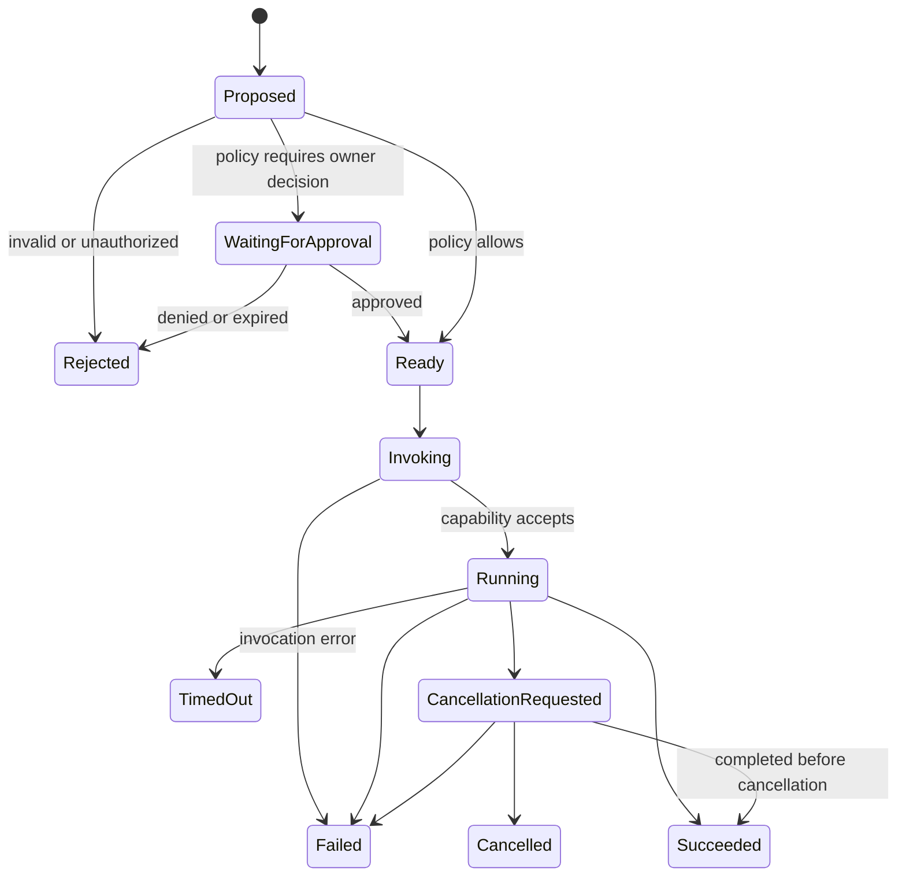

Cancellation is a protocol, not a magical rollback. A capability must declare
what cancellation can stop and which completed external effects remain.

## Capability selection

A model may propose a capability based on descriptions and structured inputs.
Vera's code must then verify:

- the capability and version exist;
- the capability is healthy and available;
- the input matches its schema;
- the principal is authorized;
- the data is allowed to cross the capability's trust boundary;
- cost and policy limits are satisfied;
- the invocation and any proposed child work fit within the run's remaining
  resource and delegation budget;
- required approval has been granted;
- a safe idempotency identity exists for side effects.

The model does not invent a capability, permission, credential, or contract.

## Capability composition and artifact handoff

An enabled capability declaration also states which artifact types it accepts
as input. Vera may compose two or three capabilities into one bounded goal only
when every dependency points backward and the consumer explicitly accepts the
producer's artifact type.

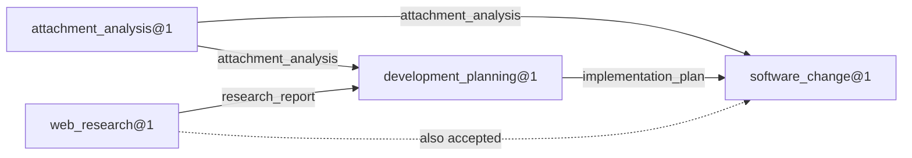

Artifact content is not model-authored authority. Before a handoff, Vera freezes
the exact artifact references and the `artifact_content` data class in that
step's approval. At execution and recovery it reloads the owner-scoped artifact,
recomputes content integrity, verifies project scope and declared compatibility,
and records the references on the new artifact as lineage. A capability never
reads another capability's storage directly.

The current accepted compositions are:

| Consumer | Accepted input artifacts |
|---|---|
| `development_planning@1` | `attachment_analysis`, `research_report` |
| `software_change@1` | `attachment_analysis`, `implementation_plan`, `research_report` |

For adaptive work, an artifact cited as `decisionEvidence` informed Vera's
choice but is not passed to the next capability. An `inputArtifacts` entry is a
separate disclosure: the capability receives the full integrity-checked
artifact after approval. Attachment-derived owner-state actions receive exact
arguments and retain the analysis only as decision evidence. Planning and
software-change steps that materially use attachment analysis must name it in
both classes so the second approval explicitly authorizes specialist access.
See [ADR-0032](decisions/0032-compose-attachment-evidence-into-separately-approved-actions.md).
| `web_research@1` | none |
| `personal_task_management@1` | none |

Every step retains a separate destination and authority approval. Completing a
planning step does not automatically authorize the implementation step.

### Fixed plans and adaptive continuation

Fixed goals validate the complete two- or three-step graph before the first
approval. Adaptive goals validate only the first step, then use each completed
artifact as evidence to choose exactly one next step or produce a final answer.
Both forms use the same provider-neutral declarations, artifact contracts,
approval records, invocation lifecycle, and three-step ceiling.

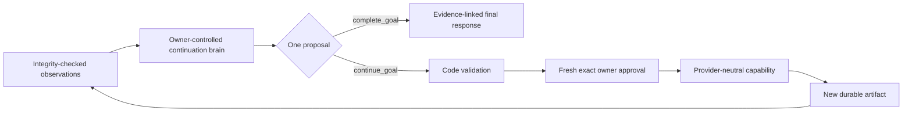

The initial adaptive proposal also records every requested outcome as a durable
requirement with its proving capability and either an unconditional or
evidence-dependent condition. The continuation proposal cannot define its own
capability catalog or next step identity. Vera supplies both, validates
capability arguments and remaining
budget, preserves project and time-zone identity, and rejects invented or
incompatible evidence. `evidenceStepIds` explain why Vera selected the next
boundary; `inputStepIds` separately identify artifacts that the capability
must consume. The latter must satisfy the consumer declaration and become part
of the exact disclosure approval. Completion is valid only when every outcome
requirement is resolved exactly once; a satisfied outcome must cite an artifact
from its declared capability, and only a conditional outcome may be marked not
applicable from evidence.

Each capability declaration owns conservative explicit-request patterns and a
generic outcome description. During adaptive-plan validation, these patterns
restore any plainly requested capability outcome that a model omitted from its
requirement list. When a structurally valid proposal names a first step but
omits its matching unconditional requirement, Vera derives that requirement
from the same step's purpose and capability before authoritative validation.
Neither normalization invents an invocation or arguments. Adding a requirement
grants no authority: the continuation must still propose schema-valid arguments
and the owner must still approve the exact invocation. New capabilities extend
this safety check through their declaration instead of adding
provider-specific orchestration branches.

When a provider duplicates a cited reasoning observation into `inputStepIds`
for a capability that cannot consume it, Vera removes that incompatible input
before approval. This is a disclosure-reducing normalization, not an authority
expansion. All other unknown, duplicate, or incompatible inputs fail closed.

Capability artifacts may contain project or personal data beyond the original
owner message. Consequently, the first adaptive continuation implementation is
restricted to an orchestration provider whose adapter declares
`owner_controlled`. Cloud providers remain interchangeable for paths whose
approved disclosure they can receive, but do not receive adaptive artifact
evidence merely because their startup profile was selected. See
[ADR-0024](decisions/0024-adapt-bounded-goals-from-validated-capability-evidence.md).

## Integration actions and owner state

Capabilities that act on an owner service use a provider-neutral integration
executor beneath the capability runtime. The executor receives only the
principal identity, durable invocation identity, invocation start time,
recovery marker, and schema-validated action arguments supplied by Vera code.
It declares a destination and calculates the exact authority for that action.

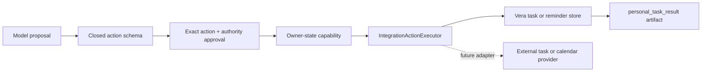

The first implementation supports `create`, `list`, `complete`, and `reopen`.
Listing is a read-only action: it discloses `personal_task_data` but carries no
side-effect class. Mutations additionally carry `personal_data_write`. The
local adapter has no network or credential authority. Its task resources are
not conversation memory and do not grant the model permission to read unrelated
owner data.

The `owner_state` effect class distinguishes a capability that changes Vera's
authoritative owner resources from an external specialist invocation. Both
still use the same task, approval, invocation, artifact, budget, and recovery
lifecycle. See
[ADR-0022](decisions/0022-introduce-provider-neutral-integration-actions-with-vera-owned-personal-tasks.md).

`personal_reminder_management@1` reuses the same integration-action boundary
for `create`, `list`, `reschedule`, `cancel`, and `acknowledge`. Creating and
rescheduling disclose both `personal_data_write` and
`scheduled_notification`; cancellation and acknowledgment disclose the write;
listing has no side effect. Its local adapter stores no timer in memory and has
no network or credential authority. A separate notification-delivery port turns
a due, claimed reminder into one durable Vera-inbox notification. See
[ADR-0023](decisions/0023-deliver-durable-reminders-through-a-vera-owned-notification-inbox.md).

### Runtime resolution

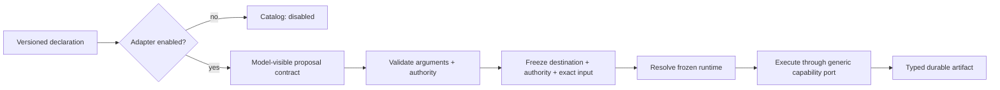

The application lifecycle does not branch on planning, code change, research,
or provider names. Capability-specific argument parsing, identity validation,
and result normalization live in runtime registrations. The lifecycle owns the
shared invariants: durable decision and approval, exact destination resolution,
budget, cancellation, invocation identity, events, artifact idempotency, and
terminal projection.

Declarations remain visible when disabled so owners can inspect supported
contracts and missing runtime configuration. A disabled declaration is absent
from the model prompt and proposal schema, so model output cannot make it
available.

### Proposal arguments are not invocation input

The model-visible `invoke_capability` proposal contains only versioned routing
arguments that the model may infer from owner intent. For
`development_planning@1`, those arguments are:

```text
objective: string
ticket:
  reference: string
  details: string
project:
  name: string
```

They are untrusted proposed data. They do not include, and cannot create:

- an invocation identity or idempotency key;
- approved context manifests or source contents;
- effective authority, permissions, or credentials;
- enforced budgets, timeouts, or retry limits; or
- an approval decision.

After proposal validation and policy evaluation, Vera's code constructs the
full capability invocation envelope from the proposed arguments plus those
authoritative fields. The invocation schema is therefore distinct from the
model proposal schema even when both refer to the same capability version.
This distinction prevents a model from authoring its own authority and lets the
invocation contract grow without silently broadening the proposal contract.

## Resource and delegation budgets

Every run must have a finite budget envelope enforced by Vera's deterministic
policy layer. The envelope may constrain:

- monetary spend or provider-specific usage units;
- model calls and tokens;
- capability invocations;
- steps and wall-clock duration;
- retries per operation and across the run;
- child-task count;
- delegation depth.

A child task receives an explicitly allocated portion of its parent's remaining
budget. Creating a child must not reset or expand the total envelope. A
specialist workflow may enforce stricter internal limits, but it cannot weaken
Vera's outer limit.

When a limit is reached, Vera stops scheduling new work and records the reason.
It may fail safely, return a partial result, or request a narrowly scoped budget
extension from the owner. A model cannot approve or silently increase its own
budget.

The implemented envelope permits at most four model calls, three capability
invocations, one retry, ten minutes, 40 context files, 200,000 context bytes,
40,000 bytes per context file, and a 100,000-byte capability artifact. Fixed and
ordinary requests consume only the operations they use. An adaptive goal can
therefore make one initial model call and one continuation decision after each
of its three possible observations, but it cannot schedule a fourth capability
step. Increasing these limits requires measured token and monetary accounting,
not a model proposal.

## Model providers

Models supply reasoning or generation. They are accessed through a model gateway
with a related but specialized contract:

- supported input modalities;
- context limits;
- structured-output support;
- tool support;
- latency and cost characteristics;
- local or remote execution;
- data-handling constraints;
- provider-specific failure modes.

Ollama is the default local provider. OpenAI and Gemini are implemented cloud
providers. All three sit behind the same Vera-owned structured-generation port;
the deterministic provider supplies repeatable evidence. A model may classify
intent, draft a plan, summarize results, or converse, but its provider is not
Vera's orchestrator and does not decide what infrastructure Vera may control.

Provider selection is explicit at process startup. Provider adapters normalize
native schemas, readiness, usage, and failures while declaring whether data is
owner-controlled or crosses a third party. Automatic fallback across those
boundaries is forbidden. A new provider requires an adapter and conformance
evidence rather than being assumed compatible because it accepts an API key.

## Example: development workflow

The original discussion described an existing development workflow as a model
for specialist orchestration:

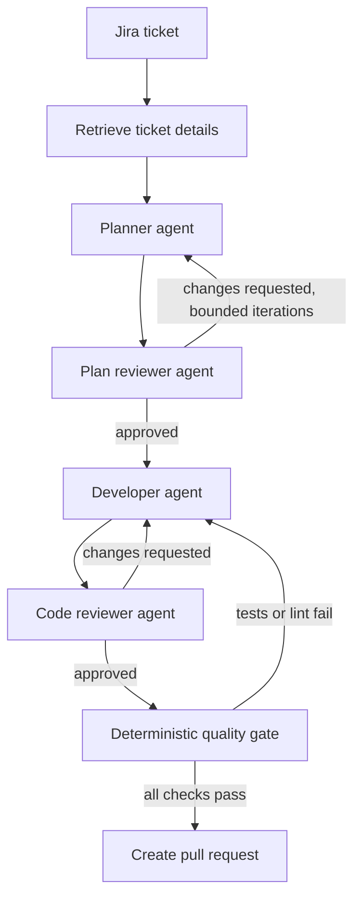

Some nodes reason with models; others execute deterministic checks. The workflow
as a whole is an orchestrator.

Vera's responsibility is not to reproduce those internal nodes. Vera should:

1. recognize that the request concerns software development;
2. identify the target project and relevant task;
3. select the approved development capability;
4. pass a versioned work request and bounded authority;
5. observe progress, approvals, artifacts, and outcome;
6. return a coherent result to the owner.

## External workflow boundary

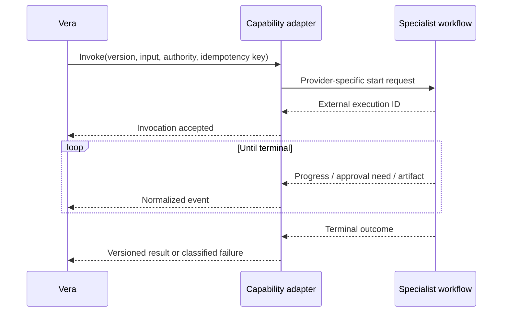

Provider-specific identifiers and payloads may be recorded as adapter metadata,
but they must not replace Vera's task, run, event, and artifact concepts.

## Child tasks versus capability calls

A capability invocation should create a child task when the delegated work:

- has an independently useful owner-visible outcome;
- may outlive or be controlled separately from its parent;
- requires its own approvals or authority boundary;
- may itself coordinate multiple capabilities;
- should appear independently in the client's task list.

A short bounded operation may remain a step and invocation inside the existing
run.

## Versioning and compatibility

- Runs record the exact capability contract version used.
- Breaking input, output, event, permission, or semantic changes create a new
  version.
- Adapters may translate old contracts during a declared migration period.
- Capabilities must not read Vera's private database tables as their API.
- Removal requires handling tasks that still reference an older version.

## Original V1 capability requirement

V1 needs one real capability, not a catalog of hypothetical integrations. The
selected capability is the provider-neutral `development_planning@1`, with
`codex_cli` as its initial default adapter. It
accepts a ticket and an explicitly selected, read-only project context and
returns one versioned implementation-plan artifact.

For V1:

- Vera invokes it through a versioned adapter contract after validating input;
- the capability receives only context displayed in the approval request;
- raw credentials are never capability input;
- invocation state, progress, errors, and artifacts are exposed through Vera's
  polled resources;
- cancellation is best-effort and its observed outcome is recorded;
- sending scoped context across any third-party data boundary requires explicit
  approval naming the adapter and provider; and
- success means one schema-valid plan artifact is durably associated with the
  invocation, using that invocation ID as the idempotency identity.

The default production adapter reconstructs the exact approved, hash-verified
context in an ephemeral directory and invokes Codex with an output schema and
read-only sandbox. A model-backed implementation remains available as an
explicit local and conformance adapter behind the same capability port. Vera
resolves the persisted approved destination at execution and recovery time,
validates the result, creates one artifact keyed by invocation ID, and removes
the snapshot. A configuration change may select a different adapter for new
work but cannot redirect an already approved invocation.
See [ADR-0011](decisions/0011-use-generic-project-sources-and-bounded-context-snapshots.md)
and [ADR-0012](decisions/0012-late-bind-specialist-platforms-behind-capability-adapters.md)
and the [V1 Definition](v1-definition.md#required-first-journey).

## Implemented web-research capability

`web_research@1` is the first capability that neither requires nor accepts a
project. It receives only the exact approved research objective and returns a
versioned `research_report` artifact with readable Markdown, deduplicated
HTTP(S) sources, and an ISO-8601 search time.

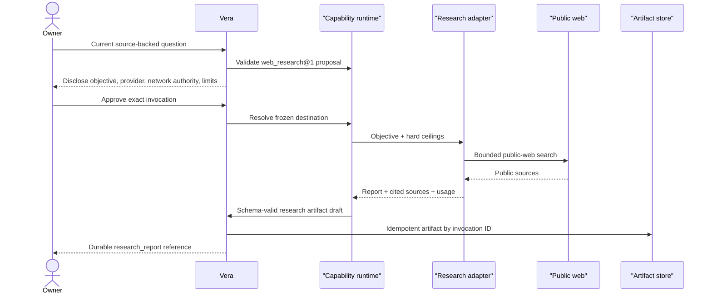

The live `openai_web_search` adapter uses OpenAI's Responses web-search tool and
fails closed unless the response contains an observed search call, report text,
and at least one source. Its API key is server-managed configuration. The
adapter does not receive project context, conversation history beyond the
approved current objective, long-term memory, or unrelated credentials.

Research adapter selection is independent of the orchestration model. Ollama,
OpenAI, Gemini, or deterministic orchestration may propose research only when a
research runtime is enabled. Research is disabled by default; there is no
automatic fallback between providers or trust boundaries. The deterministic
adapter is conformance evidence, not public-web research.

## Implemented software-change capability

`software_change@1` is the first implementation capability beyond the V1
planning proof. It uses the same model-visible routing argument shape, but has a
different outcome and authority boundary: it produces a reviewable patch in a
disposable workspace and returns one versioned `software_change` artifact.

```mermaid
flowchart LR
    I["Owner implementation intent"] --> P["software_change@1 proposal"]
    P --> A["Approval: arguments + project manifest + destination"]
    A --> S["Hash-verified isolated snapshot"]
    S --> W["Selected adapter writes only inside snapshot"]
    W --> V["Vera inspects Git effect and computes hashes + patch"]
    V --> R["Review-only software_change artifact"]
    R -. "separate exact approval" .-> X["Managed worktree application"]
    X -. "third exact approval" .-> Y["Commit / create-only push / PR"]
```

The initial adapters are `codex_cli` for production and
`deterministic_change` for repeatable conformance. The orchestration model,
planning adapter, and change adapter are configured independently. The Codex
adapter receives only approved repository evidence, and Vera—not the
specialist—computes the authoritative patch and file metadata from the isolated
filesystem.

Approval authorizes the exact context disclosure and bounded write inside the
disposable workspace. It does not authorize mutation of the registered project,
a commit, a push, a pull request, credential access, or another network effect.
Those require distinct effects and approvals. See
[ADR-0017](decisions/0017-produce-software-changes-as-isolated-patch-artifacts.md).

The first of those distinct effects is now implemented as a durable
`SoftwareChangeApplication` lifecycle, not as added authority inside
`software_change@1`. It applies and stages an exact approved artifact in a
managed Git worktree, verifies the filesystem and index independently, and
does not itself gain commit or publication authority. See
[ADR-0018](decisions/0018-apply-approved-software-changes-in-managed-git-worktrees.md).

The next distinct effect is implemented as
`SoftwareChangePublication`. It is deliberately not a model-visible coding
capability: it consumes only a successful staged application and explicit
owner-supplied delivery metadata. Before its own approval, Vera freezes the
source version, repository and branch identities, current base-branch commit,
staged Git tree and files, author, commit message, pull-request content, and a
create-only authority envelope. Its provider-neutral executor port currently
has one `github_gh_cli` adapter. The adapter receives server-managed credentials
only at transport time; the coding specialist and orchestration model never do.

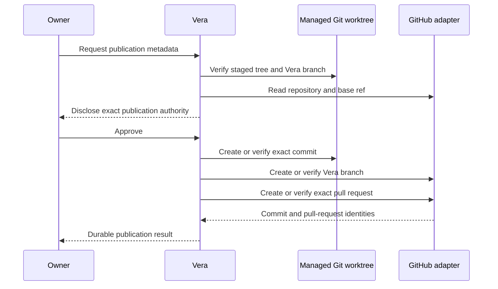

Retries reconcile existing effects; they do not update or force remote state
to make it match. See
[ADR-0029](decisions/0029-publish-approved-software-changes-through-a-separate-durable-lifecycle.md).
