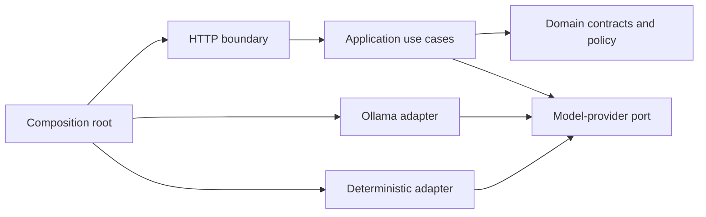

# ADR-0009: Implement the Model Decision Boundary as a Modular TypeScript API

**Status:** Accepted
**Date:** 24 August 2026
**Decided:** 24 August 2026 (owner direction to begin production implementation)

## Context

The accepted architecture requires models to propose while application code
controls effects. The repository had documented that boundary but contained no
executable system. It also deferred the API framework and exact source layout,
which prevented implementation from beginning even though the stable trust and
process boundaries were already known.

The first implementation increment needed to be testable end to end, survive
the addition of future clients and services, and become part of the production
system rather than a disposable experiment.

## Decision

Vera begins as an npm-workspaces monorepo with a modular-monolith API in
`apps/api`:

- Node.js 22 or newer is the runtime and TypeScript is compiled in strict mode.
- Source modules import explicit `.ts` paths. TypeScript rewrites relative
  extensions to `.js` only when producing the native Node.js ESM build.
- Fastify 5 is the HTTP boundary.
- Zod 4 owns runtime domain schemas and produces draft-07 JSON Schema where an
  external boundary requires it.
- Application, domain, model-adapter, and HTTP concerns remain separate modules
  inside the API app. A module moves to `packages/*` only when a second app or
  process genuinely shares it.
- The model gateway is provider-neutral. The first real adapter calls Ollama's
  local HTTP API; a deterministic adapter supports repeatable tests.
- `ModelProposal` schema version 1 is a closed union of `respond` and
  `invoke_capability`. Every model-visible capability variant includes its exact
  versioned proposal-argument schema. Unknown fields, capabilities, versions,
  and malformed arguments are rejected before policy evaluation.
- Proposed arguments are not an invocation envelope. Vera's code later adds the
  invocation identity, approved context manifest and contents, authority, and
  enforced limits; a model cannot create those authoritative fields.
- The model returns a proposal, never an authorization. Code transforms a valid
  proposal into an `ExecutionDecision`: direct response, approval required, or
  rejection.
- `development_planning@1` is the only V1 capability visible to the model. Its
  external invocation requires approval; this increment stops at that approval
  decision and performs no capability side effect.
- `POST /v1/model-decisions` is the executable decision-boundary endpoint.
  `GET /health` reports process liveness. `GET /ready` verifies provider
  connectivity and that the configured model is installed without performing
  inference. The app binds to loopback by default because authentication is not
  implemented yet.
- Provider failures distinguish unavailable transport/server, timeout, missing
  model, provider-rejected request, and invalid provider response. Public
  messages are sanitized while structured server logs retain the internal
  classification and cause.
- Development and built startup load the repository-root `.env` through the
  Node.js runtime. Startup logs only the non-secret effective configuration and
  whether the file was found.

The directory rule is deliberately small:

```text
apps/
  api/              # first deployable Vera service
packages/           # added only for code used by multiple apps/processes
docs/                # authoritative design and decisions
```

Within `apps/api/src`, dependencies point inward:



## Rationale

Fastify provides a small, high-performance HTTP boundary with JSON Schema
validation without owning Vera's domain. Zod keeps runtime validation and
TypeScript types derived from one source. Calling Ollama through a narrow
adapter prevents provider payloads from entering the domain and avoids making a
provider SDK part of Vera's core contract.

A modular monolith gives Vera real boundaries without paying the operational
and versioning cost of premature services or dozens of workspace packages. The
workspace shape still leaves room for a CLI, React Native client, Python
capability, or separately deployed worker later.

The exact proposal-argument schema must be part of structured generation, not
only checked afterward. Initial real-model evidence showed why: a generic
`arguments: object` schema let the model produce a nested object where a string
was required. Policy rejected it safely, and tightening the generation schema
made the same real-model journey pass.

## Consequences

- A clean checkout can build and test a real HTTP-to-model-to-policy path.
- Adding a capability requires a schema variant, registry entry, policy, and
  tests; a prompt edit alone cannot grant authority.
- Fastify and Zod are selected implementation dependencies for the API, but
  domain code must not depend on Fastify.
- The current endpoint is synchronous and has no durable task/run lifecycle.
  Persistence, recovery, approval resources, and capability execution remain
  required production increments.
- Until authentication exists, Vera must keep the default loopback binding and
  must not be exposed to an untrusted network.
- Model schemas and capability schemas are versioned contracts. Breaking
  changes require a new schema or capability version.

## Evidence

On 24 August 2026:

- formatting, strict linting, TypeScript type checking, twenty-two deterministic
  domain/HTTP tests, and the production build passed;
- the real Ollama adapter passed direct-response and development-delegation
  conformance cases with `gemma4-12b-64k:latest`;
- a built Fastify server accepted a real HTTP development-planning request,
  obtained a structured proposal from Ollama, validated
  `development_planning@1`, and returned `approval_required` without invoking a
  capability.

## Alternatives considered

- **Disposable proof script:** rejected because it would not become the system
  the owner will run.
- **Python-first API:** rejected for the control plane because TypeScript and
  npm workspaces better match the owner's primary ecosystem and future clients.
  Python remains available for capability implementations where it is useful.
- **Many workspace packages immediately:** rejected because no second consumer
  exists yet and package boundaries would be speculative.
- **NestJS:** rejected for the first service because its application framework
  would add conventions and dependency injection machinery Vera does not yet
  need.
- **Express:** rejected because Fastify provides a stronger first-class schema
  boundary and encapsulation model.
- **Provider SDK in the domain:** rejected because Vera needs a stable provider
  port and explicit normalization of provider failures and metadata.
- **Generic capability arguments in model output:** rejected by real-model
  evidence; they validate too late and weaken structured generation.

## Follow-up

The next end-to-end increment adds authoritative task/run/event state, an
approval resource and decision, and recovery semantics. Storage selection must
be recorded separately after implementing those required semantics; this ADR
does not choose MongoDB or Redis.
