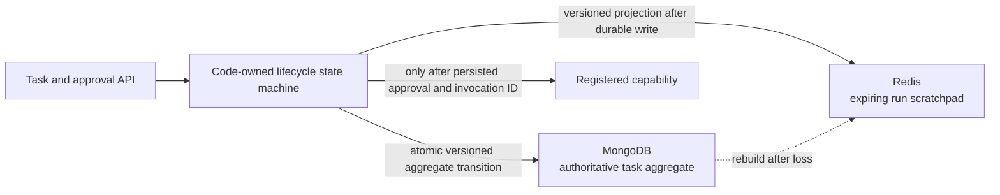

# ADR-0010: Use MongoDB for V1 Operational Truth and Redis for Run Scratchpads

**Status:** Accepted
**Date:** 24 August 2026
**Decided:** 24 August 2026 (owner delegated implementation decisions)

## Context

ADR-0007 separated authoritative operational state, rebuildable execution
scratchpads, and disposable model context without choosing storage products.
Vera now needs to persist a task before model work begins, prevent concurrent
approval requests from executing twice, record an invocation identity before
execution, recover interrupted work, and tolerate loss of temporary working
state.

The owner is substantially more effective with document databases than SQL and
explicitly prefers MongoDB when it can satisfy the required semantics. Redis
matches the original structured, expiring per-run scratchpad concept, but must
not become the authority for approvals or side effects.

## Decision

V1 uses MongoDB as the authoritative operational store and Redis as the
rebuildable execution scratchpad.

The first persistence model is one schema-versioned task-execution aggregate
document per task. It contains the task, its first run, ordered events, model
decision, approval, invocation identity, and terminal outcome. Transitions use
an aggregate version in an optimistic compare-and-swap operation. Updating the
current state and appending its event therefore happens in one MongoDB document
write rather than through an unsafe cross-collection transaction.

MongoDB enforces unique indexes for task IDs, run IDs, approval IDs, and
idempotency keys. Reusing an idempotency key with identical principal and input
returns the original task; reusing it for different input is a conflict.

Redis stores a schema-versioned projection under one key per run:

```text
vera:v1:run:{runId}:scratchpad
```

The projection has an explicit TTL. A Lua compare-and-set script prevents an
older aggregate version from overwriting a newer projection. Redis never owns
the only copy of a proposal accepted by code, an approval, an invocation
identity, an event, or a completed result. Reads and startup recovery can
recreate the projection from MongoDB.



In-memory implementations exist only as deterministic test adapters and an
explicit one-process demonstration mode. Persistent mode is the default and
must not fall back silently to memory.

## Lifecycle contract selected with this decision

The bullets below record the synchronous execution timing present when this ADR
was accepted. [ADR-0013](0013-dispatch-durable-work-with-mongodb-leases.md)
supersedes that timing with durable asynchronous dispatch; it does not change
this ADR's MongoDB and Redis authority decision.

- `POST /v1/tasks` requires an idempotency key, creates durable work, obtains a
  model decision, and returns `202 Accepted` with task and run resources.
- `GET /v1/tasks/{id}` and `GET /v1/runs/{id}` return the current durable
  projection.
- `GET /v1/runs/{id}/events` returns the ordered event history.
- `POST /v1/approvals/{id}/decision` records an exact owner approval or
  rejection. Identical retries are idempotent; contradictory decisions are
  conflicts.
- A capability invocation begins only after the approval and invocation ID are
  durable. Only one optimistic transition may claim execution.
- On startup, deciding, approved, executing, and waiting runs are inspected.
  Rebuildable state is reprojected; safe model-only work may be resumed with the
  same invocation identity.

The current aggregate represents one run because retry and cancellation are
not implemented yet. Future retries add new run records without changing the
public identity or approval semantics. A storage migration must precede that
change; internal document shape is not an external API contract.

## Rationale

MongoDB matches Vera's evolving nested records and the owner's operational
experience. A single aggregate makes the first correctness boundary explicit:
current state and its evidence cannot diverge inside one transition. Optimistic
versioning provides concurrency control without hiding transition semantics in
an ORM.

Redis adds useful isolation, TTL, and fast mutable working state while remaining
disposable. Keeping it as a projection makes the two-store failure window safe:
a failed Redis write can reduce performance or observability, but it cannot
erase authority or cause an unrecorded effect.

## Consequences

- Persistent Vera development requires MongoDB and Redis; the repository
  provides loopback-only container configuration.
- Readiness now verifies the model, MongoDB, Redis, and lifecycle recovery.
- Application schemas remain authoritative even though MongoDB accepts flexible
  documents. Stored documents and Redis payloads are validated when read.
- MongoDB must be backed up and migrated as authoritative data. Redis requires
  no backup for correctness.
- Scratchpad projection failure is logged but does not roll back a committed
  aggregate transition.
- The V1 single-node process is assumed. Multi-replica execution would require
  leases or another distributed claim mechanism in addition to optimistic
  state transitions.
- Long-term personal memory remains a separate governed concern. Selecting
  MongoDB for operational state does not authorize automatic memory retention.

## Alternatives considered

- **Redis as all active state:** rejected because loss could erase approvals,
  accepted work, or effect identity.
- **MongoDB alone:** operationally simpler, but rejected for V1 because Vera
  needs an explicitly disposable working projection with TTL and stale-write
  protection as concurrent orchestration expands.
- **PostgreSQL:** technically strong, but not selected because MongoDB meets the
  chosen aggregate semantics and better matches owner expertise.
- **Markdown files:** rejected for concurrent runtime state.
- **In-process memory:** retained only as a test adapter; rejected for
  persistent operation because restart loses all work.
- **A workflow engine now:** deferred. Vera owns its domain state and contracts
  before delegating execution mechanics to another product.

## Evidence and required follow-up

Deterministic tests cover the task state machine, strict request validation,
approval/rejection, exact-argument invocation, request idempotency, concurrent
approval claims, failure persistence, ordered events, and scratchpad rebuild.

Real integration evidence on 24 August 2026 used MongoDB 8.2.11, Redis 8.10.1,
Ollama 0.32.9, and `gemma4-12b-64k:latest`:

1. Vera persisted an approved run in `executing` state at aggregate version 4,
   with invocation `invocation_9576911f-44bb-4144-b248-06cc700f814f`.
2. The Vera process received `SIGKILL` while the model-backed capability was
   running.
3. After restart, readiness inspected interrupted state and resumed that same
   invocation identity.
4. The aggregate reached version 5 with exactly one
   `capability_invocation_started`, one `capability_invocation_succeeded`, and
   one `run_succeeded` event.
5. Deleting the Redis key and reading the run reconstructed projection version
   5 from MongoDB. An attempted stale version-4 write was rejected by the Lua
   guard.
6. Repeating the original idempotent task request returned the same task, run,
   and invocation; changing the input under that key returned HTTP 409.
7. A separate persistent-mode run created the collection with strict/error
   validation, accepted a complete aggregate, and rejected a deliberately
   incomplete direct insert with MongoDB document-validation error 121.

The isolated integration database and test scratchpad key were deleted after
verification. Broader backup/migration drills and multi-task load testing remain
engineering work, but the V1 forced-restart and scratchpad-loss claims now have
real local evidence.
