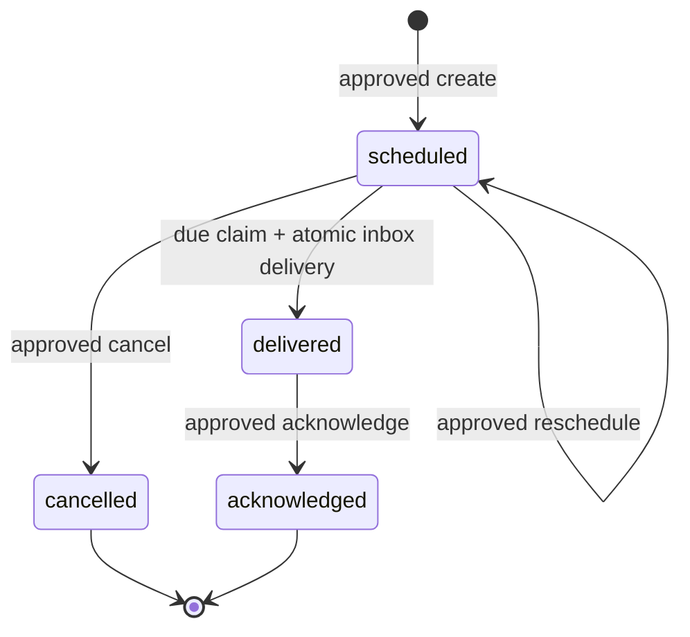

# ADR-0023: Deliver durable reminders through a Vera-owned notification inbox

**Status:** Accepted
**Date:** 26 August 2026

## Context

Personal tasks proved that Vera can own useful personal state, but they still
require the owner to return and inspect them. A Jarvis-like assistant also needs
to act when time passes: a reminder must survive process restarts, become due
without a live request, and reach any current or future client without making
that client the source of truth.

An in-process timer would lose work on restart. Redis expiry notifications would
make a rebuildable scratchpad authoritative. Writing a reminder and a separate
notification document without a transaction would leave a crash window between
state transition and delivery evidence.

## Decision

Vera adds `personal_reminder_management@1` with closed `create`, `list`,
`reschedule`, `cancel`, and `acknowledge` actions. All actions use the existing
proposal, exact approval, invocation, artifact, and recovery lifecycle.

One-shot reminders are owner-scoped MongoDB resources. A scheduled reminder is
claimable only after its UTC `scheduledFor` instant. The scheduler uses an
expiring claim containing worker identity and an opaque token. Rescheduling or
cancelling a scheduled reminder invalidates any active claim. An expired claim
may be reclaimed after a worker or process disappears.

The first notification channel is the Vera-owned inbox. Delivery atomically
changes the reminder to `delivered` and embeds one deterministic notification in
the same MongoDB document. Consequently, the reminder transition and durable
delivery evidence cannot disagree across a crash. Acknowledgment changes both
the reminder and embedded notification together. Redis, HTTP connections, and
worker memory are never delivery authority.

Clients retrieve durable notifications with `GET /v1/notifications` and an
opaque, ordered cursor. `GET /v1/notifications/stream` is a server-sent-event
projection over the same inbox. Reconnecting clients supply the last cursor and
replay from MongoDB, so disconnects do not lose notification truth. The stream
does not replace polling for task/run progress.

The model receives the durable task-creation instant as Vera-supplied current
UTC time and the configured owner IANA time zone. Anchoring relative dates to
the request instant keeps proposal recovery deterministic after a crash. The
model must normalize reminder instants into exact ISO-8601 UTC values; model
output cannot set principal, claim, notification, or delivery identity.

Creating or rescheduling discloses `personal_data_write` and
`scheduled_notification`. Cancelling and acknowledging disclose
`personal_data_write`. Listing has no side effect. The local inbox adapter has
no network or credential authority.

## Rationale

The embedded notification outbox gives this one-channel design atomicity
without requiring distributed transactions. A durable polling scheduler is
simple, restart-safe, horizontally claimable, and independent of whichever UI
or notification transport Vera adds later. Separating the notification delivery
port from the reminder capability lets a future mobile push, desktop, voice, or
external messaging adapter project from the same durable state.

## Consequences

- The API process currently hosts the scheduler, but MongoDB remains authority;
  the worker may move to a separate process without changing domain contracts.
- Reminder times are stored as UTC instants plus the owner time zone used to
  interpret the request. Daylight-saving interpretation belongs at proposal
  time, not delivery time.
- Delivery is at-least-once at the worker-attempt boundary and exactly once in
  the Vera inbox per reminder.
- SSE is best-effort transport. Cursor-based inbox reads provide recovery.
- Recurrence, snoozing, escalation, mobile push, background operation while the
  host is powered off, and external calendar synchronization are not implied.
- The loopback-only owner perimeter remains required until application
  authentication is designed.

## Alternatives considered

### Use in-process timers

Rejected because timers disappear on process exit and do not coordinate
multiple workers.

### Use Redis key expiry as the scheduler

Rejected because Redis is explicitly rebuildable scratchpad state and cannot
become the only record that a reminder is due.

### Store notifications separately immediately

Deferred. It requires a MongoDB transaction or a formal outbox relay to close
the reminder/notification crash window. Embedding one notification is the
smallest correct representation for one-shot reminders.

### Add platform push notifications first

Deferred because device registration, credentials, delivery receipts, and
provider policy are separate concerns. The Vera inbox proves the durable
contract without selecting a UI or vendor.

## Follow-up

- Add authenticated device/channel registration before remote delivery.
- Decide recurrence and snooze semantics as new versioned contracts.
- Add retention and deletion policy for acknowledged notifications.
- Split notifications into an outbox collection if multi-channel fan-out
  requires it, preserving atomic write-and-publish semantics.
