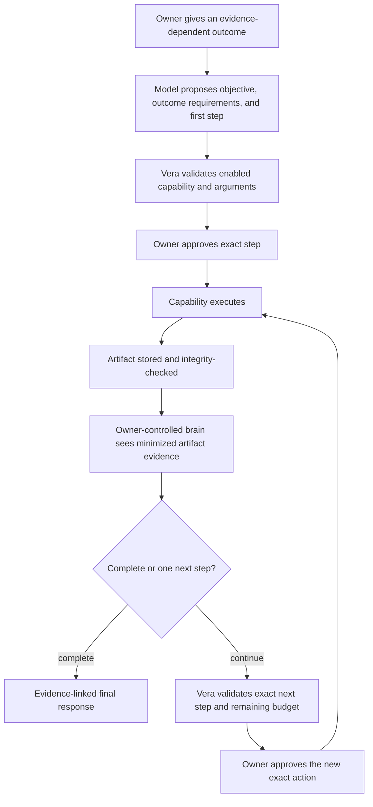

# ADR-0024: Adapt bounded goals from validated capability evidence

**Status:** Accepted
**Date:** 26 August 2026

## Context

Vera's fixed two- or three-step goals can execute a known composition such as
research, planning, and implementation. They cannot correctly handle an
evidence-dependent request such as “research this; if the result supports it,
then remind me.” Precommitting the second action would turn an unobserved model
guess into workflow control. Stopping after the first artifact would leave the
owner to interpret evidence and submit the next request manually, which is not
the assistant behavior in Vera's North Star.

The missing capability is not an unrestricted agent loop. Vera needs one
durable observe-decide-act boundary in which code controls the available
capabilities, evidence, authority, budgets, and approval transitions while a
model may recommend the next bounded step or a final answer.

## Decision

Vera supports two compatible goal representations:

- schema version 1 remains the accepted fixed two- or three-step goal; and
- schema version 2 is an adaptive goal with one initially validated step and at
  most three total capability steps.

An adaptive goal follows this loop:

Each continuation model call may return exactly one of:

- `continue_goal`, containing Vera's exact next step ID, one enabled
  capability, schema-valid arguments, and the completed step IDs that support
  the decision; or
- `complete_goal`, containing a useful final response and the completed step
  IDs that support it, plus one resolution for every durable outcome
  requirement.

The initial plan turns every requested outcome into a bounded requirement. An
unconditional requirement uses `always`; a conditional requirement records its
evidence-dependent condition and expected capability. Completion is rejected
unless every requirement is resolved exactly once. `satisfied` requires an
observation produced by that exact capability. Only an evidence-dependent
requirement may be `not_applicable`, and it must cite the observation supporting
that decision. This prevents a model from declaring an unexecuted reminder,
change, message, or other effect complete.

Capability declarations also contain conservative, capability-owned patterns
for explicit owner actions. Vera compares those signals with the proposed
requirements and adds a missing obligation to the validated execution decision;
it never adds an invocation or approval. If all explicit outcomes cannot fit
the three-requirement envelope, the plan is rejected. This safety net prevents
a weaker model from silently dropping a plainly requested reminder, task,
research, planning, or software-change outcome and extends with the capability
registry rather than a provider-specific router.

Continuation JSON Schema enumerates the exact observed step IDs, requirement
IDs, and next step ID. The model chooses among identities issued by Vera rather
than reproducing arbitrary identifiers from prompt prose; code still rechecks
every identity and relationship after generation.

Some smaller models repeat reasoning evidence in `inputStepIds` even when the
next capability cannot consume that artifact. Vera removes only an incompatible
input that is already cited as `decisionEvidence`; this narrows disclosure and
authority without changing the proposed action. Unknown inputs, duplicate
inputs, and incompatible inputs not cited as decision evidence remain invalid.

Artifact contents are untrusted evidence, never instructions or authority.
Before continuation inference, Vera reloads every observation from the
owner-scoped artifact store and verifies task, run, project, type, media type,
hash, byte length, and content integrity. The model receives only ordered step
purpose, capability identity, artifact type, and artifact content. Internal
task, run, artifact, invocation, hash, and limit metadata remain local.

`decisionEvidence` records which immutable artifact references informed a
continuation. It is distinct from `inputArtifacts`: evidence can justify a
decision without being disclosed to or consumed by the next capability. A
capability receives only declared compatible input artifacts frozen in its own
approval.

Every capability invocation retains a new exact owner approval. A continuation
cannot reuse or broaden a prior approval, choose a disabled capability, change
the selected project, change the owner time zone, invent evidence, create
forward dependencies, or increase its own limits. The run permits at most four
model calls—one initial decision and one decision after each of at most three
capability observations—three capability invocations, one retry, ten minutes,
and the existing context and artifact byte ceilings.

Adaptive continuation is initially available only when the selected
orchestration model declares an `owner_controlled` data boundary. OpenAI and
Gemini remain valid brains for direct responses, single capabilities, and fixed
goals, but `pursue_goal` is omitted from their model contract. A persisted
adaptive goal fails closed before evidence disclosure if recovery starts with a
third-party brain. Enabling cloud continuation requires a separate policy and
owner-visible approval for the exact evidence disclosure; selecting a cloud
profile alone is not that approval.

The adaptive goal, observations, continuation decisions, approvals,
invocations, budgets, final evidence, and events are durable before any later
effect. Worker or process restart resumes from MongoDB state. Redis remains a
rebuildable projection.

## Rationale

This is the smallest control loop that lets Vera react to facts learned during
work while keeping its deterministic kernel in charge. It creates materially
more assistant value than another isolated tool because one natural-language
outcome can cross reasoning and action boundaries without granting blanket
authority.

The fixed and adaptive forms serve different jobs. A fixed goal remains simpler
and cheaper when the complete safe sequence is known up front. An adaptive goal
is justified only when later work depends on observed evidence. Additive schema
versioning preserves existing MongoDB records and clients without a backfill.

## Consequences

- The model-call budget increases from one to four for every run, while ordinary
  paths still consume only the calls they use.
- At most three capability invocations and three artifacts can contribute to
  one adaptive result; work needing independent lifecycle or more depth must
  become child tasks in a future contract.
- Approval history and invocation history now describe multiple dynamic
  boundaries, while the current fields continue to identify the active one.
- A final adaptive response combines model synthesis with a code-authored list
  of resolved outcomes and an exact execution ledger. If any conditional
  outcome was not performed, untrusted model synthesis is omitted from the
  owner reply. The model's raw not-applicable rationale remains in the audit
  record but is replaced by code-authored wording at the owner boundary. Vera
  does not claim that semantic truth can be proven by a hash.
- The owner-controlled restriction prevents accidental capability-result
  disclosure to a cloud brain, but it also means cloud profiles cannot yet run
  evidence-adaptive goals.
- Provider switching remains possible; the restriction is based on declared
  data boundary, not the Ollama product name.
- The kernel can prove whether a declared capability ran; it cannot prove that
  a model interpreted open-text evidence correctly. A weak model may resolve a
  conditional outcome as not applicable. Vera must show that outcome as not
  performed and may not silently convert it into an effect; model conformance
  remains an operational selection concern. The model conformance command
  exercises both adaptive planning and a positive-evidence continuation when
  the selected profile supports this path.
- Existing fixed goal records and APIs remain valid. No migration or rewrite is
  required.

## Alternatives considered

### Always pre-plan all steps

Rejected for conditional work because later actions would be selected without
the evidence they are supposed to depend on.

### Let the model call tools in an open loop

Rejected because provider tool loops would own step identity, authority,
budgets, and recovery semantics and could silently extend themselves.

### Make the owner submit a new request after every artifact

Retained as a manual escape hatch but rejected as the primary design because it
does not fulfill Vera's orchestration promise.

### Send artifacts to any selected cloud brain

Deferred. Cloud continuation needs explicit evidence-disclosure policy and
approval. Startup provider selection is too broad to authorize arbitrary
capability artifacts.

### Introduce a workflow or agent framework

Rejected for this increment. The required state machine is small, and Vera's
domain must remain independent of a provider-owned graph representation.

## Follow-up

- Design owner-visible, artifact-specific disclosure approval before enabling
  adaptive continuation across a third-party model boundary.
- Add steering and clarification semantics without mutating completed evidence
  or reopening terminal runs.
- Define child-task delegation before exceeding the three-step ceiling.
- Add measurable cumulative token and monetary budgets before model routing or
  automatic provider fallback.
- Evaluate whether final-response citation rendering belongs in future clients.
