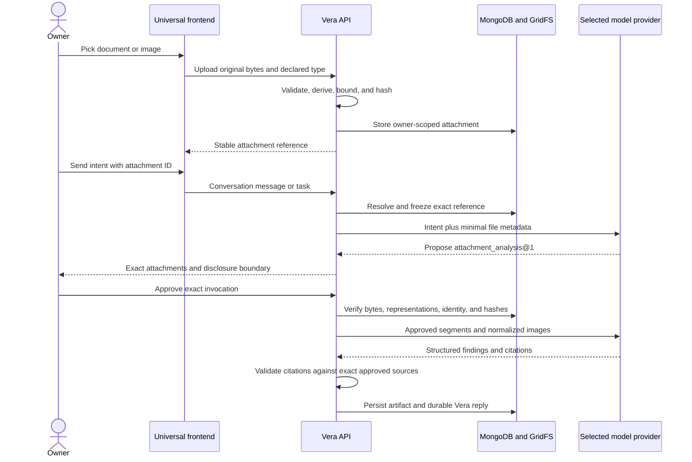

# ADR-0031: Store owner attachments and analyze them through exact approval

**Status:** Accepted
**Date:** 27 August 2026

## Context

Vera must work with files if it is to become a useful general digital
assistant. Treating an uploaded file as an oversized message would lose stable
identity, ownership, integrity, citations, reuse, and a truthful disclosure
boundary. Sending file content to the orchestration brain before it has chosen
an action would also disclose more owner data than routing requires.

The first increment must handle ordinary documents and images without coupling
the conversation model, task lifecycle, or frontend to Ollama, OpenAI, Gemini,
or a particular analysis service. Images are foundational assistant input, not
a later specialist feature. Video is deferred because safe handling also needs
duration and codec limits, frame and audio sampling, and a truthful temporal
citation model; treating it as a large image would create a misleading contract.

## Decision

Vera introduces an owner-scoped, immutable `Attachment` resource. The API
accepts `text/plain`, `text/markdown`, `application/json`, `application/pdf`,
JPEG, PNG, WebP, GIF, HEIC, HEIF, AVIF, and TIFF. Documents have an 8 MiB
ceiling, images have a 20 MiB ceiling, and no message or direct task can refer
to more than five attachments. Documents retain the 120,000-character
extracted-text ceiling. JSON must parse, text must be valid UTF-8, and PDFs must
contain extractable text. OCR is not implied.

MongoDB stores attachment metadata and document segments while GridFS stores
the original bytes. For images, Vera also creates a metadata-stripped,
orientation-corrected, sRGB JPEG or PNG representation bounded to 4096 pixels
per side and 12 MiB. It uses the first frame of an animated image. The original
is retained for immutable identity; only the normalized representation is sent
to vision models or returned by the authenticated preview route. Memory-mode
adapters implement the same ports. Content is deduplicated per owner by
SHA-256. Original bytes, derived representations, and frozen task references
are hash-checked before analysis; any mismatch fails closed. Stable processor
identities (`vera_document_text_v1` and `vera_image_vision_v1`) keep derived
representations auditable as processing evolves. Existing tasks and
conversations remain readable because attachment fields are optional additions
and legacy references default to document kind.

`attachment_analysis@1` is a provider-neutral, read-only capability. During
orchestration, a model receives only filename, media type, and byte length. It
does not receive attachment IDs, hashes, extracted text, image bytes, or
original bytes. When attachment analysis is proposed, code freezes the exact attachment
references into the task, approval, and invocation. Only an approved invocation
may load extracted segments and normalized images and send them to the selected
analysis provider.

Vision selection is independent from Vera's orchestration brain through
`VERA_VISION_PROVIDER` and provider-specific vision model settings. This lets a
text-oriented orchestration model remain in place while images use a capable
local or cloud model. There is no silent fallback across trust boundaries.

The effective approval authority reflects the selected provider:

- an owner-controlled provider reads `attachment_content` without a network
  side effect; and
- a cloud provider additionally declares `third_party_disclosure` and its
  provider API network boundary.

The capability gives the model opaque source IDs rather than asking it to copy
internal attachment identities or evidence verbatim. Vera resolves each selected
source ID to an approved document segment or image, derives document excerpts
itself, and rejects unknown IDs. Every materialized citation must name an
approved attachment. Document citations must use an exact extracted locator and
quote an excerpt present in that segment; image citations identify the exact
approved image without pretending to offer pixel-level grounding. The
validated result is persisted as an `attachment_analysis` artifact and
projected into the conversation. Retrieved content is untrusted data and cannot
grant authority or approve another capability.

## Consequences

- The same uploaded attachment can be explicitly reused in later messages without
  another upload or implicit disclosure.
- Routing remains inexpensive and data-minimal; content disclosure is a
  separate owner decision.
- A provider can be changed without changing attachment, approval, task, or
  artifact contracts.
- PDF extraction is text-only. Scanned documents require a future explicit OCR
  capability and authority decision.
- Video needs a future versioned ingestion, sampling, transcription, and
  temporal-evidence contract; it is not accepted by this decision.
- GridFS may contain an orphaned blob if a process dies between blob upload and
  metadata creation; operational reconciliation can remove unreferenced blobs.
- Attachments are immutable in V1. Replacing content creates a new identity.

## Alternatives considered

- **Embed base64 files in message JSON:** rejected because it expands every
  conversation/task payload and provides no durable content identity.
- **Send attachment content during orchestration:** rejected because routing does
  not require the content and cloud providers would receive it before approval.
- **Use filesystem paths as attachments:** rejected because mobile clients and
  concurrent tasks cannot rely on one host path or its continued contents.
- **Use a provider-native file store:** rejected because it would couple Vera's
  durable resource identity and retention to one model provider.
- **Make analysis a direct synchronous endpoint:** rejected because it would
  bypass task identity, approvals, recovery, artifacts, and conversation
  projection.

## Verification

- Automated journeys cover document and image upload, owner-scoped deduplication, direct-task and
  conversation linkage, exact approval, execution, citations, artifacts,
  reply projection, malformed content, and integrity failure.
- A valid generated PDF verifies page-addressable extraction. Generated images
  verify format detection, normalization, preview, multimodal provider transport,
  approval, execution, and image citation.
- Client tests verify binary transport headers and task attachment references.
- Persistent manual acceptance uploads a real document and image, restarts or polls the
  worker-backed API, approves the run, and retrieves its cited artifact from
  MongoDB-backed state.
