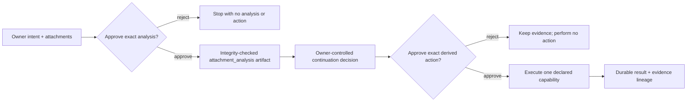

# ADR-0032: Compose attachment evidence into separately approved actions

**Status:** Accepted
**Date:** 27 August 2026

## Context

ADR-0031 made documents and images analyzable, but analysis alone does not make
Vera a useful assistant. An owner must be able to say “create a task from this
file,” “remember the important point,” or “fix the problem in this screenshot”
without manually copying the analysis into a second request.

This introduces two different uses of an analysis artifact:

- Vera may inspect it inside the owner-controlled orchestration boundary to
  choose and parameterize a next action; and
- a downstream specialist may need the complete artifact as an input.

Treating those uses as one implicit disclosure would make approvals misleading.
Letting an attachment invoke a downstream action before analysis would let
untrusted content select authority.

## Decision

Attachment-driven actions use a bounded adaptive goal:

The first step is always `attachment_analysis@1`. Every explicit later outcome
is persisted as a capability-backed adaptive requirement, so a model cannot
silently replace “analyze and act” with analysis only. Each later capability is
proposed only after validated evidence exists and receives a new exact
approval.

Approvals distinguish:

- `decisionEvidence`: artifacts Vera used to derive the proposed arguments;
  their contents are not automatically sent to the capability; and
- `inputArtifacts`: artifacts the capability will consume; approving the step
  explicitly authorizes that content disclosure and freezes its identity and
  hash.

`development_planning@1` and `software_change@1` accept
`attachment_analysis` as a typed input. When either cites attachment analysis
as material decision evidence, it must also bind that artifact in
`inputArtifacts`; Vera fails closed instead of silently broadening disclosure.
Owner-state actions such as task, reminder, and memory management receive only
their exact derived arguments, while the analysis remains decision evidence.

Artifact-derived authority includes `artifact_content` even when the artifact
is decision evidence rather than a direct capability input. This tells the
owner that the proposed values came from durable artifact content without
claiming that the destination receives the full artifact.

The universal frontend presents the lifecycle as **Understand → Decide → Act**,
shows both evidence classes on approvals, and preserves attachment citations in
the completed adaptive result.

## Rationale

An adaptive goal is the smallest existing boundary that can wait for real
evidence before selecting exact action arguments. Separate approvals preserve
owner control, typed inputs preserve provider neutrality, and durable
requirements prevent model variability from dropping requested outcomes.

## Consequences

- One attachment-driven action normally requires two approvals.
- Pure analysis remains a single capability invocation.
- Attachment-derived task, reminder, and memory actions do not receive the raw
  analysis artifact.
- Planning and change specialists may receive the analysis only when the second
  approval names it as an input.
- The orchestration brain must remain owner-controlled for adaptive evidence;
  cloud-brain continuation remains fail-closed under ADR-0024.
- At most three capability invocations and four model calls still apply. Vera
  rejects a larger requested action bundle instead of silently dropping an
  outcome; the owner can split it into smaller requests.
- Video remains outside the accepted attachment contract.

## Alternatives considered

### Stop after analysis and require a second owner message

Rejected because it turns Vera into a document viewer and forces the owner to
manually orchestrate obvious follow-up work.

### Send every analysis artifact to every downstream capability

Rejected because it violates data minimization and makes approval text
inaccurate.

### Execute all requested actions under the attachment-analysis approval

Rejected because one approval would span different destinations, data classes,
and side effects.

### Let attachment content choose the next capability directly

Rejected because untrusted evidence is data, not authority.

## Follow-up

Add more typed consumers only when a concrete capability needs attachment
evidence. Video ingestion requires its own bounded representation and resource
decision rather than being inferred from image support.
