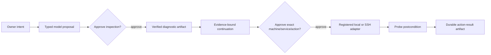

# ADR-0033: Govern machine operations through registered actions

**Status:** Accepted
**Date:** 27 August 2026

## Context

Vera must eventually operate the owner's digital environment, not merely talk
about it. Machine access is also where a broad shell, ambiguous target, or
replayed restart can cause immediate damage. A model-generated command would
collapse proposal, authorization, and execution into one unsafe boundary.

## Decision

Vera exposes two provider-neutral capabilities:

- `machine_inspection@1` runs bounded registered diagnostics and service probes;
- `machine_service_management@1` starts, stops, or restarts exactly one named
  registered service and verifies its registered postcondition.

An operator-owned JSON catalog registers machine identities, local or SSH
adapters, probes, and exact command argument vectors. Models see only public
machine, service, and allowed-action identities. They can select those typed
values but cannot provide executables, arguments, hosts, credentials, or probe
definitions. That public catalog may cross the configured orchestration-model
boundary; the operator must therefore treat display names and IDs as
prompt-visible metadata and keep secrets out of them.

The approval freezes a machine-specific capability destination. Execution
resolves that persisted destination against the current catalog and fails
closed if the machine or adapter changed. Local commands use direct process
execution without a shell. SSH commands originate only in the catalog and are
quoted as fixed remote arguments. Output is bounded before it becomes an
artifact.

An adaptive request such as “check Redis and restart it if unhealthy” requires
separate approvals. The action step must bind a matching
`machine_diagnostic` input. Recovery probes the desired postcondition before
repeating an action; if it is already satisfied, Vera records reconciliation
instead of blindly replaying the command.

## Rationale

This is the smallest useful machine-control increment that preserves Vera's
core rule: models propose, application code controls effects. A catalog is
less flexible than a shell but makes target, authority, audit, recovery, and UI
disclosure precise. Local and SSH adapters share one contract, so machine
location does not leak into assistant semantics.

## Consequences

- Unregistered machines, services, actions, diagnostics, and commands cannot run.
- Inspection and mutation have different authority and approval records.
- Every completed action includes before/after observations and a verified
  postcondition.
- Changing a catalog invalidates outstanding approvals whose destination no
  longer resolves exactly.
- SSH credentials remain an operator concern (for example an SSH agent); they
  are never placed in the catalog, prompt, artifact, or client response.
- Recovery proves that the requested postcondition already holds; for a
  recovered `restart`, it does not claim cryptographic proof that the original
  restart command ran. This safe at-most-once reconciliation avoids blindly
  replaying a disruptive action.
- Diagnostic output becomes owner-visible artifact data and may inform a later
  approved step. Operators must not register diagnostics that print secrets.
- This increment does not provide arbitrary shell execution, package
  installation, file mutation, process killing, or privileged escalation.

## Alternatives considered

### Give the orchestration model a shell

Rejected because a prompt error or injected instruction would become arbitrary
code execution and approval could not truthfully freeze the effect.

### Register only machines and let the model write commands

Rejected because machine identity alone does not bound authority.

### Use separate assistant capabilities for local and SSH machines

Rejected because transport is an adapter decision, not an owner-intent or
domain distinction.

## Follow-up

Add new operation types only as closed contracts with explicit postconditions.
Credential brokerage and multi-owner authorization remain prerequisites for
wider deployment.
