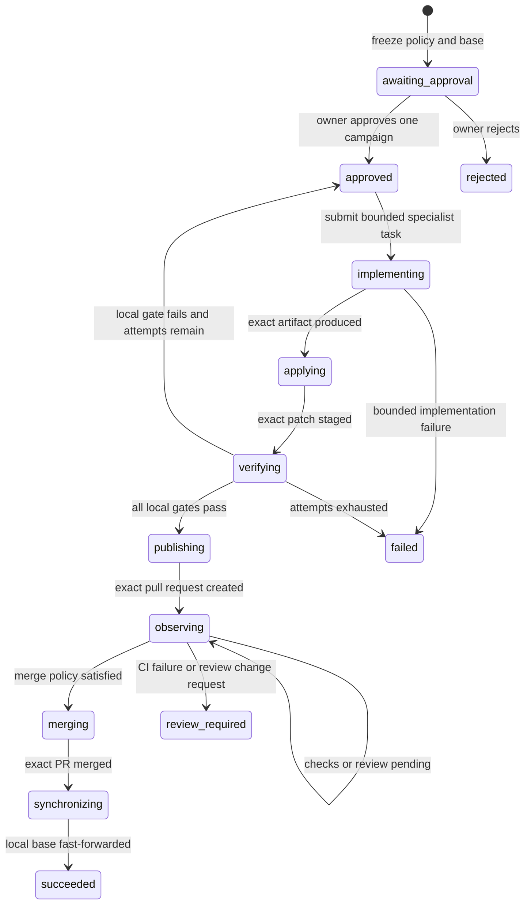

# ADR-0034: Delegate bounded development campaigns through one owner approval

**Status:** Accepted
**Date:** 27 August 2026

## Context

Vera can already ask a coding specialist for one software change, stage the
result in a managed worktree, and publish one exact pull request. Those are
safe building blocks, but they still require the owner to approve each internal
boundary manually. That is orchestration assistance, not yet useful delegated
delivery.

The owner wants to approve one well-defined engineering objective and let Vera
carry it through implementation, local verification, pull-request checks,
merge, and local synchronization. A blanket instruction such as “keep improving
Vera” would be too broad: it would let a model select its own scope, rewrite its
own controls, and repeat external effects without a finite authority envelope.

## Decision

Vera introduces a durable `development_campaign` aggregate. One owner approval
freezes exactly:

- one registered project, credential-free GitHub repository, base branch, and
  synchronized base revision;
- one objective and ticket identity;
- the exact enabled planning and software-change capability destinations and
  their maximum authority;
- server-configured quality-gate executables, argument vectors, and timeouts;
- protected path prefixes, file and byte ceilings, attempt count, wall-clock
  duration, and minimum required pull-request checks;
- exact commit and pull-request metadata; and
- merge method, review requirement, and local-base synchronization policy.

The model cannot propose or modify this envelope. The operator owns a validated
JSON policy catalog selected at process startup. Campaign creation succeeds
only from a clean registered checkout on the configured base branch whose HEAD
equals `origin/<base>`.

Within that frozen authority, Vera may approve only an exact
`development_planning@1` or `software_change@1` request whose objective,
ticket, project, context revision, destination, authority, and artifacts still
match the campaign. It may then approve the exact generated patch and the exact
publication effect using the existing lifecycles. Those internal approvals are
durable evidence of delegated authority; they are not omitted or widened.

Local quality-gate failure retires the managed attempt from the campaign and
asks the specialist for a complete replacement from the unchanged approved
base. The prior managed worktree remains immutable evidence and is never
reused. Repair is bounded by the approved attempt ceiling. Once a pull request
is published, failed CI or a reviewer change request stops the campaign at
`review_required`; V1 does not silently update an already reviewed remote
branch.

GitHub observation and merge are deterministic application operations. Vera
requires the exact head and approved base revisions, an open non-draft pull
request, the configured minimum check count, no pending or failed checks, the
configured review decision, and a clean merge state. Merge uses GitHub's
head-match protection. Direct base pushes, force pushes, policy mutation, and
campaign control-plane changes are permanently outside campaign authority.

Project-mutation leases serialize campaign effects with ordinary staging and
publication. The campaign lease covers the maximum configured sequential gate
window. MongoDB remains the operational source of truth; workers derive work
from durable state and recover through idempotent subordinate lifecycles and
remote identity checks.

## Rationale

This is the smallest credible step from “Vera helps me code” toward “Vera can
deliver bounded work for me.” It delegates an outcome rather than individual
clicks while preserving Vera's core rule that models propose and application
code controls effects. Reusing the existing task, application, and publication
lifecycles keeps evidence, recovery, and provider neutrality instead of adding
a privileged second execution path.

The operator-owned policy is deliberately separate from the model prompt and
owner objective. Stable safety controls should not be rewritten by whichever
model or coding platform happens to be selected.

## Consequences

- One approval can produce and merge one pull request without further owner
  intervention when every frozen condition remains true.
- Campaigns are durable, restart-discoverable, owner-visible, cancellable only
  before publication, and terminally auditable.
- Coding remains provider-neutral; the frozen destination records the selected
  adapter, so a restarted campaign cannot silently switch platforms.
- Control-plane source, bootstrap, policy, dependency manifests, repository
  automation, environment files, security documentation, and ADRs are protected
  by built-in prefixes in addition to operator policy.
- A dirty, stale, moved, conflicted, or ambiguously modified project fails
  closed instead of being repaired automatically.
- Quality-gate commands run directly without a shell and receive a minimal
  process environment. Gate output is bounded before persistence or model reuse.
- V1 quality gates run inside the trusted owner host account, not a hostile-code
  sandbox. A stronger OS isolation boundary is required before campaigns accept
  untrusted contributors or run outside the single-owner perimeter.
- A process crash during a long gate may delay another project mutation until
  the conservatively sized lease expires.
- This increment does not choose its own roadmap, decompose an open-ended goal
  into multiple pull requests, modify a published PR after CI/review failure,
  bypass branch protection, or merge this implementation PR itself.

## Alternatives considered

### Give Codex or another specialist repository and GitHub credentials

Rejected because implementation quality and delivery authority would collapse
into one opaque third-party boundary.

### Remember every intermediate approval forever

Rejected because approval of one effect does not imply approval of future
patches, repositories, revisions, or delivery metadata. A campaign is one
explicit finite delegation, not global approval memory.

### Let the model choose tests and merge policy

Rejected because the same component producing a change must not define the
evidence required to accept it.

### Automatically repair failed CI on an existing pull request

Deferred. Safe remote repair needs a separately designed branch-update
authority, reviewer-state policy, and immutable attempt lineage.

## Follow-up

After real owner-supervised use, add an explicit remote-repair lifecycle if the
evidence justifies it. Multi-objective or recurring development programs require
a separate planning and portfolio authority; they must not be smuggled into one
campaign approval.
