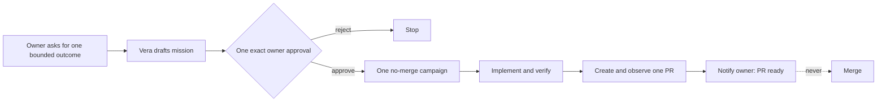

# ADR-0035: Run bounded software missions that stop at a pull request

**Status:** Accepted
**Date:** 27 August 2026

## Context

Development campaigns let an owner delegate one already-selected engineering
objective. Vera still cannot take the more assistant-like request “choose one
useful improvement while I am away and bring me a pull request.” Making a
campaign model choose its own objective would improperly let an execution
mechanism widen its own approval envelope. Giving an open-ended agent merge
authority would be worse: evaluation, implementation, acceptance, and release
would collapse into one opaque actor.

## Decision

Vera introduces a durable `mission` aggregate above development campaigns. A
mission represents one finite outcome-selection and delivery delegation. It is
available only through an operator-configured mission policy that points to one
existing campaign policy.

The orchestration model may propose `mission_management@1`. That capability
only creates a mission draft, so Vera application policy approves the draft
write automatically. It does not authorize development. The owner then sees
one consequential approval that freezes:

- one registered project and one operator mission/campaign policy;
- the exact objective and completion criteria;
- one commit message and one non-draft pull-request title;
- one subordinate campaign and its full frozen base, gates, protected paths,
  capability destinations, attempt/change ceilings, and duration;
- a hard ceiling of one campaign and one pull request; and
- explicit authority values forbidding merge, recurrence, policy mutation,
  direct base pushes, and force pushes.

After approval, deterministic application code approves the already-frozen
subordinate campaign. The campaign may plan, implement, stage, verify, publish,
and observe checks. Its completion mode is `pull_request_only`: after the exact
head and base are verified, the configured minimum checks pass, and no checks
are pending or failed, it succeeds without calling the merge operation. Review
approval is not a prerequisite for handing the pull request to the owner.
The campaign records the mission as its approval controller. Direct approval
through the campaign API fails closed; only the matching mission may approve or
reject it. This prevents the subordinate resource from becoming a second or
bypass approval surface.

MongoDB is authoritative for missions, workers rediscover approved/executing
missions, and leases prevent duplicate progress. A mission embeds the exact
campaign effect it approved and fails closed if that campaign identity or
effect changes. Terminal success, review-required, failure, and cancellation
produce Vera inbox notifications.

## Rationale

This separates three authorities cleanly: the model proposes a bounded outcome,
the owner authorizes its exact envelope once, and deterministic code enforces
execution and stopping conditions. Reusing campaigns preserves existing
provider-neutral coding, audit, recovery, and GitHub reconciliation instead of
adding a privileged autonomous agent.

Stopping at a pull request is the useful trust boundary for early unattended
work. It produces something tangible while leaving final release judgment with
the owner.

## Consequences

- Vera can perform one meaningful unattended software delivery cycle after one
  exact approval.
- The frontend exposes mission scope, completion criteria, ceilings, no-merge
  authority, progress, failure, and the resulting pull-request link.
- Draft creation does not introduce a redundant approval; every consequential
  effect remains behind the mission approval.
- A mission cannot recurse, create multiple campaigns, repair a published PR,
  choose another project, change its policy, or merge.
- Failed checks, changed remote identity, authority drift, expiry, or campaign
  review requirements stop automation and notify the owner.
- Existing merge-capable campaigns remain available as a separate explicit
  operator workflow. This ADR does not weaken or silently reinterpret ADR-0034.

## Alternatives considered

### Let the model directly create and approve campaigns

Rejected because the proposing model would also grant its own execution
authority and could silently widen scope.

### Reuse adaptive goals

Rejected because adaptive goals approve capability steps individually and are
bounded to three steps. A mission is durable delegated authority over an
existing multi-stage coordinator, not another prompt-driven step graph.

### Allow automatic merge

Rejected for this autonomy increment. A ready pull request is tangible and
reversible; merge changes the shared base and requires a higher trust decision.

## Follow-up

Gather real mission evidence before considering outcome ranking from a backlog,
multiple PRs, published-branch repair, scheduled missions, or a separately
approved merge handoff. None of those may be inferred from this authority.
