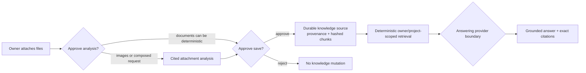

# ADR-0036: Build grounded personal knowledge from owner-approved sources

**Status:** Accepted
**Date:** 4 September 2026

## Context

Governed memory lets Vera retain concise owner assertions such as preferences
and standing instructions. Attachments let Vera inspect files for one task.
Neither makes a durable body of source material available for later questions.
Treating entire files as memory would erase provenance, overload ordinary
conversation context, and make it difficult to distinguish a remembered claim
from evidence. Automatically searching every historic attachment would make an
upload a permanent disclosure decision the owner never made.

Vera needs a personal knowledge capability that is genuinely useful now and
can later support larger libraries and stronger retrieval without changing its
trust semantics.

## Decision

Vera adds a separate, owner-governed knowledge aggregate and the versioned
`knowledge_management@1` capability. A knowledge source is created only from
one to five owner attachments after an explicit add request and approval. It
freezes:

- owner, source identity, revision, title, scope, and sensitivity;
- exact attachment identities and hashes;
- the attachment-analysis artifact when visual evidence was required;
- bounded, addressable text chunks and their hashes; and
- a whole-source content hash.

Documents are indexed from Vera's existing deterministic extraction. Images
may be indexed only from an integrity-checked `attachment_analysis` artifact;
raw image bytes and model invention never become searchable text. Removal is a
tombstone that clears all searchable chunks while retaining minimal audit and
provenance metadata.

Retrieval is deterministic application code. It validates source and chunk
integrity before ranking bounded lexical matches. The answer model receives
only synthetic source labels and the retrieved title, locator, and excerpt—not
internal task IDs, attachment IDs, hashes, excluded source metadata, or the
whole library. It must return citations from that closed set. Application code
maps those citations back to durable source identities and rejects unknown or
empty citations.

Local owner-controlled answering is read-only and may run without another
approval. A third-party model destination requires exact approval because it
discloses personal knowledge excerpts. Adding and removing sources always
require approval when requested through conversation. Direct HTTP write routes
exist as explicit owner-control surfaces inside the accepted single-owner host
perimeter; they do not give a model write authority.

Knowledge remains distinct from memory:

| Concern | Governed memory | Grounded knowledge |
|---|---|---|
| Canonical content | Concise owner assertion | Evidence-bearing source material |
| Provenance | Owner message and invocation | Exact attachments and optional analysis artifact |
| Normal use | Bounded personalization context | Explicit search and cited answers |
| Mutation | Remember, correct, forget | Add immutable source, remove source |
| Model behavior | May influence a response | Must support claims through citations |

MongoDB is authoritative for source records. The knowledge application port
keeps HTTP, capability, and future indexing adapters independent of the
concrete store. The first retrieval implementation is bounded lexical search;
embeddings may later replace or augment ranking behind that port without
changing source identity, provenance, approval, integrity, or citation rules.

## Rationale

This makes Vera useful with personal documents while preserving the product
rule that models propose and code controls authority. Explicit promotion
prevents attachment history from silently becoming long-term context. A
separate aggregate prevents memory semantics from expanding into a generic
document database. Citation mapping and fail-closed integrity checks make the
answer inspectable rather than merely confident.

Lexical retrieval is intentionally the first mechanism because it is local,
deterministic, inexpensive, and sufficient to prove the whole product journey.
It establishes a stable evaluation baseline before introducing embedding
models, vector infrastructure, or opaque relevance behavior.

## Consequences

- Owners can save documents and analyzed images, search them later, inspect
  exact excerpts, and remove their searchable content.
- The universal frontend exposes a Knowledge workspace with provenance,
  direct evidence search, citations, and two-step source removal.
- Attachment analysis and knowledge mutation remain separate approvals in a
  composed goal; approving inspection never implies permanent retention.
- Knowledge search does not automatically contaminate ordinary conversation
  context or governed memory.
- MongoDB gains a validated `knowledge_sources` collection and indexes for
  owner identity, idempotency, status, and recency.
- The initial lexical ranker will not provide semantic recall for unrelated
  wording. This is a known retrieval limitation, not a reason to weaken the
  source and trust model.

## Alternatives considered

### Store files as memory records

Rejected because memory is optimized for concise owner assertions and bounded
personalization, not large cited evidence with file provenance.

### Search every attachment automatically

Rejected because upload is not consent for permanent indexing or later model
disclosure, and old task files should not silently influence unrelated work.

### Begin with embeddings and a vector database

Deferred. Better semantic recall may be valuable, but it adds another model,
index lifecycle, cost, privacy boundary, and migration concern before the
grounded product contract has evidence.

### Let the answer model search the database directly

Rejected because it would combine retrieval authority, data selection, and
answer generation in an opaque component and could expose more than the
approved bounded evidence set.

## Follow-up

Measure search misses and citation quality on real owner sources. Consider
hybrid lexical/vector retrieval only behind the existing knowledge port and
only with explicit embedding-provider privacy, reindexing, deletion, and
evaluation rules. Optical character recognition for images and scanned PDFs
must continue through a cited analysis artifact rather than bypassing the
evidence boundary.
