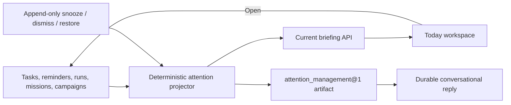

# ADR-0037: Project attention from authoritative resources

**Status:** Accepted
**Date:** 4 September 2026

## Context

Vera can already hold personal tasks, deliver reminders, wait for approvals,
and run bounded missions and development campaigns. Those capabilities are
useful individually, but a Jarvis-like assistant must also notice when the
owner is needed. Making each client scan every resource would duplicate policy,
and copying source records into a second mutable attention database would let
the copy drift from operational truth.

## Decision

Vera exposes one deterministic, owner-scoped attention projection over current
authoritative resources. The projection currently detects:

- pending task, mission, and standalone campaign approvals;
- failed runs, missions, and campaigns, plus explicit review boundaries;
- open, due-soon, and overdue personal tasks;
- imminent and delivered-but-unacknowledged reminders; and
- completed missions and campaigns whose result is ready for owner review.

Each item has a stable identity derived from its source kind, source identity,
exact source generation, and reason. Priority and prose are code-owned. A model
does not classify, summarize, or rank the dashboard and therefore cannot invent
operational status.

Vera persists only append-only owner disposition decisions: snooze, dismiss, or
restore. A disposition applies to one exact attention identity. If the source
changes, or a due-soon task becomes overdue, the new generation receives a new
identity and cannot be hidden by an old decision. Snoozes expire automatically,
are bounded to 30 days, and do not mutate the source resource.

`GET /v1/attention` returns the current briefing. The universal frontend calls
the decision endpoint with an idempotency key and presents Today as the first
owner-workspace tab. “Open” navigates to the authoritative resource; it does not
create a second action path.

`attention_management@1` provides the same projection to conversation. Its
initial `brief` action is a local, read-only, approval-free capability that
produces a durable `attention_result` artifact. The orchestration model receives
only the request and capability contract; attention contents are read locally
after routing and are not disclosed to a model provider.

## Consequences

- There is one source of truth for every underlying piece of work.
- A process restart recomputes the same briefing and restores dispositions from
  MongoDB; Redis and frontend state are not authoritative.
- Dashboard reads remain useful even when the model provider is unavailable.
- Direct dashboard dispositions are owner-interface state, while consequential
  source mutations still use their existing approval boundaries.
- Native push, email, watch, and other interruptive delivery channels remain
  future adapters over this attention policy. They must not become new truth.

## Rejected alternatives

- **Ask the model what matters:** rejected because operational claims would be
  probabilistic and could be fabricated or omitted.
- **Create mutable attention copies:** rejected because copied status can drift
  from tasks, approvals, reminders, or missions.
- **Treat notifications as attention truth:** rejected because the inbox is a
  delivery record, while attention is a current-state projection.
- **Dismiss by source ID forever:** rejected because a past dismissal must not
  hide a materially changed or newly urgent source generation.
