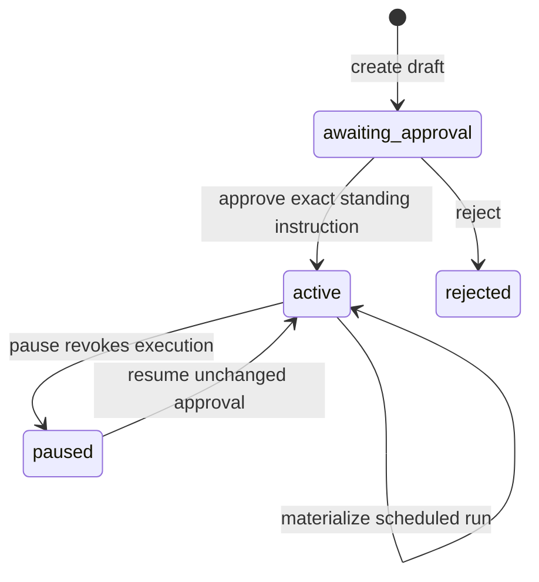
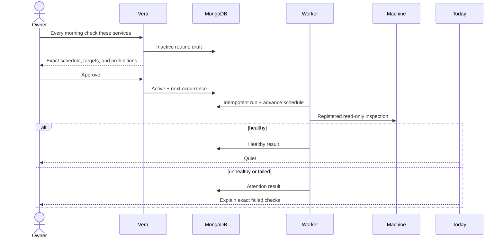

# ADR-0038: Run recurring work as approved standing instructions

**Status:** Accepted
**Date:** 4 September 2026

## Context

Vera can react to a request, deliver one-shot reminders, and derive a current
briefing. A Jarvis-like assistant also needs to notice useful facts without a
fresh prompt. Process timers are not durable, while granting a model open-ended
recurring authority would let one approval silently expand over time.

## Decision

Vera represents recurring work as an owner-scoped routine with a frozen
schedule, action, target, and authority envelope. Creating a routine only
drafts an inactive standing instruction. One separate owner decision activates
the exact effect.

The first action is `machine_health_check`. It may inspect one registered
machine and an exact optional service set. Its authority explicitly permits
recurring read-only inspection and prohibits service control, routine mutation,
and scope expansion. Corrective actions continue through the separately
approved `machine_service_management@1` boundary.

A daily schedule records local `HH:mm`, IANA time zone, and weekdays. Vera
computes UTC occurrences from this civil-time contract and executes at most
once per local date, including a repeated daylight-saving clock hour.

Routine definitions and routine runs are separate MongoDB resources. The
scheduler idempotently materializes a run for `(routine, occurrence)` before it
advances the next occurrence. A worker uses expiring durable leases to recover
queued or interrupted read-only runs. Manual runs use owner idempotency keys
and may execute only while a routine is active.

## Rationale

The durable schedule survives restarts and multiple API processes. Separate
run resources provide bounded history and recovery without growing one routine
document forever. Frozen standing authority gives the owner useful autonomy
without converting a schedule into permanent permission for arbitrary action.

## Consequences

- Healthy checks do not create noise; unhealthy and failed runs are projected
  into Today from authoritative routine-run state.
- Pausing immediately removes scheduled and manual execution authority.
- Editing schedule, target, or action is intentionally absent; a changed effect
  requires a new approval-bearing routine.
- The scheduler is polling today, but persistence and leases allow a later
  external scheduler without changing routine semantics.
- New routine action kinds require their own closed schemas, outcome policy,
  authority declaration, and recovery analysis.

## Alternatives considered

- **In-process timers:** rejected because restart loses intent and multi-process
  execution duplicates work.
- **Redis expiry as schedule authority:** rejected because Redis is Vera's
  rebuildable scratchpad, not durable authorization truth.
- **Automatically restart unhealthy services:** rejected because observation
  and mutation have different consequences and approval boundaries.
- **General scheduled prompts or shell commands:** rejected because free-form
  text is not a bounded, reviewable effect contract.

## Follow-up

Add other routine action kinds only after their authority and quiet-success
policy are explicit. External push delivery may later consume Today; it must
remain a projection, not a second source of routine truth.
