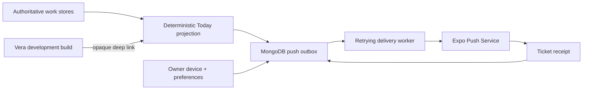

# ADR-0039: Deliver attention to owner devices through a durable outbox

**Status:** Accepted
**Date:** 4 September 2026

## Context

Vera already derives a deterministic Today briefing from authoritative work,
but the owner must open the interface to discover it. A proactive assistant
needs to reach the owner's phone without making a push provider a source of
truth, leaking private content onto a lock screen, or replaying every old item
when a device first registers.

## Decision

Vera adds an owner-scoped notification-device registry and a durable push
delivery outbox. Active Today items are projected into one delivery per
`(device, attention item)`. Items older than the device's original registration
are not backfilled. Only approvals, delivered reminders, due or overdue tasks,
failures, reviews, and ready results are eligible; ordinary open tasks and
future reminders do not generate push noise.

Push tokens remain private server records and never appear in HTTP responses or
logs. Lock-screen payloads use a fixed Vera title, a category-only body, and an
opaque attention identifier. The full title and summary are fetched from Vera
after the owner opens the app.

Expo is the first provider adapter, not a domain assumption. Submission tickets
are not treated as delivery: the worker checks receipts, retries bounded
transient failures, and invalidates devices reported as unregistered. Delivery
is at-least-once because an ambiguous provider/network result can still produce
a duplicate. User category preferences and optional IANA-time-zone quiet hours
are enforced by the server.

## Consequences

- Vera can proactively reach an installed iOS or Android client while Today and
  the inbox remain the durable human-visible truth.
- Web and Expo Go continue to work, but explain that remote push requires a
  development or production build.
- A test-alert endpoint provides explicit setup verification without backfilling
  old attention.
- Revoked, invalid, disabled-category, and stale-device deliveries fail closed.

## Alternatives considered

- **Push directly from each feature:** rejected because it duplicates policy,
  leaks provider concerns, and makes retries inconsistent.
- **Use push as the notification database:** rejected because provider delivery
  is neither durable nor queryable enough to be Vera's truth.
- **Include work titles in payloads:** rejected because lock screens are an
  uncontrolled disclosure surface.
- **Support remote push in Expo Go:** unavailable in current Expo; a native
  development build is required.
