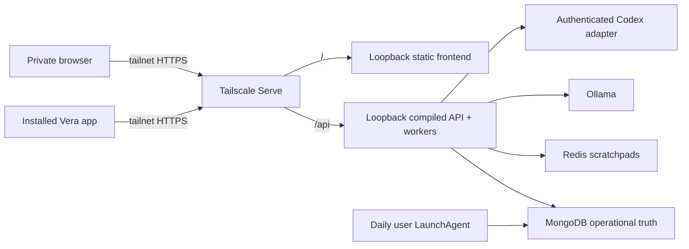

# ADR-0040: Install Vera as a user-scoped Mac Mini service

**Status:** Accepted
**Date:** 4 September 2026

## Context

Vera can already execute durable work, run bounded software missions, recover
workers, and reach an owner device. Running the API and Expo development server
manually still makes Vera a development demonstration rather than an assistant
the owner can depend on. A system that will eventually help develop itself must
also have an explicit operational boundary, repeatable startup, backups, and a
safe update path.

The production process must retain access to the owner's authenticated Codex
and GitHub sessions. Installing a privileged system daemon would create a
different identity and credential boundary. Binding the API to a LAN or
tailnet address would also contradict the accepted private-ingress design.

## Decision

The first installed Vera deployment runs on the Mac Mini as the owner's macOS
`launchd` LaunchAgents:

- the compiled API and all durable workers run as `dev.vera.api`;
- a loopback-only static host serves the exported universal web frontend as
  `dev.vera.frontend`;
- `dev.vera.backup` creates a daily compressed MongoDB archive and applies a
  bounded retention policy.

The service definitions contain only non-secret startup configuration. Vera
continues to load ignored repository-root environment profiles, whose file mode
is restricted during installation. The generated service `PATH` explicitly
includes the installed Node, npm, Homebrew, Codex, GitHub, Git, Ollama, and
Tailscale command locations required by enabled adapters.

Both HTTP processes remain bound to loopback. Tailscale Serve owns private HTTPS
ingress and maps `/` to the static frontend and `/api` to Vera without replacing
unrelated Serve handlers on the same Mac Mini. Funnel and direct network binds
remain forbidden.

The operator interface provides doctor, install, start, stop, restart, status,
logs, backup, update, and uninstall commands. Installation validates local
dependencies, credentials, compiled configuration, and production artifacts
before replacing service definitions. Uninstall removes only Vera's service
definitions; databases, backups, configuration, and source are preserved.

Updates are explicit. Before advancing `main`, the updater requires a clean
checkout, proves that `origin/main` is a fast-forward, and verifies the exact
candidate commit in an isolated Git worktree. Only a passing candidate is
fast-forwarded, built in the production checkout, and activated by restarting
Vera. Vera never automatically deploys a newly created pull request.

The everyday Android client uses an EAS internal `preview` build. It embeds only
the private Tailscale API origin and works without Metro or Expo Go. Provider
credentials and push tokens remain server-side or in platform-secure storage.

## Consequences

- Vera can survive terminal closure, process failure, and user login restarts.
- The service uses the same owner identity already accepted for V1 rather than
  inventing a privileged machine identity.
- Web production no longer depends on an Expo development server.
- The production web export is isolated from ordinary multi-platform developer
  builds, so a local build cannot replace the bundle served by the installed
  frontend.
- MongoDB is backed up; Redis remains reconstructible and is not backed up.
- The initial deployment still depends on the Mac Mini being powered on,
  connected, and logged into the owner account.
- Application authentication remains required before access expands beyond the
  single-owner tailnet perimeter.

## Alternatives considered

- **Continue running development servers manually:** rejected because terminal
  lifetime and hot-reload tooling are not an operational contract.
- **Install a root LaunchDaemon:** rejected because it changes credential and
  filesystem identity while granting unnecessary privilege.
- **Containerize every dependency immediately:** rejected because Ollama,
  Codex, GitHub authentication, and macOS device integration already belong to
  the owner host; containers would add a second operational boundary without
  improving the first installation.
- **Automatically deploy every merged branch or PR:** rejected because source
  publication, owner merge, and production activation are distinct effects.
- **Use a development client for daily use:** rejected because it requires a
  Metro session; internal standalone builds provide the intended installed
  experience.

## Follow-up

- Prove a full reboot and failed-candidate update exercise. The operator command
  already verifies each backup by restoring it into an isolated temporary
  database, inspecting the recovered collections, and deleting that database.
- Add a second deployment adapter only when another supported host exists.
- Revisit service identity and secret brokerage before multi-user deployment.
