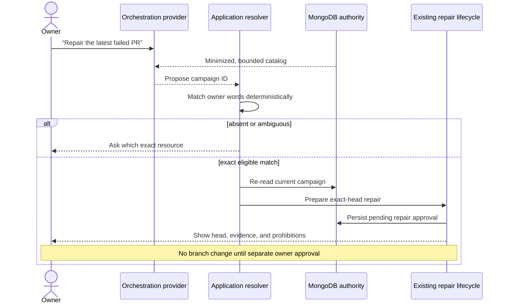

# ADR-0042: Resolve conversational software-delivery references in application code

**Status:** Accepted
**Date:** 5 September 2026

## Context

Vera can create bounded software missions, run development campaigns, observe
pull requests, and prepare exact-head repairs. Until now, the owner had to leave
the conversation and locate those resources in dedicated control surfaces.
That is operationally safe but falls short of Vera's assistant promise: the
owner should be able to ask “How is the latest campaign?” or “Repair the failed
checks on PR 42” without supplying an internal identifier.

A language model can interpret the intent, but it must not invent an identity,
silently select among ambiguous resources, or turn a conversational reference
into broader repository authority. The repair lifecycle already has the correct
consequential boundary: it freezes the exact pull-request head and evidence in a
new owner approval before any branch update.

## Decision

Vera will expose two provider-neutral conversational capabilities:

- `software_delivery_management@1` lists or inspects existing owner-scoped
  missions and campaigns. It is local, read-only, and automatically executable.
- `software_delivery_repair@1` may ask the existing campaign lifecycle to
  prepare one exact-head repair approval. It cannot approve, apply, push, force
  push, or merge that repair.

Application code assembles a bounded, newest-first catalog only for requests
that mention software-delivery concepts. The orchestration provider receives a
minimized projection: resource kind and ID, status, a truncated objective,
project display name, and only the pull-request observations required to route
the request. Repository credentials, pull-request head revisions, internal
project IDs, URLs, policies, commands, and repair evidence remain outside the
model request.

The model may propose an ID from that catalog, but application code accepts it
only when the owner's words resolve deterministically through one of these
rules:

1. an exact `mission_…` or `campaign_…` identifier;
2. one unambiguous pull-request number;
3. an explicit newest/latest reference against the ordered matching set;
4. one matching identifier in recent integrity-checked conversation context;
5. exactly one eligible resource of the requested kind.

An absent, ineligible, wrong-kind, or ambiguous reference produces a
clarification response. Execution re-reads current durable state; the catalog
is routing context, not a snapshot that grants authority.

## Rationale

This makes the conversation the primary assistant interface while retaining
the resource tabs as inspectable operational projections. Separating read-only
management from repair preparation gives each capability one immutable,
auditable authority envelope. Deterministic application resolution prevents a
plausible model guess from becoming resource identity or repository authority.
Reusing ADR-0041 avoids a second repair path and preserves all existing
exact-head, retry, and no-force/no-merge guarantees.

## Consequences

- The owner can discover and inspect current delivery work conversationally.
- A repair request can reach its real approval boundary without manual ID
  lookup, but cannot cross that boundary silently.
- New conversational operations must have a fixed authority envelope; broader
  action unions are split into separate capabilities when authority differs.
- Catalog ordering, eligibility, and ambiguity handling are application
  behavior with deterministic regression tests, not prompt conventions.
- The bounded catalog may be slightly stale by execution time, so every action
  must re-read and validate authoritative state.
- Resource tabs remain valuable for full evidence and lifecycle controls; they
  are no longer the only way to operate software delivery.

## Alternatives considered

### Let the model select any database or API identifier

Rejected. Schema-valid output does not prove that an ID follows from the
owner's request, and a model guess can target the wrong campaign.

### Require exact IDs in every owner request

Rejected. This is safe but forces the owner to operate Vera like an admin
console rather than a personal assistant.

### Put list, inspect, repair preparation, and repair execution in one capability

Rejected. A dynamic authority envelope is harder to reason about and risks
making a harmless status question share the authority of a repository action.

### Add a second conversational repair implementation

Rejected. Parallel mutation paths would drift from the exact-head approval and
recovery guarantees already accepted in ADR-0041.

## Follow-up

- Extend the same resolver pattern to other durable resources only when each
  operation has a precise capability and authority envelope.
- Add richer natural references when they can be resolved deterministically
  from bounded owner-scoped state.
- Consider live steering of an already executing campaign separately; it is not
  authorized by this decision.
