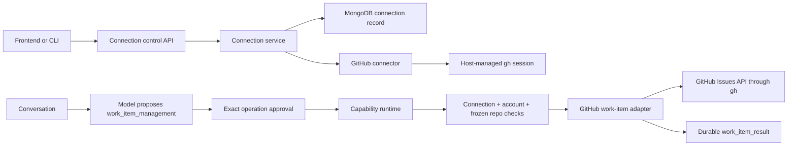

# ADR-0045: Connect curated external services through provider-neutral capabilities

**Status:** Accepted
**Date:** 5 September 2026

## Context

Vera must act across the owner's digital life without coupling its reasoning,
conversation, or frontend to one vendor. A provider CLI such as `gh` is useful
transport, but it is not a product capability, an authorization record, or a
safe plugin system. Treating ambient host authentication as sufficient
authority would also let any enabled code use a credential without an explicit
owner connection or revocation boundary.

The first concrete need is GitHub issue management for registered projects.
It must establish the architecture that later providers and credential modes
can extend without exposing secrets to the frontend, orchestration model, or
durable task records.

## Decision

Introduce two separate, provider-neutral concepts:

1. An **integration connection** is Vera's durable, owner-scoped permission to
   use a named external-service account through a registered adapter. Its
   public projection contains provider, non-secret account identity, supported
   operations, status, and verification time. It never contains credential
   material.
2. A **capability** describes the work Vera can request. The first external
   capability is `work_item_management@1`; its contract describes create,
   list, inspect, comment, close, and reopen operations without mentioning a
   CLI or SDK.

The initial GitHub connection deliberately adopts the Mac Mini user's existing
authenticated `gh` host session. Enabling the connection is an explicit
control-plane action. Revoking it removes Vera's authority without signing the
host out. Vera stores the GitHub numeric account ID and refuses silent account
switches; a different host account requires revoke and reconnect.
The adapter is disabled by default and selected independently with
`VERA_WORK_ITEM_ADAPTER=github_gh_cli`; selecting transport does not create a
connection or approve an operation.

The GitHub adapter is selected behind the generic work-item executor. Before
each operation, application code requires an active connection, verifies its
account, resolves the registered project's credential-free `origin`, and
matches that repository to the identity frozen in the approved project-context
manifest. The model may propose typed arguments, but cannot select a credential,
repository URL, adapter command, or permission.

All work-item operations require exact approval. Read operations disclose
`work_item_data` to GitHub and carry no write authority. Create, comment, close,
and reopen additionally disclose `external_data_write`. Results become typed,
durable `work_item_result` artifacts.

Issue and comment creation include a hidden invocation marker. Recovery first
reconciles that marker. If Vera cannot prove whether an interrupted write
happened, it reports an ambiguous outcome and does not retry the external
write. Close and reopen verify the resulting state.

The frontend exposes a curated Connections workspace. It discovers server
definitions and public connection state, requires explicit enable/revoke
confirmation, and contains no provider credential form in this host-session
version. This is an install-like experience, not runtime loading of arbitrary
third-party code. New providers require reviewed server adapters and declared
capabilities.

## Rationale

Separating connection, capability, and adapter gives each concept one job:
the connection answers *may Vera use this account*, the capability answers
*what work is being requested*, and the adapter answers *how that provider is
called*. `gh` is a strong first transport because it already uses the owner's
secure host authentication and is installed for Vera's software-delivery
workflow. It can later be replaced by a GitHub API or OAuth adapter without
changing conversations or the work-item domain contract.

A curated catalog is intentionally smaller than a general plugin marketplace.
Vera needs audited authority boundaries and recoverable effects before it needs
arbitrary code distribution.

## Consequences

- MongoDB becomes authoritative for integration connections; the memory store
  preserves development and test parity.
- An authenticated CLI alone never authorizes Vera. Both an active connection
  and an exact invocation approval are required.
- Public APIs, clients, logs, prompts, events, artifacts, and frontend bundles
  must never contain provider tokens or raw credential locations.
- Selected projects without a supported, credential-free GitHub origin cannot
  use the GitHub work-item adapter.
- Connection revocation affects subsequent operations; it does not attempt to
  undo completed external effects.
- Adding OAuth, a provider SDK, GitLab, Jira, or another work-item service is an
  adapter and credential-broker extension. It does not change
  `work_item_management@1` unless its product semantics genuinely require a new
  contract version.
- A health check may verify the adapter binaries without requiring every
  optional owner connection to be active.

## Alternatives considered

### Let every feature call `gh` directly

Rejected because transport, credentials, project resolution, approval, and
recovery would be duplicated and GitHub-specific behavior would leak into the
application.

### Send GitHub tokens from the frontend

Rejected because it exposes secrets to a broad client surface, complicates
revocation, and makes mobile storage part of Vera's trust boundary.

### Treat `gh auth` as an implicit always-on connection

Rejected because ambient authentication is not owner authorization for Vera
and cannot be independently revoked or audited.

### Build arbitrary downloadable plugins now

Rejected because remote code installation, dependency isolation, signing,
permissions, upgrades, and credential delegation require a separate security
model. The curated catalog provides the intended experience without pretending
those problems are solved.

### Implement OAuth first

Deferred. OAuth is appropriate when Vera becomes multi-user or leaves the
owner-controlled host, but it adds callbacks, token encryption, rotation, and
provider-app operations that are unnecessary for the current single-owner Mac
Mini deployment.

## Follow-up

- Add an encrypted credential-broker port before the first token- or
  OAuth-backed connection.
- Add a second provider only when a real capability requires it, and verify
  that provider selection remains late-bound.
- Design signed plugin distribution separately if external code installation
  becomes a genuine product requirement.
