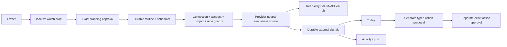
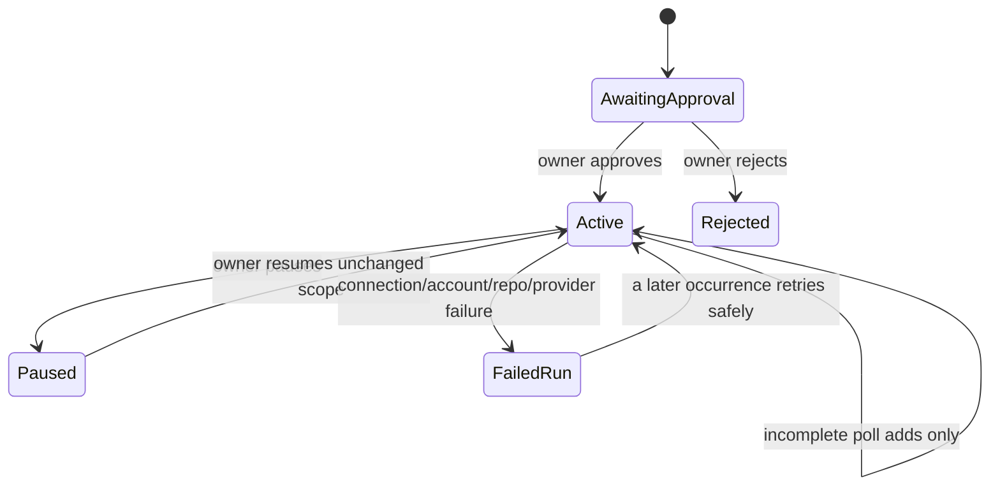

# ADR-0046: Project external signals through approved standing watches

**Status:** Accepted
**Date:** 5 September 2026

## Context

Vera can act when the owner asks, but a Jarvis-like assistant must also notice
important changes without being prompted. GitHub is the first connected
external service, and review requests, assignments, mentions, and failed pull
request checks are useful signals. Polling those APIs simply because a GitHub
host session exists would bypass Vera's owner-governed connection and approval
model. Giving a watch the same authority as issue mutation would be worse: the
ability to observe must never become permission to act.

External state can remain active across many polls, disappear when resolved,
reappear, or be returned in a truncated provider page. Vera needs stable
deduplication, restart recovery, and a fail-closed rule for incomplete
observations.

## Decision

An external watch is a new `integration_awareness` action of the existing
durable routine lifecycle. Creating one produces an inactive draft. A separate
owner approval freezes:

- the integration and connection IDs;
- the non-secret provider account identity;
- the registered project ID and display name;
- the credential-free GitHub repository identity;
- a closed set of signal categories; and
- an interval from 5 minutes to 24 hours.

Its authority permits recurring external reads and explicitly prohibits
external writes and self-modification. Pause immediately prevents new runs.
Resume restores only the unchanged approved effect. Any scope change requires
a new approval-bearing routine.

The routine worker continues to provide occurrence identity, leases,
restart-safe materialization, and run history. It calls a provider-neutral
`ExternalAwarenessSource`; the first adapter uses the authenticated `gh`
session to read GitHub. Before every poll, application and adapter code verify
the active connection, frozen account, current registered project origin, and
repository identity. Account or repository drift fails the run before signal
reconciliation.

Provider observations become `ExternalSignal` resources in a separate durable
store. Their identity is deterministic from owner, watch, provider, and
provider key. Repeated observations are no-ops; material changes advance the
signal generation; signals absent from a complete poll become resolved. An
incomplete or truncated poll may add observations but must not resolve absent
signals.

Application code validates the complete provider batch before writing any of
it. The batch is rejected if it exceeds 300 observations, repeats a provider
key, includes an unapproved category, or contains a URL outside the frozen
HTTPS repository boundary.

Active signals are authoritative inputs to Today. Signal generations are also
projected into Vera's Activity feed and existing device-push outbox. Opening a
signal uses its validated canonical HTTPS provider URL. These are projections:
neither Today, Activity, nor push becomes a second source of truth.

Any later action—commenting, closing, repairing, merging, or changing provider
state—must travel through its own typed capability and exact approval.
Observation authority is never inherited by an action.

## Rationale

Reusing routines avoids a competing scheduler while preserving the distinction
between a standing instruction and each occurrence. A provider-neutral source
and signal domain keep GitHub transport details out of application, attention,
notification, client, and frontend contracts. Deterministic identities make a
poll safe to repeat after partial failure. Treating completeness as evidence
prevents a provider page limit from falsely declaring work resolved.

## Consequences

- Routine schedules support bounded intervals in addition to local daily
  schedules.
- MongoDB gains `external_signals`; memory storage preserves test and local
  development parity.
- GitHub awareness is available only when the curated `gh` connector is
  enabled and the owner has an active connection. Enabling that connector does
  not enable the separately configured work-item writer.
- External reads can disclose the approved repository identity and retrieve
  work-item metadata, but do not authorize external writes.
- Today, Activity, and push surface the same signal without duplicating
  authority or provider polling.
- Failed polls are durable routine-run failures. Already stored observations
  remain deduplicated and a later occurrence can safely reconcile them.
- The initial adapter reads at most 100 unread participating notifications and
  200 open pull requests per poll; reaching either cap marks the poll incomplete
  and suppresses absence-based resolution.

## Alternatives considered

### Add a second watch scheduler

Rejected because routines already own approved schedules, leases, recovery,
pause/resume, and run history.

### Poll whenever a connection exists

Rejected because connection authority says Vera may use an account; it does
not define which repository, data, frequency, or standing purpose the owner
approved.

### Turn every GitHub notification directly into a task

Rejected because external observations are not owner requests. Signals belong
in attention and activity first; the owner or a future separately approved
policy may convert one into work.

### Let a watch auto-fix failed checks

Rejected because read authority cannot imply code changes, publication,
review repair, or merge authority.

### Resolve anything absent from the latest page

Rejected because pagination, provider limits, and partial failures can make an
observation incomplete. Resolution requires positive evidence that the
requested scope was completely enumerated.

## Follow-up

- Add provider webhooks as another ingestion adapter when deployment has a
  stable authenticated callback boundary; keep the same signal contract.
- Add per-signal acknowledgement only when Activity needs a state independent
  of Today dispositions.
- Generalize repository providers when a second real integration proves the
  shared semantics.
