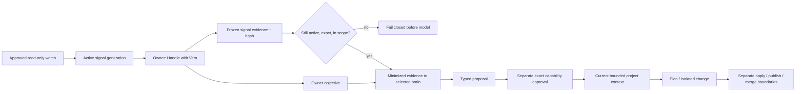

# ADR-0047: Convert external signals into owner-directed work

**Status:** Accepted
**Date:** 5 September 2026

## Context

Approved watches let Vera notice GitHub work, but observation alone does not
make an assistant useful. The owner needs a direct way to turn one signal into
reasoning and, where appropriate, separately approved action. The transition
must not reinterpret provider text as an owner request, inherit write authority
from the watch, or lose the identity of the signal generation that initiated
the work.

## Decision

`POST /v1/external-signals/{id}/triage` creates an idempotent, project-scoped
conversation and task for one active signal. The API and universal frontend
call this “Handle with Vera.” A retry with the same owner key returns the same
conversation and task.

The owner instruction and provider evidence remain separate. Application code
creates a category-specific default objective, or preserves the owner's
explicit objective. It stores the latest active `ExternalSignal` generation in
an immutable context bundle with principal, project, version, character total,
and SHA-256 integrity metadata. Immediately before orchestration-model
disclosure, Vera reloads durable signal state and verifies every identity,
field, total, hash, active status, generation, and project scope. Missing,
changed, resolved, or tampered evidence fails the run closed.

The model receives only category, title, summary, canonical URL, occurrence
time, and credential-free repository identity. Internal signal, routine,
connection, project, hash, and limit metadata remain local. The system prompt
labels the signal as untrusted third-party evidence. Signal text cannot grant
authority or override the current owner request.

The resulting task uses Vera's ordinary lifecycle. A failed-check objective may
therefore propose a planning and software-change goal, but every capability
step receives its own exact approval and current bounded project context.
Application, publication, provider mutation, and merge remain separate
approval and policy boundaries. The watch grants none of them.

Today joins the latest task whose frozen source is the displayed signal. The
same card then changes from “Handle with Vera” to “Continue with Vera,” opening
the durable conversation rather than creating hidden duplicate work. “View
source” remains a separate canonical HTTPS navigation.

## Consequences

- External signals can initiate useful work without becoming instructions.
- Tasks durably retain the exact source signal ID and generation, and expose a
  link back to that signal.
- Signal changes between the tap and model execution intentionally require a
  fresh triage instead of reasoning over stale evidence.
- Third-party model profiles receive the minimized signal fields because the
  owner explicitly initiated triage through the configured brain; no ambient
  watch data is sent to a model merely by polling.
- The first implementation does not automatically mutate the existing pull
  request or merge it. Existing effect lifecycles remain authoritative.

## Alternatives considered

### Put the provider title and summary into the owner message

Rejected because it collapses untrusted provider data into the highest-trust
request channel and makes prompt-injection provenance impossible to enforce.

### Let failed checks start repairs automatically

Rejected because observation authority is read-only and cannot imply code,
publication, or GitHub write authority.

### Copy signal handling state into the signal aggregate

Rejected because task state would become duplicated and eventually stale.
Today derives the link from the authoritative task aggregate instead.
