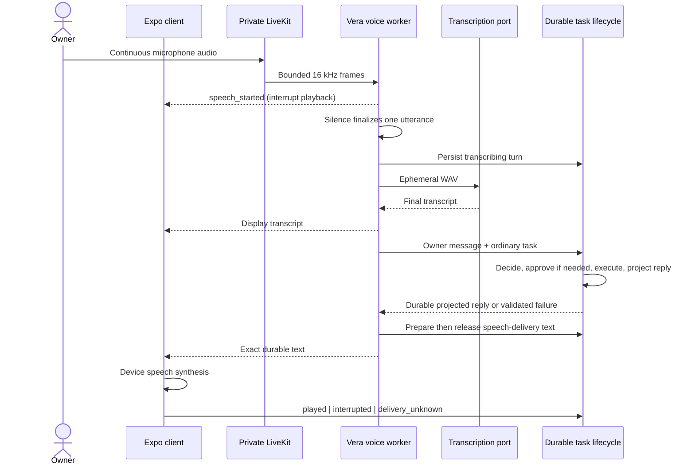

# ADR-0048: Conduct private live conversations through a durable voice-session adapter

**Status:** Accepted

**Date:** 5 September 2026

**Complements:** [ADR-0030](0030-transcribe-owner-controlled-recordings-through-a-provider-neutral-boundary.md)

**Extends:** [ADR-0016](0016-freeze-bounded-conversation-context-and-durably-project-replies.md)

## Context

ADR-0030 intentionally behaves like a voice note: the owner starts and stops a
recording, reviews its transcript, and submits it. That is the right contract
for dictation, but it is not a conversation. A Jarvis-like interface also needs
an explicit mode in which the microphone stays open, natural pauses are
accepted, Vera detects completed turns, and the owner can interrupt speech.

Voice must not create a privileged route around Vera's existing controls. A
spoken request can be misheard and a speaker cannot prove who spoke. Finalized
speech therefore remains ordinary untrusted owner input. Exact approvals,
capability authority, project selection, task recovery, and durable
conversation history remain owned by the existing application boundaries.

The Mac Mini has a finite unified-memory budget and the default deployment is
owner-controlled. The first production-shaped increment should provide useful
hands-free turn-taking without adding a second conversational model, a hosted
realtime dependency, or a server-side speech-synthesis model.

## Decision

### Live mode is explicit and additive

The frontend presents **Start live conversation** separately from the existing
record-and-review microphone. Starting it creates a short-lived session bound
to one principal, conversation, and optional project. Ending it, changing the
conversation or project, exceeding the 30-minute lifetime, losing transport
beyond the reconnect grace period, or encountering an unrecoverable transport
error makes the session terminal. Terminal sessions never reopen.

Only one starting, active, or reconnecting session may exist per principal. A
MongoDB partial unique index rejects concurrent creation races even if two API
processes reach the database; the memory adapter enforces the same contract.
Session creation is idempotent and a key reused with different input conflicts.
An explicit `takeover` request ends the previous session before creating the
replacement.

V1 deliberately operates one authoritative API process. Realtime session
ownership is process-local, so active-active API serving is unsupported until
Vera introduces a distributed runtime lease and remote transport control.
Starting another API process against the same production database is therefore
an operator error, not a supported failover mechanism.

### LiveKit transports audio; it is not Vera's brain

V1 uses a self-hosted LiveKit server. The server creates a two-participant room
and issues a short-lived owner token scoped to that exact room. The phone may
publish microphone audio and data but may not subscribe to media. The Vera
worker may subscribe and publish control data. Signing secrets remain on the
server and are never returned through the public configuration or logs.

LiveKit listens only on loopback and the Mac Mini's Tailscale address. Tailscale
Serve provides private TLS WebSocket signaling at `/livekit`; ICE advertises
only the tailnet address. The helper never binds an ordinary LAN address and
does not enable Funnel or a hosted relay. All permitted tailnet devices are
trusted equally until Vera adopts application-layer identity.

LiveKit and its React Native WebRTC modules require a custom Expo development
or preview build. Expo Go remains useful for the rest of Vera but cannot run
Live mode.

### Silero finalizes bounded utterances

The worker converts the owner's subscribed audio track to 16 kHz mono frames
and feeds a local Silero VAD stream. Speech start immediately interrupts device
playback. Speech end is declared after 2.5 seconds of silence by default; an
utterance is capped at 90 seconds. The session is capped at 100 turns and 30
minutes. These values are configuration, but always remain finite.

Frames and unfinished speech are bounded in memory. Vera does not write raw
audio or partial speech to MongoDB, Redis, artifacts, task events, or logs.
Silero performs endpointing only; it does not infer intent or grant authority.

V1 deliberately does not stream partial transcription or model tokens. Once
Silero finalizes an utterance, the worker encodes its buffered PCM as WAV and
uses the existing provider-neutral transcription boundary. This gives natural
hands-free turns while preserving the proven whole-utterance transcription and
durable reply contracts. Streaming remains a later latency optimization, not a
second task path.

### Every finalized turn is an ordinary durable Vera task

Before transcription begins, Vera appends a versioned turn record to the voice
session. A successful final transcript is appended exactly once as an owner
conversation message, submitted through the existing `TaskLifecycle`, and
attached to that message. The normal model decision, approval, capability,
budget, event, recovery, and conversation-reply projection rules apply without
voice-specific authority.



### Device synthesis speaks only durable text

The worker follows the submitted task. Approval prompts are fixed application
text and the full approval card remains authoritative on screen. Terminal
speech uses the already projected durable conversation reply or validated
failure. The client speaks that text with the operating system's synthesizer,
avoiding another resident model on the Mac Mini.

Before sending text to the client, Vera persists a `SpeechDelivery` in
`prepared` state and then records `released`. The client reports one of:

```text
prepared -> released -> played
                    -> interrupted
                    -> delivery_unknown
```

The acknowledgement describes application-observed playback, not proof of the
last word a person heard. Owner speech during playback stops synthesis and
settles the delivery as interrupted. Released but unacknowledged text becomes
`delivery_unknown` on session termination or API recovery and is never replayed
automatically.

Interruption stops speech output, not consequential work already submitted.
Cancellation still uses the explicit task control. A spoken “yes” never grants
an approval.

### MongoDB is authority; live media is disposable

The voice-session aggregate records its version, lifecycle, finalized turns,
task identities, and speech-delivery states. MongoDB compare-and-swap protects
every transition. Redis is not required for correctness and LiveKit room state
is disposable.

On startup, the single authoritative API process marks every surviving
starting/active/reconnecting session failed. Live-voice persistence and its
indexes are initialized only when the feature is enabled. When live voice is
later re-enabled, that same recovery closes any session left by the previous
enabled process.
Released but unacknowledged delivery becomes unknown. Already submitted tasks
continue through their normal durable worker and reply projection, so recovery
does not duplicate an action. The owner starts a new live session rather than
pretending the old realtime connection survived.

## Consequences

- Vera now supports genuine hands-free, multi-turn conversation and barge-in,
  while retaining the deliberate voice-note mode.
- End-to-reply latency still includes endpoint silence, whole-utterance STT,
  task inference, and full reply projection. We accept that cost in V1 to keep
  one authority path and measure before introducing streaming complexity.
- LiveKit, Silero, WebRTC native modules, and a custom Expo build add operational
  and supply-chain surface. Live mode is off unless explicitly configured.
- The root `adm-zip` override selects the patched archive release used through
  Silero's ONNX dependency, while the `sharp` override deduplicates LiveKit
  Agents with Vera's existing image runtime. Dependency upgrades must recheck
  whether those overrides are still necessary.
- Device TTS quality varies by platform, but it consumes no Mac model memory
  and keeps source text identical to the durable response.
- Because the current perimeter authenticates the tailnet rather than a person,
  no voice transcript can approve a consequential action.

## Alternatives considered

- **Replace the existing recorder:** rejected; dictation needs owner-controlled
  stopping and transcript review.
- **Browser speech recognition with automatic restart:** rejected after device
  testing showed duplicated text, audible start/stop churn, and browser-owned
  silence timeouts.
- **Hosted speech-to-speech:** deferred; it adds recurring cost and a new data
  boundary. A future adapter may support it explicitly.
- **A second “fast” conversational model:** deferred; it competes with the task
  model for memory and risks creating a second routing authority.
- **Streaming tokens before durable reply projection:** deferred; useful for
  latency, but it requires a more granular delivery journal and crash contract.
- **Voice approvals:** rejected; transcription is input, not attributable
  authorization.

## Verification

Acceptance requires automated coverage of configuration boundaries, session
idempotency and single-active-session enforcement, turn-to-task exactness,
delivery acknowledgement and restart ambiguity, transport event validation,
and raw-audio non-persistence. Physical-device verification must additionally
cover a long thinking pause, automatic endpointing, multiple turns without
touching the microphone, barge-in, explicit Stop, private Tailscale signaling,
and continued availability of record-and-review mode.
