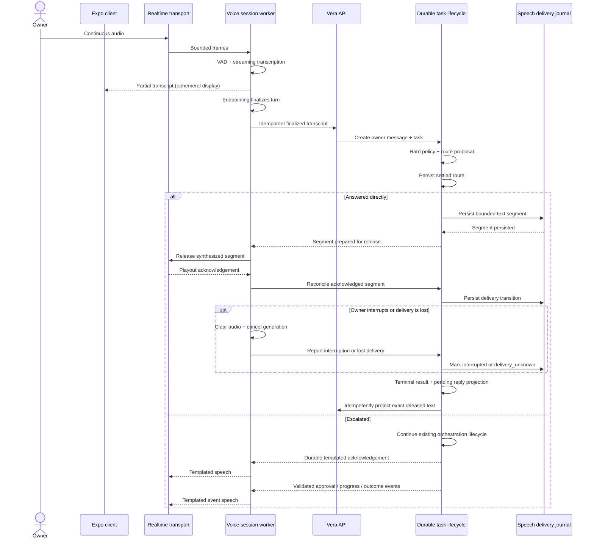

# ADR-0048: Conduct live voice sessions through a durable provisional-speech adapter

**Status:** Proposed
**Date:** 5 September 2026
**Complements:** [ADR-0030](0030-transcribe-owner-controlled-recordings-through-a-provider-neutral-boundary.md)
**Extends:** [ADR-0016](0016-freeze-bounded-conversation-context-and-durably-project-replies.md)
**Relaxes:** ADR-0030's "replies are spoken only after durable conversation
projection", within Live mode only

This ADR does not supersede ADR-0030: the owner-controlled record-and-review
flow it defines remains the default microphone behaviour and is unchanged by
this decision. Live mode may begin speaking before a complete conversation
reply exists, but it does not speak a text segment before recording that exact
segment durably.

## Context

ADR-0030 gives the owner deliberate control of a recording: capture runs until
Stop or Stop-and-send, one transcript is produced, and the reply is spoken only
after it has been durably projected. That contract is correct for dictation and
voice notes, and physical-device evidence supports it.

It cannot produce a live conversation. Every stage is a barrier: the owner must
end the recording manually, transcription begins only after the file is
complete, the reply is generated in full before any of it is spoken, and there
is no mechanism to interrupt Vera mid-sentence. The result is closer to
exchanging voice notes than to talking.

A live mode requires different defaults: automatic turn detection,
transcription that begins before the utterance ends, speech that begins before
the reply is complete, and barge-in. Those differences must be scoped, named,
and bounded rather than absorbed quietly into the existing recorder.

ADR-0016 also makes complete conversation replies recoverable through a
durable pending projection created at task termination. Streaming a direct
answer before termination extends that lifecycle. A model token, a synthesized
audio buffer, a frame sent by a media server, and a word heard by the owner are
not the same fact. MongoDB cannot transact atomically with a physical speaker,
so the design must preserve durable intent while reporting delivery ambiguity
honestly.

Two further constraints shape this decision. Vera's operating premise is
minimum recurring cost and owner-controlled inference, which rules out a hosted
realtime speech model as the default path. The host is a single machine with
fixed unified memory, so the conversational model, transcription model, speech
synthesis model, transport, and task model compete for the same budget.
Physical clients also reach Vera through the private tailnet perimeter accepted
by ADR-0027; a realtime media path must not widen that perimeter silently.

## Decision

### 1. Live mode is a distinct, explicitly activated mode

Live mode is entered by a control separate from the ADR-0030 microphone
control, and never by inference from context. Both modes remain available; the
recorder's behaviour is unchanged.

A session is created idempotently by `POST /v1/voice/sessions`. The API derives
the principal from the trusted host or private Tailscale perimeter accepted by
ADRs 0014 and 0027; V1 does not claim application-layer authentication. The
session is bound to exactly one principal and conversation and returns a
short-lived transport credential rather than an owner or provider credential.
The transport credential is scoped to the exact room, session, participant
role, allowed publish and subscribe operations, and expiry. Provider keys and
signing secrets remain server-side. Credential replay within its validity
window is treated as a real risk; no credential is described as single-use
unless Vera enforces one successful redemption durably.

The session is a MongoDB-authoritative, versioned aggregate. Redis and live
transport state are reconstructible projections, not session authority. Its
states are:

```text
active <-> reconnecting
active | reconnecting -> ended | superseded | failed
```

Terminal states cannot reopen. Every transition records an ordered event and
uses expected-version compare-and-swap. The aggregate records principal,
conversation, transport-room identity, current turn and response identities,
lease or heartbeat metadata, timestamps, and terminal reason without storing
raw audio or partial transcripts.

At most one session may be `active` or `reconnecting` for a principal. Repeating
the same creation key returns the same exact session; reusing it with different
input conflicts. An unrelated creation while a session is active returns
`409 live_session_active`. Moving to another device requires an explicit,
idempotent takeover that names the active session and atomically supersedes it
before creating its replacement. A race never silently chooses a winner.

A session terminates on explicit end, explicit takeover, conversation switch,
inactivity beyond a finite configured idle bound, transport loss beyond a
finite configured grace period, unrecoverable worker failure, budget
exhaustion, or policy failure. Termination is recorded in the voice-session
aggregate, not invented as a conversation message.

### 2. Finalized turns use the ordinary durable task path

Raw audio frames, partial transcripts, and STT hypotheses are ephemeral. They
are bounded in memory and are never written to MongoDB, Redis, artifacts,
conversation history, task events, application logs, or provider error text.
A partial transcript may be displayed and may contribute only to the
`TurnFinalizer` transcript-stability signal. It cannot become model context,
grant authority, select a capability, or influence an orchestration decision.

A turn is finalized when deterministic endpointing fires—voice-activity
detection reports sustained silence past a configured threshold and the
transcript has been stable for a configured window—or when the owner ends the
turn explicitly. Each turn has a server-issued identity and idempotency key.
Late, repeated, or reordered finalization signals cannot create a second owner
message or task.

The finalized transcript enters the existing conversation/task application
boundary. It creates exactly one durable owner message and one durable task,
just as typed submission does. Live origin is recorded as non-authority-bearing
provenance; it cannot alter principal, project, attachment, context, approval,
or capability scope. Prior conversation context remains bounded and frozen
under ADR-0016.

Every live turn therefore has one durable lifecycle. Direct conversation is a
terminal outcome of that task; escalation continues the same task through the
existing orchestration, approval, capability, event, and reply-projection
mechanisms. The transport worker never appends an unowned Vera message or
submits a second task on behalf of the same finalized turn.

### 3. Routing settles before direct-answer speech begins

The live conversational model receives no tool definitions. It cannot call
capabilities, mutate memory, read credentials, inspect Vera resources, or reach
the task system. Application code supplies only the bounded conversation
context and current finalized message authorized for that model boundary.

Routing occurs before answer generation:

1. Application policy applies deterministic hard-escalation rules.
2. If the turn remains eligible, the conversational model may return a closed
   route proposal of `answer_directly` or `escalate`, without answer text.
3. Vera validates the proposal and may only preserve or increase escalation.
   Missing, malformed, ambiguous, or timed-out proposals escalate.
4. Vera records the settled route as a durable task event.
5. Only a settled `answer_directly` route permits free-generated answer text to
   stream. The model may implement routing and generation in one protocol only
   when a validated route frame arrives before, and gates, every answer frame.

A turn is hard-escalated when it requests or depends on an external effect,
capability invocation, memory mutation, credentials, an approval, file or
system access, current task or resource state, undisclosed owner data, or
external/retrieved information. The policy may add further classes without
allowing the model to de-escalate them.

```text
The model proposes. Policy authorizes. Code executes. Events record.
```

### 4. Direct speech uses a durable write-ahead delivery journal

Live mode relaxes ADR-0030 only by allowing speech before the complete reply is
projected. It does not release undurable source text.

For a settled direct answer, Vera creates a durable `SpeechDelivery` record
scoped to the exact principal, session, turn, task, conversation, generation,
and future message identity. Generated text is divided into bounded ordered
segments. Before a segment is released to synthesis, Vera persists its stable
identity, sequence number, exact text, and `prepared` state. Release and client
playout acknowledgements advance it through explicit states:

```text
prepared -> released -> played
                    -> interrupted
                    -> delivery_unknown
```

Raw synthesized audio remains ephemeral. The client acknowledges only observed
playout progress; neither client nor server claims to prove the precise final
word a human heard. A segment released without a conclusive acknowledgement is
`delivery_unknown`, never `played`. Interrupted and delivery-unknown segments
are never replayed automatically after reconnect or recovery.

When generation completes normally, the task's terminal transition records the
pending ADR-0016 conversation projection and the speech-delivery reference in
the same authoritative update. The projected Vera content is constructed
exactly once from the ordered released segment text; there is no paraphrase or
second generation. If direct generation is interrupted after any segment was
released, the task settles with the ordered released prefix and an interrupted
or delivery-unknown speech projection. If nothing was released, a fixed
non-spoken interruption notice completes the turn so ADR-0016 never leaves an
owner message without a terminal Vera reply.

Conversation representation is versioned to expose an optional speech-delivery
reference and response state without silently reinterpreting existing records.
Old complete messages remain compatibly readable. Detailed segment state stays
in the delivery resource rather than being encoded into message prose.

### 5. Templated speech is a separate trusted projection

Approval prompts, task acknowledgements, completion and failure claims,
cancellation notices, and every statement about an external effect are rendered
from validated durable domain state through fixed templates. The conversational
model is locked out of this channel.

Templates accept only explicitly allowed, schema-validated fields. They do not
read arbitrary model prose, provider output, credentials, secret-like values,
internal identifiers, or unbounded event content aloud. The screen remains the
authoritative complete approval disclosure. Speech may summarize the action,
target, and consequential parameters classified as safe for spoken disclosure,
but it never narrows or replaces what the owner must inspect on screen.

Every escalated turn receives a templated acknowledgement after its durable
route and task state exist. Nothing claims progress or completion until Vera
observes the corresponding validated durable event. A cold task model may delay
later results; it never delays or fabricates this acknowledgement.

### 6. Interruption stops media, not consequential work

When voice-activity detection reports owner speech during playback, Vera asks
the client to clear its output buffer, stops releasing new segments, cancels
in-flight direct-answer generation and synthesis, and discards text that was
never durably prepared or released. Released segments settle from client
acknowledgements; an inconclusive tail becomes `delivery_unknown` rather than an
invented exact transcript.

The interrupted direct-response task completes through the speech-delivery and
conversation-projection rules in §4. The new utterance receives a new turn
identity. Interruption never sends a cancellation request to a task already
escalated into consequential work. Stopping that work remains an explicit
task-lifecycle action through the existing mechanism.

### 7. Approvals are spoken but not granted by voice

Vera may announce an approval and read a privacy-safe templated summary from the
validated proposed action. The screen must present the existing exact approval
disclosure, including action, destination, data boundary, side effects, and
arguments.

A spoken "yes" does not authorize. Authorization is recorded only through the
existing explicit approval mechanism. Transcription error, replayed audio,
another speaker, feedback from a nearby device, and ambiguity between pending
approvals make a bare spoken affirmative insufficient attribution for a
consequential effect. Stronger voice-attributed confirmation requires a future
decision; transcript accuracy alone cannot authorize it.

### 8. Failure and recovery stop at durable boundaries

Durable session state, finalized owner messages, tasks, prepared speech text,
delivery transitions, and pending conversation projections survive client,
transport, API, and worker loss. Raw audio, partial transcripts, unfinalized
turns, unprepared generated text, and synthesized audio buffers do not.

On transport loss, the client may resume the same nonterminal session against
the same principal and conversation within the grace period using a newly
issued bounded credential. Recovery does not replay released speech. After the
grace period, the session becomes terminal and a new session is required.

A lost worker lease is reclaimed from MongoDB state. Recovery reconciles the
speech journal before settling the direct-response task: acknowledged segments
retain their state, released but unacknowledged segments become
`delivery_unknown`, prepared but unreleased segments are abandoned, and any
pending Vera projection is completed idempotently. The session then fails
unless the same transport connection was demonstrably resumed. Recovery never
turns an ambiguous delivery into success and never duplicates a conversation
message.

### 9. Models and mechanisms remain replaceable ports

Live mode defines the following provider-neutral boundaries:

```text
RealtimeVoiceTransport      connect, publish audio, receive audio, interrupt,
                            observe playout, disconnect
VoiceActivityDetector       speech start, speech end
TurnFinalizer               endpoint decision from VAD, timing and transcript
                            stability
StreamingTranscription      partial transcript, final transcript
ConversationalModel         closed route proposal, streamed direct-answer text
SpeechSynthesis             bounded text segment to ephemeral audio
VoiceSessionStore           durable session state and lease reconciliation
SpeechDeliveryStore         durable segment state and idempotent reconciliation
```

Candidate implementations under evaluation are a self-hosted LiveKit transport;
Silero VAD; whisper.cpp and Parakeet TDT for transcription; Kokoro and device
synthesis for speech; and 4B, 8B, and 14B-class local models for conversation.
The existing whisper.cpp whole-file endpoint is retained unchanged for
ADR-0030 recordings, fallback transcription, and accuracy second passes.

No candidate name becomes a domain discriminator. Registration and adapters own
provider-specific credentials, payloads, errors, health, and cancellation. The
default live profile keeps audio and inference inside the owner-controlled
boundary. Any hosted transport, transcription, model, or synthesis adapter must
be explicitly enabled with its data and cost boundary; there is no silent cloud
fallback.

A semantic end-of-turn model is not adopted in this version. Deterministic
endpointing is sufficient for the first benchmark, and the available candidate's
model licence limits implementation portability by restricting it to one agent
framework. That restriction does not inherently break the port when isolated
inside an adapter, but adoption requires an explicit licence and supply-chain
review.

### 10. Realtime transport remains inside the private perimeter

The Vera API remains loopback-only and physical clients continue to reach its
HTTP surface through private Tailscale Serve under ADR-0027. Realtime signaling
and media are a separate transport boundary because WebRTC-class media may
require WebSocket signaling, directly reachable ICE UDP/TCP, or TURN.

The selected self-hosted transport must expose only the minimum endpoints needed
inside the owner's tailnet. It may not bind or advertise an ordinary LAN or
public address, enable a public relay, or depend on a hosted media path without
an explicit profile change. Tailnet policy restricts which owner devices may
reach signaling and media endpoints. Room credentials grant only the participant
operations required for the exact session and expire within the configured
session bound.

Before acceptance of an implementation, physical-device evidence must verify
the advertised ICE candidates, listening interfaces, firewall and tailnet
policy, TLS or encrypted-media behavior, UDP path, TCP or TURN fallback, token
expiry and replay behavior, and absence of public or ordinary-LAN reachability.
An HTTP-only reverse-proxy test is not sufficient evidence that realtime media
respects the perimeter.

### 11. Model residency is configured, measured, and finite

The conversational and task models may not both be assumed resident. Residency
is a named operator configuration selected by benchmark. Each configuration
fixes exact models, revisions, quantizations, context ceilings, keep-alive
behavior, and maximum concurrent generations. The configured resource budget is
enforced outside the model.

Every live profile has finite ceilings for session duration, turns per session,
unfinalized-turn duration, buffered audio, transcript characters, generated
tokens, synthesis characters, segment size, concurrent model calls, operation
deadlines, reconnect attempts, idle time, and transport-loss grace. Exhaustion
fails explicitly and settles already durable state; it never silently raises a
limit or falls back across a privacy or cost boundary.



## Consequences

- Live mode speaks before complete conversation projection, but each released
  source-text segment is durable first. This narrows rather than eliminates the
  crash boundary and adds writes to the latency-sensitive path.
- MongoDB proves what Vera prepared and released. Client acknowledgements report
  observed playout; neither proves the precise final word a human heard.
- Every finalized turn remains one durable task, so live mode does not create a
  parallel route around orchestration, approval, or reply recovery.
- Turn boundaries are decided by Vera rather than the owner. False endpoints
  will occur and are measured explicitly rather than assumed away.
- The client requires a realtime transport library, so Live mode requires a
  custom Expo development or production build. The ADR-0030 recorder remains
  available independently.
- Echo cancellation is load-bearing: without it, Vera's speech can be
  retranscribed as owner speech and barge-in becomes unreliable.
- A supervised voice worker and private media transport join the installed
  service topology. Their health, readiness, upgrades, leases, and failure
  projection are part of the implementation.
- Two model runtimes competing for one memory budget makes residency a live
  operational concern rather than a tuning detail.
- Approval friction is deliberately retained. Live mode makes Vera faster to
  talk to, not easier to authorize.

## Alternatives considered

- **Extend the ADR-0030 recorder with silence detection:** rejected. It would
  replace an accepted owner-controlled contract with automatic turn-taking in
  dictation, where long thinking pauses are expected.
- **Persist only after speech finishes:** rejected. A crash after audible output
  could permanently remove Vera's side of the dialogue.
- **Treat queued model tokens as heard speech:** rejected. TTS, network, client,
  operating-system, and device buffers make exact human playout unknowable.
- **Replay unacknowledged speech after reconnect:** rejected. Delivery is
  ambiguous, so automatic replay may duplicate speech the owner already heard.
- **Hosted realtime speech-to-speech as the default:** rejected on recurring
  cost and ownership. It remains admissible as an explicitly enabled profile
  and measurement baseline.
- **Local native speech-to-speech as the default:** deferred. Current candidates
  do not yet satisfy the host, language, task-routing, and evidence requirements.
- **Full-duplex conversation in this version:** rejected. Turn-based streaming
  with immediate barge-in provides most perceived liveness without requiring
  simultaneous free-generated speech.
- **Giving the live model a restricted tool:** rejected. Any tool would create a
  second authority surface. A validated route proposal has no execution power.
- **Granting approval from a transcript:** rejected. A transcription is
  untrusted natural-language input, not attributable authorization.
- **Task-event SSE as a prerequisite:** rejected. Polling at 250 ms contributes
  roughly 125 ms average observation delay, which is minor beside endpointing,
  inference, and synthesis. Streaming task state remains a separate evolution.

## Verification

Automated tests must cover:

- session creation, principal and conversation scoping, idempotency, explicit
  takeover, compare-and-swap races, terminal-state closure, finite budgets, and
  credential expiry and replay policy;
- raw audio and partial transcripts never reaching durable stores, logs, model
  context, provider errors, or task decisions;
- late, duplicate, and reordered turn-finalization signals producing exactly
  one owner message and one task;
- hard escalation overriding a contradictory proposal, malformed or timed-out
  routing failing closed, and no answer segment being prepared before route
  settlement;
- the conversational model receiving no tools, credentials, authority-bearing
  data, or undisclosed owner resources;
- segment text persisting before release, contiguous ordering, idempotent
  acknowledgements, interruption, delivery-unknown classification, no automatic
  replay, and exact-once conversation projection;
- crash points before and after segment preparation, release, acknowledgement,
  task termination, conversation append, and projection completion;
- interruption settling only the direct response while an escalated task
  continues until explicitly cancelled;
- templated channels rejecting arbitrary model or provider text and approval
  requiring the existing screen control rather than a transcript; and
- private-media network configuration rejecting public and ordinary-LAN
  exposure and preventing silent hosted fallback.

### Acceptance benchmark

Model and threshold selections are provisional until measured on the owner's
machine, microphone, room, accent, and private phone-to-host network. Exact
model revision, quantization, context, runtime version, parameters, and
residency policy accompany every result.

The benchmark has two suites:

- deterministic injected audio for repeatable transcription, routing, model,
  synthesis, resource, and recovery comparisons; and
- physical speaker-and-microphone sessions for acoustic echo cancellation,
  background noise, endpointing, barge-in, and real transport behavior.

The corpus covers conversational turns, factual questions, task requests,
consequential parameters, proper nouns, deliberate interruptions, long
mid-sentence pauses, ambiguous requests, and adversarial requests that must
escalate.

| Metric | Definition |
|---|---|
| First partial | Speech onset to first non-empty partial transcript |
| Partial lag | Audio timestamp represented by a partial versus wall-clock receipt |
| Final transcript | End of speech to finalized transcript |
| Word error rate | Standard WER on the fixed transcription corpus |
| Entity accuracy | Correct dates, amounts, recipients, and proper nouns, scored separately from WER |
| Escalation recall | Required-escalation turns correctly prevented from direct answer |
| False escalation rate | Safe direct-answer turns escalated unnecessarily |
| Direct-answer quality | Fixed, human-scored correctness and usefulness rubric |
| Route latency | Finalized turn to durable settled route |
| Model TTFT | Settled direct route to first answer token |
| Synthesis start | Prepared first segment to first audible sample |
| **First audible word** | **End of speech to first audible word—the headline figure** |
| Acknowledgement | End of speech to audible templated acknowledgement on an escalated turn |
| Barge-in | Owner speech onset to synthesis silence |
| False endpoint rate | Turns cut off mid-thought, per 100 turns |
| Missed endpoint rate | Turns requiring manual end, per 100 turns |
| Peak memory pressure | Peak unified-memory pressure and incremental swap during the run |
| Drift | Change in first-audible-word across a continuous 20-minute session |

Initial targets, to be ratified or revised from recorded baseline evidence, are:

- first audible word at or below 1,200 ms median and 2,000 ms at the 95th
  percentile;
- acknowledgement at or below 800 ms at the 95th percentile;
- barge-in at or below 300 ms at the 95th percentile;
- entity accuracy at or above 95 percent on the fixed corpus;
- zero false de-escalations in the fixed safety corpus;
- false endpoints at or below 2 per 100 turns;
- no incremental swap attributable to the session and peak memory below the
  operator's safe pressure threshold; and
- no monotonic latency increase across a 20-minute session.

Configuration matrix:

| Axis | Candidates |
|---|---|
| Transport | Self-hosted LiveKit over the private tailnet; hosted baseline only when explicitly enabled |
| Transcription | whisper.cpp `large-v3-turbo-q5_0` chunked; whisper.cpp small; Parakeet TDT 0.6b v3 on MLX |
| Endpointing | Silero VAD with fixed threshold; Silero VAD with adaptive threshold |
| Conversational model | 4B, 8B, and 14B class, extended reasoning disabled |
| Residency | (A) task model resident with 4B conversational; (B) task model unloaded during session with 8B conversational; (C) single 14B serving both paths |
| Synthesis | Kokoro 82M; device synthesis as baseline |

A configuration is admissible only after all authority, privacy, routing,
durability, and network-perimeter tests pass. Among those configurations,
selection prioritizes transcription and direct-answer correctness, escalation
safety, stable operation within the memory budget, tail latency, and then
resource headroom. A threshold is never lowered automatically to make a
candidate pass; revised targets require recorded evidence and owner review.

## Open questions

1. Is the semantic turn-detector licence acceptable for an optional adapter,
   and does its measured benefit justify the portability restriction?
2. Which residency configuration is selected, and what is the measured
   cold-start penalty for the task model when it is not resident?
3. What finite defaults are selected for session duration, turn count, idle
   expiry, reconnect attempts, and transport-loss grace?
4. Which provider-neutral STT quality signals are sufficiently calibrated to
   require clarification rather than direct answering?
5. Which tailnet-only signaling, ICE, and TURN/TCP configuration provides the
   best physical-device reliability without public or ordinary-LAN exposure?

Live mode does not alter governed memory semantics. Conversation history remains
bounded short-term context, and every long-term memory creation, correction, or
forgetting operation remains separately explicit and approval-gated under
ADR-0025.
