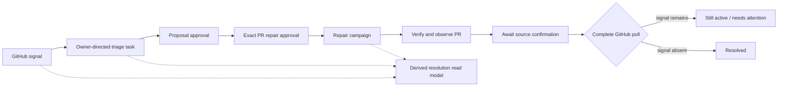

# ADR-0049: Derive signal resolution from authoritative work

**Status:** Accepted
**Date:** 5 September 2026

## Context

ADR-0047 lets the owner turn one observed external signal into an ordinary
conversation task. That made the signal actionable, but it did not give the
owner one reliable answer to “what is Vera doing about this?” A failed-check
signal can span task triage, a proposal approval, an exact pull-request repair
approval, implementation, verification, publication, GitHub observation, and
source reconciliation.

Copying those states into the external-signal aggregate would create a second
orchestration truth. Treating campaign success as signal resolution would also
be incorrect: GitHub may still report the failed check until a later complete
poll, or a new check may fail.

## Decision

Vera exposes a provider-neutral signal-resolution read model at
`GET /v1/external-signals/{id}/resolution`. It derives progress at read time
from three authoritative records:

- the durable external signal and its source-observed generation;
- the newest owner-scoped task linked to that exact signal generation; and
- the development campaign referenced by an explicitly prepared repair.

The read model can report untriaged, triaging, action approval required, exact
repair approval required, repairing, verifying, awaiting source confirmation,
triaged, needs attention, or resolved. These are projections, not a new
workflow aggregate. Today includes the same derived progress on active signal
cards, and the CLI exposes it through `vera signal status <signal-id>`.

For failed-check triage, application policy binds a proposed repair to exactly
one repairable campaign only when all of these frozen identities match:

- selected project ID;
- GitHub repository owner and name; and
- canonical pull-request URL.

If a signal context is present but its category or identity does not match,
repair selection fails closed. Conversational wording cannot redirect that
signal to another repairable campaign. The signal identifies the affected PR;
it never approves a mutation. Preparing the repair and approving its exact
head-bound fast-forward remain separate owner decisions under ADR-0041.

Final resolution is source-owned. A successful campaign produces
`awaiting_source_confirmation`; only a later complete awareness poll that no
longer observes the signal may mark it resolved.

## Consequences

- The owner can follow one signal across the existing task and campaign
  lifecycles without inspecting internal IDs or guessing from stale UI state.
- MongoDB records remain authoritative; no migration or duplicated resolution
  state is introduced.
- A model cannot select a different repairable campaign when several exist.
- Resolution may intentionally lag a successful repair until the approved
  watch runs again. That lag is honest evidence, not an orchestration failure.
- Signals resolved independently of Vera still become resolved after complete
  source reconciliation.

## Alternatives considered

### Store workflow status on the external signal

Rejected because task and campaign transitions would need distributed updates
to a duplicate state machine and could drift after crashes or retries.

### Resolve immediately when a campaign succeeds

Rejected because local or campaign evidence cannot prove that the external
provider stopped reporting the original condition.

### Let the model choose among repairable campaigns

Rejected because third-party signal text and probabilistic selection are not a
safe identity boundary for a branch-changing operation.
