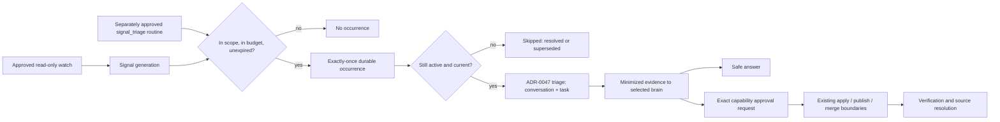

# ADR-0050: Act on external signals under event-triggered standing authority

**Status:** Accepted
**Date:** 5 September 2026
**Extends:** [ADR-0046](0046-project-external-signals-through-approved-standing-watches.md)
**Extends:** [ADR-0047](0047-convert-external-signals-into-owner-directed-work.md)
**Extends:** [ADR-0049](0049-derive-signal-resolution-from-authoritative-work.md)
**Constrained by:** [ADR-0003](0003-models-propose-code-controls-effects.md),
[ADR-0013](0013-dispatch-durable-work-with-mongodb-leases.md)

This ADR does not supersede ADR-0047. The owner-initiated
`POST /v1/external-signals/{id}/triage` path is unchanged and remains the
default. This decision adds a second, separately approved way to reach the same
lifecycle, and it does not grant any authority that ADR-0047 withheld.

## Context

ADR-0046 gave Vera approved read-only standing watches that project
provider-neutral `ExternalSignal` generations. ADR-0047 let the owner turn one
active signal into a project-scoped conversation and task by tapping "Handle
with Vera". ADR-0041 and ADR-0034 already carry an approved repair through
implementation, publication, and merge, each behind its own approval, and
ADR-0049 makes the signal card report resolution only after a complete
observation confirms the original signal is gone.

The loop is therefore complete except for its beginning. Vera observes, but it
waits. Every occurrence needs the owner to notice a card, decide it matters,
and press a button before Vera does any thinking at all. The owner is the
scheduler, which is exactly the work an assistant should absorb.

The naive fix is to make the GitHub watch start work by itself. ADR-0047
rejected that, correctly: observation authority is read-only, a watch approval
is not a work approval, and widening one approval to mean another is the
failure mode this repository exists to avoid. The GitHub-specific version of
the fix is also wrong for a second reason — email, machine alerts, document
changes, and task systems will all eventually produce signals, and none of them
should require changes to the orchestration core to become actionable.

Two properties are missing and both are generic:

1. A routine can currently only be triggered by civil time. There is no way to
   express "when this kind of thing happens" as approvable standing authority.
2. There is no durable, exactly-once occurrence for an event. A scheduled
   routine has `nextRunAt`; an event has no clock to materialize from, so
   restart recovery, idempotency, and budget enforcement have nothing to bind
   to.

## Decision

### 1. A routine is triggered, not scheduled

`Routine.approval.effect.schedule` is replaced by
`Routine.approval.effect.trigger`, a closed discriminated union:

```text
{ kind: 'schedule',        schedule }
{ kind: 'external_signal', integrationId, project, categories }
```

`Routine` and `RoutineRun` move to `schemaVersion: 2`. Stored version 1
documents are upgraded by an explicit compatibility parser that rewrites
`schedule` into `{ kind: 'schedule', schedule }`; version 1 is never silently
reinterpreted and is never written again.

The trigger is part of the frozen approved effect. Changing a trigger requires
a new routine and a new approval; a trigger is never mutated in place.

### 2. Event-triggered standing authority is approved in exact terms

A `signal_triage` routine freezes, before approval:

- the exact trigger: integration, frozen project identity, and the closed set
  of signal categories it may respond to;
- the permitted response, which in this decision is exactly one value —
  `investigate_and_propose`;
- the model disclosure boundary, which is exactly the ADR-0047 minimized
  signal evidence and nothing else;
- a finite budget: occurrences per day and total occurrences;
- an expiry instant, after which the routine stops on its own.

The authority record is explicit and closed:

```text
eventTriggeredExecution: true
readExternalSignals:     true
startTriageConversation: true
modifyExternalService:   false
applyChanges:            false
modifyRoutine:           false
```

A watch approval does not create this authority and cannot be widened into it.
The owner approves a `signal_triage` routine separately, and pausing or
revoking that routine stops future occurrences without touching the watch.

### 3. Each matching signal generation creates exactly one durable occurrence

A signal generation is the pair `(signalId, version)`. The routine worker
materializes occurrences from durable state, never from an in-process event:

```text
find active signal-triggered routines
  -> enforce expiry and budget in code
  -> list active in-scope signals after the compound routine cursor
  -> create one RoutineRun per generation, keyed signal:<id>:<version>
  -> advance the cursor by compare-and-swap
```

The run identity is `routine_run_<sha256(routineId, occurrenceKey)>` and
`createRun` is an insert-if-absent on `(routineId, occurrenceKey)`, so a crash
between any two steps produces the same single run on recovery. The cursor is
an efficiency bound, not the correctness boundary; occurrence identity is.

Budget is counted from durable runs, not from a mutable counter, so a lost race
cannot inflate or deflate it. Exhausting the daily budget defers the occurrence
to the next day. Exhausting the total budget or passing the expiry moves the
routine to the terminal `expired` status with a recorded reason.

### 4. Execution re-verifies, then enters the ordinary ADR-0047 lifecycle

Executing a `signal_triage` run reloads the signal and refuses to proceed on
stale or out-of-scope evidence:

- the signal is no longer active — the run succeeds with outcome `skipped`
  and reason `resolved`;
- the signal has a newer generation — outcome `skipped`, reason `superseded`,
  because that generation has its own occurrence;
- integration, project, or category no longer match the frozen trigger — the
  run fails closed with `routine_signal_scope_changed`.

Otherwise the run calls the same triage service the owner's button calls, with
the deterministic run ID as the idempotency key. From that point nothing is
special: the ADR-0047 context bundle is frozen and hash-verified, only
minimized untrusted evidence reaches the selected brain, and every capability
step, application, publication, merge, and provider mutation keeps its own
exact approval.



### 5. The owner is told, through the surfaces that already exist

An occurrence produces an ordinary task. When that task reaches
`awaiting_approval` the existing attention projection raises an approval item,
Today shows it, and the existing push worker delivers it. No new notification
channel, urgency rule, or push category is introduced, and push payloads stay
privacy-safe pointers.

## Rationale

Putting the trigger on the routine rather than on the GitHub watch keeps the
orchestration core provider-neutral: a future email or machine-alert source
produces `ExternalSignal` generations, and the same `signal_triage` routine
becomes actionable without touching the lifecycle, the worker, or the approval
model.

Reusing `RoutineRun` as the occurrence is what makes exactly-once cheap. Leases,
recovery queries, compare-and-swap transitions, deterministic identity, and
failure classification already exist and are already tested; an event-specific
queue would have to reproduce all of them and would be a second source of
truth for the same fact.

Counting budget from durable runs rather than a counter field means the budget
survives concurrent workers, lost races, and restarts without a reconciliation
path, because there is nothing separate to reconcile.

## Consequences

- Vera can begin work without being asked, only within an exact, expiring,
  budgeted, revocable standing approval the owner granted for that purpose.
- Observation authority still grants nothing. A watch alone never starts work.
- Nothing consequential became automatic. Code changes, application,
  publication, merge, provider mutation, and messaging keep their own
  approvals unchanged.
- `POST /v1/routines` now takes `trigger` instead of `schedule`. This is an
  accepted breaking change to a single-owner V1 surface whose only consumers
  are in this repository; persisted routines are migrated by parser.
- A routine now has a terminal `expired` status that clients must render.
- Duplicate work is structurally impossible per generation, but a signal that
  legitimately changes many times produces many occurrences; the daily budget,
  not the signal source, is the defence.

## Alternatives considered

### Attach a response policy to the GitHub awareness routine

Rejected. It would make the response GitHub-shaped, duplicate the policy in
every future source, and blur an approved read-only watch into an approval to
act.

### Deliver occurrences through an in-process event bus or Redis queue

Rejected. Redis is an expiring reconstructible scratchpad and not an authority;
an in-process bus loses accepted work when the process dies, which the system
invariants forbid.

### Key occurrences by signal ID alone

Rejected. A signal that changes materially — new failing check, new reviewer —
is new evidence and deserves a fresh occurrence. Keying by
`(signalId, version)` makes "one occurrence per generation" the durable
guarantee.

### Let the model decide whether a signal is worth handling

Rejected. Model output is not authorization, and a budget the model can talk
its way past is not a budget. Scope, category, budget, and expiry are enforced
in code before any disclosure occurs.

## Follow-up

- Add the second signal source (machine alerts or email) to prove the trigger
  is genuinely provider-neutral.
- Consider a per-category response policy once a second permitted response
  beyond `investigate_and_propose` exists.
