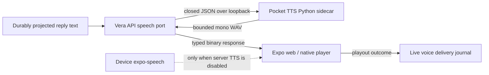

# ADR-0053: Synthesize speech through an owner-controlled provider boundary

**Status:** Accepted
**Date:** 6 September 2026
**Extends:** [ADR-0006](0006-typescript-first-npm-monorepo.md)
**Extends:** [ADR-0048](0048-conduct-live-conversations-through-a-durable-voice-session-adapter.md)
**Supersedes in part:** [ADR-0051](0051-select-device-speech-voices-through-local-preferences.md)

## Context

Operating-system and browser voices made Vera functional but did not give the
assistant a consistent, human-like identity. The catalog differs per device,
often includes novelty voices, and produced visibly different behavior between
web and native clients. Hosted neural speech would improve quality but adds a
recurring charge, credentials, and a third-party disclosure boundary.

Pocket TTS is Python-native while Vera's application and public API are
TypeScript-first. Pulling model-specific Python into the API process would
couple lifecycle, memory failures, dependencies, and future provider changes to
the orchestration runtime.

## Decision

Vera introduces a provider-neutral `SpeechSynthesisProvider` port behind the
API. V1 implements it with an owner-controlled Pocket TTS sidecar and retains
`expo-speech` as an explicit device fallback when server speech is disabled.
The frontend never calls Pocket TTS directly.

The sidecar is a separate `services/pocket-tts` Python project managed by
`uv`, with Python 3.12 selected locally, PEP 621 metadata, and a committed
lockfile. It listens only on loopback. A small Vera-owned versioned HTTP
contract isolates upstream package churn. Requests use a fixed stock-voice
allowlist, bounded text, bounded request bytes, and no unknown fields. Responses
are mono WAV with declared length and model metadata.

`VERA_SPEECH_PROVIDER` selects the adapter independently of orchestration and
transcription providers. `pocket_tts` requires a loopback base URL and one safe
stock voice identifier. API readiness fails closed when the selected sidecar is
unavailable or its advertised contract does not include that voice.

The existing production installer synchronizes the locked Python runtime and
launchd supervises the sidecar before the API. First installation may download
model weights. CI runs only the deterministic sidecar implementation in an
isolated test environment; CI never downloads neural model weights.

Read aloud, voice preview, and live-conversation replies share one frontend
playback adapter. Server synthesis failures are visible and are not silently
re-synthesized on the device because that would hide an operational fault and
change Vera's voice mid-conversation. Device speech remains available when the
API explicitly reports server synthesis disabled.

No reply text, audio output, voice state, or model weights are added to MongoDB,
Redis, task events, or logs. Existing durable `SpeechDelivery` text and client
acknowledgements remain the source of truth for live playout semantics.

## Rationale

This yields a consistent local neural voice without spending LLM GPU/Metal
budget or binding Vera to one engine. The HTTP process boundary contains Python
dependency failures, preserves the TypeScript-first application, and provides
the seam needed for Kokoro, Chatterbox, or a consented cloud provider later.

## Consequences

- The Mac Mini runs one additional supervised CPU service when enabled.
- Startup is slower on first use while weights are downloaded and the model is
  loaded; readiness remains false until loading succeeds.
- Synthesis is currently request/response WAV, so first audio waits for one
  bounded segment. True chunk streaming can be added behind the same port.
- Device rate, pitch, and voice selection apply to fallback speech only; the
  selected Pocket TTS stock voice is server configuration.
- Adding custom voice cloning requires a separate consent, provenance, storage,
  deletion, and sensitive-data decision. It is not accepted by this ADR.

## Alternatives considered

- **Keep device speech as the primary engine:** rejected because its quality and
  identity are inconsistent across Vera clients.
- **Call Pocket TTS directly from Expo:** rejected because model execution
  belongs on the Mac Mini and clients must not depend on provider contracts.
- **Embed Python in the API process:** rejected because it weakens runtime and
  deployment isolation.
- **ElevenLabs first:** deferred as a useful quality benchmark; it introduces
  per-use cost, credentials, availability risk, and third-party disclosure.
- **LiveKit server-side audio tracks immediately:** deferred. LiveKit continues
  to transport realtime owner input; client playback preserves the existing
  journal and acknowledgement flow with less protocol churn.

## Follow-up

- Compare the approved Pocket TTS stock voices on the actual Mac Mini and pick
  Vera's long-term voice by listening, not by name.
- Measure first-byte latency and add streaming transport only if bounded segment
  latency harms conversation.
- Add alternative providers through the same port without changing clients.
