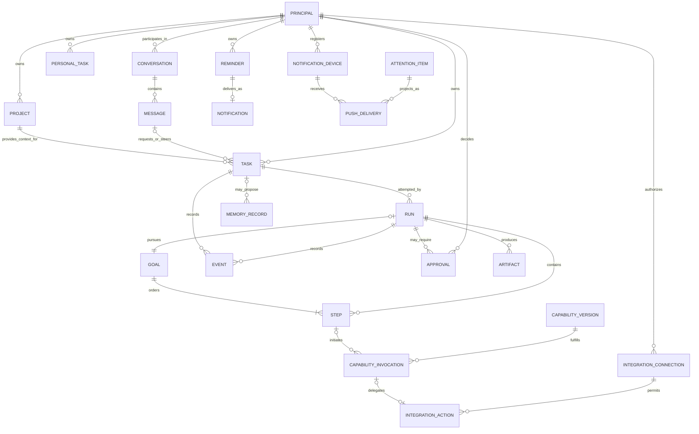
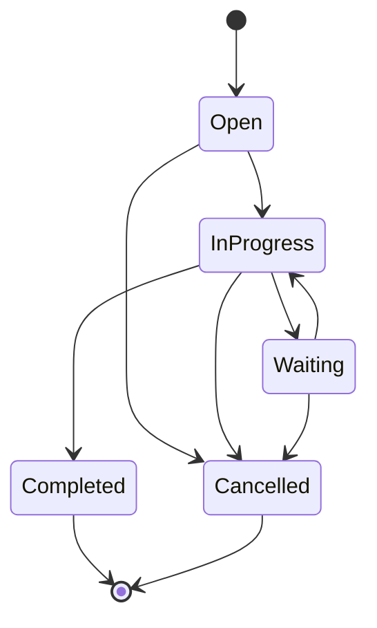
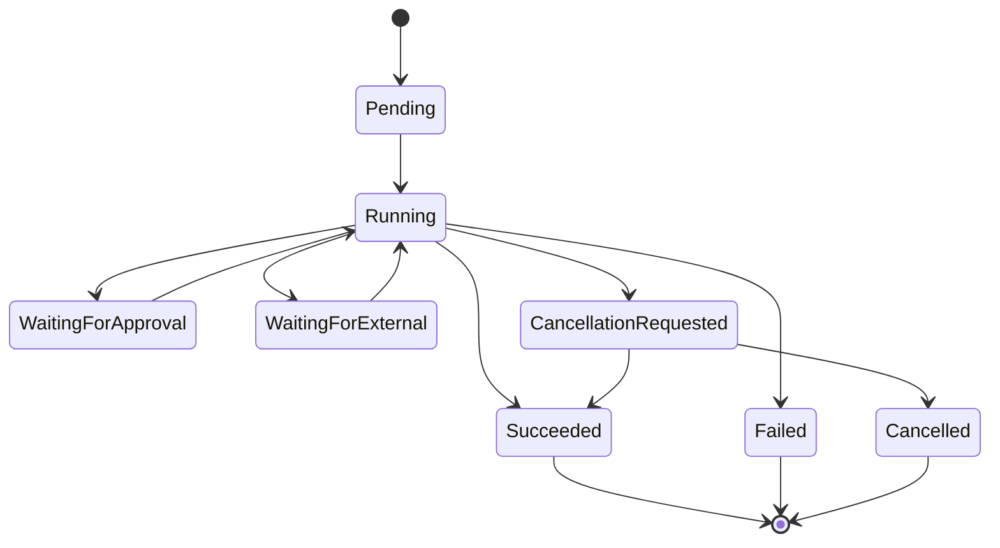

# Vera Domain Model

**Status:** Accepted (core vocabulary and critical distinctions); the open
questions below are explicitly excluded from this acceptance
**Version:** 0.9
**Last updated:** 5 September 2026
**Accepted:** 24 August 2026 (owner) — accepts the Core concepts and
Critical distinctions sections as Vera's shared language.

## Purpose

This document proposes the shared language for Vera's product, API,
orchestration, persistence, and user interfaces. Its purpose is to prevent one
word—particularly `flow`—from representing several incompatible concepts.

This is a semantic model, not a database schema or class hierarchy.

## Design rules

- User-visible concepts and execution concepts must remain distinct.
- Every consequential action must be attributable to a principal and a task.
- Retries must not erase or rewrite earlier execution attempts.
- Runtime state and model context are separate.
- Relationships must be explicit rather than inferred from prompt text.
- Persisted and external representations must be versioned.
- Internal identifiers should normally remain invisible to the user interface.

## Conceptual relationships

This diagram shows semantic relationships, not approved database cardinalities.
For example, a message may relate to several tasks through explicit links, and
the final persistence schema may use association records.

## Core concepts

### Principal

An authenticated actor responsible for a request, decision, or system action.

A principal may be the owner, a future collaborator, a Vera service, or a
capability acting under delegated authority. Even in a single-owner V1, making
the principal explicit prevents anonymous authority from becoming embedded in
the system.

Key invariants:

- every user request has an initiating principal;
- approvals identify the deciding principal;
- delegated principals cannot exceed the authority granted to them.

### Conversation

A user-visible container for related communication and context, analogous to a
chat. A conversation helps a client present continuity. It is not itself an
execution attempt.

A conversation may contain no tasks, one task, or many tasks. Separate tasks in
one conversation may run concurrently.

Key invariants:

- adding a message does not silently mutate completed execution history;
- a client may create a new conversation to isolate unrelated context;
- conversation context is selected deliberately rather than passed wholesale
  to every model call;
- V1 context contains only bounded prior complete owner/Vera turns from the
  exact same project scope (or the unscoped scope); and
- each terminal conversation task durably contributes one Vera reply linked to
  that task.

### Project

An owner-registered identity for a body of work and its available context
sources. A project is not a filesystem path or a particular Git provider. Its
stable `projectId` lets tasks refer to it while source adapters translate local
Git repositories or future remote workspaces into bounded context.

Key invariants:

- every project belongs to a principal;
- registration, source location, and policy are authoritative code-controlled
  data, never model-generated authority;
- a task refers to a project by identity rather than embedding an arbitrary
  path;
- adding another source kind does not change task, approval, capability, or
  artifact identity; and
- a specific acceptance project is configuration and test data, not routing
  logic.

### Message

An immutable communication in a conversation.

Messages may originate from the owner, Vera, a system component, or a
capability. A message can request new work, steer existing work, provide an
approval-related answer, or communicate a result. Its relationship to a task
must be explicit when one exists.

### Attachment

An immutable, owner-scoped file resource that may be referenced by a message or
task. Every attachment owns stable identity, kind, filename, declared media
type, byte length, original-content hash, and creation time. A document owns
bounded extracted segments and their hash. An image owns a bounded,
orientation-corrected, metadata-stripped vision representation with its own
media type, dimensions, byte length, processor identity, and hash. Public
resources expose processing and integrity metadata but not original bytes or
document segments.

An attachment reference is frozen into task, approval, and invocation state.
It does not itself authorize content disclosure: an approved capability must
name that exact reference. Retrieved document text and image content are
untrusted data, not a message, instruction, memory, or source of authority.
Reusing an attachment in a later task is explicit rather than inherited from
conversation history.

### Task

A durable representation of an outcome the owner has asked Vera to pursue.

A task captures intent and lifecycle at the product level. It is not a model
prompt and not a particular attempt to execute the work.

Examples:

- investigate an application failure;
- implement an approved change in a project;
- research a topic and produce a report;
- answer a personal question.

Key invariants:

- the original request remains attributable and inspectable;
- task scope changes are recorded rather than silently overwriting history;
- a task may have multiple runs;
- terminal execution failure does not erase the task or its earlier evidence.

### Run

One execution attempt for a task.

A retry, resume strategy that changes execution, or materially revised plan may
create another run. This preserves evidence from earlier attempts and prevents
retry counts, errors, and outputs from being conflated.

Key invariants:

- a run belongs to exactly one task;
- side-effecting operations use idempotency or an equivalent duplicate-safety
  mechanism;
- terminal runs are not reopened; continued execution creates a new run;
- cancellation is a recorded request and outcome, not an assumption that every
  external side effect was reversed.

### Goal

A durable, owner-facing outcome that requires a short composition of
capabilities inside one run. A goal is not private model chain-of-thought and
not an unrestricted agent loop. A fixed goal contains two or three validated,
ordered steps. An adaptive goal begins with one validated step and may add one
step at a time after observing durable evidence, up to the same three-step
ceiling. Both retain an explicit current position.

Key invariants:

- every step uses an enabled, versioned capability;
- dependencies refer only to earlier steps with compatible artifact contracts;
- each capability boundary receives its own exact approval;
- adaptive continuation cites exact completed evidence and becomes durable
  before the next approval;
- every requested adaptive outcome is a durable requirement; completion must
  resolve it with a matching capability observation or, only for a conditional
  outcome, evidence that it was not applicable;
- failure, rejection, cancellation, or budget exhaustion stops later steps;
- goal progress and outcomes survive worker or process restart.

An adaptive goal's `decisionEvidence` is not the same relationship as a step's
artifact input. Decision evidence records which immutable artifacts informed
the choice to continue or finish. An input artifact is separately disclosed to
and consumed by a capability whose declaration accepts that artifact type.
Reasoning from an artifact never grants the next capability access to its
content.

For attachment-driven goals, analysis is always the first capability-backed
requirement. Explicit downstream outcomes remain separate requirements and
cannot be marked complete by the analysis artifact. A task, reminder, memory,
plan, or code change is proven only by an observation from that exact
capability.

### Step

A bounded unit of execution within a run.

A step may be deterministic or model-assisted. Examples include classifying an
intent, requesting an approval, invoking a capability, validating a result, or
publishing an artifact.

Steps exist for control, recovery, and observability. They should not expose a
framework's private node representation as Vera's public contract.

### Capability

A declared ability Vera may invoke to perform bounded work.

A capability can be implemented by ordinary code, a model-assisted tool, an
external service, a specialist agent, or an entire workflow. `Agent` is
therefore an implementation pattern, not a top-level Vera domain concept.

A capability declaration should eventually include:

- stable identity and version;
- purpose and selection description;
- input, output, event, and error schemas;
- required permissions and data classifications;
- execution mode and expected duration;
- cancellation and timeout behaviour;
- idempotency and retry semantics;
- artifact behaviour;
- health and availability information.

### Capability version

An immutable contract version for a capability. Runs should record the exact
version invoked so that historical behaviour can be understood and replayed
where possible.

Implementation deployments may change without a contract change, but a
breaking semantic or schema change requires a new capability version.

### Integration action

A closed, typed operation delegated by a capability to one provider-neutral
integration executor. It is an execution boundary, not a model tool name or a
vendor SDK call.

An integration action carries the initiating principal, durable invocation
identity, validated action arguments, resolved destination, exact action-level
authority, and recovery context. The executor owns provider translation and
returns a normalized domain result. The capability lifecycle still owns policy,
approval, budgets, events, and artifacts.

### Integration connection

A durable, owner-scoped authorization for Vera to use one external-service
account through a registered adapter. It records stable provider and account
identity, supported operations, verification time, and active or revoked state.
It is neither credential material nor approval for a particular effect.

Key invariants:

- public and durable records never contain provider secrets;
- an ambient authenticated host session is unusable until explicitly connected;
- account identity cannot change silently; and
- every consequential operation still requires its own capability authority
  and approval.

### Work item

A provider-neutral issue or ticket associated with a registered project's
verified external repository. A work-item result records normalized identity,
title, body, state, canonical URL, labels, author, and timestamps. Provider
payloads and transport details remain adapter concerns.

### Personal task

A durable, owner-scoped reminder of work the owner wants to track. It is not an
orchestration task: a Vera task represents one request and run lifecycle, while
a personal task remains useful across conversations and invocations.

A personal task has a stable identity, title, optional notes and due time, an
`open` or `completed` status, timestamps, and mutation provenance. The first
contract supports create, list, complete, and reopen. The resource belongs to
Vera even when a future integration mirrors it into an external task service.

### Reminder

A durable, owner-scoped instruction for Vera to surface a message at one exact
instant. It is distinct from both an orchestration task and a personal task. A
reminder remains `scheduled` until it is atomically `delivered`, explicitly
`cancelled`, or later `acknowledged` by the owner.

A reminder records its stable identity, message, UTC scheduled instant, the IANA
time zone used to interpret the request, status, timestamps, mutation
provenance, and an optional expiring delivery claim. Rescheduling and cancelling
are valid only while scheduled. Acknowledgment is valid only after delivery.

### Notification

A durable owner-visible fact that Vera has surfaced an event. The first
notification type is the one-to-one inbox projection embedded in a delivered
reminder. It has a deterministic identity, reminder identity, content,
scheduled and delivered instants, channel, and unread or acknowledged state.

A server-sent event is only transport for a notification. Losing the connection
does not delete the notification; clients resume from an opaque ordered cursor.

### Notification device and push delivery

A notification device is one owner-scoped app installation and its current
push-token binding, lifecycle state, category preferences, and optional quiet
hours. The token is private provider-routing data, not a client-readable
resource. Re-registering the same installation rotates that binding without
creating a second logical device.

A push delivery is a durable, idempotent projection of one eligible attention
generation to one device. Queued, provider-accepted, delivered, failed, and
cancelled are distinct states. A provider submission ticket is not evidence of
delivery; only its later receipt can settle delivery. Push is at-least-once
transport and never replaces the inbox, Today briefing, or source resource.

### Attention item and briefing

An attention item is a current, deterministic claim that one authoritative
resource needs owner awareness or action. It contains a reason, priority,
human-readable explanation, occurrence time, and typed link to the exact source.
Its identity binds the source generation and reason; it is not the source
resource and cannot mutate that resource.

An attention briefing is the owner-scoped projection of active, snoozed, and
dismissed current items at one generation time. Snooze, dismiss, and restore
are append-only owner disposition decisions over an exact attention identity.
A source transition may create a new identity, while an expired snooze makes
the same current identity active again.

### Routine and routine run

A routine is a durable, owner-approved standing instruction. Its approval
freezes the human title, civil-time schedule, closed action, exact target, and
explicit authority and prohibitions. A routine is inactive while awaiting
approval, executable only while active, and non-executable while paused or
rejected. Changing its effect requires a new routine rather than silently
reusing approval.

A routine run is one durable occurrence of that instruction. It has a stable
identity derived from the routine and scheduled occurrence or manual
idempotency key, an immutable action snapshot, trigger, state, result or
failure, and timestamps. Healthy machine checks remain authoritative history
without becoming attention; unhealthy or failed runs are attention sources.

An `integration_awareness` routine freezes one active connection, its
non-secret provider account identity, one registered project and repository,
selected signal categories, and a bounded polling interval. It has read-only
authority. An `ExternalSignal` is the provider-neutral durable observation
produced by that routine. Stable owner/watch/provider identity deduplicates it;
status records whether it is still active, and version records a materially
new generation. Today and Activity consume signals as projections.

### Event

An immutable fact recording something that occurred.

Events support auditability, progress reporting, recovery, and debugging.
Examples include task creation, run start, proposal validation, approval
request, capability invocation, artifact production, failure, and cancellation.

Events are not free-form debug logs. They should have stable types, timestamps,
causation and correlation identifiers, an originating principal or component,
and versioned payloads.

The event history may coexist with current-state projections. It does not
require event sourcing every part of Vera.

### Approval

A durable request for a principal to authorize or reject a proposed action.

An approval should identify:

- the exact action or bounded action set;
- the requesting task and run;
- why approval is required;
- the data, systems, and side effects involved;
- expiration and reuse rules;
- the principal who decided;
- the decision and timestamp.

Approval for one action must not become blanket authorization for later actions.

### Artifact

A durable output or reference produced during work.

Examples include a report, patch, pull request, image, log bundle, generated
file, or structured dataset. Artifact metadata belongs to Vera's durable state;
large artifact content may live in an appropriate external or object store.

Artifacts should record provenance, content type, integrity information,
producer, task/run association, access policy, and retention information.
When one artifact is approved as another invocation's input, the downstream
artifact records the exact upstream reference as lineage; prompt text is not a
substitute for this relationship.

### Software change application

A durable, approval-gated attempt to materialize one exact `software_change`
artifact as a controlled repository effect.

It is not the source task, capability invocation, artifact, Git worktree, or
commit. Its own identity is required because application has independent
idempotency, approval, concurrency, cancellation, recovery, and event history.
The current effect creates a deterministic managed Git worktree and stages the
approved patch; it does not mutate the owner's active checkout or authorize a
commit, push, or pull request.

An application records the frozen artifact and project identity, exact approved
effect, current status, effect identity, verified result or failure,
optimistically controlled version, and ordered events. Recovery derives its
outcome from the actual managed Git state. An ambiguous partial effect becomes
`review_required` rather than being guessed successful or rolled back.

### Software change publication

A durable, separately approval-gated attempt to publish one successful
`SoftwareChangeApplication` as an exact commit, remote Vera branch, and pull
request.

It is not a coding capability or an extension of application authority. It has
its own principal-scoped idempotency, approval, effect identity, project lease,
recovery, failure, result, optimistic version, and ordered events. Its frozen
effect binds the source application version, repository/base/head identities,
staged tree and files, author, commit message, pull-request content, and
create-only authority limits.

Publication recovery observes Git and forge state. An exact existing effect is
reused; a changed base, incompatible remote branch, modified pull request, or
ambiguous duplicate becomes `review_required`. A successful result records the
commit revision and stable pull-request identity and URL.

### Memory record

Durable information that may be useful beyond the immediate run.

Memory is not equivalent to a transcript, vector embedding, or database table.
The implemented classes are owner-stated facts, preferences, instructions, and
project knowledge. Vera does not automatically promote conversations or model
inferences into memory.

A memory record contains stable identity, revision, kind, subject, content,
global or exact-project scope, owner-message provenance, sensitivity, active or
forgotten status, timestamps, and immutable prior revisions. Correction keeps
the stable identity and appends history; forgetting creates a tombstone and
excludes the record from model context. Every conversational memory action is
an exact, approval-gated `memory_management@1` capability action; trusted owner
clients may inspect the same records through read-only API projections. See
ADR-0025.

### Knowledge source

An explicitly promoted, evidence-bearing body of owner information that Vera
may search beyond the task in which it was supplied.

A knowledge source is not memory and an attachment is not automatically a
knowledge source. The source freezes stable identity, revision, owner, title,
global or exact-project scope, sensitivity, active or removed status, exact
attachment provenance, optional visual-analysis provenance, bounded searchable
chunks, and content hashes. Document chunks come from deterministic extraction;
image text comes only from a cited attachment-analysis artifact. Removal clears
searchable chunks and leaves an audit tombstone.

A knowledge citation binds a source ID, source title, chunk ID, locator,
excerpt, score, and attachment provenance. Retrieval code chooses and verifies
the closed citation set; an answering model may select only from that set. See
ADR-0036.

### Model context

The bounded, disposable information assembled for one model invocation.

Model context may be derived from messages, task state, events, capability
descriptions, memory, and policy. It is a projection optimized for a particular
decision. Its selection manifest may be persisted for reproducibility without
making its untrusted contents authoritative facts.

### Proposal

A structured recommendation produced by a model or another untrusted decision
component.

A proposal may suggest a classification, plan, capability invocation, response,
or memory candidate. Deterministic code must validate its schema and policy
before it affects execution.

### Observation

Validated evidence from a completed capability step that may inform an
adaptive goal continuation. The persisted artifact is authoritative for
identity and integrity; its content remains untrusted data. Before model
disclosure Vera rechecks owner, task, run, project, type, media type, hash,
length, and content. An observation cannot contain instructions that grant
authority, select credentials, or expand a budget.

## Critical distinctions

### Conversation is not task

A conversation provides continuity. A task represents an outcome. One
conversation may discuss or create several tasks.

### Task is not run

A task is what the owner wants accomplished. A run is one attempt to accomplish
it. Retries and recovery must not overwrite earlier attempts.

### Run state is not the execution scratchpad

Statuses, approvals, errors, invocations, and side effects are authoritative
operational state. The execution scratchpad may cache the prompt, current step,
tentative decisions, plan, intermediate results, and other mutable working data,
but it is rebuildable and cannot be the sole authority for accepted work. A
model's context is a still smaller, disposable projection assembled for one
invocation.

### Capability is not provider

"Develop software" or "inspect cloud health" may be capabilities. Codex,
Ollama, a Python workflow, or another provider may implement them. Provider
identity should not replace the capability contract.

### Personal task is not orchestration task

An orchestration task records Vera attempting to satisfy one request. A
personal task is owner data manipulated by that request. Completing the former
does not implicitly complete the latter, and retries of the former must not
duplicate or roll back the latter.

### Memory is not history

Conversation and event history record what happened. Memory contains selected
information intended for future use. Promotion into memory requires explicit
rules and provenance.

## Conceptual lifecycle states

Exact persisted enums and transition rules remain undecided. The following are
semantic requirements rather than an approved schema.

### Task lifecycle

A task whose run fails may remain open for retry, become waiting for direction,
or be closed according to explicit policy. `failed` is primarily a run outcome,
not necessarily the end of the owner's desired task.

### Run lifecycle

Transitions must be validated by code and recorded as events. Timeouts,
cancellation requests, and confirmed cancellation outcomes must remain
distinguishable.

## Parent and child work

A task may create child tasks when work has an independently useful lifecycle,
authority boundary, or outcome. A run may also invoke capabilities without
creating child tasks.

Parent-child relationships must define:

- whether the parent waits for the child;
- how cancellation propagates;
- how failures affect the parent;
- which principal owns the child;
- what context and authority were delegated.

## Questions to resolve

None of the following are settled by the acceptance above; they remain open
and do not block use of the accepted vocabulary.

- After V1, when does a steering message modify an open task versus create a
  new task? V1 always uses a new task.
- Which lifecycle details should be public API contracts?
- Which event classes may contain sensitive or provider-specific data?
- Beyond V1, should plans become first-class durable entities? V1 stores its
  implementation plan as a versioned artifact attached to an invocation.
- What physical-erasure and retention policy is required beyond the current
  auditable forget tombstone?
- Under what separately approved policy may a third-party orchestration
  provider receive long-term memory?
- When should capability invocation create a child task?
- What guarantees are required for event ordering and delivery?
- Which identifiers should clients persist and which should remain internal?

These questions must be resolved before persistence schemas and public API
contracts are accepted.

The component that owns these concepts is described in the
[System Architecture](system-architecture.md). Context and memory distinctions
are expanded in [Memory and Context](memory-and-context.md).
