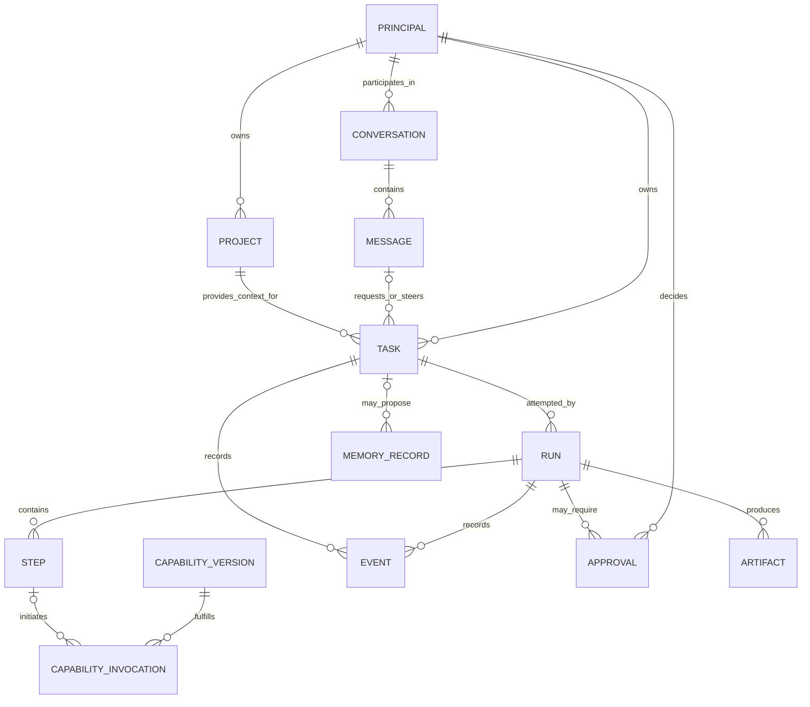
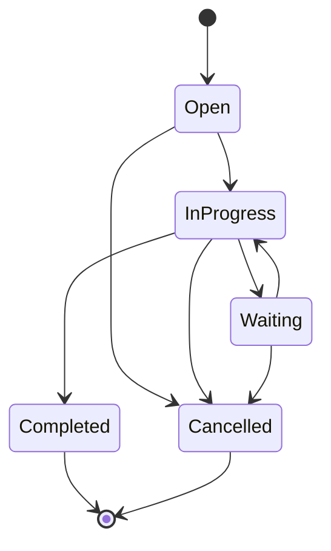
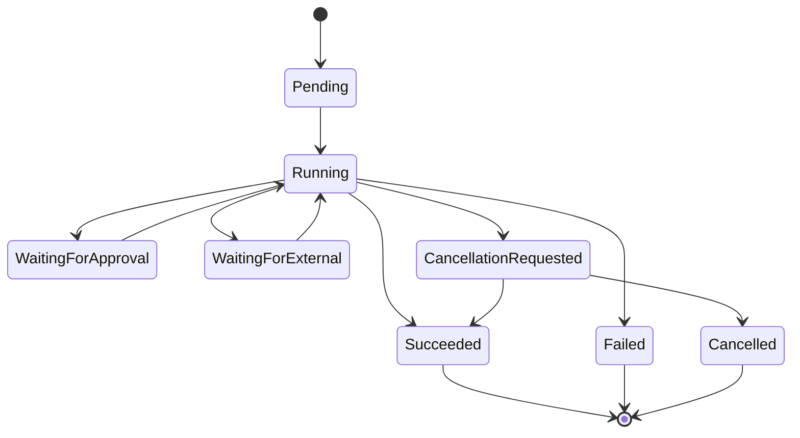

# Vera Domain Model

**Status:** Accepted (core vocabulary and critical distinctions); the open
questions below are explicitly excluded from this acceptance
**Version:** 0.2
**Last updated:** 24 August 2026
**Accepted:** 24 August 2026 (owner) — accepts the Core concepts and
Critical distinctions sections as Vera's shared language.

## Purpose

This document proposes the shared language for Vera's product, API,
orchestration, persistence, and user interfaces. Its purpose is to prevent one
word—particularly `flow`—from representing several incompatible concepts.

This is a semantic model, not a database schema or class hierarchy.

## Design rules

- User-visible concepts and execution concepts must remain distinct.
- Every consequential action must be attributable to a principal and a task.
- Retries must not erase or rewrite earlier execution attempts.
- Runtime state and model context are separate.
- Relationships must be explicit rather than inferred from prompt text.
- Persisted and external representations must be versioned.
- Internal identifiers should normally remain invisible to the user interface.

## Conceptual relationships

This diagram shows semantic relationships, not approved database cardinalities.
For example, a message may relate to several tasks through explicit links, and
the final persistence schema may use association records.

## Core concepts

### Principal

An authenticated actor responsible for a request, decision, or system action.

A principal may be the owner, a future collaborator, a Vera service, or a
capability acting under delegated authority. Even in a single-owner V1, making
the principal explicit prevents anonymous authority from becoming embedded in
the system.

Key invariants:

- every user request has an initiating principal;
- approvals identify the deciding principal;
- delegated principals cannot exceed the authority granted to them.

### Conversation

A user-visible container for related communication and context, analogous to a
chat. A conversation helps a client present continuity. It is not itself an
execution attempt.

A conversation may contain no tasks, one task, or many tasks. Separate tasks in
one conversation may run concurrently.

Key invariants:

- adding a message does not silently mutate completed execution history;
- a client may create a new conversation to isolate unrelated context;
- conversation context is selected deliberately rather than passed wholesale
  to every model call.

### Project

An owner-registered identity for a body of work and its available context
sources. A project is not a filesystem path or a particular Git provider. Its
stable `projectId` lets tasks refer to it while source adapters translate local
Git repositories or future remote workspaces into bounded context.

Key invariants:

- every project belongs to a principal;
- registration, source location, and policy are authoritative code-controlled
  data, never model-generated authority;
- a task refers to a project by identity rather than embedding an arbitrary
  path;
- adding another source kind does not change task, approval, capability, or
  artifact identity; and
- a specific acceptance project is configuration and test data, not routing
  logic.

### Message

An immutable communication in a conversation.

Messages may originate from the owner, Vera, a system component, or a
capability. A message can request new work, steer existing work, provide an
approval-related answer, or communicate a result. Its relationship to a task
must be explicit when one exists.

### Task

A durable representation of an outcome the owner has asked Vera to pursue.

A task captures intent and lifecycle at the product level. It is not a model
prompt and not a particular attempt to execute the work.

Examples:

- investigate an application failure;
- implement an approved change in a project;
- research a topic and produce a report;
- answer a personal question.

Key invariants:

- the original request remains attributable and inspectable;
- task scope changes are recorded rather than silently overwriting history;
- a task may have multiple runs;
- terminal execution failure does not erase the task or its earlier evidence.

### Run

One execution attempt for a task.

A retry, resume strategy that changes execution, or materially revised plan may
create another run. This preserves evidence from earlier attempts and prevents
retry counts, errors, and outputs from being conflated.

Key invariants:

- a run belongs to exactly one task;
- side-effecting operations use idempotency or an equivalent duplicate-safety
  mechanism;
- terminal runs are not reopened; continued execution creates a new run;
- cancellation is a recorded request and outcome, not an assumption that every
  external side effect was reversed.

### Step

A bounded unit of execution within a run.

A step may be deterministic or model-assisted. Examples include classifying an
intent, requesting an approval, invoking a capability, validating a result, or
publishing an artifact.

Steps exist for control, recovery, and observability. They should not expose a
framework's private node representation as Vera's public contract.

### Capability

A declared ability Vera may invoke to perform bounded work.

A capability can be implemented by ordinary code, a model-assisted tool, an
external service, a specialist agent, or an entire workflow. `Agent` is
therefore an implementation pattern, not a top-level Vera domain concept.

A capability declaration should eventually include:

- stable identity and version;
- purpose and selection description;
- input, output, event, and error schemas;
- required permissions and data classifications;
- execution mode and expected duration;
- cancellation and timeout behaviour;
- idempotency and retry semantics;
- artifact behaviour;
- health and availability information.

### Capability version

An immutable contract version for a capability. Runs should record the exact
version invoked so that historical behaviour can be understood and replayed
where possible.

Implementation deployments may change without a contract change, but a
breaking semantic or schema change requires a new capability version.

### Event

An immutable fact recording something that occurred.

Events support auditability, progress reporting, recovery, and debugging.
Examples include task creation, run start, proposal validation, approval
request, capability invocation, artifact production, failure, and cancellation.

Events are not free-form debug logs. They should have stable types, timestamps,
causation and correlation identifiers, an originating principal or component,
and versioned payloads.

The event history may coexist with current-state projections. It does not
require event sourcing every part of Vera.

### Approval

A durable request for a principal to authorize or reject a proposed action.

An approval should identify:

- the exact action or bounded action set;
- the requesting task and run;
- why approval is required;
- the data, systems, and side effects involved;
- expiration and reuse rules;
- the principal who decided;
- the decision and timestamp.

Approval for one action must not become blanket authorization for later actions.

### Artifact

A durable output or reference produced during work.

Examples include a report, patch, pull request, image, log bundle, generated
file, or structured dataset. Artifact metadata belongs to Vera's durable state;
large artifact content may live in an appropriate external or object store.

Artifacts should record provenance, content type, integrity information,
producer, task/run association, access policy, and retention information.

### Memory record

Durable information that may be useful beyond the immediate run.

Memory is not equivalent to a transcript, vector embedding, or database table.
Potential memory classes include user-stated facts, preferences, project
knowledge, episodic summaries, capability knowledge, and model-derived
inferences.

A memory record should eventually include:

- content and type;
- subject and scope;
- provenance;
- whether it was stated, observed, or inferred;
- confidence where inference is involved;
- creation and review timestamps;
- sensitivity and access policy;
- retention and deletion behaviour.

V1 may postpone broad long-term memory, but it must not introduce an
unstructured store that later makes provenance and deletion impossible.

### Model context

The bounded, disposable information assembled for one model invocation.

Model context may be derived from messages, task state, events, capability
descriptions, memory, and policy. It is a projection optimized for a particular
decision. It is not authoritative state and should not be persisted as though
everything in it were true.

### Proposal

A structured recommendation produced by a model or another untrusted decision
component.

A proposal may suggest a classification, plan, capability invocation, response,
or memory candidate. Deterministic code must validate its schema and policy
before it affects execution.

## Critical distinctions

### Conversation is not task

A conversation provides continuity. A task represents an outcome. One
conversation may discuss or create several tasks.

### Task is not run

A task is what the owner wants accomplished. A run is one attempt to accomplish
it. Retries and recovery must not overwrite earlier attempts.

### Run state is not the execution scratchpad

Statuses, approvals, errors, invocations, and side effects are authoritative
operational state. The execution scratchpad may cache the prompt, current step,
tentative decisions, plan, intermediate results, and other mutable working data,
but it is rebuildable and cannot be the sole authority for accepted work. A
model's context is a still smaller, disposable projection assembled for one
invocation.

### Capability is not provider

"Develop software" or "inspect cloud health" may be capabilities. Codex,
Ollama, a Python workflow, or another provider may implement them. Provider
identity should not replace the capability contract.

### Memory is not history

Conversation and event history record what happened. Memory contains selected
information intended for future use. Promotion into memory requires explicit
rules and provenance.

## Conceptual lifecycle states

Exact persisted enums and transition rules remain undecided. The following are
semantic requirements rather than an approved schema.

### Task lifecycle

A task whose run fails may remain open for retry, become waiting for direction,
or be closed according to explicit policy. `failed` is primarily a run outcome,
not necessarily the end of the owner's desired task.

### Run lifecycle

Transitions must be validated by code and recorded as events. Timeouts,
cancellation requests, and confirmed cancellation outcomes must remain
distinguishable.

## Parent and child work

A task may create child tasks when work has an independently useful lifecycle,
authority boundary, or outcome. A run may also invoke capabilities without
creating child tasks.

Parent-child relationships must define:

- whether the parent waits for the child;
- how cancellation propagates;
- how failures affect the parent;
- which principal owns the child;
- what context and authority were delegated.

## Questions to resolve

None of the following are settled by the acceptance above; they remain open
and do not block use of the accepted vocabulary.

- After V1, when does a steering message modify an open task versus create a
  new task? V1 always uses a new task.
- Which lifecycle details should be public API contracts?
- Which event classes may contain sensitive or provider-specific data?
- Beyond V1, should plans become first-class durable entities? V1 stores its
  implementation plan as a versioned artifact attached to an invocation.
- Which memory types, if any, are allowed after V1? Broad personal memory is
  excluded from V1.
- When should capability invocation create a child task?
- What guarantees are required for event ordering and delivery?
- Which identifiers should clients persist and which should remain internal?

These questions must be resolved before persistence schemas and public API
contracts are accepted.

The component that owns these concepts is described in the
[System Architecture](system-architecture.md). Context and memory distinctions
are expanded in [Memory and Context](memory-and-context.md).
