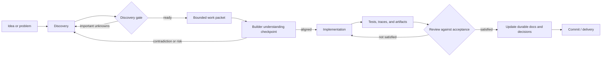

# Vera Engineering Method

**Status:** Accepted
**Version:** 0.2
**Last updated:** 25 August 2026
**Accepted:** 24 August 2026 (owner); provider evidence wording updated 25
August 2026

## Purpose

This document adapts the architect-builder method discussed during discovery to
Vera's development. The goal is not to copy a fixed scaffold. It is to ensure
that implementation begins from approved, repository-backed intent and ends
with evidence and updated project knowledge.

## Core loop

The repository—not the chat that produced a plan—is the handoff.

## Roles

### Owner

- supplies product intent and operational knowledge;
- decides consequential product and architecture questions;
- defines autonomy and approval boundaries;
- accepts outcomes that require product judgment.

### Architect

- turns intent into explicit requirements and system consequences;
- identifies unknowns rather than inventing certainty;
- checks domain, security, data, failure, and migration implications;
- prepares bounded work with acceptance evidence;
- may be a human or an AI operating in the architect role.

### Builder

- reads authoritative repository context;
- explains its understanding and planned changes when risk warrants it;
- implements only the accepted scope;
- verifies the result and reports evidence, limitations, and deviations;
- may be a human or an AI such as Codex operating in the builder role.

### Reviewer

- evaluates behaviour against requirements and evidence;
- checks architecture, security, maintainability, and regressions;
- does not treat another model's confidence as proof;
- may involve the owner, automated gates, and independent technical review.

The same person or tool may perform multiple roles, but the responsibilities and
checkpoints should remain distinct.

## Discovery gate

Work is ready to plan when:

- the problem and desired outcome are understood;
- affected users or principals are known;
- domain language is consistent;
- important business and policy rules are recorded;
- consequential unknowns are answered or explicitly accepted as experiments;
- success and failure can be observed;
- scope and non-scope are credible.

The architect should not manufacture answers merely to produce a complete-looking
packet.

## Bounded work packet

For meaningful changes, the handoff should contain four concerns. They may be
sections of one document, issue, or task rather than four mandatory files.

### Requirements

- problem and motivation;
- user-visible or operational behaviour;
- rules and edge cases;
- explicit non-goals;
- relevant accepted decisions.

### Design

- affected components and boundaries;
- data and API changes;
- security and failure behaviour;
- alternatives and migration implications;
- expected files or modules when known.

### Acceptance and validation

- observable completion criteria;
- automated tests and static checks;
- manual or integration verification;
- required artifacts, traces, or screenshots;
- rollback or failure checks where appropriate.

### Builder handoff

- exact scope for this task;
- documents to read;
- decisions that must not be revisited silently;
- checkpoints requiring owner input;
- commands or environments available for verification.

## Scaling the ceremony

| Change | Expected process |
|---|---|
| Typo or obvious documentation correction | Direct edit and review. |
| Small implementation with established pattern | Short requirements and acceptance notes. |
| New API, entity, capability, permission, or persistence change | Full work packet and architecture review. |
| Destructive, security-sensitive, or hard-to-migrate change | Explicit decision record, threat/failure analysis, approval checkpoint, and rollback evidence. |

Process should reduce ambiguity and risk, not create documents for their own
sake.

## Verification tiers and CI budget

Required pull-request CI must be deterministic, bounded, and economical. Vera
uses one Linux job so checkout, dependency installation, build work, and
per-job billing granularity are not duplicated. Superseded runs are cancelled,
and the job has a twelve-minute hard limit. The real-storage tier runs once for
the pull request and is not repeated for the resulting `main` push; the static,
unit, boundary, and build checks still protect both events. An explicit manual
run remains available.

That job has two evidence tiers:

1. static checks, unit tests, boundary tests, and production compilation; and
2. one compiled persistent journey using ephemeral real MongoDB and Redis
   service containers with deterministic, owner-controlled model and capability
   adapters.

The second tier validates datastore, concurrency, recovery, API, client, CLI,
worker, and controlled Git application semantics without conflating those
failures with inference quality or external-provider availability. It uses a
temporary clean repository and managed-worktree root, then removes both. It
reuses the production output already built by CI rather than compiling a second
time.

Required CI must not download Ollama model weights or invoke a paid or
third-party model or specialist. Real Ollama, OpenAI, and Gemini conformance,
real specialist disclosure, and subjective output-quality evaluation are
separate manual or explicitly triggered evidence classes. A future self-hosted
model workflow must not become a required pull-request check until its trust
boundary, availability, and runtime budget are deliberately accepted.

Model qualification has two explicit manual tiers. `npm run test:model`
exercises provider-neutral routing, planning, and adaptive-continuation
contracts directly; `VERA_MODEL_CONFORMANCE_RUNS` repeats those cases and
reports every failure plus aggregate pass rate, latency, and token use. After
that boundary passes, `npm run verify:live-model` runs the selected model
through compiled production code, HTTP, durable workers, isolated MongoDB and
Redis state, approval gates, artifacts, conversation projection, and an
adaptive goal. The latter requires `VERA_PROFILE`, cleans its temporary state,
uses deterministic specialist adapters, and does not download a model or make
live public-research calls. Neither check records or reports private reasoning
content.

## Context rules for AI builders

- Begin a bounded task with fresh context when practical.
- Read the repository entry point and task-specific authoritative documents.
- Do not load every project document automatically.
- Treat proposed documents differently from accepted decisions.
- Surface contradictions before implementation.
- Never infer credentials, permissions, or acceptance criteria from silence.
- Record durable changes in the repository rather than relying on chat memory.

## State and progress

The project should not use one giant `STATE.md` as a second issue tracker and
commit history. Current work may be summarized in a lightweight planning
artifact when it provides real coordination value.

Durable project knowledge belongs in:

- specifications for intended behaviour;
- decision records for consequential choices;
- version control for change history;
- tests for executable expectations;
- issues or work packets for active scope;
- release notes or changelogs for delivered changes.

Raw meetings and transcripts may be retained privately as sources, but their
decisions and requirements must be extracted into the appropriate authoritative
artifact.

## Definition of done for implementation work

A change is complete when:

- the accepted behavioural criteria are satisfied;
- relevant tests and quality checks pass;
- security and failure cases were considered proportionately;
- migrations and compatibility are handled;
- deviations from the approved plan are documented;
- affected diagrams, specifications, and decisions are current;
- the final report names evidence and remaining limitations.

## Relationship to Vera's product

This method is also a candidate future capability for Vera: turn ambiguous
intent into an approved work packet, delegate to a builder, observe execution,
and verify evidence.

We should use the method manually first, learn which artifacts genuinely help,
and automate only the proven protocol. Vera should not attempt to autonomously
design and build itself before its own kernel and policy boundaries exist.
