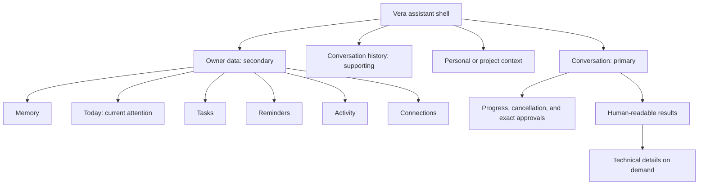
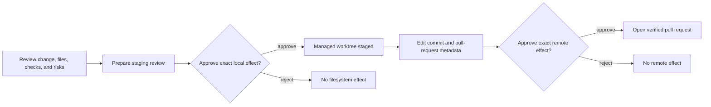

# Vera Interface Design

**Status:** Implemented design language
**Last updated:** 5 September 2026

## Purpose

Vera's universal frontend is the owner's primary conversational interface to
the system. It should make broad capability feel calm and understandable while
preserving the approvals, provenance, and control required by the
[Product Charter](product-charter.md).

## Design character

The interface uses a **quiet intelligence** visual language:

- deep graphite surfaces rather than pure black;
- warm, readable text with restrained muted-gold accents;
- generous spacing and continuous corners;
- subtle depth and motion instead of decorative sci-fi effects;
- human language in the primary interface, with exact technical data available
  through explicit detail disclosures.

Vera should feel capable and attentive. It should not resemble a terminal, a
generic chatbot, or a dashboard that asks the owner to choose a subsystem before
expressing intent.

## Information hierarchy

Conversation remains the starting point on every platform. The owner-data
surfaces support the conversation rather than competing with it as equal app
destinations.

## Responsive behavior

- On compact screens, the conversation list is a full-height modal drawer and
  owner data is a near-full-height bottom sheet.
- On wide screens, conversation history remains visible and owner data opens as
  a right-side inspector.
- The conversation header exposes one compact context selector. `Personal` is
  the human-facing label for no project scope.
- The message viewport is independently scrollable and the composer remains
  keyboard- and safe-area-aware.
- Web document and application backgrounds use the same canvas color so browser
  overscroll and mobile viewport gaps cannot reveal a white page.

## Interaction rules

- All primary controls have at least a 44 by 44 point target and an accessible
  name.
- Prompt starters populate an editable draft and never submit automatically.
- The owner can refresh Vera without reloading the browser: the header exposes
  an always-available refresh action, and pulling down from the top of the
  conversation refreshes on native and web surfaces. Refresh preserves the
  message draft while synchronizing the active conversation, active run,
  projects, conversation history, memory, knowledge, tasks, reminders, and inbox.
- Voice capture is one continuous recording with elapsed time and no silence
  cutoff. While recording, two distinct controls stop into an editable
  transcript or stop, transcribe, and send through the typed-message path.
  Transcription runs once after capture and never submits on its own.
- Run progress, cancellation, and approval remain inside the conversation where
  the relevant intent was expressed.
- The composer exposes one paperclip rather than separate media controls. Its
  file picker accepts up to five text, Markdown, JSON, PDF, JPEG, PNG, WebP,
  GIF, HEIC, HEIF, AVIF, or TIFF attachments. Each selected file shows
  processing, ready, retry, and remove states; images include a thumbnail. Send
  remains disabled until every referenced attachment is ready.
- Owner messages show compact attachment chips and image previews. Selecting `Use again` adds the
  exact existing reference to the composer without silently attaching it to a
  future turn.
- Approval cards keep the action, target, network authority, side effects, and
  exact arguments inspectable before a decision.
- Attachment-analysis approvals list the exact filenames, types, sizes, and
  short hashes and say plainly whether extracted text or normalized images stay
  owner-controlled or are sent to a named third-party model boundary.
- Attachment-driven outcomes remain in one visible **Understand → Decide →
  Act** journey. The first approval governs analysis; a later approval names the
  exact derived action. `Evidence used to decide` never implies destination
  disclosure, while `Evidence disclosed to this action` lists every complete
  artifact the destination will receive.
- Structured results are presented as task-specific cards. Opaque identifiers,
  hashes, raw payloads, and artifact metadata remain available under
  `Technical details`; arbitrary assistant text is never altered to hide data.
- Attachment-analysis results present summary and findings first, followed by
  readable evidence cards. Documents show filename, page/line locator, and a
  verified excerpt; images show the exact approved image identity.
- Completed adaptive results retain the analysis summary and citations beside
  the action ledger, so the owner can inspect what Vera understood and what it
  ultimately did without opening raw JSON.
- The Knowledge workspace distinguishes evidence from memory. It lists only
  explicit sources with filenames, scope, sensitivity, date, and chunk count;
  supports direct evidence search with exact source/locator/excerpt cards; and
  requires a second confirmation before source removal. “Add files to
  knowledge” prepares an editable conversation request so attachment analysis
  and permanent retention remain visible, separately governed actions.
- The Machines resource tab shows only registered machines, services, and
  allowed actions. Inspect creates a read-only approval; start, stop, and
  restart create a distinct mutation approval. Completed cards show service
  health or the before/after postcondition rather than raw command output.
- The Connections tab presents the curated server catalog and public account
  state. Enabling and revoking require a plain-language confirmation; verifying
  never changes accounts. Host-session connections show no credential input,
  and a completed work-item card opens only the canonical provider URL.

## Today and proactive attention

Today is the first owner-workspace destination and the default target of the
header's Vera control. It is a calm decision surface, not a feed:

- a compact briefing states the number of urgent, high-priority, and later
  items;
- cards explain why an authoritative source needs attention and link back to
  that task, conversation, reminder, mission, or campaign;
- snooze hides one exact generation for one hour from the quick action;
- dismiss removes one exact generation from the active briefing; and
- snoozed and dismissed items remain inspectable and restorable.

The UI never computes urgency and never treats local component state as truth.
Refresh and inbox events re-fetch the API projection. Consequential action is
performed at the source resource under its existing approval rules.

The Activity surface owns device-alert setup. The owner explicitly enables an
installed device, chooses category preferences and optional quiet hours, sends
a setup test, sees recent delivery state, and can revoke the installation.
Unsupported web and Expo Go runtimes explain the development-build requirement
instead of presenting a broken permission flow. Opening an alert goes to Today
and emphasizes the exact opaque attention target; private work content is
loaded only after the app opens.

The Routines workspace is the owner surface for standing instructions. It
shows status, schedule, time zone, machine/service scope, next occurrence,
latest run outcome, and the authority boundary before approval. Active routines expose Run now and
Pause; paused routines expose Resume. Routine failures opened from Today land
back on this source surface. Healthy runs intentionally create no badge or
notification.

## Software delivery in conversation

A completed software-change artifact is not a terminal blob. Its result card
is the durable owner interface for taking that exact change through staging and
publication:

- The card shows human-readable change evidence before offering an effect.
- Staging and publication remain separate reviews; neither button silently
  grants the authority of the next phase.
- Pull-request metadata is editable before publication preparation. The exact
  frozen repository, branches, files, author, commit, and PR payload remain
  inspectable at approval time.
- Active work follows durable status and exposes cancellation only when the API
  says cancellation is still truthful.
- Refresh or process restart rebuilds the latest active or successful delivery
  chain from owner-scoped API discovery. The device does not become a second
  operational store.
- A successful publication renders only a canonical HTTPS GitHub pull-request
  URL as an external action. Full aggregates remain available under Delivery
  evidence and Technical details.
- The owner may ask Vera to list active missions and campaigns or inspect an
  exact, latest, uniquely eligible, PR-number, or recent-conversation reference.
  Ambiguity produces a short candidate list instead of an inferred selection.
- A conversational repair request renders the existing exact-head repair card
  inline. “Approve exact repair” and “Reject” decide only that frozen repair;
  preparing the card has not changed the branch, force-pushed, or merged.

## Delegated development campaigns

The Campaigns resource tab is the control surface for outcome-level software
delegation. It is intentionally separate from ordinary conversation so the
owner sees policy and effect before granting authority.

- Creation selects one registered project and operator policy and states one
  objective. Vera derives ticket and delivery metadata, then the API returns
  the complete frozen envelope.
- Approval is labelled “Approve bounded campaign,” never a vague “Continue.”
- Cards keep objective, repository/base, merge method, gate names, file, byte,
  duration ceilings, attempts, PR checks, and terminal failure visible.
- Cancellation appears only while the server can truthfully prevent remote
  publication.
- `review_required` is terminal for automation and tells the owner why the PR
  needs intervention; the interface does not imply that Vera will silently
  rewrite reviewed remote work.
- Refresh and periodic inbox refresh rediscover campaigns from the API. The
  frontend is a projection, never campaign execution authority.

## Bounded missions

The Missions tab is the owner control surface for unattended software work.
Conversation creates the draft; the tab makes the consequential decision
legible.

- The approval card shows the objective, completion criteria, project, commit
  and pull-request metadata, one-campaign ceiling, duration, and “no merge” in
  plain language.
- “Approve mission” means Vera may produce exactly one pull request. It never
  means recurring work, multiple outcomes, policy edits, or merge.
- Active cards show durable mission state while the embedded campaign remains
  inspectable in Campaigns for technical evidence.
- Terminal success presents the canonical GitHub pull-request action. Review
  boundaries and failures explain why Vera stopped instead of implying hidden
  retries.
- Refresh and process restart rediscover missions and their notifications from
  the API; the frontend never progresses a mission itself.

## Accessibility and quality

- Text and controls must retain readable contrast against every surface.
- Important content and technical values remain selectable.
- Dynamic content uses live-region semantics where it communicates progress.
- Layouts must avoid horizontal overflow at phone, tablet, and desktop widths.
- Visual verification covers empty, active, approval, progress, error, drawer,
  owner-data, voice, and structured-result states.
