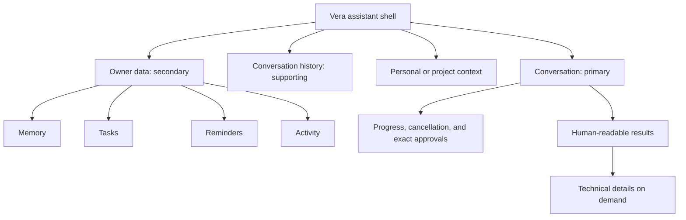
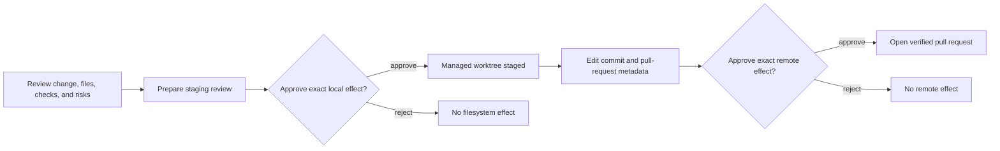

# Vera Interface Design

**Status:** Implemented design language
**Last updated:** 27 August 2026

## Purpose

Vera's universal frontend is the owner's primary conversational interface to
the system. It should make broad capability feel calm and understandable while
preserving the approvals, provenance, and control required by the
[Product Charter](product-charter.md).

## Design character

The interface uses a **quiet intelligence** visual language:

- deep graphite surfaces rather than pure black;
- warm, readable text with restrained muted-gold accents;
- generous spacing and continuous corners;
- subtle depth and motion instead of decorative sci-fi effects;
- human language in the primary interface, with exact technical data available
  through explicit detail disclosures.

Vera should feel capable and attentive. It should not resemble a terminal, a
generic chatbot, or a dashboard that asks the owner to choose a subsystem before
expressing intent.

## Information hierarchy

Conversation remains the starting point on every platform. The owner-data
surfaces support the conversation rather than competing with it as equal app
destinations.

## Responsive behavior

- On compact screens, the conversation list is a full-height modal drawer and
  owner data is a near-full-height bottom sheet.
- On wide screens, conversation history remains visible and owner data opens as
  a right-side inspector.
- The conversation header exposes one compact context selector. `Personal` is
  the human-facing label for no project scope.
- The message viewport is independently scrollable and the composer remains
  keyboard- and safe-area-aware.
- Web document and application backgrounds use the same canvas color so browser
  overscroll and mobile viewport gaps cannot reveal a white page.

## Interaction rules

- All primary controls have at least a 44 by 44 point target and an accessible
  name.
- Prompt starters populate an editable draft and never submit automatically.
- The owner can refresh Vera without reloading the browser: the header exposes
  an always-available refresh action, and pulling down from the top of the
  conversation refreshes on native and web surfaces. Refresh preserves the
  message draft while synchronizing the active conversation, active run,
  projects, conversation history, memory, tasks, reminders, and inbox.
- Voice capture is one continuous recording with elapsed time and no silence
  cutoff. While recording, two distinct controls stop into an editable
  transcript or stop, transcribe, and send through the typed-message path.
  Transcription runs once after capture and never submits on its own.
- Run progress, cancellation, and approval remain inside the conversation where
  the relevant intent was expressed.
- Approval cards keep the action, target, network authority, side effects, and
  exact arguments inspectable before a decision.
- Structured results are presented as task-specific cards. Opaque identifiers,
  hashes, raw payloads, and artifact metadata remain available under
  `Technical details`; arbitrary assistant text is never altered to hide data.

## Software delivery in conversation

A completed software-change artifact is not a terminal blob. Its result card
is the durable owner interface for taking that exact change through staging and
publication:

- The card shows human-readable change evidence before offering an effect.
- Staging and publication remain separate reviews; neither button silently
  grants the authority of the next phase.
- Pull-request metadata is editable before publication preparation. The exact
  frozen repository, branches, files, author, commit, and PR payload remain
  inspectable at approval time.
- Active work follows durable status and exposes cancellation only when the API
  says cancellation is still truthful.
- Refresh or process restart rebuilds the latest active or successful delivery
  chain from owner-scoped API discovery. The device does not become a second
  operational store.
- A successful publication renders only a canonical HTTPS GitHub pull-request
  URL as an external action. Full aggregates remain available under Delivery
  evidence and Technical details.

## Accessibility and quality

- Text and controls must retain readable contrast against every surface.
- Important content and technical values remain selectable.
- Dynamic content uses live-region semantics where it communicates progress.
- Layouts must avoid horizontal overflow at phone, tablet, and desktop widths.
- Visual verification covers empty, active, approval, progress, error, drawer,
  owner-data, voice, and structured-result states.
