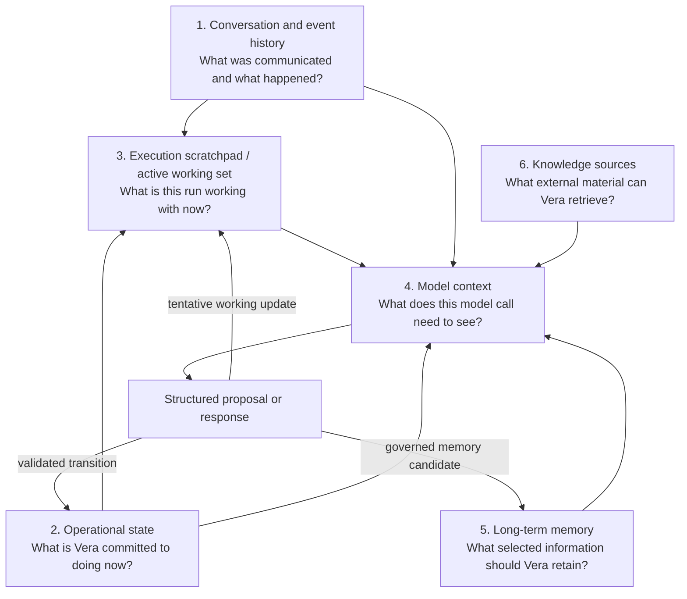
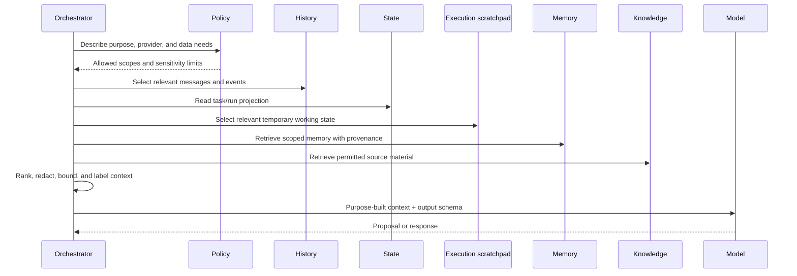
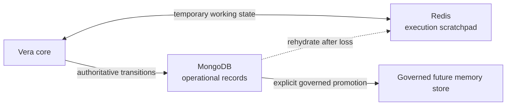
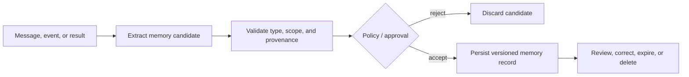

# Vera Memory and Context Architecture

**Status:** Proposed for broader memory and retention policy; the separation of
durable state, rebuildable execution scratchpad, and disposable model context
is Accepted through ADR-0007, and MongoDB/Redis operational storage is Accepted
through ADR-0010
**Version:** 0.3
**Last updated:** 24 August 2026

## Purpose

The initial discussion used the word `scratchpad` to explore how Vera would
retain temporary information while a request was being processed. It considered
a Markdown file, then Redis, and separately discussed a durable database and
vector search for long-term memory.

That exploration identified a real need, but it combined several different
information lifecycles. This document separates them so that storage products
can be selected against explicit semantics.

The original `scratchpad` meant the live working state of an entire flow, not
merely private notes inside one model invocation. That distinction is preserved
below.

## The six information layers

Each layer has different truth, durability, privacy, query, and expiration
requirements. They may share infrastructure, but they must not share semantics.

## Conversation and event history

Conversation history records immutable messages. Event history records
immutable execution facts. Together they answer what was said and what happened.

They are durable evidence, not automatically the context for every future
model call. Passing an entire history increases cost, reduces relevance, and may
cross privacy or provider boundaries.

Examples:

- the owner submitted a message at a particular time;
- Vera created a task from that message;
- a model proposal was accepted or rejected;
- a capability invocation began and produced an artifact;
- an approval was granted by the owner;
- cancellation was requested and later confirmed.

## Operational state

Operational state is Vera's authoritative representation of current
commitments and execution.

It includes:

- conversation metadata;
- tasks and their desired outcomes;
- run and step states;
- capability invocations and idempotency identities;
- approvals;
- current projections derived from events;
- artifact metadata;
- retry, timeout, and cancellation information.

Operational state must survive process restart. It must support atomic or
otherwise safe transitions and prevent two workers from performing the same
side effect accidentally.

This is not disposable scratchpad data and should not be represented primarily
as Markdown or only in Redis.

## Execution scratchpad and active working set

The execution scratchpad is the isolated, mutable workspace of one active run.
It may contain:

- a working copy of the original request and current step;
- tentative model proposals and orchestration decisions;
- the current plan and selected capability;
- intermediate tool or capability results;
- temporary summaries, errors, and retry information;
- references to artifacts or related work; and
- counters or leases used while coordinating the active run.

Redis is the selected V1 store for this layer because it offers structured
values, atomic operations, TTLs, and efficient isolated access. The scratchpad
is nevertheless rebuildable. Anything required for recovery,
authorization, audit, idempotency, or explaining an external effect must be
persisted first in the authoritative operational store.

Losing Redis may discard reproducible intermediate work. It must not erase a
task, approval, accepted decision, invocation identity, completed effect, or
durable event. On loss, Vera reconstructs the working set from durable records
and either resumes or safely classifies the run.

## Model context

Model context is a bounded projection assembled for one model invocation. It can
contain working information such as:

- the current user request;
- a task summary;
- the current plan or step;
- selected recent messages;
- relevant tool or capability results;
- applicable project facts and preferences;
- capability descriptions;
- policy constraints;
- errors the model is being asked to diagnose.

Model context may include selected scratchpad content, but it is not the entire
scratchpad. One run can assemble several different provider- and purpose-bound
contexts from the same working set.

Key rules:

- model context is derived from authoritative sources;
- it is scoped to a particular purpose and provider;
- its contents are not all presumed true;
- it cannot grant authority;
- it may expire after the invocation or run;
- durable facts are promoted through an explicit process, not by copying either
  the whole context or scratchpad into memory.

## Long-term memory

Long-term memory answers, "What selected information should Vera be able to use
again?"

Potential classes include:

| Memory class | Example | Default posture |
|---|---|---|
| User-stated fact | "My primary development machine is the Mac Mini." | Retain with provenance if useful. |
| Preference | "Prefer npm workspaces." | Retain and allow correction. |
| Project knowledge | "Gatherle uses a particular development workflow." | Scope to the project. |
| Episodic summary | "A deployment investigation concluded X." | Retain selectively with source links. |
| Capability knowledge | "Capability version 2 supports cancellation." | Derive from registry, not conversational memory. |
| Inference | "The owner may prefer local models for private data." | Mark as inferred and require confirmation when consequential. |

A memory record needs identity, type, subject, scope, provenance, sensitivity,
confidence where relevant, timestamps, and retention/deletion behaviour.

Embeddings or vector indexes are retrieval mechanisms. They are not the memory
model and do not remove the need for provenance or access control.

## Knowledge sources

Knowledge sources are external or repository-backed materials Vera may retrieve
without treating them as personal memory.

Examples include:

- project repositories and documentation;
- issue trackers;
- cloud dashboards;
- uploaded documents;
- API documentation;
- indexed reports;
- capability-provided resources.

Retrieved content is untrusted data. It may be inaccurate, outdated, or contain
instructions intended to manipulate a model. Retrieval does not grant the
content authority over Vera.

## Context assembly

The context assembler should be observable. Vera should be able to explain at a
useful level which sources influenced a decision without exposing protected
system prompts, secrets, or irrelevant private content.

## Example: development request

For "Vera, continue the authentication ticket in Gatherle," a context package
might include:

- the current conversation message;
- the explicit identity of the Gatherle project;
- the referenced ticket and its retrieved details;
- the declared development capability and its input schema;
- the task's existing run history, if this is a continuation;
- project-specific approval rules;
- a memory stating the owner's tooling preference, with provenance;
- a prohibition against including unrelated personal conversations.

It should not automatically include every prior chat, every repository file,
raw GitHub or Jira tokens, or state from an unrelated AWS investigation.

## Storage implications

### Markdown

Markdown is appropriate for project design, human-readable reports, selected
artifacts, and debugging exports. It is not an adequate authoritative store for
concurrent runtime transitions.

### MongoDB

MongoDB is the selected V1 authoritative operational store. The implemented V1
shape is one versioned task-execution aggregate per task, transitioned with
optimistic compare-and-swap and protected by unique identity and idempotency
indexes. It may also fit future structured long-term memory, provided
operational records and governed memory remain logically separate and follow
different access, retention, and promotion rules.

Vera must not treat document flexibility as permission for schema drift.
Application schemas, database validation, explicit document versions, unique
idempotency indexes, and concurrency controls remain required. Product
selection does not waive the forced-restart and migration evidence required
before V1 is complete.

### Redis

Redis is the selected V1 active execution scratchpad. Each run receives an
isolated, versioned working set with an explicit expiration policy. A stale
write guard prevents an older aggregate projection from replacing a newer one.
Redis may later also support leases, rate limits, queues, caching, or pub/sub
when demonstrated.

Redis is never the sole source of facts needed for recovery or safe effects. A
scratchpad update that follows a durable transition is a rebuildable projection;
failure to update it must be recoverable from MongoDB without duplicating work.

### V1 operational storage topology

The arrows express authority. MongoDB and Redis are selected for the V1
single-node deployment by
[ADR-0010](decisions/0010-use-mongodb-for-operational-truth-and-redis-for-scratchpads.md).
Long-term memory storage is not selected by that decision.

### Artifact storage

Large files should not necessarily live in the operational database. Vera may
store content locally or in object storage while retaining durable metadata,
integrity information, and access rules in the authoritative store.

## Promotion into memory

Vera must distinguish user-stated information from model-derived inference. A
future user interface should allow the owner to inspect and correct meaningful
memory.

## Decisions still required

- Which memory classes, if any, are allowed in V1?
- What operational data retention is required?
- Will model contexts be retained for debugging, redacted, or discarded?
- Which data may be sent to each provider?
- What backup, migration, and deployment procedures will govern the selected
  MongoDB backend?
- What retention and inspection policy applies to Redis scratchpad projections?
- When is memory promotion automatic, approval-based, or forbidden?
- How will deletion propagate to derived indexes and artifacts?

Related persistence reasoning is recorded in
[ADR-0007](decisions/0007-separate-durable-state-from-model-context.md).
