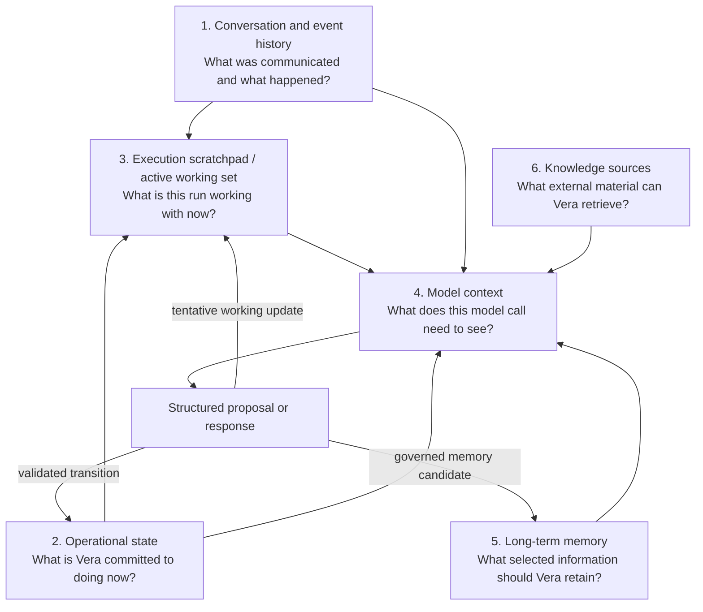
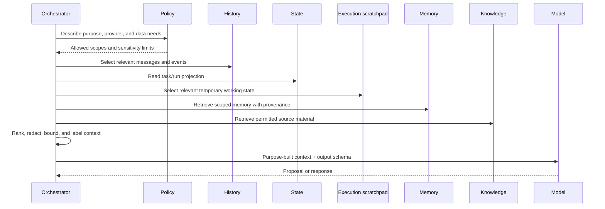
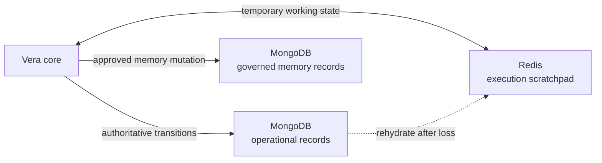
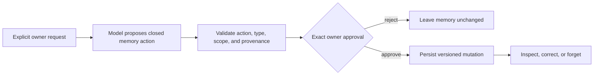

# Vera Memory and Context Architecture

**Status:** Accepted for the implemented information layers, explicit governed
memory, deterministic retrieval, and provider disclosure boundary; physical
erasure and third-party-provider memory disclosure remain open
**Version:** 0.6
**Last updated:** 26 August 2026

## Purpose

The initial discussion used the word `scratchpad` to explore how Vera would
retain temporary information while a request was being processed. It considered
a Markdown file, then Redis, and separately discussed a durable database and
vector search for long-term memory.

That exploration identified a real need, but it combined several different
information lifecycles. This document separates them so that storage products
can be selected against explicit semantics.

The original `scratchpad` meant the live working state of an entire flow, not
merely private notes inside one model invocation. That distinction is preserved
below.

## The six information layers

Each layer has different truth, durability, privacy, query, and expiration
requirements. They may share infrastructure, but they must not share semantics.

## Conversation and event history

Conversation history records immutable messages. Event history records
immutable execution facts. Together they answer what was said and what happened.

They are durable evidence, not automatically the context for every future
model call. Passing an entire history increases cost, reduces relevance, and may
cross privacy or provider boundaries.

### Implemented V1 conversation projection

For one conversation task, Vera freezes only prior complete owner/Vera turn
pairs from the exact same scope. Project-scoped messages match the same
`projectId`; unscoped messages match only unscoped history. Incomplete turns and
other scopes are counted as exclusions. Vera then keeps the most recent whole
turns within 20-message and 40,000-character defaults, configurable through
`CONVERSATION_CONTEXT_MAX_MESSAGES` and
`CONVERSATION_CONTEXT_MAX_CHARACTERS`.

The task aggregate stores both the selected messages and a manifest containing
their message/task identities, roles, SHA-256 hashes, sizes, limits, and
exclusion counts. Vera validates that frozen bundle before every provider call.
Only the ordered role/content pairs—not internal IDs, hashes, limits, or
exclusion counts—cross the provider boundary. History is labelled untrusted
and cannot grant authority.

When a conversation task becomes terminal, the same authoritative transition
records a pending Vera reply. The worker idempotently appends it to conversation
history and marks the projection complete. This makes owner and Vera messages
durable dialogue while preserving recovery across the two document writes. It
also backfills terminal conversation runs that predate the projection field;
owner and Vera idempotency are independently namespaced by role. It does not
promote either message into long-term memory. See
[ADR-0016](decisions/0016-freeze-bounded-conversation-context-and-durably-project-replies.md).

Examples:

- the owner submitted a message at a particular time;
- Vera created a task from that message;
- a model proposal was accepted or rejected;
- a capability invocation began and produced an artifact;
- an approval was granted by the owner;
- cancellation was requested and later confirmed.

## Operational state

Operational state is Vera's authoritative representation of current
commitments and execution.

It includes:

- conversation metadata;
- tasks and their desired outcomes;
- run and step states;
- capability invocations and idempotency identities;
- approvals;
- scheduled reminders, expiring claims, and delivered inbox notifications;
- current projections derived from events;
- artifact metadata;
- retry, timeout, and cancellation information.

Operational state must survive process restart. It must support atomic or
otherwise safe transitions and prevent two workers from performing the same
side effect accidentally.

This is not disposable scratchpad data and should not be represented primarily
as Markdown or only in Redis.

## Execution scratchpad and active working set

The execution scratchpad is the isolated, mutable workspace of one active run.
It may contain:

- a working copy of the original request and current step;
- tentative model proposals and orchestration decisions;
- the current plan and selected capability;
- intermediate tool or capability results;
- temporary summaries, errors, and retry information;
- references to artifacts or related work; and
- counters or leases used while coordinating the active run.

Redis is the selected V1 store for this layer because it offers structured
values, atomic operations, TTLs, and efficient isolated access. The scratchpad
is nevertheless rebuildable. Anything required for recovery,
authorization, audit, idempotency, or explaining an external effect must be
persisted first in the authoritative operational store.

Losing Redis may discard reproducible intermediate work. It must not erase a
task, approval, accepted decision, invocation identity, completed effect, or
durable event. On loss, Vera reconstructs the working set from durable records
and either resumes or safely classifies the run.

## Model context

Model context is a bounded projection assembled for one model invocation. It can
contain working information such as:

- the current user request;
- a task summary;
- the current plan or step;
- selected recent messages;
- relevant tool or capability results;
- applicable project facts and preferences;
- capability descriptions;
- policy constraints;
- errors the model is being asked to diagnose.

Model context may include selected scratchpad content, but it is not the entire
scratchpad. One run can assemble several different provider- and purpose-bound
contexts from the same working set.

Key rules:

- model context is derived from authoritative sources;
- it is scoped to a particular purpose and provider;
- its contents are not all presumed true;
- it cannot grant authority;
- it may expire after the invocation or run;
- durable facts are promoted through an explicit process, not by copying either
  the whole context or scratchpad into memory.

Adaptive-goal continuation is one purpose-specific context. Vera reloads the
completed step artifacts from durable storage, verifies owner/task/run/project
scope and content integrity, then sends only ordered step purpose, capability,
artifact type, and artifact content to an owner-controlled orchestration brain.
Artifact IDs, invocation IDs, hashes, byte limits, and other internal audit
metadata remain local. The artifact content is explicitly labelled untrusted
and cannot grant authority. Which immutable artifacts informed the resulting
decision is persisted as evidence; this does not promote their contents into
long-term memory or automatically disclose them to the next capability.

## Long-term memory

Long-term memory answers, "What selected information should Vera be able to use
again?"

The implemented memory classes are:

| Memory class | Example | Default posture |
|---|---|---|
| User-stated fact | "My primary development machine is the Mac Mini." | Retain with provenance if useful. |
| Preference | "Prefer npm workspaces." | Retain and allow correction. |
| Project knowledge | "Gatherly uses a particular development workflow." | Scope to the project. |
| Instruction | "Ask before publishing changes." | Retain only after an exact approval. |

Every record has a stable identity, monotonically increasing revision, type,
subject, content, global or exact-project scope, owner-message provenance,
sensitivity, timestamps, active/forgotten status, and prior revision history.
Vera does not silently extract memories from conversation or store model
inferences. `remember`, `list`, `correct`, and `forget` are closed
`memory_management@1` actions, and every conversational action receives its own
approval. Direct owner inspection uses read-only API projections. Correction
preserves identity and up to 100 prior revisions; a further correction fails
before persistence so the record cannot become unreadable. Forget creates a
tombstone, removes the record from active retrieval, and retains the audit
trail.

Before an owner-controlled orchestration-model call, Vera deterministically
selects active global and exact-project records, newest first, within 20-record
and 12,000-character limits. The task freezes a manifest containing identities,
revisions, hashes, scope, sizes, totals, limits, and exclusion counts. Vera
reloads and validates the records immediately before disclosure and fails
closed if any entry is missing, changed, forgotten, tampered, or out of scope.
Only kind, subject, content, scope, and sensitivity cross the model boundary;
internal IDs, hashes, provenance, and retrieval metadata stay local.

Third-party orchestration providers receive no long-term memory context. This
is an intentional data boundary, not a provider failure fallback. A separate
accepted disclosure policy is required before enabling cloud-memory context.
See
[ADR-0025](decisions/0025-use-explicit-versioned-owner-governed-memory.md).

Embeddings or vector indexes are retrieval mechanisms. They are not the memory
model and do not remove the need for provenance or access control. Vera does
not add one until deterministic retrieval becomes a measured quality problem.

## Knowledge sources

Knowledge sources are external or repository-backed materials Vera may retrieve
without treating them as personal memory.

Examples include:

- project repositories and documentation;
- issue trackers;
- cloud dashboards;
- uploaded documents and images;
- API documentation;
- indexed reports;
- capability-provided resources.

Retrieved content is untrusted data. It may be inaccurate, outdated, or contain
instructions intended to manipulate a model. Retrieval does not grant the
content authority over Vera.

## Context assembly

The context assembler should be observable. Vera should be able to explain at a
useful level which sources influenced a decision without exposing protected
system prompts, secrets, or irrelevant private content.

## Example: development request

For "Vera, continue the authentication ticket in Gatherle," a context package
might include:

- the current conversation message;
- the explicit identity of the Gatherle project;
- the referenced ticket and its retrieved details;
- the declared development capability and its input schema;
- the task's existing run history, if this is a continuation;
- project-specific approval rules;
- a memory stating the owner's tooling preference, with provenance;
- a prohibition against including unrelated personal conversations.

It should not automatically include every prior chat, every repository file,
raw GitHub or Jira tokens, or state from an unrelated AWS investigation.

## Storage implications

### Markdown

Markdown is appropriate for project design, human-readable reports, selected
artifacts, and debugging exports. It is not an adequate authoritative store for
concurrent runtime transitions.

### MongoDB

MongoDB is the selected V1 authoritative operational store. The implemented V1
shape is one versioned task-execution aggregate per task, transitioned with
optimistic compare-and-swap and protected by unique identity and idempotency
indexes. It may also fit future structured long-term memory, provided
operational records and governed memory remain logically separate and follow
different access, retention, and promotion rules.

Vera must not treat document flexibility as permission for schema drift.
Application schemas, database validation, explicit document versions, unique
idempotency indexes, and concurrency controls remain required. Product
selection does not waive the forced-restart and migration evidence required
before V1 is complete.

### Redis

Redis is the selected V1 active execution scratchpad. Each run receives an
isolated, versioned working set with an explicit expiration policy. A stale
write guard prevents an older aggregate projection from replacing a newer one.
Redis may later also support leases, rate limits, queues, caching, or pub/sub
when demonstrated.

Redis is never the sole source of facts needed for recovery or safe effects. A
scratchpad update that follows a durable transition is a rebuildable projection;
failure to update it must be recoverable from MongoDB without duplicating work.

### V1 operational storage topology

The arrows express authority. MongoDB and Redis are selected for the V1
single-node deployment by
[ADR-0010](decisions/0010-use-mongodb-for-operational-truth-and-redis-for-scratchpads.md).
ADR-0025 separately selects a governed MongoDB collection and contract for
long-term memory; Redis never becomes memory authority.

### Artifact storage

Large files should not necessarily live in the operational database. Vera may
store content locally or in object storage while retaining durable metadata,
integrity information, and access rules in the authoritative store.

## Governed memory mutation

Vera does not automatically extract memory candidates from general messages,
events, or model inferences. The universal frontend and owner CLI let the owner
inspect memory and request explicit correction or forgetting through the same
approval-gated capability.

## Decisions still required

- What operational data retention is required?
- Will model contexts be retained for debugging, redacted, or discarded?
- Under what separately accepted policy, if any, may governed memory be sent to
  third-party model providers?
- What backup, migration, and deployment procedures will govern the selected
  MongoDB backend?
- What retention and inspection policy applies to Redis scratchpad projections?
- How will deletion propagate to derived indexes and artifacts?

Related persistence reasoning is recorded in
[ADR-0007](decisions/0007-separate-durable-state-from-model-context.md).
