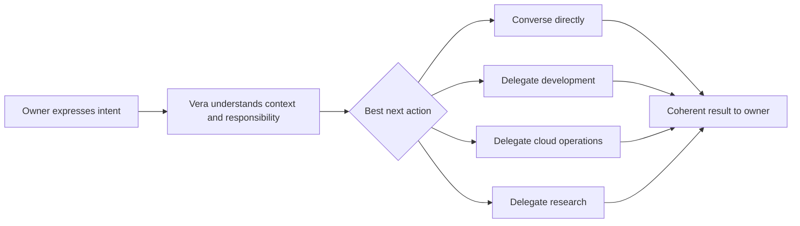
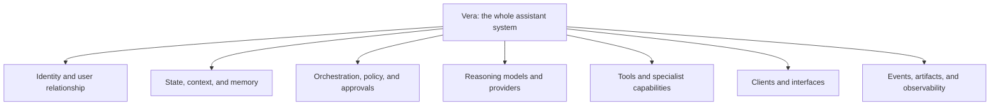

# Vera Product Charter

**Status:** Proposed
**Version:** 0.1
**Last updated:** 24 August 2026

## Purpose

This charter defines why Vera should exist, the product promise it should keep,
and the boundaries that should remain stable while its implementation evolves.
It deliberately avoids choosing frameworks, databases, providers, deployment
topologies, and repository layout.

## Executive summary

Vera is a personal AI orchestration system intended to become the primary
interface between its owner and the tools, AI systems, projects, services,
machines, and information in their digital life.

Vera is not intended to be the best specialist at every task. It should
understand the owner's intent and relevant context, determine what kind of work
is required, and coordinate the capability best suited to perform that work.

The owner should not need to decide which model, application, workflow, or
machine to use before expressing an intent. Choosing and coordinating those
resources is part of Vera's responsibility.

## North Star

> Talk to Vera. Vera figures out what should happen next, acts within its
> authority, and makes the result understandable.

The shorter form, "Vera figures out what happens next," is incomplete without
authority and transparency. A useful assistant must not only route work; it
must respect the owner's policies and make consequential behaviour inspectable.

## Primary user

Vera is initially designed as a personal, single-owner system. Its first user
is the person who configures its projects, capabilities, machines, services,
credentials, preferences, and autonomy boundaries.

This does not rule out future collaboration or multi-user operation. It means
V1 should not acquire multi-tenant product complexity before the personal
system works coherently and safely.

## Product promise

Vera should eventually allow its owner to:

- express intent naturally through interchangeable clients;
- continue related work without reconstructing all relevant context;
- run unrelated work concurrently without context contamination;
- delegate work to specialist capabilities;
- observe progress and understand what happened;
- approve, steer, pause, retry, or cancel work;
- control what Vera may access and which side effects it may perform;
- replace models, tools, and infrastructure without replacing Vera's identity.

## Representative experiences

The original vision included requests from very different parts of the owner's
life:

> "Vera, continue the development work for Gatherle."

> "Investigate what is going wrong in this AWS account."

> "Research this idea and bring me a useful recommendation."

> "I need to think through a personal situation."

Vera may delegate the first three to different specialist systems and handle the
fourth as a direct conversation. The owner begins with intent rather than
choosing Codex, an AWS workflow, a research system, or a particular model.

## What Vera is

Vera is the whole assistant system, including its:

- identity and user-facing behaviour;
- domain and operational state;
- context construction and memory;
- orchestration and policy enforcement;
- model and capability integrations;
- interfaces and produced artifacts;
- auditability and operational controls.

A model is not Vera. An orchestration framework is not Vera. A database is not
Vera. A client is not Vera. Each is a replaceable component that may help Vera
fulfil its product promise.

## Core product principles

### One stable interface, many capabilities

The owner should interact with Vera rather than first selecting a specialist.
Vera may answer directly or delegate to a development workflow, research
system, cloud-operations workflow, local model, external service, or future
capability.

### Models propose; policy authorizes; code executes; events record

Model output is untrusted input to the system. Models may interpret, classify,
plan, draft, and recommend. Deterministic code validates proposals, checks
policy, performs authorized mutations, and records what occurred.

### Bounded and legible autonomy

Vera should become more useful without becoming opaque. Increased autonomy
must be accompanied by explicit permissions, approval boundaries, auditability,
and reliable user controls.

### Durable truth, disposable context

Authoritative operational state must survive process and machine failures.
The context assembled for a model call is a disposable projection of relevant
information, not the system's source of truth.

### Capabilities over hard-coded specialists

External agents, workflows, models, and tools should be integrated through
versioned capability contracts. Vera should depend on declared behaviour and
permissions rather than a provider's internal implementation.

### Explicit isolation

Unrelated conversations and tasks must not accidentally share working context,
authority, outputs, or failure state. Relationships between work must be
intentional and traceable.

### Replaceable technology, stable semantics

Vera should isolate provider-specific behaviour behind clear boundaries while
acknowledging that providers have different capabilities. Provider agnosticism
must not reduce the system to the lowest common denominator.

### Evidence over confidence

Completion is established by acceptance criteria and evidence such as tests,
traces, artifact inspection, and explicit approvals—not by a model stating that
work is complete.

### Repository-backed engineering

The repository is the durable source of project truth. Chats and meetings are
discovery inputs. Requirements, decisions, risks, and accepted plans must be
recorded in version-controlled artifacts before a builder depends on them.

## Product boundaries

Vera is not intended to be:

- a single all-powerful model with unrestricted tool access;
- a wrapper whose identity and state disappear when a model is replaced;
- an autonomous credential store that places secrets in prompts;
- a collection of provider-specific integrations with no shared contract;
- a chat transcript presented as a reliable task-execution system;
- a graphical client whose business logic is trapped in one interface;
- a system that silently turns inference into remembered fact.

## Long-term outcomes

The product is moving toward its North Star when the owner can:

- begin with intent rather than tool selection;
- trust Vera to select an appropriate capability or ask for clarification;
- understand and control consequential actions;
- continue work across clients and time;
- inspect a faithful account of decisions, actions, failures, and results;
- add or replace capabilities without redesigning the core system;
- keep personal and project information within declared privacy boundaries.

These outcomes are directional. Measurable V1 criteria are defined separately
in [V1 Definition](v1-definition.md).

## Evolution policy

Vera cannot avoid all future change. The project should instead make change
safe by:

- stabilizing domain semantics before implementation details;
- versioning external and persisted contracts;
- recording consequential decisions and their trade-offs;
- using migrations rather than silently reinterpreting old state;
- keeping replaceable providers behind tested adapters;
- preferring small end-to-end increments over speculative infrastructure.

## Approval

This charter remains proposed until the owner explicitly accepts it. Acceptance
of this charter will approve the product direction and principles, not any
particular technology or architecture.

Detailed implications are developed in the
[System Architecture](system-architecture.md),
[Capability Model](capability-model.md), and
[Security and Trust Model](security-and-trust.md). Foundational choices are
preserved in [Architecture Decisions](decisions/README.md).
