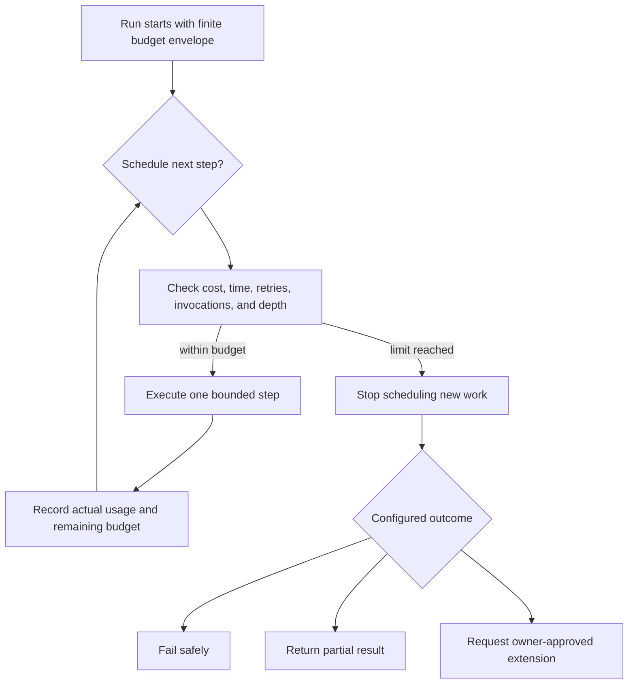
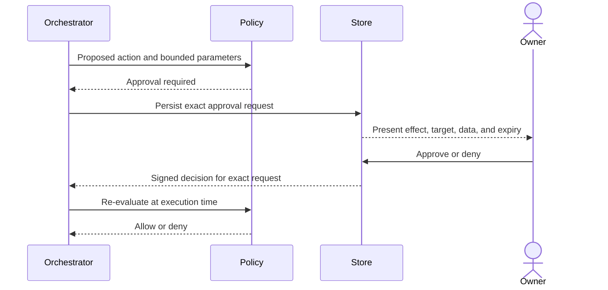

# Vera Security and Trust Model

**Status:** Accepted
**Version:** 0.1
**Last updated:** 24 August 2026
**Accepted:** 24 August 2026 (owner)

## Purpose

Vera is intended to reach across personal information, projects, machines,
models, services, and credentials. Security is therefore part of the product
model, not a hardening phase after orchestration works.

This document defines the initial trust posture and the minimum security
properties required even for a single-owner prototype.

## Core rule

> Natural-language intent may propose authority, but it never grants authority.

Permissions come from authenticated identity, configured policy, and narrowly
scoped approvals. Neither a model nor retrieved content can expand them.

## Trust boundaries


Running a service on the owner's Mac does not automatically make all inputs,
models, packages, or invoked processes trusted.

## Threat categories

### Prompt injection and instruction confusion

Retrieved documents, issue descriptions, web pages, emails, tool outputs, and
capability results may contain text that asks a model to ignore Vera's rules or
perform unrelated actions.

Mitigations include:

- label external material as data rather than instructions;
- keep policy enforcement outside the model;
- minimize context and available tools;
- validate every proposed capability invocation;
- require approval for sensitive effects;
- do not let content select or reveal credentials.

### Excessive agency

A broad generic shell, cloud credential, or filesystem tool can turn a minor
reasoning error into a major side effect.

Capabilities should be narrow, typed, scoped to an environment, and explicit
about effect. Generic execution should occur only in a sandbox with a declared
manifest and policy.

### Credential exposure

Raw credentials must not appear in:

- model prompts or context;
- conversation messages;
- ordinary event payloads;
- logs or traces;
- capability descriptions;
- client bundles;
- generated artifacts.

Models and clients should use opaque credential references. The credential
broker resolves those references only for an authorized invocation and passes
the minimum secret material to the execution environment.

### Cross-task data leakage

Concurrency creates a risk that one task receives another task's context,
artifacts, credentials, or events. Every read and invocation must be scoped to a
principal and the appropriate conversation, task, run, or project.

### Supply-chain and capability compromise

Installed packages, MCP servers, local executables, and remote workflows are
code execution dependencies. Capability registration must not imply unlimited
trust. Versions, origins, permissions, and runtime isolation must be visible.

### Incorrect durable memory

Model inference may be wrong or overly sensitive. Memory promotion requires
provenance, scope, and policy. Consequential inferred facts should be confirmed
rather than silently treated as owner statements.

## Authorization model

Every proposed operation is evaluated against:

```text
principal
  + requested action
  + target resource and environment
  + capability and version
  + data classification
  + requested credential scopes
  + expected side effects
  + cost and rate limits
  + existing approvals
  = allow | deny | require approval
```

Authorization decisions are deterministic and recorded. A model may explain or
recommend but cannot produce its own authorization token.

## Resource and delegation budgets

Cost control and loop prevention are authorization responsibilities, not prompt
suggestions. Every task and run must have a finite, deterministic budget
envelope covering the resource dimensions relevant to its work.

At minimum, Vera's policy model must be capable of limiting:

- monetary or provider usage cost;
- model calls and tokens;
- execution steps and capability invocations;
- wall-clock duration and individual timeouts;
- retries;
- child-task count and delegation depth.



Budget rules:

- child work inherits an allocated portion of the parent's remaining budget;
- delegation never resets cost, retry, time, or depth counters;
- only the authenticated owner or preconfigured policy may extend a budget;
- an extension is scoped, recorded, and re-evaluated before execution;
- exhaustion produces a distinct event and outcome rather than an unexplained
  model failure;
- capability-local limits may be stricter but cannot weaken Vera's envelope.

The implemented flat V1 envelope allows one initial model decision, one
capability invocation, one recovery retry, ten minutes of run duration, 40
context files, 200,000 total context bytes, 40,000 bytes per context file, and
a 100,000-byte plan artifact. Context, output, call, invocation, retry, and
duration limits are enforced in code. A provider-usage ceiling remains required
before V1 completion where the provider exposes a measurable unit; absence of
measurable usage must be recorded explicitly.

## Approval model



An approval must be narrow enough that the owner understands what will happen.
It should expire and should not silently authorize materially different inputs.

Example approval classes may include:

- read-only access to a named repository or cloud account;
- writing files in a bounded workspace;
- running tests or local commands;
- creating a pull request;
- changing cloud infrastructure;
- sending a message or publishing content;
- spending above a configured model or service threshold.

Exact classes remain to be designed.

## AWS example from the initial discussion

The initial vision said Vera should be able to investigate dashboards by
obtaining credentials for an AWS account or delegating to an AWS specialist.

The secure interpretation is:

1. Vera identifies the target account and read-only investigation capability.
2. Policy checks whether the owner and capability may access that account.
3. If required, the owner approves the exact scope and duration.
4. The credential broker obtains or resolves short-lived, least-privilege
   credentials.
5. Only the AWS execution environment receives the credential material.
6. The model receives normalized results, not the secret.
7. Every access and consequential recommendation is recorded.

Vera should not search the machine for ambient credentials and place them into
a model prompt.

## Data classification

An initial classification scheme should distinguish at least:

- public;
- internal project information;
- personal information;
- confidential business information;
- credentials and cryptographic material;
- highly sensitive personal information.

Provider and capability policies should declare which classes may cross their
boundaries. Redaction does not replace authorization.

## Audit and observability

Security-relevant records include:

- authentication and principal identity;
- proposal validation failures;
- policy decisions;
- approval requests and decisions;
- credential reference use;
- capability invocation and version;
- side-effect identities;
- cancellation and timeout outcomes;
- administrative policy changes.

Audit records must avoid storing the secrets or unnecessary sensitive payloads
they describe.

## V1 security floor

This section remains the accepted security target. Authentication is
intentionally not part of the current durable-worker and CLI increment because
the local and remote identity design has not yet been selected. Consequently,
the security floor is not yet complete: the implementation uses the explicit
development principal `owner_v1`, binds to loopback, and must not be exposed to
an untrusted network. Authentication is a pre-exposure requirement, not an
assumption that loopback traffic is authenticated.

V1 must demonstrate:

- an authenticated owner boundary, even if locally configured;
- one explicit approval-gated external disclosure and capability invocation;
- scoped capability input and authority;
- no raw secrets in model context, logs, events, or artifacts;
- rejection of an unauthorized structured proposal;
- separation between two concurrent tasks;
- finite configured ceilings for model calls, measurable cost or usage,
  wall-clock time or steps, retries, and capability invocations;
- delegation depth fixed at one, with child Vera tasks and recursive delegation
  rejected;
- a demonstrated safe stop when at least one configured ceiling is reached;
- a deterministic audit trail for the demonstrated journey.

The accepted target model above still requires inherited child budgets before
Vera later permits child tasks. V1 proves the simpler safe case by forbidding
them.

## Open questions

- How is the owner authenticated locally and remotely?
- Where are credentials stored and how are short-lived credentials obtained?
- Which data may be sent to local versus cloud models?
- What sandbox is required for local command and coding capabilities?
- How are capability packages verified and updated?
- Which approval decisions may be remembered, and for how long?
- What emergency stop or global revocation control is required?
