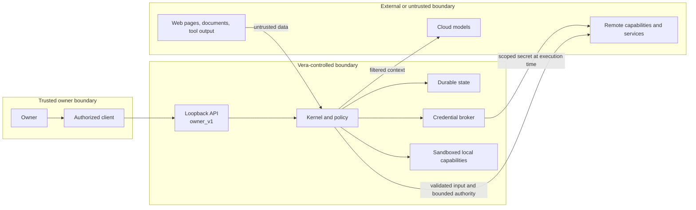
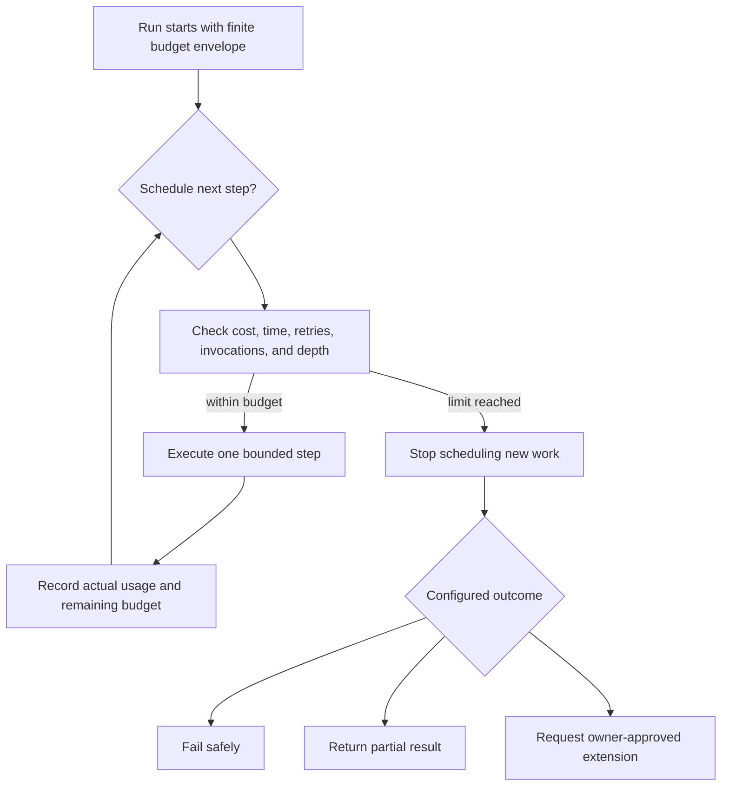
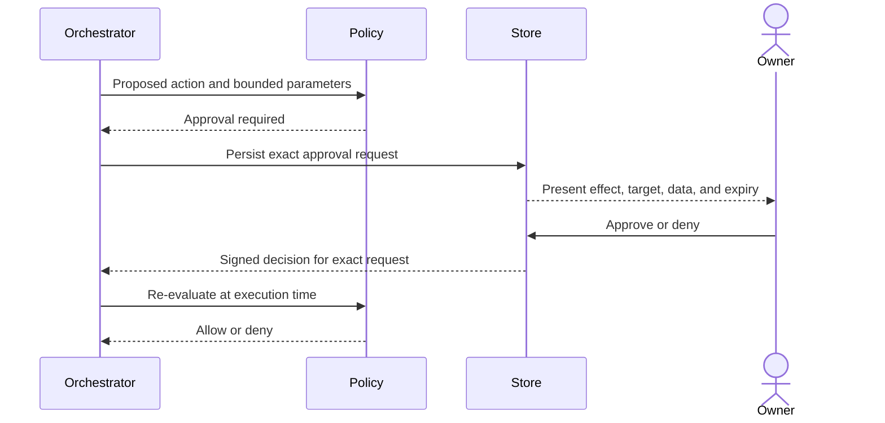

# Vera Security and Trust Model

**Status:** Accepted
**Version:** 0.9
**Last updated:** 4 September 2026
**Accepted:** 24 August 2026 (owner); V1 perimeter clarified by ADR-0014 and
cloud-provider policy clarified by ADR-0015 and bounded conversation disclosure
accepted by ADR-0016 on 25 August 2026
and managed-worktree application accepted by ADR-0018; bounded goal authority
accepted by ADR-0021 and personal-task integration authority accepted by
ADR-0022, with reminder scheduling and inbox authority accepted by ADR-0023 on
26 August 2026; adaptive evidence disclosure and budget authority accepted by
ADR-0024; governed memory and the universal frontend boundary are accepted by
ADRs 0025 and 0026; private physical-device ingress is accepted by ADR-0027;
reviewed device voice interaction is accepted by ADR-0028; and governed
software-change publication is accepted by ADR-0029 on 27 August 2026. Durable
owner attachments and approval-scoped analysis are accepted by ADR-0031;
grounded personal knowledge is accepted by ADR-0036 on 4 September 2026.
Privacy-safe proactive device delivery is accepted by ADR-0039 on 4 September
2026.

## Purpose

Vera is intended to reach across personal information, projects, machines,
models, services, and credentials. Security is therefore part of the product
model, not a hardening phase after orchestration works.

This document defines the initial trust posture and the minimum security
properties required even for a single-owner prototype.

## Core rule

> Natural-language intent may propose authority, but it never grants authority.

Permissions come from authenticated identity, configured policy, and narrowly
scoped approvals. Neither a model nor retrieved content can expand them.

## Trust boundaries



Running a service on the owner's Mac does not automatically make all inputs,
models, packages, or invoked processes trusted.

For V1 only, the trusted owner perimeter is the owner's Mac Mini account plus
authenticated SSH access or private Tailscale Serve ingress to Vera's
code-enforced loopback listener. Tailscale mode trusts every device permitted
by the owner's tailnet policy as `owner_v1`; it is not application-layer caller
identity. See
[ADR-0014](decisions/0014-use-the-host-session-as-the-v1-owner-boundary.md) and
[ADR-0027](decisions/0027-use-tailscale-serve-for-private-physical-device-access.md).

Browser CORS permits only HTTP(S) loopback origins, while native and CLI
requests may omit an Origin header. CORS is a browser-read restriction, not
authentication. ADR-0027 gives a physical browser one private same-origin
Tailscale Serve endpoint for both frontend and API; it does not add a remote
origin to CORS or permit LAN binding. See
[ADR-0026](decisions/0026-use-one-expo-react-native-frontend-for-web-and-mobile.md).

Voice capture is an explicit experience-layer disclosure under
[ADR-0030](decisions/0030-transcribe-owner-controlled-recordings-through-a-provider-neutral-boundary.md).
The owner must deliberately start and stop the microphone. The completed
recording crosses the frontend/API boundary only after Stop and is held only
for the synchronous transcription call: it is not logged or written to any
durable Vera store. The configured adapter determines disclosure:
`whisper_cpp` stays on the loopback owner host; `openai` sends the recording to
a third-party provider and uses server-held credentials. Configuration logs
make that boundary visible without exposing credentials.

The returned transcript remains untrusted natural-language input, cannot
approve a capability, and enters the durable system only through a separate
owner Send or Stop-and-send action. Provider error bodies are discarded because
they may echo audio-derived content. Supported content types and a 25 MB limit
bound memory use before inference. Spoken output is visible and stoppable
because it can disclose conversation content to nearby people.

Remote push delivery is a third-party transport boundary, not a trusted state
store. Expo receives only the device token, a fixed Vera title, a
category-level body, an opaque delivery ID, and an opaque attention deep link.
Conversation text, work titles, summaries, project identities, and approval
details do not enter the lock-screen payload. Push tokens and provider tickets
remain server-only; the Expo access token is server-held configuration and is
never returned to the universal frontend. The durable outbox, bounded retries,
receipt checks, and device invalidation are governed by
[ADR-0039](decisions/0039-deliver-attention-to-owner-devices-through-a-durable-outbox.md).

Uploaded documents and images are durable owner data under
[ADR-0031](decisions/0031-store-owner-attachments-and-analyze-them-through-exact-approval.md).
Vera bounds type, size, count, extracted characters, decoded pixels, normalized
dimensions, and normalized byte size; stores original bytes separately from
metadata and derived representations; and scopes reads and deduplication by principal.
Orchestration receives only filename, media type, and byte length. Attachment
IDs, hashes, original bytes, extracted text, and normalized images are withheld from that routing
request. Exact content is hash-verified and disclosed only after an approval
that names each attachment and the selected provider boundary. Cloud execution
declares `third_party_disclosure`; local execution does not.

Attachment content, including document text or pixels that resemble system
instructions or requests for credentials, remains untrusted capability input. It cannot expand the
approved objective, select another capability, or grant follow-on authority.
The model may cite only opaque source IDs. Vera maps those IDs to approved
sources, constructs the external citation fields itself, and accepts the result
only when attachment identity and filename match approved evidence; document
citations additionally require an exact locator and matching excerpt.

Attachment content never grants follow-on authority. Under
[ADR-0032](decisions/0032-compose-attachment-evidence-into-separately-approved-actions.md),
an attachment-driven request first produces an approved, validated analysis
artifact. An owner-controlled continuation may use that artifact as
`decisionEvidence` to derive exact arguments, but the downstream capability
receives the complete artifact only when its declared contract accepts the type
and a second approval also lists it under `inputArtifacts`. Planning or change
steps that cite attachment analysis must bind it as an input or fail closed;
owner-state actions receive only the derived values.

Grounded personal knowledge is a separate durable data class under
[ADR-0036](decisions/0036-build-grounded-personal-knowledge-from-owner-approved-sources.md).
The knowledge store retains immutable source provenance, bounded searchable
chunks, per-chunk hashes, and a whole-source content hash. Reads are always
principal-scoped. Search verifies those hashes before returning evidence and
fails closed if stored text has changed. Removal tombstones the source and
erases its searchable chunks so later retrieval cannot disclose removed text.

Knowledge retrieval never grants authority. Local retrieval selects candidate
excerpts deterministically; a model may only synthesize an answer from those
bounded excerpts. Owner-controlled model execution is read-only and can run
without another prompt. Third-party synthesis requires an exact approval whose
authority declares `personal_knowledge` and `third_party_disclosure`. Provider
input uses synthetic source IDs plus title, locator, and excerpt only. Vera
rejects missing, invented, or out-of-set citations and maps accepted synthetic
IDs back to owner-visible provenance itself. Images cannot enter the knowledge
index until an integrity-checked attachment-analysis artifact covers the exact
approved attachment set.

## Threat categories

### Prompt injection and instruction confusion

Retrieved documents, issue descriptions, web pages, emails, tool outputs, and
capability results may contain text that asks a model to ignore Vera's rules or
perform unrelated actions.

Mitigations include:

- label external material as data rather than instructions;
- keep policy enforcement outside the model;
- minimize context and available tools;
- validate every proposed capability invocation;
- require approval for sensitive effects;
- do not let content select or reveal credentials.

### Excessive agency

A broad generic shell, cloud credential, or filesystem tool can turn a minor
reasoning error into a major side effect.

Capabilities should be narrow, typed, scoped to an environment, and explicit
about effect. Generic execution should occur only in a sandbox with a declared
manifest and policy.

Machine operations follow this rule concretely: the owner-operated catalog
contains the only executable paths and argument vectors Vera may use. The model
receives public IDs and allowed action names, never commands. Inspection and
service mutation use separate exact approvals; mutation must produce a matching
postcondition observation. Public machine IDs and labels may reach the selected
orchestration provider, so they must not contain secrets. Registered diagnostic
output becomes owner-visible artifact data and must not print credentials.
There is no generic shell capability.

### Credential exposure

Raw credentials must not appear in:

- model prompts or context;
- conversation messages;
- ordinary event payloads;
- logs or traces;
- capability descriptions;
- client bundles;
- generated artifacts.

Models and clients should use opaque credential references. The credential
broker resolves those references only for an authorized invocation and passes
the minimum secret material to the execution environment.

V1 model-provider API keys are a narrower interim case: they are server-only
process configuration passed directly from a provider adapter into an HTTP
authorization header. They are never model input or client-visible state. A
credential broker remains required before Vera distributes capability
credentials or supports multiple principals.

### Cross-task data leakage

Concurrency creates a risk that one task receives another task's context,
artifacts, credentials, or events. Every read and invocation must be scoped to a
principal and the appropriate conversation, task, run, or project.

### Supply-chain and capability compromise

Installed packages, MCP servers, local executables, and remote workflows are
code execution dependencies. Capability registration must not imply unlimited
trust. Versions, origins, permissions, and runtime isolation must be visible.

### Incorrect durable memory

Model inference may be wrong or overly sensitive. Vera therefore stores no
automatically extracted or inferred memory. Remember, list, correct, and forget
are exact approval-gated actions with owner-message provenance and explicit
scope. Corrections preserve revision history; forgotten records are excluded
from retrieval. Frozen memory context is hash- and revision-verified before an
owner-controlled model call, and no memory is disclosed to a third-party
orchestration provider without a future separately accepted policy.
The model boundary enforces that rule again at invocation time, so restarting a
queued run under a third-party provider cannot disclose memory frozen while an
owner-controlled provider was active.

## Authorization model

Every proposed operation is evaluated against:

```text
principal
  + requested action
  + target resource and environment
  + capability and version
  + data classification
  + requested credential scopes
  + expected side effects
  + cost and rate limits
  + existing approvals
  = allow | deny | require approval
```

Authorization decisions are deterministic and recorded. A model may explain or
recommend but cannot produce its own authorization token.

Integration authority is calculated after action arguments are validated and
before an invocation can execute. A capability's maximum authority is only a
ceiling: the frozen approval must contain the exact authority for that action.
For `personal_task_management@1`, listing discloses `personal_task_data` with no
side effect; create, complete, and reopen additionally require
`personal_data_write`. Switching a local adapter for a remote provider must not
silently inherit network, credential, or third-party disclosure authority.

Personal tasks are owner-scoped durable data. Store reads and mutations include
the principal identity, public HTTP representations omit internal mutation
identifiers, and invocation-based idempotency cannot cross owner boundaries.
The V1 read API remains protected only by the accepted loopback owner perimeter;
it must not be exposed remotely before a stronger identity decision.

## Resource and delegation budgets

Cost control and loop prevention are authorization responsibilities, not prompt
suggestions. Every task and run must have a finite, deterministic budget
envelope covering the resource dimensions relevant to its work.

At minimum, Vera's policy model must be capable of limiting:

- monetary or provider usage cost;
- model calls and tokens;
- execution steps and capability invocations;
- wall-clock duration and individual timeouts;
- retries;
- child-task count and delegation depth.



Budget rules:

- child work inherits an allocated portion of the parent's remaining budget;
- delegation never resets cost, retry, time, or depth counters;
- only the authenticated owner or preconfigured policy may extend a budget;
- an extension is scoped, recorded, and re-evaluated before execution;
- exhaustion produces a distinct event and outcome rather than an unexplained
  model failure;
- capability-local limits may be stricter but cannot weaken Vera's envelope.

The original flat V1 envelope allowed one initial model decision and one
capability invocation. The accepted goal increments now permit at most four
model calls and three capability invocations. A fixed goal normally uses one
initial decision; an adaptive goal may use one additional continuation decision
after each of at most three validated observations. Both retain one recovery
retry, ten minutes of run duration, 40 context files, 200,000 total context
bytes, 40,000 bytes per context file, and a 100,000-byte capability artifact.
Context, observation, output, call, invocation, retry, and duration limits are
enforced in code. Each step has its own exact approval; a prior artifact used as
capability input adds an explicit `artifact_content` disclosure and is
hash-checked before use. Evidence that only informed the orchestration decision
is disclosed separately as `decisionEvidence` and is not passed to the next
capability. Model adapters additionally send a
configured maximum output-token request and record provider token usage when it
is returned. The fixed three-step ceiling provides a finite per-operation
boundary without allowing a self-extending model loop.
Cumulative token or monetary accounting is required before increasing those
call counts or enabling provider fallback/routing; absence of measurable usage
must remain explicit.

Adaptive continuation introduces a second model-data boundary because
capability artifacts can contain project, personal, or third-party data not
present in the owner's original request. The implemented rule is fail-closed:
only an `owner_controlled` orchestration provider may receive minimized artifact
type and content, and third-party profiles do not receive the adaptive proposal
schema at all. Recovery with a cloud brain stops before disclosure. Enabling
cloud continuation requires a new exact evidence-disclosure approval policy;
startup provider selection is not sufficient consent. Artifact contents remain
untrusted even inside the owner boundary and cannot grant authority through
prompt instructions.

Natural-language completion is not proof that an effect occurred. Adaptive
plans therefore persist a capability-backed requirement for every requested
outcome. Code rejects completion unless each requirement is resolved exactly
once, each satisfied outcome cites an observation from its declared capability,
and any not-applicable outcome was explicitly conditional and cites evidence.
The owner reply includes a code-authored outcome and execution ledger; model
prose cannot silently manufacture a reminder, task, code change, or other side
effect.

## Approval model



An approval must be narrow enough that the owner understands what will happen.
It should expire and should not silently authorize materially different inputs.

Example approval classes may include:

- read-only access to a named repository or cloud account;
- writing files in a bounded workspace;
- running tests or local commands;
- creating a pull request;
- changing cloud infrastructure;
- sending a message or publishing content;
- spending above a configured model or service threshold.

Exact classes remain to be designed.

## AWS example from the initial discussion

The initial vision said Vera should be able to investigate dashboards by
obtaining credentials for an AWS account or delegating to an AWS specialist.

The secure interpretation is:

1. Vera identifies the target account and read-only investigation capability.
2. Policy checks whether the owner and capability may access that account.
3. If required, the owner approves the exact scope and duration.
4. The credential broker obtains or resolves short-lived, least-privilege
   credentials.
5. Only the AWS execution environment receives the credential material.
6. The model receives normalized results, not the secret.
7. Every access and consequential recommendation is recorded.

Vera should not search the machine for ambient credentials and place them into
a model prompt.

## Data classification

An initial classification scheme should distinguish at least:

- public;
- internal project information;
- personal information;
- confidential business information;
- credentials and cryptographic material;
- highly sensitive personal information.

Provider and capability policies should declare which classes may cross their
boundaries. Redaction does not replace authorization.

Ollama and deterministic model providers are owner-controlled. Selecting an
OpenAI or Gemini startup profile explicitly permits the owner message and
minimal selected-project identity, plus bounded prior complete turns from the
exact same project scope, to cross that third-party model boundary. The frozen
manifest makes this history inspectable and excludes incomplete or other-scope
turns, but remains local: only ordered role/content pairs are disclosed, not
internal task/message IDs, hashes, limits, or exclusion counts. Repository
contents, credentials, unrelated conversations, long-term
memory, and capability authority are excluded. Exact project context sent
through a cloud-backed capability
remains separately approval-gated. Vera never falls back automatically across
provider boundaries. See
[ADR-0015](decisions/0015-select-model-providers-through-explicit-profiles.md)
and
[ADR-0016](decisions/0016-freeze-bounded-conversation-context-and-durably-project-replies.md).

### Isolated software-change boundary

Approval of `software_change@1` grants write authority only inside a newly
created disposable snapshot containing the exact approved context. It does not
grant write authority over the registered repository. The production adapter
must run ephemerally, must not load repository agent-instruction files, and must
not use credentials or network effects. Vera rejects credential-like paths,
agent instruction files, symlinks, binaries, path escapes, generated dependency
trees, and changes beyond the run's file and artifact ceilings.
The subprocess receives an allowlisted runtime environment; Vera's model API
keys, MongoDB and Redis configuration, selected profiles, and unrelated server
variables are not inherited.

The specialist supplies a human-readable report, but Vera derives the patch,
file operations, sizes, and before/after hashes from the resulting filesystem.
Applying that patch, committing it, pushing it, or creating a pull request are
separate effects requiring separate policy and approval. This boundary is
accepted in [ADR-0017](decisions/0017-produce-software-changes-as-isolated-patch-artifacts.md).

### Managed software-change application boundary

The implemented application effect grants only the right to materialize the
exact approved patch on the disclosed branch and stage it inside the disclosed
managed Git worktree. Approval binds the artifact and patch hashes, immutable
base commit, project, path, file manifest, and staged outcome. It grants no
authority over the owner's active checkout, commits, remotes, credentials,
pushes, or pull requests.

Vera serializes mutation per registered project and verifies actual file hashes
and Git index state after execution and recovery. Cancellation may remove an
untouched managed worktree, but it cannot claim to reverse a patch already
staged. Ambiguous or partial state is quarantined as `review_required` for owner
inspection. See
[ADR-0018](decisions/0018-apply-approved-software-changes-in-managed-git-worktrees.md).

### Software-change publication boundary

Publication is a third authority boundary after patch generation and staged
application. Only a successful, version-frozen application is eligible. Before
approval Vera verifies and discloses the credential-free GitHub repository,
remote base-branch revision, Vera-managed head branch, staged tree and complete
file manifest, Git author, exact commit message, exact pull-request content,
and draft state. It independently matches the resulting file bytes and SHA-256
digests to the durable staged-application result before requesting approval.

The server constructs the authority envelope. Callers and models cannot enable
direct base-branch writes or force pushes. Execution disables repository Git
hooks and GPG signing, creates at most one commit, creates or verifies only the
approved `vera/change-*` remote branch, and creates or verifies one exact pull
request. It never rewrites an incompatible commit, branch, or pull request.
Movement of the base branch after approval or any ambiguous remote state fails
closed as `review_required`; the base revision is checked before remote work
and again after the pull request is verified.

Git and GitHub credentials remain in the host credential mechanisms. Remote
URLs containing embedded HTTPS credentials, queries, fragments, or unsupported
hosts are rejected. API resources expose the repository owner/name but not the
remote URL; lifecycle warnings contain classified failure codes rather than raw
subprocess output. Cancellation is limited to the period before execution so
Vera never presents an irreversible remote effect as rolled back. See
[ADR-0029](decisions/0029-publish-approved-software-changes-through-a-separate-durable-lifecycle.md).

### Delegated development-campaign boundary

A campaign approval delegates a finite outcome, not unrestricted repository
control. The approved effect freezes one objective, project, base revision,
specialist destinations, local gates, protected paths, delivery metadata,
attempt and duration ceilings, GitHub check/review policy, and merge method.
Models and clients cannot supply gate commands, lower ceilings, remove protected
paths, enable direct pushes, enable force pushes, or alter policy.

Built-in protected paths cover repository automation, dependency manifests,
environment files, campaign domain/application/adapter/persistence/HTTP code,
bootstrap composition, security documentation, and decision records. Operator
policy may add protection but cannot remove built-ins. A campaign-produced patch
touching any protected path becomes `review_required` before a gate or remote
effect runs.

Gate executables and arguments come only from the validated server catalog and
run without a shell in the exact managed worktree. Their process environment is
allowlisted; model, database, GitHub, SSH-agent, and unrelated service secrets
are not inherited. The same component producing code cannot change the
acceptance commands. This is not a hostile-code sandbox: V1 still relies on the
trusted Mac Mini account perimeter because a process running as that OS user may
reach user-readable files. Strong OS isolation is required before campaigns run
untrusted contributor code or leave the single-owner topology.
GitHub merge additionally verifies exact head and base identities, check and
review policy, and clean merge state. See
[ADR-0034](decisions/0034-delegate-bounded-development-campaigns-through-one-owner-approval.md).

Failed-check output and review comments are untrusted evidence, never
instructions or authority. A repair freezes bounded sanitized evidence and the
exact PR head in a new owner approval. The specialist receives only the derived
repair request and exact historical project context. Application code retains
commit and credential control, permits only a normal fast-forward of the
existing PR branch, and verifies the same PR afterward. Force-push, base push,
merge, and policy mutation remain prohibited by the repair effect. See
[ADR-0041](decisions/0041-repair-review-required-pull-requests-through-exact-approved-fast-forwards.md).

Conversational software-delivery control does not make model output an object
reference. A bounded owner-scoped catalog gives the model only the metadata it
needs to propose an existing ID; head revisions, URLs, internal project IDs,
credentials, policies, commands, and full objectives stay local. Application
code independently proves that the proposed ID follows from the owner's exact
ID, PR number, latest qualifier, recent same-conversation reference, or a
unique eligible candidate. Ambiguity fails closed. Execution re-reads durable
state, and repair preparation can create only ADR-0041's pending exact-head
approval. See
[ADR-0042](decisions/0042-resolve-conversational-software-delivery-references-in-application-code.md).

## Audit and observability

Security-relevant records include:

- authentication and principal identity;
- proposal validation failures;
- policy decisions;
- approval requests and decisions;
- credential reference use;
- capability invocation and version;
- side-effect identities;
- cancellation and timeout outcomes;
- administrative policy changes.

Audit records must avoid storing the secrets or unnecessary sensitive payloads
they describe.

## V1 security floor

This section remains the accepted security target. V1 establishes its owner
boundary at the deployment perimeter: the trusted Mac Mini account,
authenticated SSH session, and private owner-controlled tailnet admit traffic
to a listener whose configuration permits only loopback. The application uses
the explicit principal `owner_v1` inside that perimeter. This is sufficient
only for the single-owner V1 topology and does not authenticate HTTP callers
independently. Application authentication remains a precondition for shared or
multi-user exposure.

V1 must demonstrate:

- an authenticated owner deployment perimeter with code-enforced loopback and
  optional private Tailscale Serve ingress;
- one explicit approval-gated external disclosure and capability invocation;
- scoped capability input and authority;
- no raw secrets in model context, logs, events, or artifacts;
- rejection of an unauthorized structured proposal;
- separation between two concurrent tasks;
- finite configured ceilings for model calls, measurable cost or usage,
  wall-clock time or steps, retries, and capability invocations;
- delegation depth fixed at one, with child Vera tasks and recursive delegation
  rejected;
- a demonstrated safe stop when at least one configured ceiling is reached;
- a deterministic audit trail for the demonstrated journey.

The accepted target model above still requires inherited child budgets before
Vera later permits child tasks. V1 proves the simpler safe case by forbidding
them.

## Open questions

- How will application-layer principals be issued, authenticated, and revoked
  before Vera is exposed beyond the V1 private-device perimeter?
- Where are credentials stored and how are short-lived credentials obtained?
- Which additional data classes, if any, may future cloud-model policies
  authorize beyond current messages, minimal selected-project identity, and
  bounded same-scope conversation turns?
- What sandbox is required for local command and coding capabilities?
- How are capability packages verified and updated?
- Which approval decisions may be remembered, and for how long?
- What emergency stop or global revocation control is required?
