# Vera System Architecture

**Status:** Accepted (logical architecture, component responsibilities,
request lifecycle, architectural invariants, initial modular API shape, V1
operational storage, and the first Mac Mini deployment topology); general
progress transport remains open
**Version:** 1.5
**Last updated:** 4 September 2026
**Accepted:** 24 August 2026 (owner) — post-V1 progress transport and deployment
topology are deferred; V1 uses HTTP polling. The initial Fastify/Zod modular API
is accepted by ADR-0009. MongoDB operational truth and the Redis scratchpad are
accepted by ADR-0010. The V1 owner perimeter is accepted by ADR-0014 and the
startup-selected model-provider registry by ADR-0015. Conversation context and
reply projection are accepted by ADR-0016.
Software-change artifacts, controlled application, the enforced API module
map, and the declarative capability runtime with project-independent web
research are accepted by ADRs 0017–0020.
Bounded goal execution and typed artifact lineage are accepted by ADR-0021.
Provider-neutral integration actions and Vera-owned personal tasks are accepted
by ADR-0022. Durable reminders and the Vera-owned notification inbox are
accepted by ADR-0023; task progress continues to use polling.
Evidence-adaptive bounded goals are accepted by ADR-0024. Explicit governed
memory and its provider boundary are accepted by ADR-0025. The universal Expo
React Native frontend is accepted by ADR-0026, its private physical-device
ingress through Tailscale Serve is accepted by ADR-0027, and reviewed device
voice input and output are accepted by ADR-0028.
Owner-scoped attachments and approval-gated document analysis are accepted by
ADR-0031.
Grounded personal knowledge, source integrity, bounded retrieval, and cited
answers are accepted by ADR-0036.
Deterministic attention delivery through an owner-device registry, durable
outbox, and provider-neutral push worker is accepted by ADR-0039.
The owner-scoped Mac Mini service topology and explicit update boundary are
accepted by ADR-0040.

## Purpose

This document describes Vera's accepted logical architecture: the major
components, their responsibilities, the boundaries between them, and the
lifecycle of a request. It deliberately separates stable system semantics from
replaceable products and frameworks.

The architecture is evolutionary. V1 should implement the smallest credible
subset while preserving the boundaries required for future clients,
capabilities, local and cloud models, memory, and concurrent work.

## Architectural thesis

Vera is a durable, policy-controlled orchestration system that borrows
reasoning from models and delegates bounded work to capabilities.

The orchestrator is not itself a brain. It is application code that:

1. receives intent;
2. constructs relevant context;
3. asks a model or deterministic component for a structured proposal;
4. validates that proposal;
5. applies policy and approval rules;
6. coordinates execution;
7. records events and results;
8. keeps the user in control.

## System context

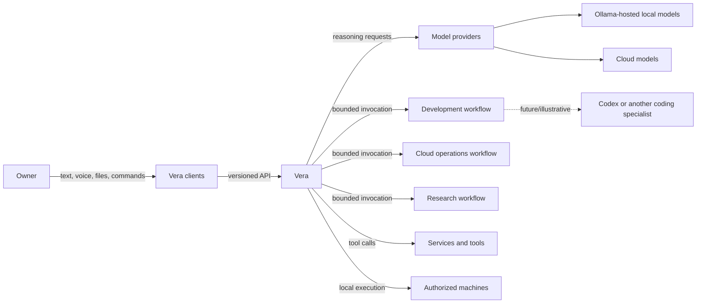

The owner interacts with Vera. Provider and capability selection is normally an
internal responsibility, although advanced clients may expose controls and
explanations.

## Logical architecture

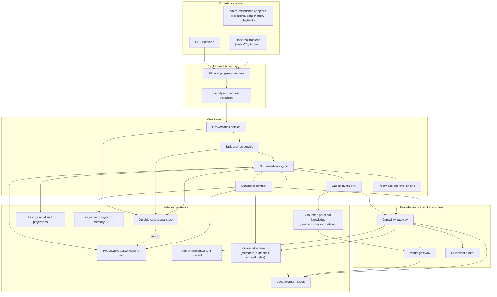

These are logical responsibilities, not necessarily separate processes in V1.
A modular monolith may implement several of them in one deployable service while
preserving internal boundaries.

## Component responsibilities

### API and progress interface

- authenticate the initiating principal;
- validate versioned request payloads;
- apply idempotency and request-size rules;
- create or continue conversations and tasks;
- expose current projections, events, approvals, and artifacts;
- expose progress without making a network connection the source of truth;
- contain minimal orchestration logic.

### Conversation service

- create and retrieve conversations;
- append immutable messages;
- associate messages with tasks and steering actions;
- produce client-facing summaries;
- prevent unrelated context from being included automatically.

### Task and run service

- create durable tasks and execution attempts;
- validate lifecycle transitions;
- coordinate retries without rewriting earlier attempts;
- expose current state derived from recorded transitions;
- distinguish task outcome from run outcome.

### Orchestration engine

- choose the next permitted step;
- request structured proposals where reasoning is useful;
- execute deterministic transitions;
- invoke policies, approvals, models, and capabilities;
- manage timeouts, retries, cancellation, and recovery;
- remain independent of one model provider or agent framework.

### Policy and approval engine

- determine whether a proposed operation is allowed, denied, or requires
  approval;
- evaluate principal, capability, data sensitivity, environment, and effect;
- enforce task and run budgets for cost, time, steps, retries, invocations, and
  delegation depth;
- issue narrowly scoped approval requests;
- ensure approval cannot be broadened by a model or capability.

### Capability registry

- declare stable capability identity, proposal schema, artifact, and authority;
- expose enabled and disabled capabilities without exposing credentials;
- supply only enabled contracts to model routing;
- resolve a frozen capability destination to its runtime adapter; and
- keep capability-specific parsing and validation outside the shared task
  lifecycle.

### Context assembler

- select relevant messages, task state, events, memory, project knowledge,
  policy, and capability descriptions;
- enforce token, sensitivity, provenance, and provider constraints;
- produce a disposable model-context projection;
- avoid sending the entire conversation or database by default.

Attachment content follows a stricter two-stage context path. The orchestration
projection contains minimal file metadata only. After an exact
`attachment_analysis@1` approval, the capability runtime independently loads
and integrity-checks bounded extracted segments and normalized images from the
attachment store. A separately configured vision provider may serve this
runtime without changing Vera's orchestration brain. The model selects opaque
source IDs; application code materializes citations from those exact approved
sources. This keeps provider selection replaceable and prevents ordinary
routing from becoming implicit attachment disclosure.

Attachment-derived actions continue through the bounded adaptive-goal path.
The owner-controlled brain may inspect the validated analysis to derive one
next typed action, but application code persists that reference as decision
evidence and creates a new approval. A downstream specialist receives the
analysis itself only when its declared artifact contract accepts the type and
the approval also freezes it as an input artifact. This separation is enforced
again during recovery and execution.

### Active working-set service

- maintain one isolated, versioned execution scratchpad per active run;
- store tentative plans, current-step data, intermediate results, and other
  disposable coordination state;
- apply explicit retention and expiration without using TTL as execution truth;
- require consequential decisions and effect identities to be durable before
  they are acted upon; and
- rebuild the working set from durable state after loss or classify the run for
  review when safe reconstruction is impossible.

### Model gateway

- provide a Vera-facing interface for structured reasoning and response
  generation;
- translate provider-specific request and response shapes;
- validate outputs and expose usage, latency, and failure metadata;
- select Ollama, OpenAI, Gemini, or deterministic implementations through an
  explicit startup registry and profile;
- select an attachment-vision provider and model independently from the
  orchestration brain while retaining the same normalized gateway contract;
- prohibit silent fallback across owner-controlled and third-party boundaries;
- make provider capabilities explicit rather than pretending all models are
  identical.

Provider-native structured-output support is an adapter concern. In
particular, the Ollama adapter derives a compatible grammar schema by removing
unsupported validation keywords. If Ollama rejects that grammar, the adapter
may retry the same request against the same Ollama model in JSON mode; it must
not select another provider. In every case, the unmodified Vera Zod schema is
the authoritative post-generation validator, so unsupported provider grammar
features never become relaxed domain contracts. The schema travels through the
model-provider port and is not duplicated as prompt prose: the prompt describes
selection policy and capability semantics, while the separate schema defines
the machine-readable output contract. Ollama reasoning mode is explicit
configuration because model families differ: the adapter forwards the selected
boolean or reasoning level, consumes only final structured content, and
discards the provider's separate reasoning trace.

The canonical distinction between a model provider such as Ollama and a Vera
capability is defined in the [Capability Model](capability-model.md#model-providers).

### Capability gateway

- invoke local functions, remote services, tools, agents, or workflows through
  a common lifecycle;
- enforce declared inputs and permissions;
- normalize progress, completion, failure, timeout, and cancellation;
- keep capability implementations out of Vera's private storage schema.

The gateway may delegate one closed action to an integration-action executor.
That port describes the logical integration, destination, readiness, exact
action authority, idempotent invocation identity, and normalized result. It
does not expose a vendor SDK to the orchestration lifecycle. A local Vera store
and a future remote service can therefore implement the same capability
contract without making the capability or model proposal vendor-specific.

### Credential broker

- resolve opaque credential references only after authorization;
- provide the narrowest credential suitable for an invocation;
- prevent raw credentials from entering prompts, ordinary events, or logs;
- record credential use without recording secret material.

### State and evidence services

- store authoritative conversations, tasks, runs, steps, approvals, and
  invocation records durably;
- record immutable events and build query-friendly projections;
- store artifact metadata and content through appropriate backends;
- expose long-term memory through its own governance rules;
- project current attention deterministically from authoritative resources and
  combine it with generation-scoped owner dispositions;
- project eligible attention into an idempotent per-device push outbox, while
  retaining Today and the source stores as truth;
- persist recurring routine definitions separately from their bounded run
  history, and recover due or interrupted runs through durable leases;
- correlate logs, metrics, traces, and domain identifiers.

The attention projector stores no duplicate task, reminder, run, mission, or
campaign status. MongoDB stores only append-only snooze, dismiss, and restore
decisions. API, conversational capability, and universal frontend consume the
same projector, so restart and client reconnection cannot produce competing
briefings.

The push projector reads that briefing and creates at most one delivery for an
exact `(device, attention item)` pair. A lease-coordinated worker sends a
category-only payload through a replaceable provider adapter, records the
provider ticket, and later resolves the delivery receipt. Registration time,
device status, category preferences, and quiet hours are enforced server-side;
the device token and provider ticket never cross the public API boundary.

The routine scheduler treats MongoDB as both schedule and authorization truth.
It materializes a deterministic run before advancing a daily civil-time
occurrence, then a lease-coordinated worker executes only the frozen registered
action snapshot. The first routine action reuses the machine operations port
for inspection only. Healthy results stay out of Today; unhealthy and failed
runs join the attention projection without creating duplicate mutable status.

## Request lifecycle

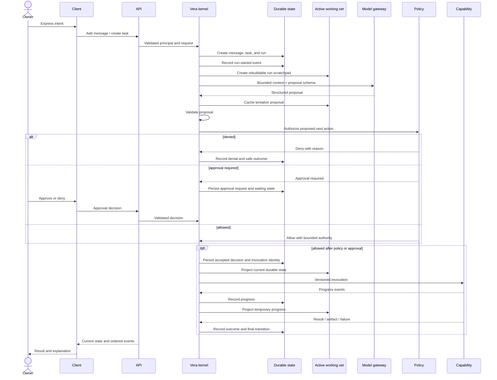

The client connection or active working-set store may disappear at any point.
Authoritative execution state remains in durable storage. The scratchpad can be
reconstructed after reconnection or restart; accepted work never depends only
on its survival.

## Bounded goal execution

Vera has two additive, versioned goal modes. A fixed goal is appropriate when
the complete safe composition is known before work starts. An adaptive goal is
appropriate when the next action depends on evidence not yet available.

### Fixed goal

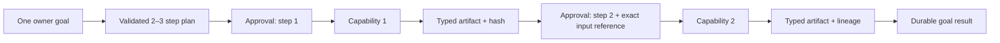

The model proposes this small graph; it does not control its execution. Vera
code admits only enabled capability versions, backward-only dependencies, and
declared artifact compatibility. The lifecycle advances one step at a time and
freezes a new approval whenever destination, authority, context, or artifact
disclosure changes. This is the implemented substrate for assistant-level
outcomes without adopting a provider-owned or unbounded agent loop.

A goal remains one run while it is short, sequential, and serves one outcome.
Independent delegated work will use child tasks so it can carry its own
lifecycle, budget, cancellation, and owner-visible result.

### Evidence-adaptive goal

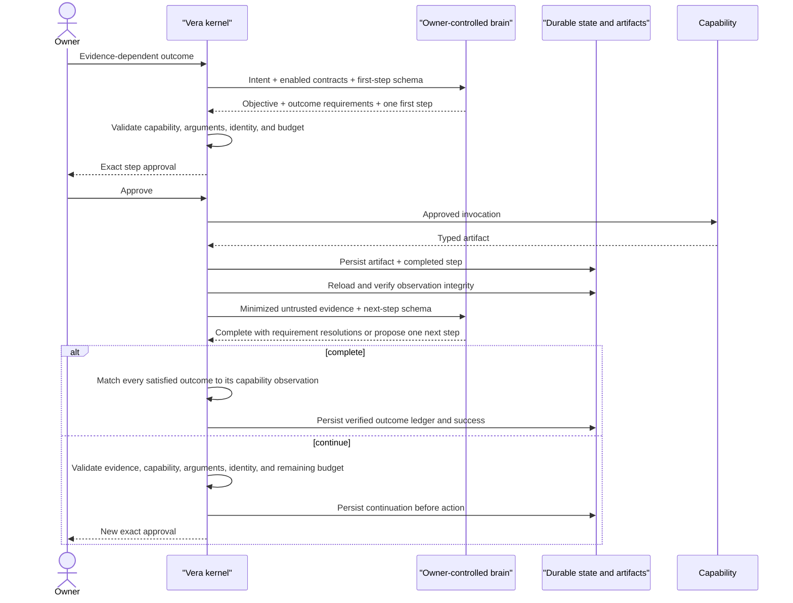

Adaptive execution does not expose an open model tool loop. Vera supplies the
next step identity, presents only enabled capability schemas, validates every
evidence reference and artifact hash, and stops after at most three capability
steps and four model calls. Evidence that informed a decision is recorded
separately from artifacts passed as invocation inputs. Every effect receives a
fresh exact approval.

The kernel also reconciles the initial model plan with conservative explicit
outcome signals owned by each capability declaration. A plainly requested
action omitted by the model becomes a durable requirement, not an automatic
invocation. Continuation schemas enumerate exact step and requirement IDs so
provider formatting cannot invent control-plane identity.

Capability artifact contents initially cross only an `owner_controlled`
orchestration-model boundary. The adaptive proposal is absent from third-party
brain schemas; recovery with a third-party brain fails before artifact
disclosure. This rule is provider-neutral and therefore permits another local
or owner-controlled model adapter without coupling the domain to Ollama. See
[ADR-0024](decisions/0024-adapt-bounded-goals-from-validated-capability-evidence.md).

## Concurrent work

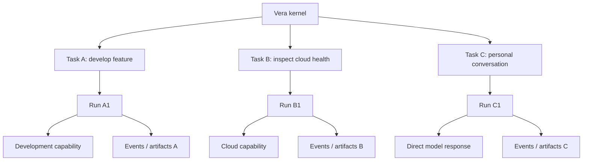

Isolation is logical and enforceable, not merely a naming convention. Context,
authority, cancellation, errors, and artifacts are scoped to the relevant work.

## Current implemented slice

The production slice now wraps the permanent model decision boundary in a
durable task lifecycle inside `apps/api`:

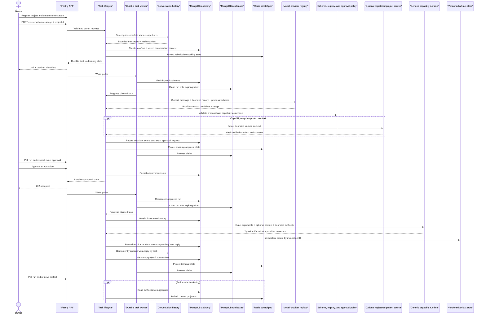

The local source adapter performs context selection without a model or network
call. Exact request anchors, token-boundary path matches, and fixed-string
content matches establish relevance. A resolved exact anchor suppresses broad
prose-token expansion; an unmatched request receives only repository-root
evidence rather than arbitrary source files. Implementation and verification
evidence outrank documentation, and implementation requests retain separate
documentation file and byte ceilings even when documentation is one requested
deliverable. Tracked repository-root formatter configuration is included as
verification evidence. Only the selected, hashed files cross the later
approval boundary; local discovery results and unselected repository contents
do not.

The MongoDB document is the atomic V1 task aggregate: current task/run state and
the event proving each transition are replaced together under optimistic
version control. Redis receives only a schema-versioned, expiring projection;
projection failure cannot roll back or erase durable truth. Exact mechanics and
rationale are in [ADR-0010](decisions/0010-use-mongodb-for-operational-truth-and-redis-for-scratchpads.md).

Task-producing and approval `POST` handlers return after the requested
transition is durable. An in-process worker polls dispatchable MongoDB state,
claims an expiring per-run MongoDB lease, and advances the same lifecycle
service used by deterministic tests. Work is therefore independent of the
client connection and rediscoverable after restart. Redis is not a queue and an
untracked promise is never the execution contract. See
[ADR-0013](decisions/0013-dispatch-durable-work-with-mongodb-leases.md).

The current worker shares the API process only as an initial deployment
topology. Its port boundaries permit a separate worker process later. Leases
provide cross-process exclusion; optimistic aggregate transitions and
idempotent invocation/artifact identities provide recovery safety.

This slice now includes a browser-neutral TypeScript client used by an owner
CLI and universal Expo React Native frontend, generic project and conversation
resources, governed owner memory, selected
read-only Git context, bounded same-scope multi-turn context, recoverable Vera
reply projection, exact disclosure approval, a provider-neutral specialist
port with a late-bound adapter registry, the default Codex adapter, artifact
identity, flat resource ceilings, and best-effort
cancellation. Memory retention and every memory mutation require exact owner
approval; bounded, integrity-checked memory context is disclosed only to an
owner-controlled model provider. The model-backed planner remains an explicit
provider-neutral adapter. Ollama, OpenAI, and Gemini implement the same
structured-generation port; provider-specific schemas, credentials, readiness,
and errors stay behind their adapters. Deterministic tests cover interrupted
invocation, cancellation recovery, conversation-scope isolation, and
reply-projection recovery; a compiled persistent-mode journey verifies
artifact, dialogue, and memory survival across process restart plus Redis
projection reconstruction. The owner accepted the exact real-cloud-Codex
disclosure and resulting artifact on 25 August 2026, completing the V1 evidence
boundary.

Live model qualification remains outside required CI. Direct conformance can
repeat the provider-neutral decision, planning, and adaptive-continuation cases
and reports aggregate reliability, latency, and token use. A separate compiled
journey then verifies the selected orchestration model through the real HTTP,
worker, MongoDB, Redis, approval, artifact, conversation, and adaptive-goal
boundaries while keeping specialist adapters deterministic. Qualification
summaries may expose final outputs and normalized usage metadata but never the
provider's private reasoning trace.

The same lifecycle now also implements `software_change@1`. Its Codex adapter
uses a workspace-write sandbox over a disposable approved snapshot, while the
registered repository remains untouched. Vera derives an authoritative Git
patch and file hashes from the snapshot and stores a review-only
`software_change` artifact. Application, commit, push, and pull-request effects
remain outside this capability. The deterministic adapter drives the compiled
persistent journey without downloads or third-party calls. See
[ADR-0017](decisions/0017-produce-software-changes-as-isolated-patch-artifacts.md).

The capability gateway now uses one declarative runtime for planning, software
change, and web research. The registry is the shared source for catalog
inspection, model-visible contracts, readiness, approval authority, destination
resolution, and execution. `web_research@1` proves that task execution is not
coupled to coding or projects: no project context is assembled or persisted for
that invocation. Its exact owner question, third-party provider destination,
public-network authority, and four-search ceiling are frozen before execution;
the result is a durable source-backed `research_report` artifact.

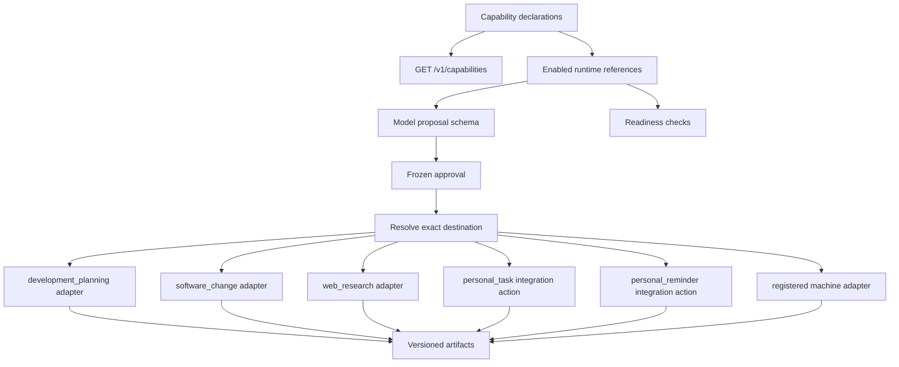

The initial live research adapter uses OpenAI Responses web search, is selected
independently from the orchestration model, and is disabled by default. There is
no automatic fallback. See
[ADR-0020](decisions/0020-use-a-declarative-capability-runtime-and-approval-gated-web-research.md).

`personal_task_management@1` is the first assistant-oriented integration
capability. It routes `create`, `list`, `complete`, and `reopen` through the
provider-neutral integration-action port to Vera's durable owner-scoped task
store. Authority is calculated from the validated action: listing discloses
personal-task data without a side effect, while mutations additionally disclose
`personal_data_write`. The invocation identity makes creation idempotent, and a
recovered older mutation cannot overwrite a newer task state. Each invocation
produces a `personal_task_result` artifact while the task remains a separately
addressable owner resource. See
[ADR-0022](decisions/0022-introduce-provider-neutral-integration-actions-with-vera-owned-personal-tasks.md).

`personal_reminder_management@1` adds time as an external trigger without
adding an unbounded agent loop. The approved action writes a one-shot reminder
to MongoDB. A scheduler claims only due reminders with expiring tokens; delivery
atomically transitions the reminder and embeds one durable inbox notification.
The API exposes the inbox through cursor-based reads and a resumable SSE
projection. Redis and live HTTP connections are never reminder authority.

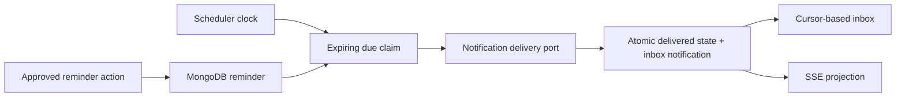

See
[ADR-0023](decisions/0023-deliver-durable-reminders-through-a-vera-owned-notification-inbox.md).

`machine_inspection@1` and `machine_service_management@1` extend the same
runtime to owner-operated computers without introducing a model-controlled
shell. An operator catalog contains exact local or SSH command vectors, probes,
machine identities, and allowed service actions. The model and clients receive
only a public projection of IDs, labels, adapter kind, and allowed actions.
Every approval freezes a machine-specific destination. Inspection produces a
typed diagnostic artifact; mutation captures before and after observations and
succeeds only when the registered postcondition is observed. Conditional
requests such as “check Redis and restart it if unhealthy” use an adaptive goal
with separate read and mutation approvals. See
[ADR-0033](decisions/0033-govern-machine-operations-through-registered-actions.md).

The same worker lifecycle now supports adaptive goals. After a step artifact is
durable, the run returns to `deciding`; the worker can therefore disappear at
the observation boundary without losing the completed effect or inventing the
next one. Recovery reloads and validates all completed artifacts before the
owner-controlled brain proposes completion or one next step. The continuation
is stored before any new approval is presented, so a restart cannot turn a
tentative model response into an unrecorded action. This path reuses the generic
capability runtime rather than naming research, reminders, or coding in the
lifecycle.

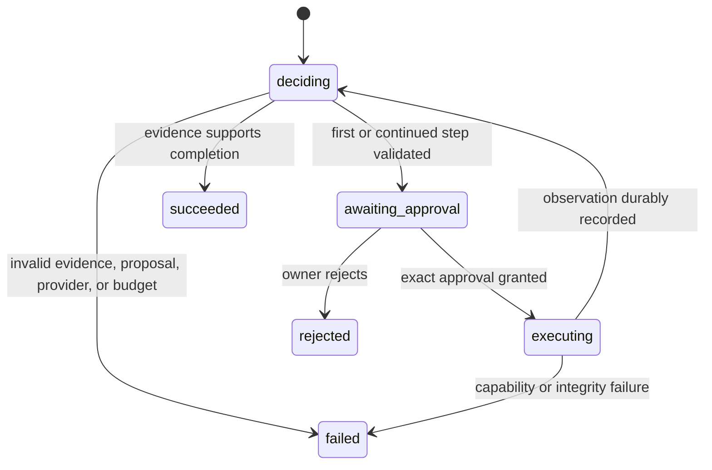

See
[ADR-0024](decisions/0024-adapt-bounded-goals-from-validated-capability-evidence.md).

Artifact application is a separate durable lifecycle rather than hidden inside
that capability. The owner approves an exact artifact hash, immutable base
commit, patch hash, file manifest, deterministic branch, workspace path, and
staged effect. A change-application worker holds a project-scoped MongoDB lease
while the `local_git_worktree` adapter materializes and verifies the effect. The
registered checkout remains untouched, and commit/publication authority remains
absent from this lifecycle. Recovery inspects before/after/mixed filesystem state; it never infers
completion from an interrupted process claim. See
[ADR-0018](decisions/0018-apply-approved-software-changes-in-managed-git-worktrees.md).

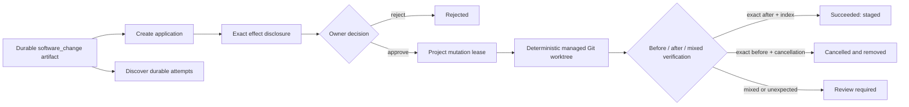

Publication is another durable lifecycle, not a post-success callback. It
references one successful application by immutable version, takes the same
project mutation lease, and persists its own approval, effect, ordered events,
failure, and result in MongoDB. The `github_gh_cli` outbound adapter is the
first implementation of a provider-neutral publication executor port.

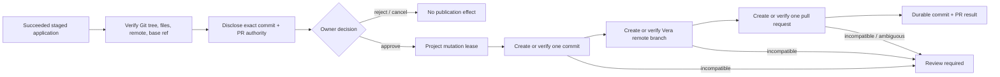

The worker may restart after any external effect. Re-execution inspects the
commit parent/tree/message/author, remote branch revision, and pull-request
identity/content. Exact state is reused; incompatible state is never overwritten.
The approved remote base-branch revision is rechecked before execution and
again after the pull request is verified. Preparation also hashes the resulting
worktree files against the durable application result before approval.
See
[ADR-0029](decisions/0029-publish-approved-software-changes-through-a-separate-durable-lifecycle.md).

Approval freezes the complete specialist destination. Execution and recovery
resolve that persisted descriptor rather than the currently selected adapter;
missing or changed adapter configuration fails closed instead of redirecting
approved context.

The app rejects non-loopback bind configuration. V1 trusts the authenticated
Mac Mini account, SSH session, and optionally the owner's private tailnet as its
deployment perimeter, maps admitted requests to `owner_v1`, and requires
application authentication before shared or multi-user exposure under
[ADR-0014](decisions/0014-use-the-host-session-as-the-v1-owner-boundary.md) and
[ADR-0027](decisions/0027-use-tailscale-serve-for-private-physical-device-access.md).
Tailscale Serve terminates HTTPS and proxies to the unchanged loopback listener;
Funnel and direct LAN/Tailscale binding remain forbidden.
For physical-browser development, the same Serve origin maps `/` to loopback
Expo web and `/api` to the API, avoiding a remote CORS exception.
For installed operation, user LaunchAgents run the compiled API, a loopback
static host for the exported web frontend, and a daily MongoDB backup. Tailscale
preserves the same `/` and `/api` contract without overwriting unrelated host
routes. Updates verify the exact `origin/main` candidate in an isolated
worktree before activation; pull-request publication never deploys code.
The API admits browser cross-origin reads only from loopback HTTP(S) origins so
the Expo web development server can use a separate port without making CORS an
authentication substitute or exposing Vera to the LAN.

Voice remains an experience-plane adapter under
[ADR-0030](decisions/0030-transcribe-owner-controlled-recordings-through-a-provider-neutral-boundary.md).
The frontend records continuously until an explicit Stop, then uploads one
completed compressed recording to the ephemeral transcription endpoint. The
API validates and buffers the bounded body for one selected transcription
adapter call, returns final text, and persists no audio. Only a later explicit
message submission enters conversations and tasks. A voice-originated terminal
reply is played only after durable projection, so neither transcription nor
playback creates a second execution path.

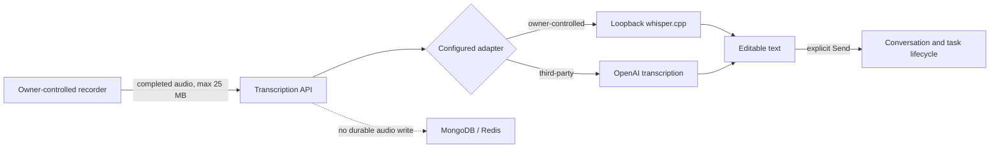

Health is process liveness.
Readiness verifies provider connectivity, configured-model availability,
MongoDB, Redis, worker lease access, lifecycle recovery, and every enabled
capability runtime without running orchestration inference or a web search.

## Proposed API resource shape

The initial conversation proposed a single endpoint with an optional `flow_id`,
then evolved toward flow-oriented resources. The refined domain model separates
the user-visible conversation from executable work.

The implemented V1 lifecycle paths are:

```text
GET    /v1/capabilities
POST   /v1/tasks                         # requires Idempotency-Key
POST   /v1/projects                      # requires Idempotency-Key
GET    /v1/projects
GET    /v1/projects/{project_id}
POST   /v1/conversations                 # requires Idempotency-Key
GET    /v1/conversations
GET    /v1/conversations/{conversation_id}
POST   /v1/conversations/{conversation_id}/messages
GET    /v1/tasks/{task_id}
GET    /v1/runs/{run_id}
GET    /v1/runs/{run_id}/events
POST   /v1/approvals/{approval_id}/decision
POST   /v1/runs/{run_id}/cancellation
GET    /v1/artifacts/{artifact_id}
POST   /v1/artifacts/{artifact_id}/applications   # requires Idempotency-Key
GET    /v1/artifacts/{artifact_id}/applications
GET    /v1/change-applications/{application_id}
GET    /v1/change-applications/{application_id}/events
POST   /v1/change-applications/{application_id}/decision
POST   /v1/change-applications/{application_id}/cancellation
POST   /v1/change-applications/{application_id}/publications   # requires Idempotency-Key
GET    /v1/change-applications/{application_id}/publications
GET    /v1/software-change-publications/{publication_id}
GET    /v1/software-change-publications/{publication_id}/events
POST   /v1/software-change-publications/{publication_id}/decision
POST   /v1/software-change-publications/{publication_id}/cancellation
POST   /v1/model-decisions               # low-level decision diagnostic
GET    /health
GET    /ready
```

The broader post-V1 target shape remains illustrative:

```text
GET    /v1/tasks
GET    /v1/tasks/{task_id}

GET    /v1/runs/{run_id}
GET    /v1/runs/{run_id}/events
POST   /v1/tasks/{task_id}/retry

GET    /v1/approvals
POST   /v1/approvals/{approval_id}/decision

GET    /v1/capabilities
GET    /v1/health
```

Clients should create new conversations or continue existing ones through
ordinary UI actions. They retain opaque identifiers in the background; the
owner should not have to speak or type IDs.

The shared TypeScript client wraps these resources without owning
orchestration semantics. The owner CLI uses that client and renders the exact
approval disclosure before interactive or explicitly requested approval. Its
`chat` path creates or continues a conversation, waits for any approval and the
durable Vera reply, and returns the reply with its task identity.
The `plan` and `change` commands constrain auto-approval to their exact
capability, then retrieve the resulting artifact.

For V1, accepting a task-producing message returns `202 Accepted` with the
conversation, task, and run identifiers. Clients poll run, event, approval, and
artifact resources. Live steering is deferred; changed intent creates a new
task after best-effort cancellation where necessary. The implemented paths and
schemas are owned by the [HTTP API](api.md).

## Bounded development-campaign coordination

The first higher-autonomy development path is a durable coordinator over the
existing task, software-change application, and publication lifecycles. It does
not create a privileged coding path.

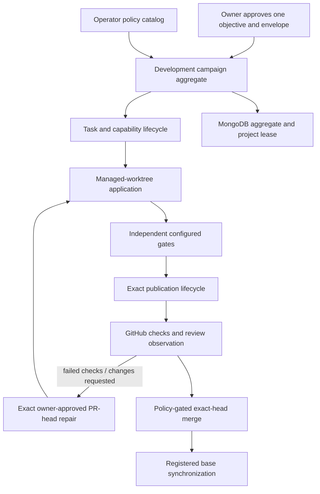

The campaign aggregate is the durable orchestration truth. Each subordinate
resource keeps its own approval, events, effect identity, and recovery
semantics. The shared project-mutation lease serializes campaign verification,
publication, and synchronization with ordinary repository operations. Provider
selection remains late-bound in the capability runtime; test, merge, and policy
authority remain deterministic code. See
[ADR-0034](decisions/0034-delegate-bounded-development-campaigns-through-one-owner-approval.md).
Remote repair adds a second, narrower approval rather than widening the first:
GitHub evidence is bounded untrusted input, historical context is assembled
from the exact PR head, and only a non-forced fast-forward of the existing PR
branch is permitted. See
[ADR-0041](decisions/0041-repair-review-required-pull-requests-through-exact-approved-fast-forwards.md).

## Bounded mission coordination

Missions add outcome selection without widening campaign execution authority.
The orchestration capability can write only a draft. The mission aggregate
then becomes the single consequential approval boundary and embeds the exact
subordinate campaign effect it will authorize.

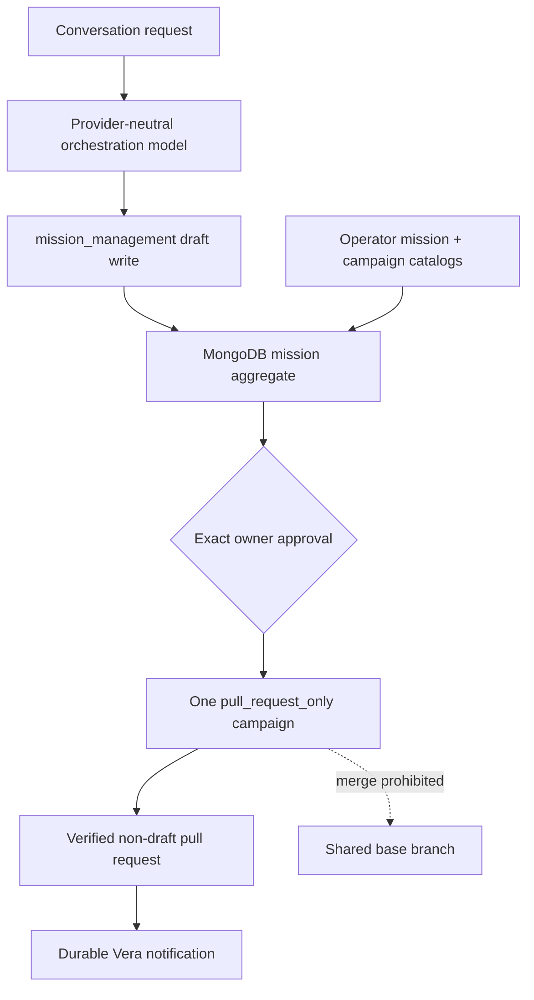

Mission and campaign workers are separately restart-discoverable. The mission
worker does not implement software itself; it validates frozen identity,
delegates only the embedded campaign approval, observes terminal campaign
state, and projects a mission result. Mission-owned campaigns reject direct
approval through the campaign boundary, so the mission remains the only
consequential approval. This preserves the same capability,
application, publication, GitHub, and project-lease boundaries described
above. See
[ADR-0035](decisions/0035-run-bounded-software-missions-that-stop-at-a-pull-request.md).

## Initial deployment hypothesis

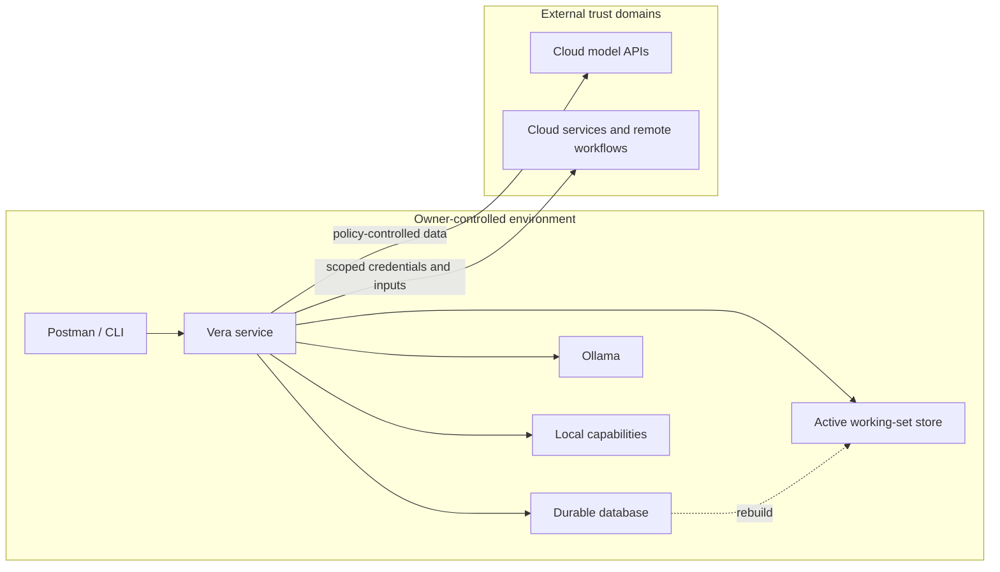

The first accepted deployment runs on the Mac Mini under the authenticated
owner's user session. LaunchAgents recover the API and frontend after process
failure and login restart, while Tailscale reconnects private ingress and a
daily compressed archive protects MongoDB. The Mac Mini remains a single-host
availability boundary: Vera is unavailable while it is powered off, asleep, or
disconnected. See
[ADR-0040](decisions/0040-install-vera-as-a-user-scoped-mac-mini-service.md).

## Architectural invariants

- No model writes directly to Vera's authoritative store.
- No client owns orchestration semantics.
- No capability receives unrestricted credentials by default.
- Every side effect is associated with a principal, task, run, and invocation.
- Every persisted or external contract has an explicit versioning strategy.
- Every run has finite resource and delegation ceilings enforced outside models.
- Provider-specific data does not become the core domain model.
- A process restart does not silently erase accepted work.
- Progress transport is not the source of execution truth.
- Completion is supported by evidence, not model confidence.

## Evolution path

### V1

- one owner;
- one API client;
- one model gateway with a deterministic fake and at least one real provider;
- one real specialist capability;
- one rebuildable active execution scratchpad per run;
- durable tasks, runs, events, and approvals;
- basic progress, cancellation, recovery, and artifact handling.

### Later

- additional clients and delivery channels beyond the implemented universal
  web/mobile, voice, inbox, and device-push surfaces;
- richer capability discovery and routing;
- multiple execution environments;
- governed long-term memory;
- schedules and proactive work;
- collaboration and carefully designed multi-user authority;
- stronger availability and distributed execution.

## Decisions and unresolved questions

Related decisions are indexed in [Architecture Decisions](decisions/README.md).
Open questions and required implementation evidence remain in the
[Discovery Record](discovery-record.md). V1 uses HTTP polling; persistence,
later streaming transport, deployment, and the remaining resource API shapes
are not accepted by this document. Fastify, Zod, the modular API layout, and the
model decision endpoint are accepted by ADR-0009. The nested module map and
enforced inward dependency direction are accepted by
[ADR-0019](decisions/0019-organize-the-api-as-an-inward-dependent-modular-monolith.md).
