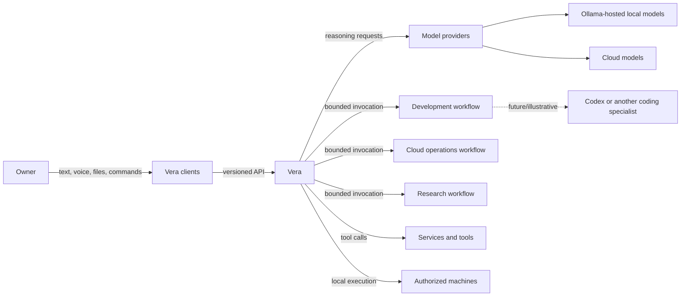
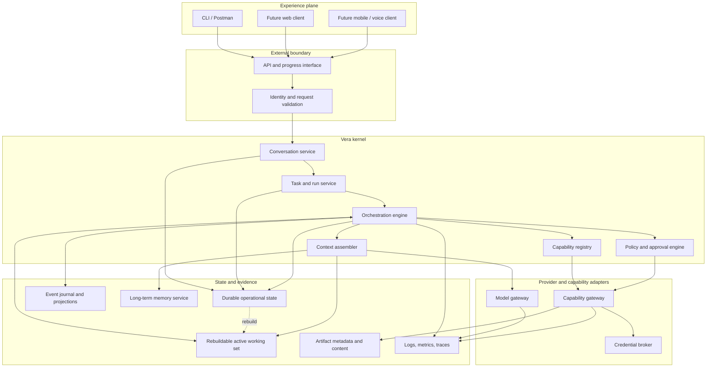
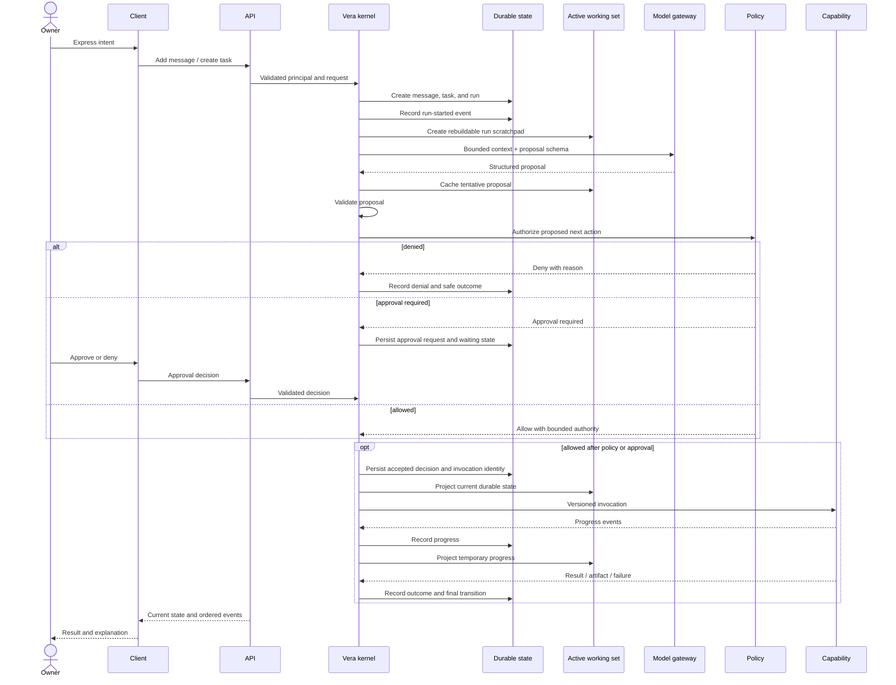
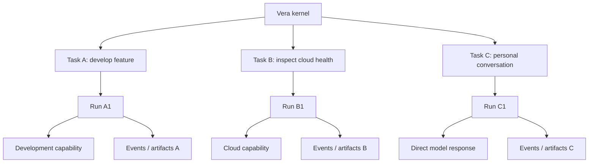
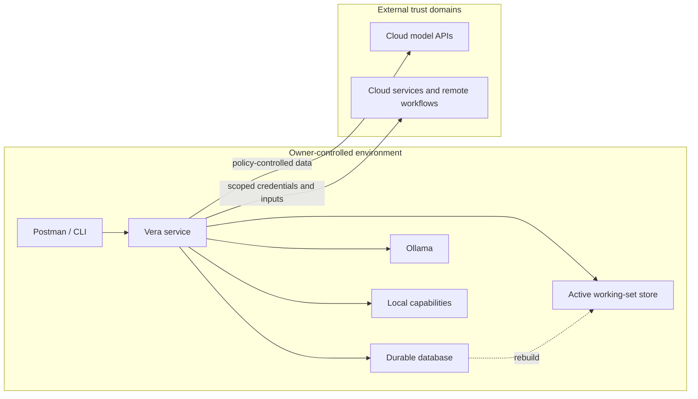

# Vera System Architecture

**Status:** Accepted (logical architecture, component responsibilities,
request lifecycle, and architectural invariants); persistence, post-V1 progress
transport, and deployment topology remain open
**Version:** 0.2
**Last updated:** 24 August 2026
**Accepted:** 24 August 2026 (owner) — persistence choice, post-V1 progress
transport, and deployment topology are deferred to the durable-transition/
recovery and client-event-consumption experiments; V1 uses HTTP polling.

## Purpose

This document describes Vera's accepted logical architecture: the major
components, their responsibilities, the boundaries between them, and the
lifecycle of a request. It deliberately separates stable system semantics from
replaceable products and frameworks.

The architecture is evolutionary. V1 should implement the smallest credible
subset while preserving the boundaries required for future clients,
capabilities, local and cloud models, memory, and concurrent work.

## Architectural thesis

Vera is a durable, policy-controlled orchestration system that borrows
reasoning from models and delegates bounded work to capabilities.

The orchestrator is not itself a brain. It is application code that:

1. receives intent;
2. constructs relevant context;
3. asks a model or deterministic component for a structured proposal;
4. validates that proposal;
5. applies policy and approval rules;
6. coordinates execution;
7. records events and results;
8. keeps the user in control.

## System context



The owner interacts with Vera. Provider and capability selection is normally an
internal responsibility, although advanced clients may expose controls and
explanations.

## Logical architecture



These are logical responsibilities, not necessarily separate processes in V1.
A modular monolith may implement several of them in one deployable service while
preserving internal boundaries.

## Component responsibilities

### API and progress interface

- authenticate the initiating principal;
- validate versioned request payloads;
- apply idempotency and request-size rules;
- create or continue conversations and tasks;
- expose current projections, events, approvals, and artifacts;
- expose progress without making a network connection the source of truth;
- contain minimal orchestration logic.

### Conversation service

- create and retrieve conversations;
- append immutable messages;
- associate messages with tasks and steering actions;
- produce client-facing summaries;
- prevent unrelated context from being included automatically.

### Task and run service

- create durable tasks and execution attempts;
- validate lifecycle transitions;
- coordinate retries without rewriting earlier attempts;
- expose current state derived from recorded transitions;
- distinguish task outcome from run outcome.

### Orchestration engine

- choose the next permitted step;
- request structured proposals where reasoning is useful;
- execute deterministic transitions;
- invoke policies, approvals, models, and capabilities;
- manage timeouts, retries, cancellation, and recovery;
- remain independent of one model provider or agent framework.

### Policy and approval engine

- determine whether a proposed operation is allowed, denied, or requires
  approval;
- evaluate principal, capability, data sensitivity, environment, and effect;
- enforce task and run budgets for cost, time, steps, retries, invocations, and
  delegation depth;
- issue narrowly scoped approval requests;
- ensure approval cannot be broadened by a model or capability.

### Capability registry

- describe available capabilities and versions;
- expose selection metadata without exposing credentials;
- record health, availability, permissions, and execution mode;
- resolve a capability declaration to an invocation adapter.

### Context assembler

- select relevant messages, task state, events, memory, project knowledge,
  policy, and capability descriptions;
- enforce token, sensitivity, provenance, and provider constraints;
- produce a disposable model-context projection;
- avoid sending the entire conversation or database by default.

### Active working-set service

- maintain one isolated, versioned execution scratchpad per active run;
- store tentative plans, current-step data, intermediate results, and other
  disposable coordination state;
- apply explicit retention and expiration without using TTL as execution truth;
- require consequential decisions and effect identities to be durable before
  they are acted upon; and
- rebuild the working set from durable state after loss or classify the run for
  review when safe reconstruction is impossible.

### Model gateway

- provide a Vera-facing interface for structured reasoning and response
  generation;
- translate provider-specific request and response shapes;
- validate outputs and expose usage, latency, and failure metadata;
- support local providers such as Ollama and cloud providers;
- make provider capabilities explicit rather than pretending all models are
  identical.

The canonical distinction between a model provider such as Ollama and a Vera
capability is defined in the [Capability Model](capability-model.md#model-providers).

### Capability gateway

- invoke local functions, remote services, tools, agents, or workflows through
  a common lifecycle;
- enforce declared inputs and permissions;
- normalize progress, completion, failure, timeout, and cancellation;
- keep capability implementations out of Vera's private storage schema.

### Credential broker

- resolve opaque credential references only after authorization;
- provide the narrowest credential suitable for an invocation;
- prevent raw credentials from entering prompts, ordinary events, or logs;
- record credential use without recording secret material.

### State and evidence services

- store authoritative conversations, tasks, runs, steps, approvals, and
  invocation records durably;
- record immutable events and build query-friendly projections;
- store artifact metadata and content through appropriate backends;
- expose long-term memory through its own governance rules;
- correlate logs, metrics, traces, and domain identifiers.

## Request lifecycle



The client connection or active working-set store may disappear at any point.
Authoritative execution state remains in durable storage. The scratchpad can be
reconstructed after reconnection or restart; accepted work never depends only
on its survival.

## Concurrent work



Isolation is logical and enforceable, not merely a naming convention. Context,
authority, cancellation, errors, and artifacts are scoped to the relevant work.

## Proposed API resource shape

The initial conversation proposed a single endpoint with an optional `flow_id`,
then evolved toward flow-oriented resources. The refined domain model separates
the user-visible conversation from executable work.

The following API shape is illustrative, not accepted:

```text
POST   /v1/conversations
GET    /v1/conversations
GET    /v1/conversations/{conversation_id}
POST   /v1/conversations/{conversation_id}/messages

GET    /v1/tasks
GET    /v1/tasks/{task_id}

GET    /v1/runs/{run_id}
GET    /v1/runs/{run_id}/events
POST   /v1/runs/{run_id}/cancel
POST   /v1/tasks/{task_id}/retry

GET    /v1/approvals
POST   /v1/approvals/{approval_id}/decision

GET    /v1/capabilities
GET    /v1/health
```

Clients should create new conversations or continue existing ones through
ordinary UI actions. They retain opaque identifiers in the background; the
owner should not have to speak or type IDs.

For V1, accepting a task-producing message returns `202 Accepted` with the
conversation, task, and run identifiers. Clients poll run, event, approval, and
artifact resources. Live steering is deferred; changed intent creates a new
task after best-effort cancellation where necessary. Exact paths and schemas
remain outputs of the experiments.

## Initial deployment hypothesis



Running on the Mac Mini is a working assumption, not an accepted deployment
decision. The architecture must state what happens when that machine sleeps,
restarts, loses connectivity, or becomes unavailable.

## Architectural invariants

- No model writes directly to Vera's authoritative store.
- No client owns orchestration semantics.
- No capability receives unrestricted credentials by default.
- Every side effect is associated with a principal, task, run, and invocation.
- Every persisted or external contract has an explicit versioning strategy.
- Every run has finite resource and delegation ceilings enforced outside models.
- Provider-specific data does not become the core domain model.
- A process restart does not silently erase accepted work.
- Progress transport is not the source of execution truth.
- Completion is supported by evidence, not model confidence.

## Evolution path

### V1

- one owner;
- one API client;
- one model gateway with a deterministic fake and at least one real provider;
- one real specialist capability;
- one rebuildable active execution scratchpad per run;
- durable tasks, runs, events, and approvals;
- basic progress, cancellation, recovery, and artifact handling.

### Later

- multiple clients including mobile, web, voice, and notifications;
- richer capability discovery and routing;
- multiple execution environments;
- governed long-term memory;
- schedules and proactive work;
- collaboration and carefully designed multi-user authority;
- stronger availability and distributed execution.

## Decisions and unresolved questions

Related decisions are indexed in [Architecture Decisions](decisions/README.md).
Open questions and required experiments remain in the
[Discovery Record](discovery-record.md). V1 uses HTTP polling; persistence,
later streaming transport, framework, deployment, and exact API shapes are not
accepted by this document.
