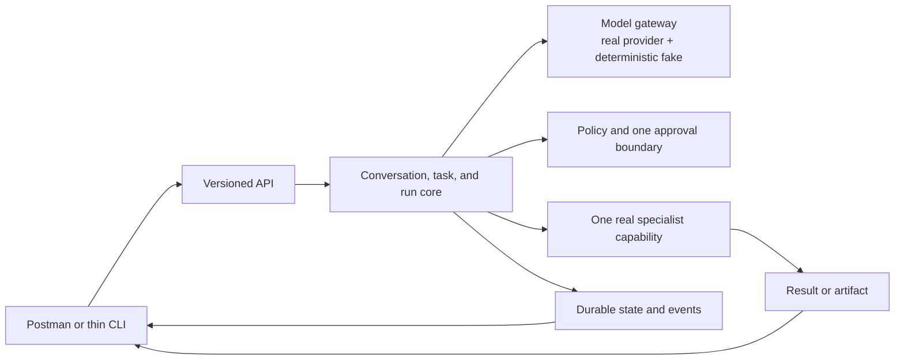

# Vera V1 Definition

**Status:** Proposed
**Version:** 0.1
**Last updated:** 24 August 2026

## Purpose

V1 should prove Vera's smallest credible architectural spine. It should not be
a miniature imitation of the entire long-term product, nor merely an API that
calls a model and stores its response.

This document defines the behavioural proof required before Vera expands into
multiple clients, broad memory, or many specialist capabilities. It does not
select an implementation framework or repository structure.

## V1 hypothesis

Vera can accept a natural-language request, represent the resulting work
durably, use a model within a deterministic and policy-controlled execution
loop, delegate to one real specialist capability, expose faithful progress, and
remain controllable across concurrency and failure.

If this hypothesis is proven, additional clients and capabilities can be added
without replacing Vera's core semantics.

## V1 system slice

Anything not required to prove this slice is presumptively outside V1.

## Required first journey

The exact specialist capability remains an open discovery decision. The first
journey must nevertheless exercise this complete shape:

1. The owner creates or continues a conversation through an HTTP client.
2. A message requests a distinct outcome.
3. Vera creates a durable task and run.
4. Vera assembles bounded context and requests a structured proposal from a
   model or deterministic test double.
5. Vera validates the proposal and applies policy.
6. Vera either responds directly or invokes the one approved specialist
   capability.
7. A consequential operation pauses for explicit approval.
8. Vera records progress, decisions, invocations, errors, and artifacts as
   inspectable events.
9. The owner can steer or request cancellation.
10. Vera returns a result and a traceable explanation of what occurred.

Software-development delegation is the leading candidate because it reflects
the original vision and provides a real existing specialist. It is not accepted
until its invocation, credential, sandbox, cancellation, and success contracts
are understood.

## V1 functional scope

### Conversations and messages

- Create a conversation.
- Add a message to a conversation.
- Retrieve a conversation and its messages.
- List conversations with a useful summary and recent status.
- Associate task-creating and steering messages explicitly with affected work.

### Tasks and runs

- Create a durable task from an accepted request.
- Create and inspect run attempts.
- Show current state without erasing event history.
- Support retry as a new run rather than reopening a terminal run.
- Represent waiting for approval separately from waiting for an external system.

### Proposals and policy

- Request a versioned, structured model proposal.
- Reject malformed, unsupported, or unauthorized proposals safely.
- Use a deterministic fake provider for tests.
- Enforce at least one real approval boundary.
- Prevent model output from directly mutating authoritative state.

### Capability delegation

- Register or configure exactly one real specialist capability.
- Validate its versioned input and output.
- Record invocation, progress, result, errors, and produced artifacts.
- Define timeout and cancellation behaviour.
- Prevent the capability from depending on Vera's private database schema.

### Resource and delegation budgets

- Assign every run finite configured ceilings for model usage or cost,
  wall-clock duration, steps, capability invocations, retries, child-task count,
  and delegation depth.
- Enforce ceilings in deterministic policy code rather than prompts.
- Allocate child work from the parent's remaining budget without resetting it.
- Stop safely or request explicit owner approval before extending a limit.
- Record budget allocation, consumption, exhaustion, and extension as events.

### Control and observability

- Retrieve an ordered event history for a run.
- Observe work in progress from an HTTP client.
- Request cancellation and distinguish request from confirmed outcome.
- Submit steering input with explicit semantics.
- Inspect why a capability was selected and which policy allowed it.
- Correlate logs and events without exposing secrets.

### Durability and concurrency

- Run at least two unrelated tasks concurrently without state or context
  contamination.
- Interrupt and restart Vera during active work.
- Recover, resume, or safely classify interrupted work according to a documented
  rule.
- Prevent a retry or recovery operation from duplicating a demonstrated
  side effect.

## V1 acceptance criteria

V1 is complete only when the following can be demonstrated reproducibly.

### End-to-end behaviour

- Given a new conversation message, the client receives identifiers for the
  conversation, task, and run without having to invent them.
- Given a valid direct-response proposal, Vera produces a response without
  invoking the specialist capability.
- Given a valid delegation proposal, Vera invokes the configured capability and
  returns its result or artifact.
- Given an invalid proposal, Vera records the validation failure and performs no
  proposed side effect.
- Given a policy-restricted action, Vera waits for approval and does not execute
  before approval is granted.

### Isolation and concurrency

- Two simultaneous tasks have distinct context, events, outputs, errors, and
  cancellation state.
- Steering one task does not modify the other.
- A capability receives only the context and authority declared for its
  invocation.

### Failure and recovery

- A forced process termination during execution does not lose the task or
  completed event history.
- After restart, interrupted work is deterministically resumed, failed, or
  placed in a review state according to documented semantics.
- A repeated request carrying the same idempotency identity does not duplicate
  the demonstrated side effect.
- Provider timeout, capability timeout, validation failure, and policy denial
  are distinguishable outcomes.
- Exhausting a configured budget stops new work without an uncontrolled retry or
  delegation loop.
- A child task cannot reset or expand the parent's cost, retry, time, invocation,
  or delegation-depth ceilings.

### Human control

- The owner can inspect current work and its relevant history.
- The owner can grant or deny a requested approval.
- The owner can request cancellation and see whether cancellation succeeded.
- The owner can understand which capability was chosen and what evidence was
  produced.

### Engineering evidence

- Domain and boundary logic has automated tests.
- Provider and capability adapters can be replaced with deterministic fakes.
- API and event payloads are validated against versioned schemas.
- Logs and stored events contain no test credentials or raw secrets.
- The complete journey can be run from documented commands on a clean checkout.

## Explicit V1 non-goals

V1 does not require:

- a mobile, desktop, or polished web interface;
- voice, image, or general multimodal interaction;
- proactive background autonomy;
- broad long-term personal memory;
- vector search merely for architectural appearance;
- multiple specialist capabilities;
- multi-user or multi-tenant operation;
- high availability across multiple regions;
- automatic acquisition or rotation of credentials;
- perfect model or provider routing;
- a marketplace or plugin ecosystem;
- adoption of Redis, Temporal, LangGraph, an Agents SDK, or any other framework
  before its need is demonstrated.

## Security floor

Even as a prototype, V1 must not:

- place secrets in model prompts, model-visible context, or ordinary logs;
- allow a model to choose its own effective permissions;
- execute undeclared arbitrary side effects through a generic tool;
- run with unlimited model calls, retries, capability invocations, duration,
  child tasks, or delegation depth;
- treat retrieved or external content as trusted instructions;
- silently promote model inference into durable personal memory;
- claim cancellation reversed an external action when it only stopped waiting;
- expose server-only credentials or policy logic to a client package.

## Implementation gates

Implementation should not begin until:

1. the Product Charter is accepted;
2. the first specialist capability is selected;
3. steering and cancellation semantics are defined sufficiently for V1;
4. the initial deployment assumption is confirmed;
5. the required approval boundary is chosen;
6. the minimum capability contract is approved;
7. the technology recommendations that affect the first slice are either
   accepted or replaced through explicit decisions.

## Questions blocking V1 approval

1. What exact owner request will serve as the first demonstration?
2. What real specialist capability will Vera invoke?
3. What side effect will demonstrate approval and idempotency safely?
4. Must execution continue while the Mac Mini is offline?
5. Is V1 allowed to send project or personal context to a cloud model?
6. Should steering affect the active run, create a successor run, or create a
   related task for the first journey?
7. What minimum result must Vera return synchronously, and what may be observed
   asynchronously?

Until these are answered, this document is a testable proposal rather than an
implementation assignment.

The logical design behind this slice is documented in the
[System Architecture](system-architecture.md), with specialized detail in
[Memory and Context](memory-and-context.md),
[Capability Model](capability-model.md), and
[Security and Trust](security-and-trust.md).
