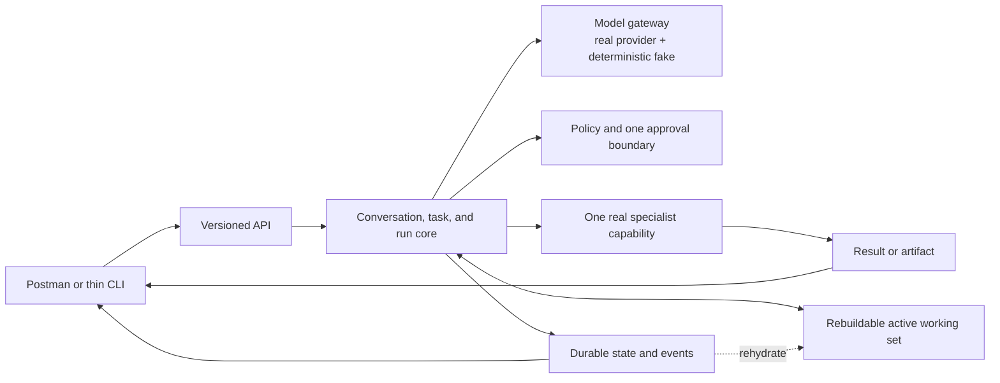

# Vera V1 Definition

**Status:** Accepted
**Version:** 0.6
**Last updated:** 24 August 2026
**Accepted:** 24 August 2026 (owner) — completion still requires the evidence
in this document

## Scope change, 24 August 2026

V1 as originally drafted (v0.1) specified roughly thirty acceptance criteria
spanning durability, recovery, resource and delegation budgets with
child-task inheritance, approvals, a formal cancellation protocol, live
steering, concurrency isolation, and versioned capability contracts — more
than a solo build should attempt before validating the underlying product
idea. This version cuts scope. Full rationale is recorded in
[ADR-0008](decisions/0008-trim-v1-scope-and-ratify-foundation.md).

Removed or deferred to V1.1:

- **Live steering** of an in-flight run. V1 supports cancel-and-resubmit as
  a new task instead of steering semantics.
- **Hierarchical delegation and inherited child-task budgets.** V1 has no
  recursive delegation or child tasks. It still enforces multiple flat,
  finite ceilings because an orchestration loop without them is unsafe.
- **A formal cancellation protocol.** V1 supports a best-effort stop
  request and records the resulting run state; it does not guarantee which
  external side effects were or were not stopped.

Kept, because the hypothesis cannot be tested without them:

- A durable task and run representation that survives a process restart.
- One isolated active execution scratchpad that can be deleted and rebuilt from
  durable state without losing accepted work.
- One demonstrated recovery after a forced process termination.
- A structured, validated model proposal, including at least one rejection
  case.
- One real approval boundary that blocks execution until granted.
- One real specialist capability invocation with a recorded result.
- Idempotency for the one side-effecting operation used in the journey.
- Finite ceilings for model calls, capability invocations, retries, elapsed
  work, and cost or provider usage where measurable.

## Purpose

V1 should prove Vera's smallest credible architectural spine. It should not be
a miniature imitation of the entire long-term product, nor merely an API that
calls a model and stores its response.

This document defines the behavioural proof required before Vera expands into
multiple clients, broad memory, or many specialist capabilities. The initial
implementation framework and repository structure are selected by ADR-0009;
persistence and the remaining resource API are selected in later decisions.

## V1 hypothesis

Vera can accept a natural-language request, represent the resulting work
durably, use a model within a deterministic and policy-controlled execution
loop, delegate to one real specialist capability, expose faithful progress, and
remain controllable across concurrency and failure.

If this hypothesis is proven, additional clients and capabilities can be added
without replacing Vera's core semantics.

## V1 system slice

Anything not required to prove this slice is presumptively outside V1.

## Required first journey

The accepted V1 request shape is:

> Vera, prepare an implementation plan for this ticket: [ticket details]. Use
> the registered project as read-only context.

Gatherle is the first real manual acceptance project, not part of the contract.
The same journey must work for another registered repository without production
code changes. Automated evidence uses multiple synthetic repositories to
prevent a project-specific implementation from passing accidentally.

The single real specialist contract is `development_planning@1`, a versioned,
provider-neutral capability using Codex as its initial default adapter. It may analyze only the supplied ticket and an
explicitly selected, read-only project context. It may not edit the project,
run arbitrary commands, create a branch, or open a pull request in V1.

The journey exercises this complete shape:

1. The owner creates or continues a conversation through an HTTP client.
2. A message requests a distinct outcome.
3. Vera creates a durable task and run.
4. Vera assembles bounded context and requests a structured proposal from a
   model or deterministic test double.
5. Vera validates the proposal and applies policy.
6. Vera proposes the `development_planning@1` capability and the exact context
   that would be disclosed.
7. Before any selected project or ticket context crosses the selected adapter's
   declared data boundary, Vera pauses for explicit owner approval naming the
   adapter and provider.
8. On approval, Vera invokes the capability once with bounded input and
   authority. On denial, it records the decision and sends nothing.
9. Vera records progress, decisions, invocations, errors, and artifacts as
   inspectable events.
10. The owner can request cancellation on a best-effort basis, or start a new
   task; live steering of the active run is deferred to V1.1.
11. Vera creates exactly one versioned internal plan artifact for the
    capability invocation and returns a traceable explanation of what occurred.

Creating the internal plan artifact is V1's controlled side effect. Its
idempotency identity is the capability invocation ID: retrying the same
invocation must return or update the same artifact identity, never create a
duplicate. The first HTTP response is `202 Accepted` with conversation, task,
and run identifiers. V1 clients observe state, events, approval requests, and
the result by polling versioned HTTP resources; streaming is deferred.

### Product value under test

The journey is worthwhile only if Vera removes meaningful orchestration work:
selecting the specialist, assembling and disclosing only approved context,
persisting the task across failure, enforcing limits, obtaining approval, and
returning one inspectable artifact and execution trace. Implementation evidence must
test whether that experience is preferable to opening Codex and manually
performing those steps. The documentation does not assume the answer is yes.

### Minimum capability contract

The `development_planning@1` input contains:

- the owner-stated outcome and ticket text or reference;
- the selected project identity;
- a bounded context manifest naming every included project source;
- the approved source contents or summaries; and
- the invocation identity and enforced limits.

Vera's local context assembler selects read-only project sources before the
approval request. The approval view must make the manifest, selected adapter,
provider, transport, and data boundary inspectable; the capability cannot
discover additional local files itself.

The successful artifact contains at least:

- the ticket identity and interpreted objective;
- scope, non-goals, assumptions, and unresolved questions;
- an ordered implementation approach;
- affected project areas supported by the supplied context;
- risks and explicit decision points; and
- a verification plan tied to the objective.

The versioned proposal and initial capability proposal-argument schemas are
accepted by ADR-0009. They do not replace the enriched invocation contract
below, whose authoritative fields are created by code. The implemented V1
defaults select at most 40 files, 200,000 total bytes, and 40,000 bytes per
file. These are deterministic policy values rather than capability advice and
may be revised with evidence without changing the manifest contract.

## V1 functional scope

### Conversations and messages

- Create a conversation.
- Add a message to a conversation.
- Retrieve a conversation and its messages.
- List conversations with a useful summary and recent status.
- Associate task-creating messages explicitly with the task they create.

### Tasks and runs

- Create a durable task from an accepted request.
- Create and inspect run attempts.
- Show current state without erasing event history.
- Support retry as a new run rather than reopening a terminal run.
- Represent waiting for approval separately from waiting for an external system.

### Execution scratchpad

- Maintain one isolated, schema-versioned active working set per run.
- Store the current step, tentative proposals, working plan, selected
  capability, intermediate results, temporary errors, and artifact references.
- Never use the scratchpad as the sole record of an approval, accepted proposal,
  invocation identity, completed effect, or durable event.
- Rebuild it from durable state after loss, or move the run to review when safe
  reconstruction is impossible.
- Apply explicit expiration after a terminal run without treating TTL deletion
  timing as a correctness mechanism.

### Proposals and policy

- Request a versioned, structured model proposal.
- Reject malformed, unsupported, or unauthorized proposals safely.
- Use a deterministic fake provider for tests.
- Enforce at least one real approval boundary.
- Prevent model output from directly mutating authoritative state.

### Capability delegation

- Register or configure exactly one real specialist capability.
- Validate its versioned input and output.
- Record invocation, progress, result, errors, and produced artifacts.
- Define a per-invocation timeout. Cancellation is best-effort only in V1
  (see Scope change above).
- Prevent the capability from depending on Vera's private database schema.

### Resource ceilings (flat for V1)

- Assign every run finite maximums for model calls, capability invocations,
  retries, and wall-clock duration or execution steps.
- Assign a cost or provider-usage maximum when the selected provider exposes a
  measurable unit; record explicitly when it does not.
- Fix delegation depth at one: Vera may invoke the selected capability, but
  neither Vera nor that capability may create child Vera tasks in V1.
- Enforce every ceiling in deterministic policy code, not in a prompt.
- Stop safely when any ceiling is reached and record why.
- Record ceiling assignment, consumption, and exhaustion as events.

Hierarchical allocation, child-task inheritance, dynamic budget extensions,
and recursive delegation are deferred to V1.1. The target design stays in the
[Capability Model](capability-model.md#resource-and-delegation-budgets) and
[Security and Trust](security-and-trust.md#resource-and-delegation-budgets).

### Control and observability

- Retrieve an ordered event history for a run.
- Observe work in progress from an HTTP client.
- Request cancellation on a best-effort basis and record the resulting run
  state.
- Inspect why a capability was selected and which policy allowed it.
- Correlate logs and events without exposing secrets.

Live steering of an in-flight run is deferred to V1.1; the owner cancels and
starts a new task instead.

### Durability and concurrency

- Run at least two unrelated tasks concurrently without state or context
  contamination.
- Interrupt and restart Vera during active work.
- Delete an active run's scratchpad during execution.
- Recover, resume, or safely classify interrupted work according to a documented
  rule.
- Prevent a retry or recovery operation from duplicating a demonstrated
  side effect.

## V1 acceptance criteria

V1 is complete only when the following can be demonstrated reproducibly.

### End-to-end behaviour

- Given a new conversation message, the client receives identifiers for the
  conversation, task, and run without having to invent them.
- Given a valid direct-response proposal, Vera produces a response without
  invoking the specialist capability.
- Given a valid delegation proposal, Vera invokes the configured capability and
  returns its result or artifact.
- Given an invalid proposal, Vera records the validation failure and performs no
  proposed side effect.
- Given a policy-restricted action, Vera waits for approval and does not execute
  before approval is granted.

### Isolation and concurrency

- Two simultaneous tasks have distinct context, events, outputs, errors, and
  cancellation state.
- Cancelling or retrying one task does not modify the other.
- A capability receives only the context and authority declared for its
  invocation.

### Failure and recovery

- A forced process termination during execution does not lose the task or
  completed event history.
- Losing the active scratchpad does not lose an accepted decision, approval,
  invocation identity, effect record, or artifact reference.
- If a durable transition succeeds but its working-set projection update fails,
  restart reconstructs the projection from durable state.
- After restart, interrupted work is deterministically resumed, failed, or
  placed in a review state according to documented semantics.
- A repeated request carrying the same idempotency identity does not duplicate
  the demonstrated side effect.
- Provider timeout, capability timeout, validation failure, and policy denial
  are distinguishable outcomes.
- Exhausting the configured ceiling stops new work without an uncontrolled
  retry loop.
- Exhausting any configured model-call, capability-invocation, retry, duration,
  step, or measurable-usage ceiling records which limit stopped the run.
- A proposal for recursive delegation or a child task is rejected in V1.

### Human control

- The owner can inspect current work and its relevant history.
- The owner can grant or deny a requested approval.
- The owner can request cancellation and see the resulting run state.
- The owner can understand which capability was chosen and what evidence was
  produced.

### Engineering evidence

- Domain and boundary logic has automated tests.
- Provider and capability adapters can be replaced with deterministic fakes.
- API and event payloads are validated against versioned schemas.
- Logs and stored events contain no test credentials or raw secrets.
- The complete journey can be run from documented commands on a clean checkout.

## Explicit V1 non-goals

V1 does not require:

- a mobile, desktop, or polished web interface;
- voice, image, or general multimodal interaction;
- proactive background autonomy;
- broad long-term personal memory;
- vector search merely for architectural appearance;
- multiple specialist capabilities;
- multi-user or multi-tenant operation;
- high availability across multiple regions;
- automatic acquisition or rotation of credentials;
- perfect model or provider routing;
- a marketplace or plugin ecosystem;
- a durable workflow engine, agent framework, or graph framework;
- live steering of an in-flight run — cancel-and-resubmit instead;
- hierarchical child-task budgets, inherited delegation budgets, recursive
  delegation, or runtime budget expansion;
- a cancellation protocol that guarantees which external effects were
  stopped — best-effort stop and a recorded outcome only.

## Security floor

Even as a prototype, V1 must not:

- place secrets in model prompts, model-visible context, or ordinary logs;
- allow a model to choose its own effective permissions;
- execute undeclared arbitrary side effects through a generic tool;
- run with unlimited model calls, retries, capability invocations, or
  duration;
- treat retrieved or external content as trusted instructions;
- silently promote model inference into durable personal memory;
- claim cancellation reversed an external action when it only stopped waiting;
- expose server-only credentials or policy logic to a client package.

## Implementation sequence

The scope decisions required before implementation are resolved:

1. ~~the Product Charter is accepted~~ — done, 24 August 2026.
2. ~~the first specialist capability is selected~~ — done:
   `development_planning@1`, initially using the `codex_cli` adapter.
3. ~~steering and cancellation semantics are defined sufficiently for V1~~ —
   done: steering is deferred to V1.1, cancellation is best-effort only.
4. the initial deployment assumption is confirmed — **resolved by working
   assumption**: Mac-Mini-only, with no execution during an outage but with
   durable recovery or safe classification after restart (see the
   [Discovery Record](discovery-record.md)).
5. ~~the required approval boundary is chosen~~ — done: explicit approval
   before selected project or ticket context crosses a third-party boundary.
6. ~~the minimum capability contract is approved~~ — done via the
   [Capability Model](capability-model.md).
7. the technology decisions affecting the first slice are accepted — language,
   runtime, and monorepo through
   [ADR-0006](decisions/0006-typescript-first-npm-monorepo.md), and the modular
   Fastify/Zod API plus model boundary through
   [ADR-0009](decisions/0009-implement-the-model-decision-boundary.md). MongoDB
   authoritative operational state plus a rebuildable Redis scratchpad is
   accepted by
   [ADR-0010](decisions/0010-use-mongodb-for-operational-truth-and-redis-for-scratchpads.md).

Implementation proceeds in production vertical increments. The implemented
spine now includes strict HTTP validation, real and deterministic model
adapters, the closed `ModelProposal` v1 contract, MongoDB task/run/event truth,
Redis scratchpad projection, idempotent task submission, persisted approval and
invocation identity, ordered events, restart inspection, and schema-bound
planning execution after approval.

The production spine now also includes registered generic projects,
conversations and task-linked messages, bounded Git context assembly, exact
context disclosure, a read-only ephemeral Codex adapter, one idempotent
versioned plan artifact, flat run ceilings, and best-effort cancellation.
Task acceptance is now detached from model and capability latency through a
durable-state worker with expiring MongoDB run leases. A shared TypeScript
client and owner CLI exercise submission, polling, event inspection, approval,
cancellation, and artifact retrieval without moving orchestration logic into a
client.

This is not yet V1 product completion. Deterministic tests now cover interrupted
invocation and cancellation recovery. A compiled persistent-mode journey has
also verified the real CLI boundary, registered context, direct response,
approval idempotency, rejection, cancellation, concurrent isolation, MongoDB
lease exclusion, artifact identity, process restart, conversation retrieval,
and Redis projection reconstruction. The journey forces one process termination
after the approval boundary is durable, then verifies another graceful restart
after completion. Required CI runs it with ephemeral real MongoDB and Redis and
deterministic owner-controlled adapters, without downloading model weights or
contacting a third party. The remaining acceptance boundary is an
owner-approved real-cloud-Codex disclosure and evaluation of the resulting
plan; Gatherle may be one acceptance project but is not production architecture.

## Decisions to validate during V1

- Cloud disclosure is allowed only for the exact project/ticket context shown
  in an approval request; credentials and unrelated personal context are never
  included.
- `202 Accepted` plus polling is implemented by the first durable-task client.
  Later measured client needs may justify server-sent events or another
  transport.
- The plan artifact is a useful, safely idempotent outcome for the first
  journey.
- The selected MongoDB/Redis implementation satisfies forced-restart,
  projection-loss, concurrency, backup, and migration requirements.
- Vera's orchestration, control, recovery, and trace make this journey more
  useful than invoking the specialist manually.

The logical design behind this slice is documented in the
[System Architecture](system-architecture.md), with specialized detail in
[Memory and Context](memory-and-context.md),
[Capability Model](capability-model.md), and
[Security and Trust](security-and-trust.md).
